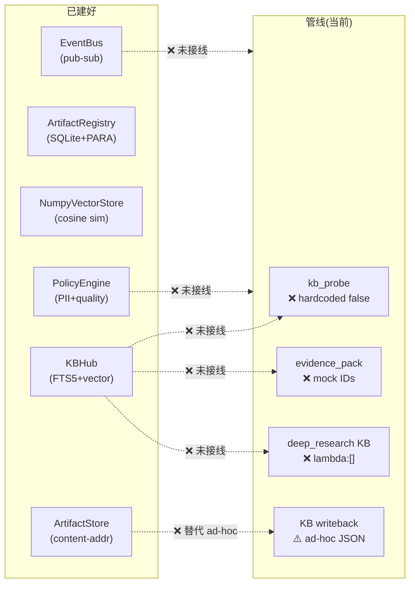

# 需求漏斗 + 知识库 + 记忆管理: 差距分析 + 补齐计划

## 1. 已建好的模块清单 (15 个, ~70KB 代码)

| 层 | 模块 | 文件 | 代码量 | 状态 |
|---|------|------|--------|------|
| **KB** | `KBHub` (FTS5+vector+RRF 混合检索) | [hub.py](file:///vol1/1000/projects/ChatgptREST/chatgptrest/kb/hub.py) | 261行 | ✅ 已实现 🔴 未接入 |
| **KB** | `KBRetriever` (FTS5全文搜索+BM25) | [retrieval.py](file:///vol1/1000/projects/ChatgptREST/chatgptrest/kb/retrieval.py) | 348行 | ✅ 已实现 🔴 未接入 |
| **KB** | `NumpyVectorStore` (余弦相似度+SQLite持久化) | [vector_store.py](file:///vol1/1000/projects/ChatgptREST/chatgptrest/kb/vector_store.py) | 346行 | ✅ 已实现 🔴 无 embedding |
| **KB** | `ArtifactRegistry` (SQLite元数据+PARA分类+去重) | [registry.py](file:///vol1/1000/projects/ChatgptREST/chatgptrest/kb/registry.py) | 607行 | ✅ 已实现 ⚠️ 部分接入 |
| **KB** | `KBScanner` (文件系统扫描入库) | [scanner.py](file:///vol1/1000/projects/ChatgptREST/chatgptrest/kb/scanner.py) | ~200行 | ✅ 已实现 🔴 未运行 |
| **EvoMap** | `EvoMapObserver` (信号采集+SQLite持久化) | [observer.py](file:///vol1/1000/projects/ChatgptREST/chatgptrest/evomap/observer.py) | 206行 | ✅ 已实现 ✅ 已接入 |
| **EvoMap** | `EvoMapDashboard` (信号统计API) | [dashboard.py](file:///vol1/1000/projects/ChatgptREST/chatgptrest/evomap/dashboard.py) | ~150行 | ✅ 已实现 ✅ 已接入 |
| **Kernel** | `EventBus` (发布订阅+SQLite持久化) | [event_bus.py](file:///vol1/1000/projects/ChatgptREST/chatgptrest/kernel/event_bus.py) | 246行 | ✅ 已实现 🔴 未接入 |
| **Kernel** | `PolicyEngine` (PII/安全/质量门控链) | [policy_engine.py](file:///vol1/1000/projects/ChatgptREST/chatgptrest/kernel/policy_engine.py) | 304行 | ✅ 已实现 🔴 未接入 |
| **Kernel** | `ArtifactStore` (内容寻址存储+溯源) | [artifact_store.py](file:///vol1/1000/projects/ChatgptREST/chatgptrest/kernel/artifact_store.py) | 318行 | ✅ 已实现 🔴 未接入 |
| **Kernel** | `EffectsOutbox` (幂等执行+重试) | [effects_outbox.py](file:///vol1/1000/projects/ChatgptREST/chatgptrest/kernel/effects_outbox.py) | ~300行 | ✅ 已实现 ⚠️ dispatch可选用 |
| **Advisor** | `funnel_graph` (9阶段需求漏斗) | [funnel_graph.py](file:///vol1/1000/projects/ChatgptREST/chatgptrest/advisor/funnel_graph.py) | ~330行 | ✅ 刚修复 |
| **Advisor** | `report_graph` (报告管线) | [report_graph.py](file:///vol1/1000/projects/ChatgptREST/chatgptrest/advisor/report_graph.py) | ~220行 | ✅ 刚修复 |
| **Advisor** | `dispatch` (项目派发+代码生成) | [dispatch.py](file:///vol1/1000/projects/ChatgptREST/chatgptrest/advisor/dispatch.py) | ~240行 | ✅ 刚修复 |
| **设计文档** | `MemoryManager` 架构 (4层信息+4分类) | [memory_module_design.md](file:///home/yuanhaizhou/.gemini/antigravity/brain/cf3a1159-970d-47d1-b0e2-2ff0828abf12/memory_module_design.md) | 474行 | ✅ 已设计 🔴 未实现 |

---

## 2. 差距诊断: 8 个断点



| # | 断点 | 当前代码 | 应接入 |
|---|------|---------|--------|
| **G1** | `kb_probe` 永远返回 `kb_has_answer=false` | `graph.py:107-124` hardcoded | `KBHub.search(msg, top_k=5)` |
| **G2** | `evidence_pack` 返回 mock IDs | `report_graph.py:104-115` hardcoded `["ev_0"..."ev_4"]` | `KBHub.evidence_pack(scope)` |
| **G3** | `deep_research` KB搜索 = lambda:[] | `graph.py:230-234` no-op | `KBHub.search(query, top_k=10)` |
| **G4** | KB writeback = ad-hoc JSON 文件 | `graph.py:504-530` raw pathlib | `ArtifactStore.store()` + `ArtifactRegistry.register_file()` |
| **G5** | `MemoryManager` 未实现 | 仅有474行设计文档 | 实现 Working/Episodic/Semantic/Meta + StagingGate |
| **G6** | `PolicyEngine` 未接入 | 304行代码闲置 | 在 finalize 前做 PII/安全检查 |
| **G7** | `EventBus` 未接入 | 246行代码闲置 | 替代 `_emit()` 内联调用 |
| **G8** | 无 embedding 生成 | `NumpyVectorStore` 空 | KB writeback 时生成 embedding 并存入向量库 |

---

## 3. 实施计划 (按优先级)

### P0: KB 搜索接入 (G1 + G2 + G3)

> [!IMPORTANT]
> 这是最高优先级：KB 基础设施全部建好却不用，pipeline 所有搜索都是 no-op

#### [MODIFY] [graph.py](file:///vol1/1000/projects/ChatgptREST/chatgptrest/advisor/graph.py)

**G1: `kb_probe` 接入 `KBHub.search()`**
- 在 `AdvisorGraph.__init__` 中初始化 `KBHub`
- `kb_probe()` 调用 `hub.search(msg, top_k=5)`
- 返回 `kb_has_answer = len(hits) > 0`, `kb_top_chunks = hits`

**G3: `execute_deep_research` 接入 KB 搜索**
- 注入 `_kb_search_fn = lambda q, k: hub.search(q, top_k=k)`
- `deep_research()` 用 KB 命中的 snippets 作为 LLM context

#### [MODIFY] [report_graph.py](file:///vol1/1000/projects/ChatgptREST/chatgptrest/advisor/report_graph.py)

**G2: `evidence_pack` 接入 `KBHub.evidence_pack()`**
- `evidence_pack()` 调用 `hub.evidence_pack(scope, max_docs=30)`
- 返回真实 evidence_ids 和 summaries

#### [MODIFY] [routes_advisor_v3.py](file:///vol1/1000/projects/ChatgptREST/chatgptrest/api/routes_advisor_v3.py)

- 初始化 `KBHub(db_path=kb_dir/"search.db")` 并注入到 graph state

---

### P1: KB Writeback 规范化 (G4 + G8)

#### [MODIFY] [graph.py](file:///vol1/1000/projects/ChatgptREST/chatgptrest/advisor/graph.py)

**G4: KB writeback 使用 `ArtifactStore` + `ArtifactRegistry`**
- 替换 ad-hoc `pathlib.write_text()` → `ArtifactStore.store(content, task_id=trace_id, producer="advisor")`
- 替换 ad-hoc `register_file` → 用已有 `ArtifactRegistry`

**G8: writeback 时同时 index 到 `KBRetriever` (FTS5)**
- 每次 KB writeback 后调用 `retriever.index_text(artifact_id, title, content)`
- 使得下次 `kb_probe`/`evidence_pack` 能搜到刚写入的内容

---

### P2: MemoryManager 实现 (G5)

#### [NEW] [memory_manager.py](file:///vol1/1000/projects/ChatgptREST/chatgptrest/kernel/memory_manager.py)

按设计文档实现:
- `MemoryManager(db_path)` — 统一 SQLite 存储
- 4 层 tier: Working / Episodic / Semantic / Meta
- `StagingGate` — 写入门控 (冲突检测+敏感检查+审计)
- `stage()` → `promote()` 管线
- 读 API: `get_working_context()`, `get_episodic()`, `get_semantic()`, `get_meta()`

> [!NOTE]
> 按设计文档建议，Phase 0 只需 SQLite 单表 + 审计表，不引入向量库。FTS5 已有。

---

### P3: EventBus + PolicyEngine 接入 (G6 + G7)

#### [MODIFY] [graph.py](file:///vol1/1000/projects/ChatgptREST/chatgptrest/advisor/graph.py)

**G7: 用 `EventBus.emit()` 替代内联 `_emit()`**
- 初始化 `EventBus(db_path)` 并注入 state
- 所有 `_emit()` 调用改为 `bus.emit(TraceEvent.create(...))`
- EvoMapObserver 通过 `bus.subscribe(observer.record)` 自动收集

**G6: 在 finalize 前调用 `PolicyEngine.run_quality_gate()`**
- 检查 PII/安全/成本
- 如果 `blocked_by` 非空，返回 `requires_human_review=true`

---

## 4. 实施顺序

```
P0-G1: kb_probe → KBHub.search()         ~30min
P0-G2: evidence_pack → KBHub.evidence_pack()   ~20min
P0-G3: deep_research → KBHub.search()     ~15min
P1-G4: KB writeback → ArtifactStore       ~30min
P1-G8: writeback → KBRetriever.index_text ~15min
P2-G5: MemoryManager 实现                 ~60min
P3-G6: PolicyEngine 接入                  ~20min
P3-G7: EventBus 替代 _emit()             ~20min
                                    合计: ~3.5h
```

## 5. 验证计划

### 自动化验证
1. 运行同一个场景 2 次：第一次 KB 为空，第二次验证之前的输出被搜到
2. `kb_probe` 在第二次运行时返回 `kb_has_answer=true`
3. `evidence_pack` 返回真实 artifact_ids
4. 所有 KB writeback 可在 `ArtifactRegistry.list()` 查到
5. EvoMap signals 通过 EventBus 路由

### 手动验证
1. 检查 `~/.openmind/kb/search.db` FTS5 索引有内容
2. Dashboard API `/v2/advisor/kb/artifacts` 返回所有注册的 artifact
