# AIOS Requirements & Background Bundle

Source repo: `/vol1/1000/projects/planning/aios`
Generated: 2026-02-28

---
## Source: aios_requirements_fullview_v5_20260227.md
Path: /vol1/1000/projects/planning/aios/docs/specs/aios_requirements_fullview_v5_20260227.md

---
title: AIOS 需求全景 v5（质量诊断 + 行动方案）
version: v5
updated: 2026-02-27
source: user_chat
note: 本文件为“用户原话整理稿”，用于作为后续 Pro/Gemini 评审与架构设计的输入基线；不在此处做结论改写。
---

# AIOS 需求全景 v5 — 质量诊断 + 行动方案

命名：AIOS | 经深度扫描 planning/ + research/ 全部文档后形成

## 核心诊断：质量问题出在哪

### 你已经有的（很好的基础）

| 已有能力 | 文件位置 | 状态 |
|---|---|---|
| 三套稿体系（外发沟通稿/内部底稿/执行拆解） | `research/docs/报告输出标准_三套稿_提示词体系.md` | ✅ 完整 |
| 7 个可复用模块库 | `research/docs/报告输出标准_目的矩阵.md` | ✅ 完整 |
| 目的矩阵（5 种场景 × 模块组合） | 同上 | ✅ 完整 |
| Pro 复审闭环工作流 | `research/docs/规划_Pro复审闭环工作流.md` | ✅ 完整 |
| 提示词模板（3 套：出稿/底稿/复审） | `报告输出标准_三套稿_提示词体系.md` | ✅ 完整 |
| KB 全文检索 + 证据包生成 | `planning/scripts/kb_build/query/pack/redact` | ✅ 可运行 |
| 钉钉发布自动化 | `planning/scripts/dingtalk_*` | ✅ 可运行 |

### 质量差在哪

不是缺标准，是标准每次都要用手喂。

| 痛点 | 具体表现 |
|---|---|
| 框架不对 | AI 不知道该用哪套稿件结构（外发 vs 底稿），每次需手动指定 |
| 深度不够 | AI 没有你的证据包和 KB 上下文，只能泛泛而谈 |
| 需求没理解准 | AI 不知道这个报告的“目的”是什么（技术预研 vs 合作评估 vs 请示），选错了模块组合 |
| 多次迭代才能用 | prompt → 初稿 → 手动 Pro 复审 → 替换段落 → 再审 → 脱敏 → 发布，链条太长 |

根因一句话：
你有一整套出色的方法论，但每次执行都是手工艺，没有被固化成自动化管线。

## 该做什么（按优先级）

### 第一步：把“写报告”端到端自动化（解决 A/B 痛点）

输入：写一份__关于__的报告，发给__

1) 目的识别：自动匹配目的矩阵 → 选模块组合  
2) 证据装载：自动 kb_pack → 生成证据包  
3) 底稿生成：用底稿 prompt + 证据包 → 生成内部底稿  
4) 外发稿生成：用外发 prompt + 底稿结论 → 生成外发沟通稿  
5) Pro 复审：调用复审 prompt → 生成替换段落  
6) 脱敏 + 发布：kb_redact → dingtalk_publish

这 6 步你已有全部零件，只差一个编排器把它们串起来。

### 第二步：C3 激励系统（给儿子用）

points/ 前端已有，需补一个后端。

### 第三步：C4 HomeAgent 增强

已在试用，迭代增强。

### 第四步：D2 需求漏斗完整闭环

把碎片收集 → 分类 → 立项 → 分派 → 执行 → 交付全链路跑通。

## 全部场景详细状态

### A/B 工作自动化 & 分析研究

| 场景 | 现有链路 | 缺少的 | 第一步行动 |
|---|---|---|---|
| A4 项目规划 | 项目台账 + 候选清单 + KB | 自动生成规划报告 | 第一步的一部分 |
| A2 写报告 | 三套稿体系 + prompt 模板 | 编排器 | 最优先 |
| A3 做调研 | research 归档体系 + kb_pack | 自动生成调研报告 | 第一步完成后复用 |
| A1 做PPT | markdown_convert + 钉钉 | PPT 渲染质量 | 低优先 |
| B1 投资分析 | finagent(空) + finchat(前端) | 数据源 + 分析逻辑 | 阶段2 |
| B4 知识图谱 | codexread(9 worktree) | 实体关系可视化 | 阶段2 |
| B2 行业研究 | 15个归档项目 | 复用第一步管线 | 第一步完成后复用 |

### C 应用开发

| 场景 | 现有基础 | 需要做的 |
|---|---|---|
| C3 激励系统 | 前端 + Docker + CI | 后端 API |
| C4 HomeAgent | brain_server + ESP32 + Android | 迭代增强 |
| C5 投研助手 | finchat 前端框架 | 后端 + 数据源 |

### D AIOS

| 场景 | 现有基础 | 需要做的 |
|---|---|---|
| D2 需求漏斗 | 碎片收集 + 候选清单 + 项目台账 | 自动入库 + 分类 + AI 匹配框架 |
| D3 EvoMap | 745行 + 8测试 | 先用模板，后接LLM |
| D1+D4 多模型 | ChatgptREST 3 driver | 辩论与交叉验证机制 |


---
## Source: aios_development_plan_background_20260227.md
Path: /vol1/1000/projects/planning/aios/docs/specs/aios_development_plan_background_20260227.md

# AIOS Development Plan 背景恢复说明

## 会话定位
- 目标背景会话链（按你更正的 ‘AIOS Development Plan’ 对应内容）：`cf3a1159-970d-47d1-b0e2-2ff0828abf12`
- 该链路在 Antigravity 中的核心标题是中文：`# AIOS 开发任务清单`，并逐步产出 AIOS 架构、模块、审核与最终开发任务文档。
- 与之直接关联并落地到仓库的计划产物：`/vol1/1000/projects/planning/aios/DEVELOPMENT_PLAN.md`（历史副本：`/vol1/1000/antigravity/data/User/History/-5358c8d5/v3JV.md`）。

## 本次恢复范围
- 已完整读取 8 组 History 资源（`entries.json`）对应的 31 份版本文件，时间范围：2026-02-26 11:43:11 +0800 至 2026-02-26 23:10:17 +0800。
- 资源覆盖：
  - `openclaw_pipeline_review.md`（7 版）
  - `refactoring_requirements.md`（1 版）
  - `implementation_plan.md`（4 版）
  - `task.md`（8 版）
  - `needs_analysis.md`（5 版）
  - `memory_module_design.md`（2 版）
  - `module_business_logic.md`（2 版）
  - `dual_model_audit_report.md`（2 版）

## 时间线
| 时间 | 标题 | 历史文件 | 目标资源 |
|---|---|---|---|
| 2026-02-26 11:43:11 +0800 | # OpenClaw 需求管道（Request Pipeline）架构深度评审 | /vol1/1000/antigravity/data/User/History/-55161db9/qVl1.md | vscode-remote://ssh-remote%2B7b22686f73744e616d65223a22666e6f73227d/home/yuanhaizhou/.gemini/antigravity/brain/cf3a1159-970d-47d1-b0e2-2ff0828abf12/openclaw_pipeline_review.md |
| 2026-02-26 13:05:33 +0800 | # OpenClaw 需求管道（Request Pipeline）架构深度评审 | /vol1/1000/antigravity/data/User/History/-55161db9/E1eJ.md | vscode-remote://ssh-remote%2B7b22686f73744e616d65223a22666e6f73227d/home/yuanhaizhou/.gemini/antigravity/brain/cf3a1159-970d-47d1-b0e2-2ff0828abf12/openclaw_pipeline_review.md |
| 2026-02-26 13:19:49 +0800 | # OpenClaw 需求管道（Request Pipeline）架构深度评审 | /vol1/1000/antigravity/data/User/History/-55161db9/ibDt.md | vscode-remote://ssh-remote%2B7b22686f73744e616d65223a22666e6f73227d/home/yuanhaizhou/.gemini/antigravity/brain/cf3a1159-970d-47d1-b0e2-2ff0828abf12/openclaw_pipeline_review.md |
| 2026-02-26 13:20:00 +0800 | # OpenClaw 需求管道（Request Pipeline）架构深度评审 | /vol1/1000/antigravity/data/User/History/-55161db9/oA6M.md | vscode-remote://ssh-remote%2B7b22686f73744e616d65223a22666e6f73227d/home/yuanhaizhou/.gemini/antigravity/brain/cf3a1159-970d-47d1-b0e2-2ff0828abf12/openclaw_pipeline_review.md |
| 2026-02-26 13:20:39 +0800 | # OpenClaw 需求管道（Request Pipeline）架构深度评审 | /vol1/1000/antigravity/data/User/History/-55161db9/0xjf.md | vscode-remote://ssh-remote%2B7b22686f73744e616d65223a22666e6f73227d/home/yuanhaizhou/.gemini/antigravity/brain/cf3a1159-970d-47d1-b0e2-2ff0828abf12/openclaw_pipeline_review.md |
| 2026-02-26 13:21:03 +0800 | # OpenClaw 需求管道（Request Pipeline）架构深度评审 | /vol1/1000/antigravity/data/User/History/-55161db9/gGzt.md | vscode-remote://ssh-remote%2B7b22686f73744e616d65223a22666e6f73227d/home/yuanhaizhou/.gemini/antigravity/brain/cf3a1159-970d-47d1-b0e2-2ff0828abf12/openclaw_pipeline_review.md |
| 2026-02-26 13:58:53 +0800 | # OpenClaw 架构彻底改造设计 | /vol1/1000/antigravity/data/User/History/-55161db9/6cke.md | vscode-remote://ssh-remote%2B7b22686f73744e616d65223a22666e6f73227d/home/yuanhaizhou/.gemini/antigravity/brain/cf3a1159-970d-47d1-b0e2-2ff0828abf12/openclaw_pipeline_review.md |
| 2026-02-26 15:14:31 +0800 | # OpenClaw 重构需求定义 | /vol1/1000/antigravity/data/User/History/-3cd5fc9/IjE0.md | vscode-remote://ssh-remote%2B7b22686f73744e616d65223a22666e6f73227d/home/yuanhaizhou/.gemini/antigravity/brain/cf3a1159-970d-47d1-b0e2-2ff0828abf12/refactoring_requirements.md |
| 2026-02-26 15:16:54 +0800 | # OpenClaw Phase 1 Implementation Plan | /vol1/1000/antigravity/data/User/History/-1b1bc912/ScuY.md | vscode-remote://ssh-remote%2B7b22686f73744e616d65223a22666e6f73227d/home/yuanhaizhou/.gemini/antigravity/brain/cf3a1159-970d-47d1-b0e2-2ff0828abf12/implementation_plan.md |
| 2026-02-26 15:16:54 +0800 | # OpenClaw Phase 1 重构任务清单 | /vol1/1000/antigravity/data/User/History/5fef7881/jMeA.md | vscode-remote://ssh-remote%2B7b22686f73744e616d65223a22666e6f73227d/home/yuanhaizhou/.gemini/antigravity/brain/cf3a1159-970d-47d1-b0e2-2ff0828abf12/task.md |
| 2026-02-26 15:17:19 +0800 | # OpenClaw Phase 1 重构任务清单 | /vol1/1000/antigravity/data/User/History/5fef7881/Q6ju.md | vscode-remote://ssh-remote%2B7b22686f73744e616d65223a22666e6f73227d/home/yuanhaizhou/.gemini/antigravity/brain/cf3a1159-970d-47d1-b0e2-2ff0828abf12/task.md |
| 2026-02-26 15:20:06 +0800 | # OpenClaw Phase 1 重构任务清单 | /vol1/1000/antigravity/data/User/History/5fef7881/izX0.md | vscode-remote://ssh-remote%2B7b22686f73744e616d65223a22666e6f73227d/home/yuanhaizhou/.gemini/antigravity/brain/cf3a1159-970d-47d1-b0e2-2ff0828abf12/task.md |
| 2026-02-26 15:28:30 +0800 | # 我到底想让 AI 帮我做什么？— 需求全景梳理 | /vol1/1000/antigravity/data/User/History/29e6a7e8/TGQG.md | vscode-remote://ssh-remote%2B7b22686f73744e616d65223a22666e6f73227d/home/yuanhaizhou/.gemini/antigravity/brain/cf3a1159-970d-47d1-b0e2-2ff0828abf12/needs_analysis.md |
| 2026-02-26 16:18:02 +0800 | # 需求全景梳理 v2（经你确认） | /vol1/1000/antigravity/data/User/History/29e6a7e8/kq5E.md | vscode-remote://ssh-remote%2B7b22686f73744e616d65223a22666e6f73227d/home/yuanhaizhou/.gemini/antigravity/brain/cf3a1159-970d-47d1-b0e2-2ff0828abf12/needs_analysis.md |
| 2026-02-26 16:31:32 +0800 | # 需求全景 v3 — 项目实况盘点 | /vol1/1000/antigravity/data/User/History/29e6a7e8/Q4DS.md | vscode-remote://ssh-remote%2B7b22686f73744e616d65223a22666e6f73227d/home/yuanhaizhou/.gemini/antigravity/brain/cf3a1159-970d-47d1-b0e2-2ff0828abf12/needs_analysis.md |
| 2026-02-26 16:57:39 +0800 | # 需求全景 v4 — 经实地盘点后的完整版 | /vol1/1000/antigravity/data/User/History/29e6a7e8/si0S.md | vscode-remote://ssh-remote%2B7b22686f73744e616d65223a22666e6f73227d/home/yuanhaizhou/.gemini/antigravity/brain/cf3a1159-970d-47d1-b0e2-2ff0828abf12/needs_analysis.md |
| 2026-02-26 17:09:54 +0800 | # 需求全景 v5 — 质量诊断 + 行动方案 | /vol1/1000/antigravity/data/User/History/29e6a7e8/OMcD.md | vscode-remote://ssh-remote%2B7b22686f73744e616d65223a22666e6f73227d/home/yuanhaizhou/.gemini/antigravity/brain/cf3a1159-970d-47d1-b0e2-2ff0828abf12/needs_analysis.md |
| 2026-02-26 17:19:06 +0800 | # AIOS 框架架构设计 | /vol1/1000/antigravity/data/User/History/-1b1bc912/QzY5.md | vscode-remote://ssh-remote%2B7b22686f73744e616d65223a22666e6f73227d/home/yuanhaizhou/.gemini/antigravity/brain/cf3a1159-970d-47d1-b0e2-2ff0828abf12/implementation_plan.md |
| 2026-02-26 17:19:24 +0800 | # AIOS 框架搭建任务清单 | /vol1/1000/antigravity/data/User/History/5fef7881/0m5t.md | vscode-remote://ssh-remote%2B7b22686f73744e616d65223a22666e6f73227d/home/yuanhaizhou/.gemini/antigravity/brain/cf3a1159-970d-47d1-b0e2-2ff0828abf12/task.md |
| 2026-02-26 17:19:52 +0800 | # AIOS 框架搭建任务清单 | /vol1/1000/antigravity/data/User/History/5fef7881/3e5r.md | vscode-remote://ssh-remote%2B7b22686f73744e616d65223a22666e6f73227d/home/yuanhaizhou/.gemini/antigravity/brain/cf3a1159-970d-47d1-b0e2-2ff0828abf12/task.md |
| 2026-02-26 17:59:20 +0800 | # AIOS 详细架构设计 | /vol1/1000/antigravity/data/User/History/-1b1bc912/7CLs.md | vscode-remote://ssh-remote%2B7b22686f73744e616d65223a22666e6f73227d/home/yuanhaizhou/.gemini/antigravity/brain/cf3a1159-970d-47d1-b0e2-2ff0828abf12/implementation_plan.md |
| 2026-02-26 17:59:55 +0800 | # AIOS 框架搭建任务清单 | /vol1/1000/antigravity/data/User/History/5fef7881/5vfb.md | vscode-remote://ssh-remote%2B7b22686f73744e616d65223a22666e6f73227d/home/yuanhaizhou/.gemini/antigravity/brain/cf3a1159-970d-47d1-b0e2-2ff0828abf12/task.md |
| 2026-02-26 18:11:57 +0800 | # AIOS 深度架构设计 v2 | /vol1/1000/antigravity/data/User/History/-1b1bc912/UAhW.md | vscode-remote://ssh-remote%2B7b22686f73744e616d65223a22666e6f73227d/home/yuanhaizhou/.gemini/antigravity/brain/cf3a1159-970d-47d1-b0e2-2ff0828abf12/implementation_plan.md |
| 2026-02-26 18:27:20 +0800 | # AIOS 记忆管理模块深度设计 | /vol1/1000/antigravity/data/User/History/-28b8daed/zZmd.md | vscode-remote://ssh-remote%2B7b22686f73744e616d65223a22666e6f73227d/home/yuanhaizhou/.gemini/antigravity/brain/cf3a1159-970d-47d1-b0e2-2ff0828abf12/memory_module_design.md |
| 2026-02-26 18:37:25 +0800 | # AIOS 记忆管理模块深度设计 | /vol1/1000/antigravity/data/User/History/-28b8daed/wliA.md | vscode-remote://ssh-remote%2B7b22686f73744e616d65223a22666e6f73227d/home/yuanhaizhou/.gemini/antigravity/brain/cf3a1159-970d-47d1-b0e2-2ff0828abf12/memory_module_design.md |
| 2026-02-26 18:46:39 +0800 | # AIOS 各模块业务逻辑深度设计 | /vol1/1000/antigravity/data/User/History/448e5cf2/OqRE.md | vscode-remote://ssh-remote%2B7b22686f73744e616d65223a22666e6f73227d/home/yuanhaizhou/.gemini/antigravity/brain/cf3a1159-970d-47d1-b0e2-2ff0828abf12/module_business_logic.md |
| 2026-02-26 18:47:45 +0800 | # AIOS 框架搭建任务清单 | /vol1/1000/antigravity/data/User/History/5fef7881/e299.md | vscode-remote://ssh-remote%2B7b22686f73744e616d65223a22666e6f73227d/home/yuanhaizhou/.gemini/antigravity/brain/cf3a1159-970d-47d1-b0e2-2ff0828abf12/task.md |
| 2026-02-26 18:57:50 +0800 | # AIOS 各模块业务逻辑深度设计（V2 细化版） | /vol1/1000/antigravity/data/User/History/448e5cf2/kJI6.md | vscode-remote://ssh-remote%2B7b22686f73744e616d65223a22666e6f73227d/home/yuanhaizhou/.gemini/antigravity/brain/cf3a1159-970d-47d1-b0e2-2ff0828abf12/module_business_logic.md |
| 2026-02-26 21:18:49 +0800 | # AIOS 深度设计双模型审核报告 | /vol1/1000/antigravity/data/User/History/-472d16ed/t12x.md | vscode-remote://ssh-remote%2B7b22686f73744e616d65223a22666e6f73227d/home/yuanhaizhou/.gemini/antigravity/brain/cf3a1159-970d-47d1-b0e2-2ff0828abf12/dual_model_audit_report.md |
| 2026-02-26 21:44:39 +0800 | # AIOS 深度设计双模型审核报告 | /vol1/1000/antigravity/data/User/History/-472d16ed/mAuM.md | vscode-remote://ssh-remote%2B7b22686f73744e616d65223a22666e6f73227d/home/yuanhaizhou/.gemini/antigravity/brain/cf3a1159-970d-47d1-b0e2-2ff0828abf12/dual_model_audit_report.md |
| 2026-02-26 23:10:17 +0800 | # AIOS 开发任务清单 | /vol1/1000/antigravity/data/User/History/5fef7881/Bkr3.md | vscode-remote://ssh-remote%2B7b22686f73744e616d65223a22666e6f73227d/home/yuanhaizhou/.gemini/antigravity/brain/cf3a1159-970d-47d1-b0e2-2ff0828abf12/task.md |

## 背景上下文恢复结果（需求确认 → 方案生成）
1. 起点是 OpenClaw 现状深度评审，先做请求管线与系统性缺陷识别，再形成重构需求定义。
2. 随后输出 OpenClaw Phase 1 实施方案与任务清单，但在需求复盘阶段逐步确认：核心问题不是‘缺标准’，而是‘标准未自动执行’。
3. 需求全景从 v1-v5 连续修订，逐步收敛到 AIOS 目标：把碎片输入到发布交付的全链路自动化、可复核、可回指。
4. 架构产物从‘AIOS 框架架构设计’升级到‘AIOS 深度架构设计 v2’，明确内核层、调度层、执行层、存储层及与 OpenClaw/ChatgptREST/planning 的关系。
5. 并行补齐记忆系统与业务模块深度设计，细化模块职责、状态、接口、失败级联与验收口径。
6. 通过双模型独立审阅（ChatGPT Pro + Gemini Deep Think）形成审计报告，再把共识与修正意见折叠进最终开发任务。
7. 最终落到 `AIOS 开发任务清单`，并对应生成仓库内 `DEVELOPMENT_PLAN.md`，进入 Claude Code Agent Teams 执行阶段。

## 是否包含 Claude Code Agent Teams 使用说明
- 包含。至少有两条明确证据：
  - 使用说明文档：`/vol1/1000/antigravity/data/User/History/33124e6e/TD3u.md`（标题：`Claude Code Agent Teams 指南 + Session Manager 使用说明`）。
  - AIOS 执行任务文档：`/vol1/1000/antigravity/data/User/History/5fef7881/Bkr3.md`，其中明确写到“启动 Claude Code Agent Teams 执行开发 / 监控进度直到测试通过”。

## 产物文件
- 索引（机器可读）：`/vol1/1000/projects/planning/aios/docs/specs/aios_development_plan_history_20260227.tsv`
- 全量版本原文汇编（逐版本原文，不做摘要删减）：`/vol1/1000/projects/planning/aios/docs/specs/aios_development_plan_history_full_20260227.md`

## 关于‘双边原文’的边界说明
- 当前这条背景链在本地可直接读取的是文档版本历史（History 编辑轨迹）和部分系统步骤输出。
- Antigravity `conversations/*.pb` 为二进制封装（非可直接文本解码），因此‘会话 UI 双边逐条消息’需依赖产品侧解码能力；本次已以可读到的原始文档版本链最大化恢复背景上下文。

## 补充关联证据（会话外但强关联）
- 计划成品历史副本：`/vol1/1000/antigravity/data/User/History/-5358c8d5/v3JV.md`（对应仓库文件 `/vol1/1000/projects/planning/aios/DEVELOPMENT_PLAN.md`）。
- Agent Teams 使用说明：`/vol1/1000/antigravity/data/User/History/33124e6e/TD3u.md`（对应 brain 文档 `claude_code_agent_teams_guide.md`）。
- 两份补充原文已并入全量汇编：`docs/specs/aios_development_plan_history_full_20260227.md`。

---
## Source: AIOS_CONTEXT_DIGEST_R0_20260227.md
Path: /vol1/1000/projects/planning/aios/docs/specs/AIOS_CONTEXT_DIGEST_R0_20260227.md

---
title: AIOS Context Digest（R0）
date: 2026-02-27
owner: Codex
note: 本文件用于“给外部模型快速建立全盘上下文”，重点是资产、现状、硬约束与待决策点；不是结论稿。
---

# 1. 北极星目标与工作方式

目标：建设“个人级高标准基础设施底座（AIOS）”，可承载未来未知类别应用，默认可追溯/可回放/可审计/可回滚，并能在运行中自进化。

工作方式约束（硬约束）：
- AIOS 侧不修改 ChatgptREST 的任何代码/脚本/配置，只调用其 API/MCP；遇到问题只能登记 issue。
- 方法论已很成熟，但当前痛点是“每次执行仍需要手工喂标准”，需要固化为自动化管线与门禁。
- 需求/产物散落在多个仓库与工作区，需要统筹为平台能力，而不是单点应用堆砌。

# 2. 需求全景（只做归类，不新增）

平台能力（AIOS 必须具备）：
- 统一入口：接收碎片输入（语音/文本/链接/截图/历史会话等）并形成可执行任务/项目。
- 端到端管线：把“写报告/做调研/项目规划”等方法论固化为可自动执行流程（含证据、复审、脱敏、发布）。
- 需求漏斗闭环：采集 -> 清洗 -> 提炼 -> 分类 -> 评估 -> 收敛 -> 派工 -> 沉淀。
- 知识与记忆：记忆层（可写动态事实）与知识库（稳定可验证知识）严格分离；支持双视图（Agent 视图/Human 视图）、可追溯证据链。
- 多模型协作：需要可运行的交叉验证/辩论/仲裁机制（不是一句“建议用多模型”）。
- 自进化闭环：信号 -> 计划 -> 审批/预算 -> 执行 -> 隔离/回滚 -> 晋级，需可治理。
- 可观测与门禁：每次运行要有可回指的 RunRecord/证据路径/验收结论；失败语义清晰（执行失败 vs 业务失败）。

应用能力（可作为样例/插件，不应绑死内核）：
- 报告写作自动化（目的识别 -> 证据包 -> 底稿 -> 外发稿 -> Pro 复审 -> 脱敏 -> 发布）。
- HomeAgent 类设备/陪伴应用增强。
- StoryPlay 内容生产流水线（TTS/ASR/QC/发布）作为复杂应用样例。
- 投研助手/知识图谱等未来未知应用。

# 3. 你已经有的关键资产（跨仓库）

报告方法论与提示词资产：
- 三套稿体系（外发沟通稿/内部底稿/执行拆解）与提示词模板。
- 目的矩阵（场景 -> 模块组合）与可复用模块库。
- Pro 复审闭环工作流（要求“替换块交付”与可追溯）。

证据与发布工具链：
- KB 全文检索与证据包生成（kb_build/kb_query/kb_pack/kb_redact）。
- 钉钉协作发布自动化（Markdown/表格发布到 AliDocs）。

多模型执行平台：
- ChatgptREST 服务提供长答落盘、幂等、节流、队列、状态机与自愈；AIOS 仅作为调用方。

自进化闭环：
- OpenClaw 已有 EvoMap（signals -> plan -> approval/budget/quarantine -> execute -> audit/store）。

项目治理与漏斗方法（OpenClaw workspaces/worktrees 侧）：
- 需求输入基线（会话全量需求归档、纠偏与边界）。
- PM 项目治理最小字段与状态流。
- PM 主链路执行稿（C0-C7：输入基线锁定/台账同步/优先级冻结/依赖图/派工包/验收门禁/审计更新/阻塞升级）。

# 4. AIOS 当前代码基线（Phase 0 骨架）

AIOS 当前是一套可运行的“管线执行框架骨架”，核心包括：
- Kernel：EventLog（SQLite WAL append-only 事件）、ArtifactStore（内容寻址存储+元数据表）、ResourceManager（资源信号量/FIFO）、PolicyEngine（质量门禁链）、TaskSpec（事件溯源的任务规格）。
- Core：Registry（能力/管线注册与自动发现）、PipelineRunner（步骤执行/重试/事件落盘/路由匹配与审计）、Context（变量解析与安全条件表达式）。
- Capabilities：purpose_identify（目的识别）、evidence_load（调用 kb_pack）、draft_generate（Phase 0 仅生成 prompt 骨架 + 质量门禁）。

已知工程风险（来自审查与代码直读）：
- ArtifactStore 的“写文件+写 DB”一致性语义与事务边界需要澄清（崩溃一致性/幂等语义/重复写）。
- ResourceManager 的并发唤醒/死锁与公平性边界需验证（条件变量+队列维护）。
- PipelineRunner 的进程内幂等缓存无界增长（长期运行内存风险）。
- EvidenceLoad 的超时/失败语义与重试策略耦合不严谨（fallback 可能掩盖问题）。
- DraftGenerate 的路径输入与安全边界（读证据包/写草稿）需更严格策略与标签。

# 5. 当前最关键的“待决策点”（需要 Deep Research 的候选）

这些点决定 AIOS 是否能成为“高标准基础设施”而非“脚本集合”：
- 数据契约：TaskSpec/StepSpec/Artifact/Claim-Evidence/RunRecord/PolicyDecision 的字段合同与演进策略。
- 运行时：调度/并发/资源隔离/回放语义/失败语义（执行失败 vs 业务失败）、以及可观测与审计格式。
- 知识与记忆：双视图 KB、入库 schema、引用与溯源、脱敏策略与 policy 的单一事实源。
- 多模型机制：辩论/交叉验证/仲裁与成本控制如何做成可运行流程（而不是“多问几个模型”）。
- 自进化治理：signals 的派生/去重/分级/风暴控制/审批与预算/隔离与回滚/晋级门禁；与 EvoMap 的桥接策略。


---
## Source: aios_development_plan_history_full_20260227.md
Path: /vol1/1000/projects/planning/aios/docs/specs/aios_development_plan_history_full_20260227.md

# cf3a History Full Dump

## 2026-02-26 11:43:11 +0800 | /vol1/1000/antigravity/data/User/History/-55161db9/qVl1.md | source=Workspace Edit
resource: vscode-remote://ssh-remote%2B7b22686f73744e616d65223a22666e6f73227d/home/yuanhaizhou/.gemini/antigravity/brain/cf3a1159-970d-47d1-b0e2-2ff0828abf12/openclaw_pipeline_review.md

# OpenClaw 需求管道（Request Pipeline）架构深度评审

## 一、架构总览

OpenClaw 的需求管道是一个**事件驱动、多层管道（multi-layer pipeline）**架构，覆盖从外部消息接入到 AI Agent 执行再到自进化反馈的完整生命周期。

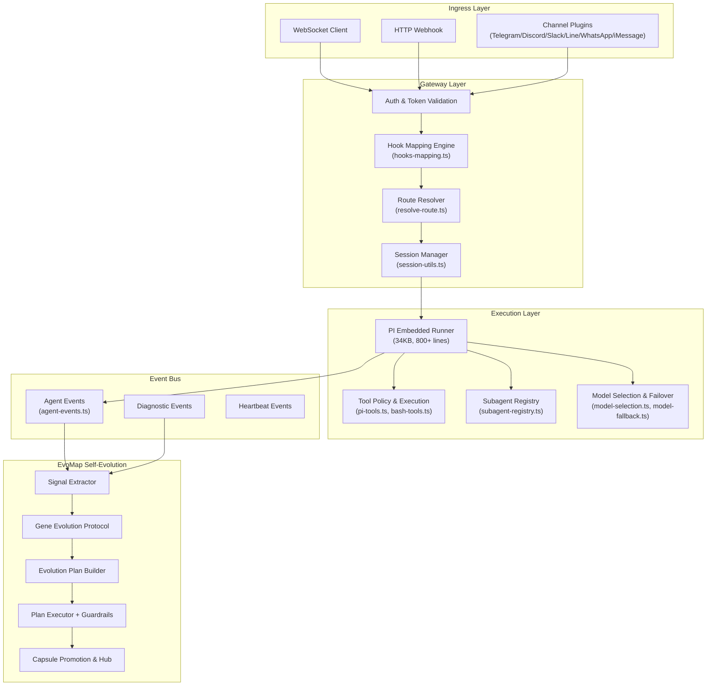

---

## 二、管道分层详析

### 2.1 接入层（Ingress Layer）

| 入口 | 文件 | 协议 |
|------|------|------|
| WebSocket 客户端 | [server-ws-runtime.ts](file:///vol1/1000/projects/openclaw/src/gateway/server-ws-runtime.ts) | WS |
| HTTP Webhook | [hooks.ts](file:///vol1/1000/projects/openclaw/src/gateway/hooks.ts) | HTTP POST + Bearer Token |
| Channel 插件 | [channels/registry.ts](file:///vol1/1000/projects/openclaw/src/channels/registry.ts) | 各平台 SDK |
| OpenAI 兼容 | [openai-http.ts](file:///vol1/1000/projects/openclaw/src/gateway/openai-http.ts) | REST (POST /v1/chat/completions) |
| Open Responses | [openresponses-http.ts](file:///vol1/1000/projects/openclaw/src/gateway/openresponses-http.ts) | REST (POST /v1/responses) |

**评价**：接入层覆盖面广，支持 8+ 通道。但每个通道的接入逻辑分散在不同文件中，没有统一的 **Adapter/Port** 抽象。

### 2.2 网关层（Gateway Layer）

#### Hook Mapping 引擎

[hooks-mapping.ts](file:///vol1/1000/projects/openclaw/src/gateway/hooks-mapping.ts)（445 行）实现了一个 **声明式路由-匹配-转换** 管道：

```
Webhook Request
  → matchPath / matchSource 匹配
  → buildActionFromMapping（模板渲染）
  → loadTransform（动态 ESM 加载自定义转换函数）
  → mergeAction（transform override 合并）
  → validateAction
  → HookAction（wake | agent）
```

> [!IMPORTANT]
> **设计亮点**：Transform 模块通过 `import()` 动态加载，支持用户自定义 hook 处理逻辑，是低代码扩展点。

> [!WARNING]
> **风险**：`transformCache` 为模块级 Map，无 TTL/LRU 策略，长期运行可能内存泄漏。

#### Route Resolver

[resolve-route.ts](file:///vol1/1000/projects/openclaw/src/routing/resolve-route.ts)（265 行）实现了 **优先级匹配路由**：

```
peer → parentPeer → guild → team → account → channel → default
```

匹配链清晰但有如下问题：

> [!CAUTION]
> `bindings.filter()` + 多轮 `bindings.find()` 在绑定数量大时存在 O(N²) 性能风险。

### 2.3 执行层（Execution Layer）

核心在 [pi-embedded-runner/run.ts](file:///vol1/1000/projects/openclaw/src/agents/pi-embedded-runner/run.ts)（34KB），这是 **整个系统最复杂的文件**，集成了：

- System prompt 构建
- Model 选择与 failover
- Tool 注入与执行策略
- 上下文窗口管理（compaction）
- Sandbox 隔离
- 流式响应订阅

**关键子模块**：

| 模块 | 文件 | 职责 |
|------|------|------|
| Model Selection | [model-selection.ts](file:///vol1/1000/projects/openclaw/src/agents/model-selection.ts)（12KB） | provider 选择 + auth profile 轮转 |
| Model Fallback | [model-fallback.ts](file:///vol1/1000/projects/openclaw/src/agents/model-fallback.ts)（11KB） | failover 链 |
| Tool Policy | [pi-tools.policy.ts](file:///vol1/1000/projects/openclaw/src/agents/pi-tools.policy.ts)（10KB） | 工具审批策略 |
| Compaction | [compact.ts](file:///vol1/1000/projects/openclaw/src/agents/pi-embedded-runner/compact.ts)（18KB） | 上下文窗口压缩 |
| Bash Tools | [bash-tools.exec.ts](file:///vol1/1000/projects/openclaw/src/agents/bash-tools.exec.ts)（54KB） | Shell 执行引擎 |

### 2.4 事件总线（Event Bus）

[agent-events.ts](file:///vol1/1000/projects/openclaw/src/infra/agent-events.ts)（84 行）是一个极简的**进程内 pub-sub**：

```typescript
const listeners = new Set<(evt: AgentEventPayload) => void>();
// 发布
emitAgentEvent(event) → enriched with seq + ts → forEach listener
// 订阅
onAgentEvent(listener) → returns unsubscribe fn
```

> [!WARNING]
> **单点瓶颈**：纯内存、单进程、无持久化、无背压。一旦 listener 阻塞，整个事件链阻塞。

### 2.5 EvoMap 自进化管道

这是 OpenClaw 最独特的子系统，实现了 **自诊断→自计划→自修复→自评估** 闭环：

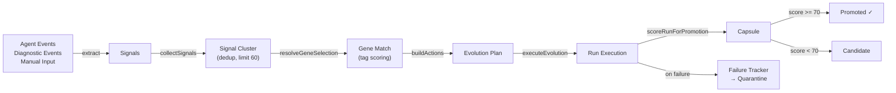

#### Signal 提取 ([extract.ts](file:///vol1/1000/projects/openclaw/src/evomap/signals/extract.ts))

- 从 `AgentEventPayload` 提取 `stream + phase + error` 组合为信号文本
- 从 `DiagnosticEventPayload` 提取 `webhook.error`, `session.stuck`, `message.processed`, `model.usage`
- 基于关键词模式匹配（`EvomapEventPattern`）确定 severity
- 使用 SHA-256 生成 stable fingerprint 用于去重和熔断

#### Gene Evolution Protocol ([assets.ts](file:///vol1/1000/projects/openclaw/src/evomap/gep/assets.ts))

默认 3 个基因：

| Gene ID | 名称 | 领域 | 标签 |
|---------|------|------|------|
| `gene-reliability` | Reliability Loop | ops | stability, retry, circuit-breaker |
| `gene-planning` | Planning Loop | workflow | funnel, triage, handoff |
| `gene-governance` | Governance Loop | policy | approval, budget, audit |

#### Plan Builder ([runner.ts](file:///vol1/1000/projects/openclaw/src/evomap/evolver/runner.ts))

- Risk 分级：presence of high→high, medium→medium, else→low
- Gene 选择：tag 共现评分 + confidence 权重
- Action 生成：`dispatch_task` + `send_followup` + `rollback`
- Approval 触发：high-risk ∨ rollback ∨ exec/network/write 关键词

#### Guardrails

```
maxRunSeconds: 600 (10分钟)
maxToolCalls: 120
maxTokens: 250,000
```

失败 3 次同一 fingerprint → **24 小时隔离（quarantine）**

---

## 三、关键问题与优化建议

### P0：架构级问题

#### 3.1 `server.impl.ts` God Object 反模式

[server.impl.ts](file:///vol1/1000/projects/openclaw/src/gateway/server.impl.ts) 是一个 **639 行的 God Function**（`startGatewayServer`），同时负责：
- 配置加载与迁移
- 插件注册
- TLS 初始化
- UI 资产构建
- WS/HTTP 服务器创建
- 事件总线绑定
- Cron 调度
- Heartbeat 启动
- Channel 管理
- 热重载
- 优雅关闭

```diff
-export async function startGatewayServer(port, opts) {
-  // 639 lines of initialization...
-}
+// 建议拆分为 Builder 模式：
+class GatewayBuilder {
+  withConfig(cfg: OpenClawConfig): this
+  withPlugins(registry: PluginRegistry): this
+  withChannels(manager: ChannelManager): this
+  withEvoMap(service: EvomapLoopService): this
+  build(): Promise<GatewayServer>
+}
```

> **影响**：新增功能必须修改此文件，冲突概率极高；测试需 mock 大量依赖；无法独立部署子系统。

#### 3.2 事件总线无背压 & 无持久化

`agent-events.ts` 的 `Set<listener>` + 同步 `forEach` 设计在以下场景会出问题：

1. **EvoMap listener 抛异常**：虽然 try-catch 吞掉了异常，但信号丢失无日志
2. **高频事件风暴**：无背压机制，listener 数量增加时延迟线性增长
3. **进程重启**：所有未消费事件丢失

```diff
-for (const listener of listeners) {
-  try { listener(enriched); } catch { /* ignore */ }
-}
+// 建议：引入 Ring Buffer + 异步消费
+class AgentEventBus {
+  private ring = new RingBuffer<AgentEventPayload>(10_000);
+  emit(event) { this.ring.push(event); this.notify(); }
+  subscribe(listener, opts: { backpressure: 'drop' | 'block' }) { ... }
+}
```

#### 3.3 `run.ts` 超大文件（34KB）

`pi-embedded-runner/run.ts` 是全系统最大的单文件，包含了完整的 Agent 执行生命周期。这违反了**单一职责原则**，建议拆分为：

| 目标模块 | 职责 |
|---------|------|
| `run-bootstrap.ts` | System prompt 构建 + 上下文初始化 |
| `run-model.ts` | Model 选择 + Provider 路由 |
| `run-tools.ts` | Tool 注入 + 执行策略 |
| `run-stream.ts` | 流式响应处理 + delta 管理 |
| `run-lifecycle.ts` | 生命周期管理 + abort/retry |

### P1：设计缺陷

#### 3.4 Route Resolver O(N²) 性能

`resolveAgentRoute` 中先 `filter` 再多轮 `find`，在绑定数量 > 100 时性能退化明显：

```diff
-const bindings = listBindings(input.cfg).filter(...)
-const peerMatch = bindings.find(b => matchesPeer(b.match, peer));
-const guildMatch = bindings.find(b => matchesGuild(b.match, guildId));
+// 建议：预构建索引 Map
+const bindingIndex = buildBindingIndex(listBindings(cfg));
+// lookups become O(1):
+const peerMatch = bindingIndex.byPeer.get(`${peer.kind}:${peer.id}`);
```

#### 3.5 Hook Transform 无安全沙箱

`loadTransform` 使用 `import()` 加载用户指定的 ESM 模块，无任何隔离：

```typescript
const mod = (await import(url)) as Record<string, unknown>;
```

> [!CAUTION]
> 这意味着 hook transform 可以访问整个 Node.js API，包括文件系统和网络。应考虑 `vm.Module` 或 Worker Thread 隔离。

#### 3.6 EvoMap Singleton 反测试模式

```typescript
let singleton: EvomapLoopService | null = null;
export function getEvomapLoopService(options?) {
  if (!singleton) singleton = new EvomapLoopService(options);
  return singleton;
}
```

Options 仅在首次创建时生效，后续调用传入不同 options 都被忽略。这导致：
- 测试间状态泄漏（虽然有 `resetForTest`）
- 无法并行测试不同配置

#### 3.7 Evolution Plan Builder 硬编码策略

`buildActions` 中的 action 生成逻辑完全硬编码，不支持基于 Gene 或模板的动态策略：

```typescript
// 始终生成 dispatch_task 作为第一个 action
actions.push({
  type: "dispatch_task",
  title: "dispatch-investigation",
  task: `Analyze and resolve: ${baseTask}`,
  targetAgentId: params.selectedGeneIds.includes("gene-reliability") 
    ? "maintagent" : undefined,
});
```

建议将 action 生成策略抽取为 `ActionStrategy` 接口，允许 GEP assets 中定义 action 模板。

### P2：改进建议

#### 3.8 Capsule Promotion 评分过于简单

`scoreRunForPromotion` 使用线性扣分：

```
base=82, errorCount*18, minutes*2, toolCalls-12, high_risk-10, rollback-8
```

无正向评分指标，无 A/B 对比机制。建议增加：
- Run 执行质量信号（如子 session 的完成率）
- 历史同类 Plan 的 baseline 对比
- 用户反馈信号权重

#### 3.9 Signal 提取缺乏结构化解析

`extractSignalsFromAgentEvents` 将所有事件字段拼成一个文本字符串：

```typescript
const summary = [event.stream, phase ? `phase=${phase}` : "", error ? `error=${error}` : ""]
  .filter(Boolean).join(" ");
```

丢失了结构化信息。建议保留原始字段到 `metadata`，并使用结构化匹配替代纯文本关键词匹配。

#### 3.10 无分布式/多进程支持

整个管道基于 **单进程内存状态**：
- `Map/Set` 保存运行状态
- EventEmitter 模式的事件传递
- Singleton 服务实例

在横向扩展（多 Gateway 实例）场景下无法工作。建议引入 Redis/Durable Objects 作为状态后端。

---

## 四、管道数据流完整路径

以 **Webhook→Agent 执行** 为例的完整数据流：

```
1. HTTP POST /hooks/:path
   → extractHookToken (Bearer / x-openclaw-token)
   → readJsonBody (256KB limit)
   → applyHookMappings
     → matchPath + matchSource
     → renderTemplate ({{payload.field}} 插值)
     → loadTransform (可选 ESM 自定义)
     → mergeAction → HookAction{kind:"agent", message, agentId, ...}

2. resolveHookTargetAgentId
   → normalizeAgentId → knownAgentIds check
   → isHookAgentAllowed → allowedAgentIds check

3. resolveAgentRoute
   → listBindings → filter(channel + accountId)
   → priority: peer → parentPeer → guild → team → account → channel → default
   → buildAgentSessionKey

4. queueEmbeddedPiMessage
   → runEmbeddedPiAgent (run.ts)
     → resolveModel + auth profiles
     → buildSystemPrompt (AGENTS.md + skills + identity)
     → limitHistoryTurns
     → createChatCompletion (streaming)
     → subscribeEmbeddedPiSession
       → handler: assistant text → emitAgentEvent
       → handler: tool call → execute → emitAgentEvent
       → handler: lifecycle end → emitAgentEvent

5. Event Bus Fanout
   → server-chat.ts: emitChatDelta → WS broadcast
   → EvoMap listener: push to agentEvents buffer
   → Diagnostic listener: push to diagnosticEvents buffer

6. (Async) EvoMap Loop
   → collectSignals → extractSignalsFromAgentEvents
   → planEvolution → buildEvolutionPlan
   → executeEvolution → sessions_spawn / sessions_send
   → scoreRunForPromotion → Capsule promotion
```

---

## 五、重构优先级矩阵

| 优先级 | 项目 | 复杂度 | 影响面 | 建议时间 |
|--------|------|--------|--------|---------|
| **P0** | `server.impl.ts` 拆分为 Builder | 高 | 全局 | 2-3 sprint |
| **P0** | 事件总线引入背压 + Ring Buffer | 中 | Agent 执行 + EvoMap | 1 sprint |
| **P1** | `run.ts` 按职责拆分为 5 模块 | 高 | Agent 执行 | 2 sprint |
| **P1** | Route Resolver 索引优化 | 低 | 路由性能 | 0.5 sprint |
| **P1** | Hook Transform 安全隔离 | 中 | 安全 | 1 sprint |
| **P2** | EvoMap action 策略可配置化 | 中 | 自进化质量 | 1 sprint |
| **P2** | Capsule 评分增加正向信号 | 低 | 自进化质量 | 0.5 sprint |
| **P2** | Signal 结构化提取 | 低 | 信号质量 | 0.5 sprint |

---

## 六、结论

OpenClaw 的需求管道设计展现了**较高的工程成熟度**，特别是：

1. **精细的 Hook Mapping 引擎**：模板渲染 + 动态转换 + 多层 override，低代码可扩展性好
2. **完整的 EvoMap 自进化闭环**：Signal→Gene→Plan→Execute→Capsule→Promote 全自动化
3. **健壮的 Guardrail 体系**：budget 三重限制 + fingerprint quarantine + approval 审批

但在**可维护性**和**可扩展性**方面存在明显瓶颈：
- God Object/God Function 反模式（server.impl.ts, run.ts）
- 无背压事件总线
- 硬编码策略与 Singleton 反模式

**建议先执行 P0 重构**（server.impl.ts 拆分 + 事件总线升级），再逐步推进 P1 改进，以显著降低开发摩擦和运维风险。

---

## 2026-02-26 13:05:33 +0800 | /vol1/1000/antigravity/data/User/History/-55161db9/E1eJ.md | source=
resource: vscode-remote://ssh-remote%2B7b22686f73744e616d65223a22666e6f73227d/home/yuanhaizhou/.gemini/antigravity/brain/cf3a1159-970d-47d1-b0e2-2ff0828abf12/openclaw_pipeline_review.md

# OpenClaw 需求管道（Request Pipeline）架构深度评审

## 一、架构总览

OpenClaw 的需求管道是一个**事件驱动、多层管道（multi-layer pipeline）**架构，覆盖从外部消息接入到 AI Agent 执行再到自进化反馈的完整生命周期。


---

## 二、管道分层详析

### 2.1 接入层（Ingress Layer）

| 入口 | 文件 | 协议 |
|------|------|------|
| WebSocket 客户端 | [server-ws-runtime.ts](file:///vol1/1000/projects/openclaw/src/gateway/server-ws-runtime.ts) | WS |
| HTTP Webhook | [hooks.ts](file:///vol1/1000/projects/openclaw/src/gateway/hooks.ts) | HTTP POST + Bearer Token |
| Channel 插件 | [channels/registry.ts](file:///vol1/1000/projects/openclaw/src/channels/registry.ts) | 各平台 SDK |
| OpenAI 兼容 | [openai-http.ts](file:///vol1/1000/projects/openclaw/src/gateway/openai-http.ts) | REST (POST /v1/chat/completions) |
| Open Responses | [openresponses-http.ts](file:///vol1/1000/projects/openclaw/src/gateway/openresponses-http.ts) | REST (POST /v1/responses) |

**评价**：接入层覆盖面广，支持 8+ 通道。但每个通道的接入逻辑分散在不同文件中，没有统一的 **Adapter/Port** 抽象。

### 2.2 网关层（Gateway Layer）

#### Hook Mapping 引擎

[hooks-mapping.ts](file:///vol1/1000/projects/openclaw/src/gateway/hooks-mapping.ts)（445 行）实现了一个 **声明式路由-匹配-转换** 管道：

```
Webhook Request
  → matchPath / matchSource 匹配
  → buildActionFromMapping（模板渲染）
  → loadTransform（动态 ESM 加载自定义转换函数）
  → mergeAction（transform override 合并）
  → validateAction
  → HookAction（wake | agent）
```

> [!IMPORTANT]
> **设计亮点**：Transform 模块通过 `import()` 动态加载，支持用户自定义 hook 处理逻辑，是低代码扩展点。

> [!WARNING]
> **风险**：`transformCache` 为模块级 Map，无 TTL/LRU 策略，长期运行可能内存泄漏。

#### Route Resolver

[resolve-route.ts](file:///vol1/1000/projects/openclaw/src/routing/resolve-route.ts)（265 行）实现了 **优先级匹配路由**：

```
peer → parentPeer → guild → team → account → channel → default
```

匹配链清晰但有如下问题：

> [!CAUTION]
> `bindings.filter()` + 多轮 `bindings.find()` 在绑定数量大时存在 O(N²) 性能风险。

### 2.3 执行层（Execution Layer）

核心在 [pi-embedded-runner/run.ts](file:///vol1/1000/projects/openclaw/src/agents/pi-embedded-runner/run.ts)（34KB），这是 **整个系统最复杂的文件**，集成了：

- System prompt 构建
- Model 选择与 failover
- Tool 注入与执行策略
- 上下文窗口管理（compaction）
- Sandbox 隔离
- 流式响应订阅

**关键子模块**：

| 模块 | 文件 | 职责 |
|------|------|------|
| Model Selection | [model-selection.ts](file:///vol1/1000/projects/openclaw/src/agents/model-selection.ts)（12KB） | provider 选择 + auth profile 轮转 |
| Model Fallback | [model-fallback.ts](file:///vol1/1000/projects/openclaw/src/agents/model-fallback.ts)（11KB） | failover 链 |
| Tool Policy | [pi-tools.policy.ts](file:///vol1/1000/projects/openclaw/src/agents/pi-tools.policy.ts)（10KB） | 工具审批策略 |
| Compaction | [compact.ts](file:///vol1/1000/projects/openclaw/src/agents/pi-embedded-runner/compact.ts)（18KB） | 上下文窗口压缩 |
| Bash Tools | [bash-tools.exec.ts](file:///vol1/1000/projects/openclaw/src/agents/bash-tools.exec.ts)（54KB） | Shell 执行引擎 |

### 2.4 事件总线（Event Bus）

[agent-events.ts](file:///vol1/1000/projects/openclaw/src/infra/agent-events.ts)（84 行）是一个极简的**进程内 pub-sub**：

```typescript
const listeners = new Set<(evt: AgentEventPayload) => void>();
// 发布
emitAgentEvent(event) → enriched with seq + ts → forEach listener
// 订阅
onAgentEvent(listener) → returns unsubscribe fn
```

> [!WARNING]
> **单点瓶颈**：纯内存、单进程、无持久化、无背压。一旦 listener 阻塞，整个事件链阻塞。

### 2.5 EvoMap 自进化管道

这是 OpenClaw 最独特的子系统，实现了 **自诊断→自计划→自修复→自评估** 闭环：


#### Signal 提取 ([extract.ts](file:///vol1/1000/projects/openclaw/src/evomap/signals/extract.ts))

- 从 `AgentEventPayload` 提取 `stream + phase + error` 组合为信号文本
- 从 `DiagnosticEventPayload` 提取 `webhook.error`, `session.stuck`, `message.processed`, `model.usage`
- 基于关键词模式匹配（`EvomapEventPattern`）确定 severity
- 使用 SHA-256 生成 stable fingerprint 用于去重和熔断

#### Gene Evolution Protocol ([assets.ts](file:///vol1/1000/projects/openclaw/src/evomap/gep/assets.ts))

默认 3 个基因：

| Gene ID | 名称 | 领域 | 标签 |
|---------|------|------|------|
| `gene-reliability` | Reliability Loop | ops | stability, retry, circuit-breaker |
| `gene-planning` | Planning Loop | workflow | funnel, triage, handoff |
| `gene-governance` | Governance Loop | policy | approval, budget, audit |

#### Plan Builder ([runner.ts](file:///vol1/1000/projects/openclaw/src/evomap/evolver/runner.ts))

- Risk 分级：presence of high→high, medium→medium, else→low
- Gene 选择：tag 共现评分 + confidence 权重
- Action 生成：`dispatch_task` + `send_followup` + `rollback`
- Approval 触发：high-risk ∨ rollback ∨ exec/network/write 关键词

#### Guardrails

```
maxRunSeconds: 600 (10分钟)
maxToolCalls: 120
maxTokens: 250,000
```

失败 3 次同一 fingerprint → **24 小时隔离（quarantine）**

---

## 三、关键问题与优化建议

### P0：架构级问题

#### 3.1 `server.impl.ts` God Object 反模式

[server.impl.ts](file:///vol1/1000/projects/openclaw/src/gateway/server.impl.ts) 是一个 **639 行的 God Function**（`startGatewayServer`），同时负责：
- 配置加载与迁移
- 插件注册
- TLS 初始化
- UI 资产构建
- WS/HTTP 服务器创建
- 事件总线绑定
- Cron 调度
- Heartbeat 启动
- Channel 管理
- 热重载
- 优雅关闭

```diff
-export async function startGatewayServer(port, opts) {
-  // 639 lines of initialization...
-}
+// 建议拆分为 Builder 模式：
+class GatewayBuilder {
+  withConfig(cfg: OpenClawConfig): this
+  withPlugins(registry: PluginRegistry): this
+  withChannels(manager: ChannelManager): this
+  withEvoMap(service: EvomapLoopService): this
+  build(): Promise<GatewayServer>
+}
```

> **影响**：新增功能必须修改此文件，冲突概率极高；测试需 mock 大量依赖；无法独立部署子系统。

#### 3.2 事件总线无背压 & 无持久化

`agent-events.ts` 的 `Set<listener>` + 同步 `forEach` 设计在以下场景会出问题：

1. **EvoMap listener 抛异常**：虽然 try-catch 吞掉了异常，但信号丢失无日志
2. **高频事件风暴**：无背压机制，listener 数量增加时延迟线性增长
3. **进程重启**：所有未消费事件丢失

```diff
-for (const listener of listeners) {
-  try { listener(enriched); } catch { /* ignore */ }
-}
+// 建议：引入 Ring Buffer + 异步消费
+class AgentEventBus {
+  private ring = new RingBuffer<AgentEventPayload>(10_000);
+  emit(event) { this.ring.push(event); this.notify(); }
+  subscribe(listener, opts: { backpressure: 'drop' | 'block' }) { ... }
+}
```

#### 3.3 `run.ts` 超大文件（34KB）

`pi-embedded-runner/run.ts` 是全系统最大的单文件，包含了完整的 Agent 执行生命周期。这违反了**单一职责原则**，建议拆分为：

| 目标模块 | 职责 |
|---------|------|
| `run-bootstrap.ts` | System prompt 构建 + 上下文初始化 |
| `run-model.ts` | Model 选择 + Provider 路由 |
| `run-tools.ts` | Tool 注入 + 执行策略 |
| `run-stream.ts` | 流式响应处理 + delta 管理 |
| `run-lifecycle.ts` | 生命周期管理 + abort/retry |

### P1：设计缺陷

#### 3.4 Route Resolver O(N²) 性能

`resolveAgentRoute` 中先 `filter` 再多轮 `find`，在绑定数量 > 100 时性能退化明显：

```diff
-const bindings = listBindings(input.cfg).filter(...)
-const peerMatch = bindings.find(b => matchesPeer(b.match, peer));
-const guildMatch = bindings.find(b => matchesGuild(b.match, guildId));
+// 建议：预构建索引 Map
+const bindingIndex = buildBindingIndex(listBindings(cfg));
+// lookups become O(1):
+const peerMatch = bindingIndex.byPeer.get(`${peer.kind}:${peer.id}`);
```

#### 3.5 Hook Transform 无安全沙箱

`loadTransform` 使用 `import()` 加载用户指定的 ESM 模块，无任何隔离：

```typescript
const mod = (await import(url)) as Record<string, unknown>;
```

> [!CAUTION]
> 这意味着 hook transform 可以访问整个 Node.js API，包括文件系统和网络。应考虑 `vm.Module` 或 Worker Thread 隔离。

#### 3.6 EvoMap Singleton 反测试模式

```typescript
let singleton: EvomapLoopService | null = null;
export function getEvomapLoopService(options?) {
  if (!singleton) singleton = new EvomapLoopService(options);
  return singleton;
}
```

Options 仅在首次创建时生效，后续调用传入不同 options 都被忽略。这导致：
- 测试间状态泄漏（虽然有 `resetForTest`）
- 无法并行测试不同配置

#### 3.7 Evolution Plan Builder 硬编码策略

`buildActions` 中的 action 生成逻辑完全硬编码，不支持基于 Gene 或模板的动态策略：

```typescript
// 始终生成 dispatch_task 作为第一个 action
actions.push({
  type: "dispatch_task",
  title: "dispatch-investigation",
  task: `Analyze and resolve: ${baseTask}`,
  targetAgentId: params.selectedGeneIds.includes("gene-reliability") 
    ? "maintagent" : undefined,
});
```

建议将 action 生成策略抽取为 `ActionStrategy` 接口，允许 GEP assets 中定义 action 模板。

### P2：改进建议

#### 3.8 Capsule Promotion 评分过于简单

`scoreRunForPromotion` 使用线性扣分：

```
base=82, errorCount*18, minutes*2, toolCalls-12, high_risk-10, rollback-8
```

无正向评分指标，无 A/B 对比机制。建议增加：
- Run 执行质量信号（如子 session 的完成率）
- 历史同类 Plan 的 baseline 对比
- 用户反馈信号权重

#### 3.9 Signal 提取缺乏结构化解析

`extractSignalsFromAgentEvents` 将所有事件字段拼成一个文本字符串：

```typescript
const summary = [event.stream, phase ? `phase=${phase}` : "", error ? `error=${error}` : ""]
  .filter(Boolean).join(" ");
```

丢失了结构化信息。建议保留原始字段到 `metadata`，并使用结构化匹配替代纯文本关键词匹配。

#### 3.10 无分布式/多进程支持

整个管道基于 **单进程内存状态**：
- `Map/Set` 保存运行状态
- EventEmitter 模式的事件传递
- Singleton 服务实例

在横向扩展（多 Gateway 实例）场景下无法工作。建议引入 Redis/Durable Objects 作为状态后端。

---

## 四、管道数据流完整路径

以 **Webhook→Agent 执行** 为例的完整数据流：

```
1. HTTP POST /hooks/:path
   → extractHookToken (Bearer / x-openclaw-token)
   → readJsonBody (256KB limit)
   → applyHookMappings
     → matchPath + matchSource
     → renderTemplate ({{payload.field}} 插值)
     → loadTransform (可选 ESM 自定义)
     → mergeAction → HookAction{kind:"agent", message, agentId, ...}

2. resolveHookTargetAgentId
   → normalizeAgentId → knownAgentIds check
   → isHookAgentAllowed → allowedAgentIds check

3. resolveAgentRoute
   → listBindings → filter(channel + accountId)
   → priority: peer → parentPeer → guild → team → account → channel → default
   → buildAgentSessionKey

4. queueEmbeddedPiMessage
   → runEmbeddedPiAgent (run.ts)
     → resolveModel + auth profiles
     → buildSystemPrompt (AGENTS.md + skills + identity)
     → limitHistoryTurns
     → createChatCompletion (streaming)
     → subscribeEmbeddedPiSession
       → handler: assistant text → emitAgentEvent
       → handler: tool call → execute → emitAgentEvent
       → handler: lifecycle end → emitAgentEvent

5. Event Bus Fanout
   → server-chat.ts: emitChatDelta → WS broadcast
   → EvoMap listener: push to agentEvents buffer
   → Diagnostic listener: push to diagnosticEvents buffer

6. (Async) EvoMap Loop
   → collectSignals → extractSignalsFromAgentEvents
   → planEvolution → buildEvolutionPlan
   → executeEvolution → sessions_spawn / sessions_send
   → scoreRunForPromotion → Capsule promotion
```

---

## 五、重构优先级矩阵

| 优先级 | 项目 | 复杂度 | 影响面 | 建议时间 |
|--------|------|--------|--------|---------|
| **P0** | `server.impl.ts` 拆分为 Builder | 高 | 全局 | 2-3 sprint |
| **P0** | 事件总线引入背压 + Ring Buffer | 中 | Agent 执行 + EvoMap | 1 sprint |
| **P1** | `run.ts` 按职责拆分为 5 模块 | 高 | Agent 执行 | 2 sprint |
| **P1** | Route Resolver 索引优化 | 低 | 路由性能 | 0.5 sprint |
| **P1** | Hook Transform 安全隔离 | 中 | 安全 | 1 sprint |
| **P2** | EvoMap action 策略可配置化 | 中 | 自进化质量 | 1 sprint |
| **P2** | Capsule 评分增加正向信号 | 低 | 自进化质量 | 0.5 sprint |
| **P2** | Signal 结构化提取 | 低 | 信号质量 | 0.5 sprint |

---

## 六、结论

OpenClaw 的需求管道设计展现了**较高的工程成熟度**，特别是：

1. **精细的 Hook Mapping 引擎**：模板渲染 + 动态转换 + 多层 override，低代码可扩展性好
2. **完整的 EvoMap 自进化闭环**：Signal→Gene→Plan→Execute→Capsule→Promote 全自动化
3. **健壮的 Guardrail 体系**：budget 三重限制 + fingerprint quarantine + approval 审批

但在**可维护性**和**可扩展性**方面存在明显瓶颈：
- God Object/God Function 反模式（server.impl.ts, run.ts）
- 无背压事件总线
- 硬编码策略与 Singleton 反模式

**建议先执行 P0 重构**（server.impl.ts 拆分 + 事件总线升级），再逐步推进 P1 改进，以显著降低开发摩擦和运维风险。

---

## 2026-02-26 13:19:49 +0800 | /vol1/1000/antigravity/data/User/History/-55161db9/ibDt.md | source=Workspace Edit
resource: vscode-remote://ssh-remote%2B7b22686f73744e616d65223a22666e6f73227d/home/yuanhaizhou/.gemini/antigravity/brain/cf3a1159-970d-47d1-b0e2-2ff0828abf12/openclaw_pipeline_review.md

# OpenClaw 需求管道（Request Pipeline）架构深度评审

## 一、架构总览

OpenClaw 的需求管道是一个**事件驱动、多层管道（multi-layer pipeline）**架构，覆盖从外部消息接入到 AI Agent 执行再到自进化反馈的完整生命周期。


---

## 二、管道分层详析

### 2.1 接入层（Ingress Layer）

| 入口 | 文件 | 协议 |
|------|------|------|
| WebSocket 客户端 | [server-ws-runtime.ts](file:///vol1/1000/projects/openclaw/src/gateway/server-ws-runtime.ts) | WS |
| HTTP Webhook | [hooks.ts](file:///vol1/1000/projects/openclaw/src/gateway/hooks.ts) | HTTP POST + Bearer Token |
| Channel 插件 | [channels/registry.ts](file:///vol1/1000/projects/openclaw/src/channels/registry.ts) | 各平台 SDK |
| OpenAI 兼容 | [openai-http.ts](file:///vol1/1000/projects/openclaw/src/gateway/openai-http.ts) | REST (POST /v1/chat/completions) |
| Open Responses | [openresponses-http.ts](file:///vol1/1000/projects/openclaw/src/gateway/openresponses-http.ts) | REST (POST /v1/responses) |

**评价**：接入层覆盖面广，支持 8+ 通道。但每个通道的接入逻辑分散在不同文件中，没有统一的 **Adapter/Port** 抽象。

### 2.2 网关层（Gateway Layer）

#### Hook Mapping 引擎

[hooks-mapping.ts](file:///vol1/1000/projects/openclaw/src/gateway/hooks-mapping.ts)（445 行）实现了一个 **声明式路由-匹配-转换** 管道：

```
Webhook Request
  → matchPath / matchSource 匹配
  → buildActionFromMapping（模板渲染）
  → loadTransform（动态 ESM 加载自定义转换函数）
  → mergeAction（transform override 合并）
  → validateAction
  → HookAction（wake | agent）
```

> [!IMPORTANT]
> **设计亮点**：Transform 模块通过 `import()` 动态加载，支持用户自定义 hook 处理逻辑，是低代码扩展点。

> [!WARNING]
> **风险**：`transformCache` 为模块级 Map，无 TTL/LRU 策略，长期运行可能内存泄漏。

#### Route Resolver

[resolve-route.ts](file:///vol1/1000/projects/openclaw/src/routing/resolve-route.ts)（265 行）实现了 **优先级匹配路由**：

```
peer → parentPeer → guild → team → account → channel → default
```

匹配链清晰但有如下问题：

> [!CAUTION]
> `bindings.filter()` + 多轮 `bindings.find()` 在绑定数量大时存在 O(N²) 性能风险。

### 2.3 执行层（Execution Layer）

核心在 [pi-embedded-runner/run.ts](file:///vol1/1000/projects/openclaw/src/agents/pi-embedded-runner/run.ts)（34KB），这是 **整个系统最复杂的文件**，集成了：

- System prompt 构建
- Model 选择与 failover
- Tool 注入与执行策略
- 上下文窗口管理（compaction）
- Sandbox 隔离
- 流式响应订阅

**关键子模块**：

| 模块 | 文件 | 职责 |
|------|------|------|
| Model Selection | [model-selection.ts](file:///vol1/1000/projects/openclaw/src/agents/model-selection.ts)（12KB） | provider 选择 + auth profile 轮转 |
| Model Fallback | [model-fallback.ts](file:///vol1/1000/projects/openclaw/src/agents/model-fallback.ts)（11KB） | failover 链 |
| Tool Policy | [pi-tools.policy.ts](file:///vol1/1000/projects/openclaw/src/agents/pi-tools.policy.ts)（10KB） | 工具审批策略 |
| Compaction | [compact.ts](file:///vol1/1000/projects/openclaw/src/agents/pi-embedded-runner/compact.ts)（18KB） | 上下文窗口压缩 |
| Bash Tools | [bash-tools.exec.ts](file:///vol1/1000/projects/openclaw/src/agents/bash-tools.exec.ts)（54KB） | Shell 执行引擎 |

### 2.4 事件总线（Event Bus）

[agent-events.ts](file:///vol1/1000/projects/openclaw/src/infra/agent-events.ts)（84 行）是一个极简的**进程内 pub-sub**：

```typescript
const listeners = new Set<(evt: AgentEventPayload) => void>();
// 发布
emitAgentEvent(event) → enriched with seq + ts → forEach listener
// 订阅
onAgentEvent(listener) → returns unsubscribe fn
```

> [!WARNING]
> **单点瓶颈**：纯内存、单进程、无持久化、无背压。一旦 listener 阻塞，整个事件链阻塞。

### 2.5 EvoMap 自进化管道

这是 OpenClaw 最独特的子系统，实现了 **自诊断→自计划→自修复→自评估** 闭环：


#### Signal 提取 ([extract.ts](file:///vol1/1000/projects/openclaw/src/evomap/signals/extract.ts))

- 从 `AgentEventPayload` 提取 `stream + phase + error` 组合为信号文本
- 从 `DiagnosticEventPayload` 提取 `webhook.error`, `session.stuck`, `message.processed`, `model.usage`
- 基于关键词模式匹配（`EvomapEventPattern`）确定 severity
- 使用 SHA-256 生成 stable fingerprint 用于去重和熔断

#### Gene Evolution Protocol ([assets.ts](file:///vol1/1000/projects/openclaw/src/evomap/gep/assets.ts))

默认 3 个基因：

| Gene ID | 名称 | 领域 | 标签 |
|---------|------|------|------|
| `gene-reliability` | Reliability Loop | ops | stability, retry, circuit-breaker |
| `gene-planning` | Planning Loop | workflow | funnel, triage, handoff |
| `gene-governance` | Governance Loop | policy | approval, budget, audit |

#### Plan Builder ([runner.ts](file:///vol1/1000/projects/openclaw/src/evomap/evolver/runner.ts))

- Risk 分级：presence of high→high, medium→medium, else→low
- Gene 选择：tag 共现评分 + confidence 权重
- Action 生成：`dispatch_task` + `send_followup` + `rollback`
- Approval 触发：high-risk ∨ rollback ∨ exec/network/write 关键词

#### Guardrails

```
maxRunSeconds: 600 (10分钟)
maxToolCalls: 120
maxTokens: 250,000
```

失败 3 次同一 fingerprint → **24 小时隔离（quarantine）**

---

## 三、关键问题与优化建议

### P0：架构级问题

#### 3.1 `server.impl.ts` God Object 反模式

[server.impl.ts](file:///vol1/1000/projects/openclaw/src/gateway/server.impl.ts) 是一个 **639 行的 God Function**（`startGatewayServer`），同时负责：
- 配置加载与迁移
- 插件注册
- TLS 初始化
- UI 资产构建
- WS/HTTP 服务器创建
- 事件总线绑定
- Cron 调度
- Heartbeat 启动
- Channel 管理
- 热重载
- 优雅关闭

```diff
-export async function startGatewayServer(port, opts) {
-  // 639 lines of initialization...
-}
+// 建议拆分为 Builder 模式：
+class GatewayBuilder {
+  withConfig(cfg: OpenClawConfig): this
+  withPlugins(registry: PluginRegistry): this
+  withChannels(manager: ChannelManager): this
+  withEvoMap(service: EvomapLoopService): this
+  build(): Promise<GatewayServer>
+}
```

> **影响**：新增功能必须修改此文件，冲突概率极高；测试需 mock 大量依赖；无法独立部署子系统。

#### 3.2 事件总线无背压 & 无持久化

`agent-events.ts` 的 `Set<listener>` + 同步 `forEach` 设计在以下场景会出问题：

1. **EvoMap listener 抛异常**：虽然 try-catch 吞掉了异常，但信号丢失无日志
2. **高频事件风暴**：无背压机制，listener 数量增加时延迟线性增长
3. **进程重启**：所有未消费事件丢失

```diff
-for (const listener of listeners) {
-  try { listener(enriched); } catch { /* ignore */ }
-}
+// 建议：引入 Ring Buffer + 异步消费
+class AgentEventBus {
+  private ring = new RingBuffer<AgentEventPayload>(10_000);
+  emit(event) { this.ring.push(event); this.notify(); }
+  subscribe(listener, opts: { backpressure: 'drop' | 'block' }) { ... }
+}
```

#### 3.3 `run.ts` 超大文件（34KB）

`pi-embedded-runner/run.ts` 是全系统最大的单文件，包含了完整的 Agent 执行生命周期。这违反了**单一职责原则**，建议拆分为：

| 目标模块 | 职责 |
|---------|------|
| `run-bootstrap.ts` | System prompt 构建 + 上下文初始化 |
| `run-model.ts` | Model 选择 + Provider 路由 |
| `run-tools.ts` | Tool 注入 + 执行策略 |
| `run-stream.ts` | 流式响应处理 + delta 管理 |
| `run-lifecycle.ts` | 生命周期管理 + abort/retry |

### P1：设计缺陷

#### 3.4 Route Resolver O(N²) 性能

`resolveAgentRoute` 中先 `filter` 再多轮 `find`，在绑定数量 > 100 时性能退化明显：

```diff
-const bindings = listBindings(input.cfg).filter(...)
-const peerMatch = bindings.find(b => matchesPeer(b.match, peer));
-const guildMatch = bindings.find(b => matchesGuild(b.match, guildId));
+// 建议：预构建索引 Map
+const bindingIndex = buildBindingIndex(listBindings(cfg));
+// lookups become O(1):
+const peerMatch = bindingIndex.byPeer.get(`${peer.kind}:${peer.id}`);
```

#### 3.5 Hook Transform 无安全沙箱

`loadTransform` 使用 `import()` 加载用户指定的 ESM 模块，无任何隔离：

```typescript
const mod = (await import(url)) as Record<string, unknown>;
```

> [!CAUTION]
> 这意味着 hook transform 可以访问整个 Node.js API，包括文件系统和网络。应考虑 `vm.Module` 或 Worker Thread 隔离。

#### 3.6 EvoMap Singleton 反测试模式

```typescript
let singleton: EvomapLoopService | null = null;
export function getEvomapLoopService(options?) {
  if (!singleton) singleton = new EvomapLoopService(options);
  return singleton;
}
```

Options 仅在首次创建时生效，后续调用传入不同 options 都被忽略。这导致：
- 测试间状态泄漏（虽然有 `resetForTest`）
- 无法并行测试不同配置

#### 3.7 Evolution Plan Builder 硬编码策略

`buildActions` 中的 action 生成逻辑完全硬编码，不支持基于 Gene 或模板的动态策略：

```typescript
// 始终生成 dispatch_task 作为第一个 action
actions.push({
  type: "dispatch_task",
  title: "dispatch-investigation",
  task: `Analyze and resolve: ${baseTask}`,
  targetAgentId: params.selectedGeneIds.includes("gene-reliability") 
    ? "maintagent" : undefined,
});
```

建议将 action 生成策略抽取为 `ActionStrategy` 接口，允许 GEP assets 中定义 action 模板。

### P2：改进建议

#### 3.8 Capsule Promotion 评分过于简单

`scoreRunForPromotion` 使用线性扣分：

```
base=82, errorCount*18, minutes*2, toolCalls-12, high_risk-10, rollback-8
```

无正向评分指标，无 A/B 对比机制。建议增加：
- Run 执行质量信号（如子 session 的完成率）
- 历史同类 Plan 的 baseline 对比
- 用户反馈信号权重

#### 3.9 Signal 提取缺乏结构化解析

`extractSignalsFromAgentEvents` 将所有事件字段拼成一个文本字符串：

```typescript
const summary = [event.stream, phase ? `phase=${phase}` : "", error ? `error=${error}` : ""]
  .filter(Boolean).join(" ");
```

丢失了结构化信息。建议保留原始字段到 `metadata`，并使用结构化匹配替代纯文本关键词匹配。

#### 3.10 无分布式/多进程支持

整个管道基于 **单进程内存状态**：
- `Map/Set` 保存运行状态
- EventEmitter 模式的事件传递
- Singleton 服务实例

在横向扩展（多 Gateway 实例）场景下无法工作。建议引入 Redis/Durable Objects 作为状态后端。

---

## 四、管道数据流完整路径

以 **Webhook→Agent 执行** 为例的完整数据流：

```
1. HTTP POST /hooks/:path
   → extractHookToken (Bearer / x-openclaw-token)
   → readJsonBody (256KB limit)
   → applyHookMappings
     → matchPath + matchSource
     → renderTemplate ({{payload.field}} 插值)
     → loadTransform (可选 ESM 自定义)
     → mergeAction → HookAction{kind:"agent", message, agentId, ...}

2. resolveHookTargetAgentId
   → normalizeAgentId → knownAgentIds check
   → isHookAgentAllowed → allowedAgentIds check

3. resolveAgentRoute
   → listBindings → filter(channel + accountId)
   → priority: peer → parentPeer → guild → team → account → channel → default
   → buildAgentSessionKey

4. queueEmbeddedPiMessage
   → runEmbeddedPiAgent (run.ts)
     → resolveModel + auth profiles
     → buildSystemPrompt (AGENTS.md + skills + identity)
     → limitHistoryTurns
     → createChatCompletion (streaming)
     → subscribeEmbeddedPiSession
       → handler: assistant text → emitAgentEvent
       → handler: tool call → execute → emitAgentEvent
       → handler: lifecycle end → emitAgentEvent

5. Event Bus Fanout
   → server-chat.ts: emitChatDelta → WS broadcast
   → EvoMap listener: push to agentEvents buffer
   → Diagnostic listener: push to diagnosticEvents buffer

6. (Async) EvoMap Loop
   → collectSignals → extractSignalsFromAgentEvents
   → planEvolution → buildEvolutionPlan
   → executeEvolution → sessions_spawn / sessions_send
   → scoreRunForPromotion → Capsule promotion
```

---

## 五、重构优先级矩阵

| 优先级 | 项目 | 复杂度 | 影响面 | 建议时间 |
|--------|------|--------|--------|---------|
| **P0** | `server.impl.ts` 拆分为 Builder | 高 | 全局 | 2-3 sprint |
| **P0** | 事件总线引入背压 + Ring Buffer | 中 | Agent 执行 + EvoMap | 1 sprint |
| **P1** | `run.ts` 按职责拆分为 5 模块 | 高 | Agent 执行 | 2 sprint |
| **P1** | Route Resolver 索引优化 | 低 | 路由性能 | 0.5 sprint |
| **P1** | Hook Transform 安全隔离 | 中 | 安全 | 1 sprint |
| **P2** | EvoMap action 策略可配置化 | 中 | 自进化质量 | 1 sprint |
| **P2** | Capsule 评分增加正向信号 | 低 | 自进化质量 | 0.5 sprint |
| **P2** | Signal 结构化提取 | 低 | 信号质量 | 0.5 sprint |

---

## 六、结论

OpenClaw 的需求管道设计展现了**较高的工程成熟度**，特别是：

1. **精细的 Hook Mapping 引擎**：模板渲染 + 动态转换 + 多层 override，低代码可扩展性好
2. **完整的 EvoMap 自进化闭环**：Signal→Gene→Plan→Execute→Capsule→Promote 全自动化
3. **健壮的 Guardrail 体系**：budget 三重限制 + fingerprint quarantine + approval 审批

但在**可维护性**和**可扩展性**方面存在明显瓶颈：
- God Object/God Function 反模式（server.impl.ts, run.ts）
- 无背压事件总线
- 硬编码策略与 Singleton 反模式

**建议先执行 P0 重构**（server.impl.ts 拆分 + 事件总线升级），再逐步推进 P1 改进，以显著降低开发摩擦和运维风险。

---

## 2026-02-26 13:20:00 +0800 | /vol1/1000/antigravity/data/User/History/-55161db9/oA6M.md | source=Workspace Edit
resource: vscode-remote://ssh-remote%2B7b22686f73744e616d65223a22666e6f73227d/home/yuanhaizhou/.gemini/antigravity/brain/cf3a1159-970d-47d1-b0e2-2ff0828abf12/openclaw_pipeline_review.md

# OpenClaw 需求管道（Request Pipeline）架构深度评审

## 一、架构总览

OpenClaw 的需求管道是一个**事件驱动、多层管道（multi-layer pipeline）**架构，覆盖从外部消息接入到 AI Agent 执行再到自进化反馈的完整生命周期。


---

## 二、管道分层详析

### 2.1 接入层（Ingress Layer）

| 入口 | 文件 | 协议 |
|------|------|------|
| WebSocket 客户端 | [server-ws-runtime.ts](file:///vol1/1000/projects/openclaw/src/gateway/server-ws-runtime.ts) | WS |
| HTTP Webhook | [hooks.ts](file:///vol1/1000/projects/openclaw/src/gateway/hooks.ts) | HTTP POST + Bearer Token |
| Channel 插件 | [channels/registry.ts](file:///vol1/1000/projects/openclaw/src/channels/registry.ts) | 各平台 SDK |
| OpenAI 兼容 | [openai-http.ts](file:///vol1/1000/projects/openclaw/src/gateway/openai-http.ts) | REST (POST /v1/chat/completions) |
| Open Responses | [openresponses-http.ts](file:///vol1/1000/projects/openclaw/src/gateway/openresponses-http.ts) | REST (POST /v1/responses) |

**评价**：接入层覆盖面广，支持 8+ 通道。但每个通道的接入逻辑分散在不同文件中，没有统一的 **Adapter/Port** 抽象。

### 2.2 网关层（Gateway Layer）

#### Hook Mapping 引擎

[hooks-mapping.ts](file:///vol1/1000/projects/openclaw/src/gateway/hooks-mapping.ts)（445 行）实现了一个 **声明式路由-匹配-转换** 管道：

```
Webhook Request
  → matchPath / matchSource 匹配
  → buildActionFromMapping（模板渲染）
  → loadTransform（动态 ESM 加载自定义转换函数）
  → mergeAction（transform override 合并）
  → validateAction
  → HookAction（wake | agent）
```

> [!IMPORTANT]
> **设计亮点**：Transform 模块通过 `import()` 动态加载，支持用户自定义 hook 处理逻辑，是低代码扩展点。

> [!WARNING]
> **风险**：`transformCache` 为模块级 Map，无 TTL/LRU 策略，长期运行可能内存泄漏。

#### Route Resolver

[resolve-route.ts](file:///vol1/1000/projects/openclaw/src/routing/resolve-route.ts)（265 行）实现了 **优先级匹配路由**：

```
peer → parentPeer → guild → team → account → channel → default
```

匹配链清晰但有如下问题：

> [!CAUTION]
> `bindings.filter()` + 多轮 `bindings.find()` 在绑定数量大时存在 O(N²) 性能风险。

### 2.3 执行层（Execution Layer）

核心在 [pi-embedded-runner/run.ts](file:///vol1/1000/projects/openclaw/src/agents/pi-embedded-runner/run.ts)（34KB），这是 **整个系统最复杂的文件**，集成了：

- System prompt 构建
- Model 选择与 failover
- Tool 注入与执行策略
- 上下文窗口管理（compaction）
- Sandbox 隔离
- 流式响应订阅

**关键子模块**：

| 模块 | 文件 | 职责 |
|------|------|------|
| Model Selection | [model-selection.ts](file:///vol1/1000/projects/openclaw/src/agents/model-selection.ts)（12KB） | provider 选择 + auth profile 轮转 |
| Model Fallback | [model-fallback.ts](file:///vol1/1000/projects/openclaw/src/agents/model-fallback.ts)（11KB） | failover 链 |
| Tool Policy | [pi-tools.policy.ts](file:///vol1/1000/projects/openclaw/src/agents/pi-tools.policy.ts)（10KB） | 工具审批策略 |
| Compaction | [compact.ts](file:///vol1/1000/projects/openclaw/src/agents/pi-embedded-runner/compact.ts)（18KB） | 上下文窗口压缩 |
| Bash Tools | [bash-tools.exec.ts](file:///vol1/1000/projects/openclaw/src/agents/bash-tools.exec.ts)（54KB） | Shell 执行引擎 |

### 2.4 事件总线（Event Bus）

[agent-events.ts](file:///vol1/1000/projects/openclaw/src/infra/agent-events.ts)（84 行）是一个极简的**进程内 pub-sub**：

```typescript
const listeners = new Set<(evt: AgentEventPayload) => void>();
// 发布
emitAgentEvent(event) → enriched with seq + ts → forEach listener
// 订阅
onAgentEvent(listener) → returns unsubscribe fn
```

> [!WARNING]
> **单点瓶颈**：纯内存、单进程、无持久化、无背压。一旦 listener 阻塞，整个事件链阻塞。

### 2.5 EvoMap 自进化管道

这是 OpenClaw 最独特的子系统，实现了 **自诊断→自计划→自修复→自评估** 闭环：


#### Signal 提取 ([extract.ts](file:///vol1/1000/projects/openclaw/src/evomap/signals/extract.ts))

- 从 `AgentEventPayload` 提取 `stream + phase + error` 组合为信号文本
- 从 `DiagnosticEventPayload` 提取 `webhook.error`, `session.stuck`, `message.processed`, `model.usage`
- 基于关键词模式匹配（`EvomapEventPattern`）确定 severity
- 使用 SHA-256 生成 stable fingerprint 用于去重和熔断

#### Gene Evolution Protocol ([assets.ts](file:///vol1/1000/projects/openclaw/src/evomap/gep/assets.ts))

默认 3 个基因：

| Gene ID | 名称 | 领域 | 标签 |
|---------|------|------|------|
| `gene-reliability` | Reliability Loop | ops | stability, retry, circuit-breaker |
| `gene-planning` | Planning Loop | workflow | funnel, triage, handoff |
| `gene-governance` | Governance Loop | policy | approval, budget, audit |

#### Plan Builder ([runner.ts](file:///vol1/1000/projects/openclaw/src/evomap/evolver/runner.ts))

- Risk 分级：presence of high→high, medium→medium, else→low
- Gene 选择：tag 共现评分 + confidence 权重
- Action 生成：`dispatch_task` + `send_followup` + `rollback`
- Approval 触发：high-risk ∨ rollback ∨ exec/network/write 关键词

#### Guardrails

```
maxRunSeconds: 600 (10分钟)
maxToolCalls: 120
maxTokens: 250,000
```

失败 3 次同一 fingerprint → **24 小时隔离（quarantine）**

---

## 三、关键问题与优化建议

### P0：架构级问题

#### 3.1 `server.impl.ts` God Object 反模式

[server.impl.ts](file:///vol1/1000/projects/openclaw/src/gateway/server.impl.ts) 是一个 **639 行的 God Function**（`startGatewayServer`），同时负责：
- 配置加载与迁移
- 插件注册
- TLS 初始化
- UI 资产构建
- WS/HTTP 服务器创建
- 事件总线绑定
- Cron 调度
- Heartbeat 启动
- Channel 管理
- 热重载
- 优雅关闭

```diff
-export async function startGatewayServer(port, opts) {
-  // 639 lines of initialization...
-}
+// 建议拆分为 Builder 模式：
+class GatewayBuilder {
+  withConfig(cfg: OpenClawConfig): this
+  withPlugins(registry: PluginRegistry): this
+  withChannels(manager: ChannelManager): this
+  withEvoMap(service: EvomapLoopService): this
+  build(): Promise<GatewayServer>
+}
```

> **影响**：新增功能必须修改此文件，冲突概率极高；测试需 mock 大量依赖；无法独立部署子系统。

#### 3.2 事件总线无背压 & 无持久化

`agent-events.ts` 的 `Set<listener>` + 同步 `forEach` 设计在以下场景会出问题：

1. **EvoMap listener 抛异常**：虽然 try-catch 吞掉了异常，但信号丢失无日志
2. **高频事件风暴**：无背压机制，listener 数量增加时延迟线性增长
3. **进程重启**：所有未消费事件丢失

```diff
-for (const listener of listeners) {
-  try { listener(enriched); } catch { /* ignore */ }
-}
+// 建议：引入 Ring Buffer + 异步消费
+class AgentEventBus {
+  private ring = new RingBuffer<AgentEventPayload>(10_000);
+  emit(event) { this.ring.push(event); this.notify(); }
+  subscribe(listener, opts: { backpressure: 'drop' | 'block' }) { ... }
+}
```

#### 3.3 `run.ts` 超大文件（34KB）

`pi-embedded-runner/run.ts` 是全系统最大的单文件，包含了完整的 Agent 执行生命周期。这违反了**单一职责原则**，建议拆分为：

| 目标模块 | 职责 |
|---------|------|
| `run-bootstrap.ts` | System prompt 构建 + 上下文初始化 |
| `run-model.ts` | Model 选择 + Provider 路由 |
| `run-tools.ts` | Tool 注入 + 执行策略 |
| `run-stream.ts` | 流式响应处理 + delta 管理 |
| `run-lifecycle.ts` | 生命周期管理 + abort/retry |

### P1：设计缺陷

#### 3.4 Route Resolver O(N²) 性能

`resolveAgentRoute` 中先 `filter` 再多轮 `find`，在绑定数量 > 100 时性能退化明显：

```diff
-const bindings = listBindings(input.cfg).filter(...)
-const peerMatch = bindings.find(b => matchesPeer(b.match, peer));
-const guildMatch = bindings.find(b => matchesGuild(b.match, guildId));
+// 建议：预构建索引 Map
+const bindingIndex = buildBindingIndex(listBindings(cfg));
+// lookups become O(1):
+const peerMatch = bindingIndex.byPeer.get(`${peer.kind}:${peer.id}`);
```

#### 3.5 Hook Transform 无安全沙箱

`loadTransform` 使用 `import()` 加载用户指定的 ESM 模块，无任何隔离：

```typescript
const mod = (await import(url)) as Record<string, unknown>;
```

> [!CAUTION]
> 这意味着 hook transform 可以访问整个 Node.js API，包括文件系统和网络。应考虑 `vm.Module` 或 Worker Thread 隔离。

#### 3.6 EvoMap Singleton 反测试模式

```typescript
let singleton: EvomapLoopService | null = null;
export function getEvomapLoopService(options?) {
  if (!singleton) singleton = new EvomapLoopService(options);
  return singleton;
}
```

Options 仅在首次创建时生效，后续调用传入不同 options 都被忽略。这导致：
- 测试间状态泄漏（虽然有 `resetForTest`）
- 无法并行测试不同配置

#### 3.7 Evolution Plan Builder 硬编码策略

`buildActions` 中的 action 生成逻辑完全硬编码，不支持基于 Gene 或模板的动态策略：

```typescript
// 始终生成 dispatch_task 作为第一个 action
actions.push({
  type: "dispatch_task",
  title: "dispatch-investigation",
  task: `Analyze and resolve: ${baseTask}`,
  targetAgentId: params.selectedGeneIds.includes("gene-reliability") 
    ? "maintagent" : undefined,
});
```

建议将 action 生成策略抽取为 `ActionStrategy` 接口，允许 GEP assets 中定义 action 模板。

### P2：改进建议

#### 3.8 Capsule Promotion 评分过于简单

`scoreRunForPromotion` 使用线性扣分：

```
base=82, errorCount*18, minutes*2, toolCalls-12, high_risk-10, rollback-8
```

无正向评分指标，无 A/B 对比机制。建议增加：
- Run 执行质量信号（如子 session 的完成率）
- 历史同类 Plan 的 baseline 对比
- 用户反馈信号权重

#### 3.9 Signal 提取缺乏结构化解析

`extractSignalsFromAgentEvents` 将所有事件字段拼成一个文本字符串：

```typescript
const summary = [event.stream, phase ? `phase=${phase}` : "", error ? `error=${error}` : ""]
  .filter(Boolean).join(" ");
```

丢失了结构化信息。建议保留原始字段到 `metadata`，并使用结构化匹配替代纯文本关键词匹配。

#### 3.10 无分布式/多进程支持

整个管道基于 **单进程内存状态**：
- `Map/Set` 保存运行状态
- EventEmitter 模式的事件传递
- Singleton 服务实例

在横向扩展（多 Gateway 实例）场景下无法工作。建议引入 Redis/Durable Objects 作为状态后端。

---

## 四、管道数据流完整路径

以 **Webhook→Agent 执行** 为例的完整数据流：

```
1. HTTP POST /hooks/:path
   → extractHookToken (Bearer / x-openclaw-token)
   → readJsonBody (256KB limit)
   → applyHookMappings
     → matchPath + matchSource
     → renderTemplate ({{payload.field}} 插值)
     → loadTransform (可选 ESM 自定义)
     → mergeAction → HookAction{kind:"agent", message, agentId, ...}

2. resolveHookTargetAgentId
   → normalizeAgentId → knownAgentIds check
   → isHookAgentAllowed → allowedAgentIds check

3. resolveAgentRoute
   → listBindings → filter(channel + accountId)
   → priority: peer → parentPeer → guild → team → account → channel → default
   → buildAgentSessionKey

4. queueEmbeddedPiMessage
   → runEmbeddedPiAgent (run.ts)
     → resolveModel + auth profiles
     → buildSystemPrompt (AGENTS.md + skills + identity)
     → limitHistoryTurns
     → createChatCompletion (streaming)
     → subscribeEmbeddedPiSession
       → handler: assistant text → emitAgentEvent
       → handler: tool call → execute → emitAgentEvent
       → handler: lifecycle end → emitAgentEvent

5. Event Bus Fanout
   → server-chat.ts: emitChatDelta → WS broadcast
   → EvoMap listener: push to agentEvents buffer
   → Diagnostic listener: push to diagnosticEvents buffer

6. (Async) EvoMap Loop
   → collectSignals → extractSignalsFromAgentEvents
   → planEvolution → buildEvolutionPlan
   → executeEvolution → sessions_spawn / sessions_send
   → scoreRunForPromotion → Capsule promotion
```

---

## 五、重构优先级矩阵

| 优先级 | 项目 | 复杂度 | 影响面 | 建议时间 |
|--------|------|--------|--------|---------|
| **P0** | `server.impl.ts` 拆分为 Builder | 高 | 全局 | 2-3 sprint |
| **P0** | 事件总线引入背压 + Ring Buffer | 中 | Agent 执行 + EvoMap | 1 sprint |
| **P1** | `run.ts` 按职责拆分为 5 模块 | 高 | Agent 执行 | 2 sprint |
| **P1** | Route Resolver 索引优化 | 低 | 路由性能 | 0.5 sprint |
| **P1** | Hook Transform 安全隔离 | 中 | 安全 | 1 sprint |
| **P2** | EvoMap action 策略可配置化 | 中 | 自进化质量 | 1 sprint |
| **P2** | Capsule 评分增加正向信号 | 低 | 自进化质量 | 0.5 sprint |
| **P2** | Signal 结构化提取 | 低 | 信号质量 | 0.5 sprint |

---

## 六、结论

OpenClaw 的需求管道设计展现了**较高的工程成熟度**，特别是：

1. **精细的 Hook Mapping 引擎**：模板渲染 + 动态转换 + 多层 override，低代码可扩展性好
2. **完整的 EvoMap 自进化闭环**：Signal→Gene→Plan→Execute→Capsule→Promote 全自动化
3. **健壮的 Guardrail 体系**：budget 三重限制 + fingerprint quarantine + approval 审批

但在**可维护性**和**可扩展性**方面存在明显瓶颈：
- God Object/God Function 反模式（server.impl.ts, run.ts）
- 无背压事件总线
- 硬编码策略与 Singleton 反模式

**建议先执行 P0 重构**（server.impl.ts 拆分 + 事件总线升级），再逐步推进 P1 改进，以显著降低开发摩擦和运维风险。

---

## 2026-02-26 13:20:39 +0800 | /vol1/1000/antigravity/data/User/History/-55161db9/0xjf.md | source=Workspace Edit
resource: vscode-remote://ssh-remote%2B7b22686f73744e616d65223a22666e6f73227d/home/yuanhaizhou/.gemini/antigravity/brain/cf3a1159-970d-47d1-b0e2-2ff0828abf12/openclaw_pipeline_review.md

# OpenClaw 需求管道（Request Pipeline）架构深度评审

## 一、架构总览

OpenClaw 的需求管道是一个**事件驱动、多层管道（multi-layer pipeline）**架构，覆盖从外部消息接入到 AI Agent 执行再到自进化反馈的完整生命周期。

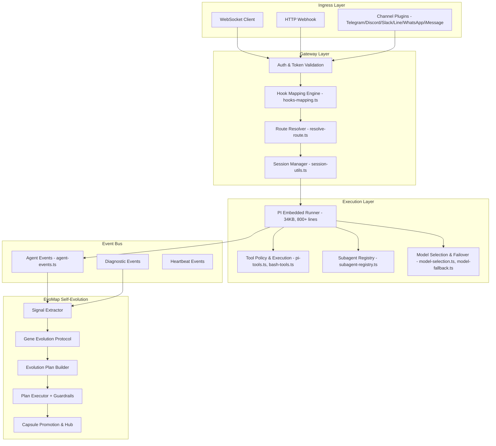


---

## 二、管道分层详析

### 2.1 接入层（Ingress Layer）

| 入口 | 文件 | 协议 |
|------|------|------|
| WebSocket 客户端 | [server-ws-runtime.ts](file:///vol1/1000/projects/openclaw/src/gateway/server-ws-runtime.ts) | WS |
| HTTP Webhook | [hooks.ts](file:///vol1/1000/projects/openclaw/src/gateway/hooks.ts) | HTTP POST + Bearer Token |
| Channel 插件 | [channels/registry.ts](file:///vol1/1000/projects/openclaw/src/channels/registry.ts) | 各平台 SDK |
| OpenAI 兼容 | [openai-http.ts](file:///vol1/1000/projects/openclaw/src/gateway/openai-http.ts) | REST (POST /v1/chat/completions) |
| Open Responses | [openresponses-http.ts](file:///vol1/1000/projects/openclaw/src/gateway/openresponses-http.ts) | REST (POST /v1/responses) |

**评价**：接入层覆盖面广，支持 8+ 通道。但每个通道的接入逻辑分散在不同文件中，没有统一的 **Adapter/Port** 抽象。

### 2.2 网关层（Gateway Layer）

#### Hook Mapping 引擎

[hooks-mapping.ts](file:///vol1/1000/projects/openclaw/src/gateway/hooks-mapping.ts)（445 行）实现了一个 **声明式路由-匹配-转换** 管道：

```
Webhook Request
  → matchPath / matchSource 匹配
  → buildActionFromMapping（模板渲染）
  → loadTransform（动态 ESM 加载自定义转换函数）
  → mergeAction（transform override 合并）
  → validateAction
  → HookAction（wake | agent）
```

> [!IMPORTANT]
> **设计亮点**：Transform 模块通过 `import()` 动态加载，支持用户自定义 hook 处理逻辑，是低代码扩展点。

> [!WARNING]
> **风险**：`transformCache` 为模块级 Map，无 TTL/LRU 策略，长期运行可能内存泄漏。

#### Route Resolver

[resolve-route.ts](file:///vol1/1000/projects/openclaw/src/routing/resolve-route.ts)（265 行）实现了 **优先级匹配路由**：

```
peer → parentPeer → guild → team → account → channel → default
```

匹配链清晰但有如下问题：

> [!CAUTION]
> `bindings.filter()` + 多轮 `bindings.find()` 在绑定数量大时存在 O(N²) 性能风险。

### 2.3 执行层（Execution Layer）

核心在 [pi-embedded-runner/run.ts](file:///vol1/1000/projects/openclaw/src/agents/pi-embedded-runner/run.ts)（34KB），这是 **整个系统最复杂的文件**，集成了：

- System prompt 构建
- Model 选择与 failover
- Tool 注入与执行策略
- 上下文窗口管理（compaction）
- Sandbox 隔离
- 流式响应订阅

**关键子模块**：

| 模块 | 文件 | 职责 |
|------|------|------|
| Model Selection | [model-selection.ts](file:///vol1/1000/projects/openclaw/src/agents/model-selection.ts)（12KB） | provider 选择 + auth profile 轮转 |
| Model Fallback | [model-fallback.ts](file:///vol1/1000/projects/openclaw/src/agents/model-fallback.ts)（11KB） | failover 链 |
| Tool Policy | [pi-tools.policy.ts](file:///vol1/1000/projects/openclaw/src/agents/pi-tools.policy.ts)（10KB） | 工具审批策略 |
| Compaction | [compact.ts](file:///vol1/1000/projects/openclaw/src/agents/pi-embedded-runner/compact.ts)（18KB） | 上下文窗口压缩 |
| Bash Tools | [bash-tools.exec.ts](file:///vol1/1000/projects/openclaw/src/agents/bash-tools.exec.ts)（54KB） | Shell 执行引擎 |

### 2.4 事件总线（Event Bus）

[agent-events.ts](file:///vol1/1000/projects/openclaw/src/infra/agent-events.ts)（84 行）是一个极简的**进程内 pub-sub**：

```typescript
const listeners = new Set<(evt: AgentEventPayload) => void>();
// 发布
emitAgentEvent(event) → enriched with seq + ts → forEach listener
// 订阅
onAgentEvent(listener) → returns unsubscribe fn
```

> [!WARNING]
> **单点瓶颈**：纯内存、单进程、无持久化、无背压。一旦 listener 阻塞，整个事件链阻塞。

### 2.5 EvoMap 自进化管道

这是 OpenClaw 最独特的子系统，实现了 **自诊断→自计划→自修复→自评估** 闭环：


#### Signal 提取 ([extract.ts](file:///vol1/1000/projects/openclaw/src/evomap/signals/extract.ts))

- 从 `AgentEventPayload` 提取 `stream + phase + error` 组合为信号文本
- 从 `DiagnosticEventPayload` 提取 `webhook.error`, `session.stuck`, `message.processed`, `model.usage`
- 基于关键词模式匹配（`EvomapEventPattern`）确定 severity
- 使用 SHA-256 生成 stable fingerprint 用于去重和熔断

#### Gene Evolution Protocol ([assets.ts](file:///vol1/1000/projects/openclaw/src/evomap/gep/assets.ts))

默认 3 个基因：

| Gene ID | 名称 | 领域 | 标签 |
|---------|------|------|------|
| `gene-reliability` | Reliability Loop | ops | stability, retry, circuit-breaker |
| `gene-planning` | Planning Loop | workflow | funnel, triage, handoff |
| `gene-governance` | Governance Loop | policy | approval, budget, audit |

#### Plan Builder ([runner.ts](file:///vol1/1000/projects/openclaw/src/evomap/evolver/runner.ts))

- Risk 分级：presence of high→high, medium→medium, else→low
- Gene 选择：tag 共现评分 + confidence 权重
- Action 生成：`dispatch_task` + `send_followup` + `rollback`
- Approval 触发：high-risk ∨ rollback ∨ exec/network/write 关键词

#### Guardrails

```
maxRunSeconds: 600 (10分钟)
maxToolCalls: 120
maxTokens: 250,000
```

失败 3 次同一 fingerprint → **24 小时隔离（quarantine）**

---

## 三、关键问题与优化建议

### P0：架构级问题

#### 3.1 `server.impl.ts` God Object 反模式

[server.impl.ts](file:///vol1/1000/projects/openclaw/src/gateway/server.impl.ts) 是一个 **639 行的 God Function**（`startGatewayServer`），同时负责：
- 配置加载与迁移
- 插件注册
- TLS 初始化
- UI 资产构建
- WS/HTTP 服务器创建
- 事件总线绑定
- Cron 调度
- Heartbeat 启动
- Channel 管理
- 热重载
- 优雅关闭

```diff
-export async function startGatewayServer(port, opts) {
-  // 639 lines of initialization...
-}
+// 建议拆分为 Builder 模式：
+class GatewayBuilder {
+  withConfig(cfg: OpenClawConfig): this
+  withPlugins(registry: PluginRegistry): this
+  withChannels(manager: ChannelManager): this
+  withEvoMap(service: EvomapLoopService): this
+  build(): Promise<GatewayServer>
+}
```

> **影响**：新增功能必须修改此文件，冲突概率极高；测试需 mock 大量依赖；无法独立部署子系统。

#### 3.2 事件总线无背压 & 无持久化

`agent-events.ts` 的 `Set<listener>` + 同步 `forEach` 设计在以下场景会出问题：

1. **EvoMap listener 抛异常**：虽然 try-catch 吞掉了异常，但信号丢失无日志
2. **高频事件风暴**：无背压机制，listener 数量增加时延迟线性增长
3. **进程重启**：所有未消费事件丢失

```diff
-for (const listener of listeners) {
-  try { listener(enriched); } catch { /* ignore */ }
-}
+// 建议：引入 Ring Buffer + 异步消费
+class AgentEventBus {
+  private ring = new RingBuffer<AgentEventPayload>(10_000);
+  emit(event) { this.ring.push(event); this.notify(); }
+  subscribe(listener, opts: { backpressure: 'drop' | 'block' }) { ... }
+}
```

#### 3.3 `run.ts` 超大文件（34KB）

`pi-embedded-runner/run.ts` 是全系统最大的单文件，包含了完整的 Agent 执行生命周期。这违反了**单一职责原则**，建议拆分为：

| 目标模块 | 职责 |
|---------|------|
| `run-bootstrap.ts` | System prompt 构建 + 上下文初始化 |
| `run-model.ts` | Model 选择 + Provider 路由 |
| `run-tools.ts` | Tool 注入 + 执行策略 |
| `run-stream.ts` | 流式响应处理 + delta 管理 |
| `run-lifecycle.ts` | 生命周期管理 + abort/retry |

### P1：设计缺陷

#### 3.4 Route Resolver O(N²) 性能

`resolveAgentRoute` 中先 `filter` 再多轮 `find`，在绑定数量 > 100 时性能退化明显：

```diff
-const bindings = listBindings(input.cfg).filter(...)
-const peerMatch = bindings.find(b => matchesPeer(b.match, peer));
-const guildMatch = bindings.find(b => matchesGuild(b.match, guildId));
+// 建议：预构建索引 Map
+const bindingIndex = buildBindingIndex(listBindings(cfg));
+// lookups become O(1):
+const peerMatch = bindingIndex.byPeer.get(`${peer.kind}:${peer.id}`);
```

#### 3.5 Hook Transform 无安全沙箱

`loadTransform` 使用 `import()` 加载用户指定的 ESM 模块，无任何隔离：

```typescript
const mod = (await import(url)) as Record<string, unknown>;
```

> [!CAUTION]
> 这意味着 hook transform 可以访问整个 Node.js API，包括文件系统和网络。应考虑 `vm.Module` 或 Worker Thread 隔离。

#### 3.6 EvoMap Singleton 反测试模式

```typescript
let singleton: EvomapLoopService | null = null;
export function getEvomapLoopService(options?) {
  if (!singleton) singleton = new EvomapLoopService(options);
  return singleton;
}
```

Options 仅在首次创建时生效，后续调用传入不同 options 都被忽略。这导致：
- 测试间状态泄漏（虽然有 `resetForTest`）
- 无法并行测试不同配置

#### 3.7 Evolution Plan Builder 硬编码策略

`buildActions` 中的 action 生成逻辑完全硬编码，不支持基于 Gene 或模板的动态策略：

```typescript
// 始终生成 dispatch_task 作为第一个 action
actions.push({
  type: "dispatch_task",
  title: "dispatch-investigation",
  task: `Analyze and resolve: ${baseTask}`,
  targetAgentId: params.selectedGeneIds.includes("gene-reliability") 
    ? "maintagent" : undefined,
});
```

建议将 action 生成策略抽取为 `ActionStrategy` 接口，允许 GEP assets 中定义 action 模板。

### P2：改进建议

#### 3.8 Capsule Promotion 评分过于简单

`scoreRunForPromotion` 使用线性扣分：

```
base=82, errorCount*18, minutes*2, toolCalls-12, high_risk-10, rollback-8
```

无正向评分指标，无 A/B 对比机制。建议增加：
- Run 执行质量信号（如子 session 的完成率）
- 历史同类 Plan 的 baseline 对比
- 用户反馈信号权重

#### 3.9 Signal 提取缺乏结构化解析

`extractSignalsFromAgentEvents` 将所有事件字段拼成一个文本字符串：

```typescript
const summary = [event.stream, phase ? `phase=${phase}` : "", error ? `error=${error}` : ""]
  .filter(Boolean).join(" ");
```

丢失了结构化信息。建议保留原始字段到 `metadata`，并使用结构化匹配替代纯文本关键词匹配。

#### 3.10 无分布式/多进程支持

整个管道基于 **单进程内存状态**：
- `Map/Set` 保存运行状态
- EventEmitter 模式的事件传递
- Singleton 服务实例

在横向扩展（多 Gateway 实例）场景下无法工作。建议引入 Redis/Durable Objects 作为状态后端。

---

## 四、管道数据流完整路径

以 **Webhook→Agent 执行** 为例的完整数据流：

```
1. HTTP POST /hooks/:path
   → extractHookToken (Bearer / x-openclaw-token)
   → readJsonBody (256KB limit)
   → applyHookMappings
     → matchPath + matchSource
     → renderTemplate ({{payload.field}} 插值)
     → loadTransform (可选 ESM 自定义)
     → mergeAction → HookAction{kind:"agent", message, agentId, ...}

2. resolveHookTargetAgentId
   → normalizeAgentId → knownAgentIds check
   → isHookAgentAllowed → allowedAgentIds check

3. resolveAgentRoute
   → listBindings → filter(channel + accountId)
   → priority: peer → parentPeer → guild → team → account → channel → default
   → buildAgentSessionKey

4. queueEmbeddedPiMessage
   → runEmbeddedPiAgent (run.ts)
     → resolveModel + auth profiles
     → buildSystemPrompt (AGENTS.md + skills + identity)
     → limitHistoryTurns
     → createChatCompletion (streaming)
     → subscribeEmbeddedPiSession
       → handler: assistant text → emitAgentEvent
       → handler: tool call → execute → emitAgentEvent
       → handler: lifecycle end → emitAgentEvent

5. Event Bus Fanout
   → server-chat.ts: emitChatDelta → WS broadcast
   → EvoMap listener: push to agentEvents buffer
   → Diagnostic listener: push to diagnosticEvents buffer

6. (Async) EvoMap Loop
   → collectSignals → extractSignalsFromAgentEvents
   → planEvolution → buildEvolutionPlan
   → executeEvolution → sessions_spawn / sessions_send
   → scoreRunForPromotion → Capsule promotion
```

---

## 五、重构优先级矩阵

| 优先级 | 项目 | 复杂度 | 影响面 | 建议时间 |
|--------|------|--------|--------|---------|
| **P0** | `server.impl.ts` 拆分为 Builder | 高 | 全局 | 2-3 sprint |
| **P0** | 事件总线引入背压 + Ring Buffer | 中 | Agent 执行 + EvoMap | 1 sprint |
| **P1** | `run.ts` 按职责拆分为 5 模块 | 高 | Agent 执行 | 2 sprint |
| **P1** | Route Resolver 索引优化 | 低 | 路由性能 | 0.5 sprint |
| **P1** | Hook Transform 安全隔离 | 中 | 安全 | 1 sprint |
| **P2** | EvoMap action 策略可配置化 | 中 | 自进化质量 | 1 sprint |
| **P2** | Capsule 评分增加正向信号 | 低 | 自进化质量 | 0.5 sprint |
| **P2** | Signal 结构化提取 | 低 | 信号质量 | 0.5 sprint |

---

## 六、结论

OpenClaw 的需求管道设计展现了**较高的工程成熟度**，特别是：

1. **精细的 Hook Mapping 引擎**：模板渲染 + 动态转换 + 多层 override，低代码可扩展性好
2. **完整的 EvoMap 自进化闭环**：Signal→Gene→Plan→Execute→Capsule→Promote 全自动化
3. **健壮的 Guardrail 体系**：budget 三重限制 + fingerprint quarantine + approval 审批

但在**可维护性**和**可扩展性**方面存在明显瓶颈：
- God Object/God Function 反模式（server.impl.ts, run.ts）
- 无背压事件总线
- 硬编码策略与 Singleton 反模式

**建议先执行 P0 重构**（server.impl.ts 拆分 + 事件总线升级），再逐步推进 P1 改进，以显著降低开发摩擦和运维风险。

---

## 2026-02-26 13:21:03 +0800 | /vol1/1000/antigravity/data/User/History/-55161db9/gGzt.md | source=Workspace Edit
resource: vscode-remote://ssh-remote%2B7b22686f73744e616d65223a22666e6f73227d/home/yuanhaizhou/.gemini/antigravity/brain/cf3a1159-970d-47d1-b0e2-2ff0828abf12/openclaw_pipeline_review.md

# OpenClaw 需求管道（Request Pipeline）架构深度评审

## 一、架构总览

OpenClaw 的需求管道是一个**事件驱动、多层管道（multi-layer pipeline）**架构，覆盖从外部消息接入到 AI Agent 执行再到自进化反馈的完整生命周期。


---

## 二、管道分层详析

### 2.1 接入层（Ingress Layer）

| 入口 | 文件 | 协议 |
|------|------|------|
| WebSocket 客户端 | [server-ws-runtime.ts](file:///vol1/1000/projects/openclaw/src/gateway/server-ws-runtime.ts) | WS |
| HTTP Webhook | [hooks.ts](file:///vol1/1000/projects/openclaw/src/gateway/hooks.ts) | HTTP POST + Bearer Token |
| Channel 插件 | [channels/registry.ts](file:///vol1/1000/projects/openclaw/src/channels/registry.ts) | 各平台 SDK |
| OpenAI 兼容 | [openai-http.ts](file:///vol1/1000/projects/openclaw/src/gateway/openai-http.ts) | REST (POST /v1/chat/completions) |
| Open Responses | [openresponses-http.ts](file:///vol1/1000/projects/openclaw/src/gateway/openresponses-http.ts) | REST (POST /v1/responses) |

**评价**：接入层覆盖面广，支持 8+ 通道。但每个通道的接入逻辑分散在不同文件中，没有统一的 **Adapter/Port** 抽象。

### 2.2 网关层（Gateway Layer）

#### Hook Mapping 引擎

[hooks-mapping.ts](file:///vol1/1000/projects/openclaw/src/gateway/hooks-mapping.ts)（445 行）实现了一个 **声明式路由-匹配-转换** 管道：

```
Webhook Request
  → matchPath / matchSource 匹配
  → buildActionFromMapping（模板渲染）
  → loadTransform（动态 ESM 加载自定义转换函数）
  → mergeAction（transform override 合并）
  → validateAction
  → HookAction（wake | agent）
```

> [!IMPORTANT]
> **设计亮点**：Transform 模块通过 `import()` 动态加载，支持用户自定义 hook 处理逻辑，是低代码扩展点。

> [!WARNING]
> **风险**：`transformCache` 为模块级 Map，无 TTL/LRU 策略，长期运行可能内存泄漏。

#### Route Resolver

[resolve-route.ts](file:///vol1/1000/projects/openclaw/src/routing/resolve-route.ts)（265 行）实现了 **优先级匹配路由**：

```
peer → parentPeer → guild → team → account → channel → default
```

匹配链清晰但有如下问题：

> [!CAUTION]
> `bindings.filter()` + 多轮 `bindings.find()` 在绑定数量大时存在 O(N²) 性能风险。

### 2.3 执行层（Execution Layer）

核心在 [pi-embedded-runner/run.ts](file:///vol1/1000/projects/openclaw/src/agents/pi-embedded-runner/run.ts)（34KB），这是 **整个系统最复杂的文件**，集成了：

- System prompt 构建
- Model 选择与 failover
- Tool 注入与执行策略
- 上下文窗口管理（compaction）
- Sandbox 隔离
- 流式响应订阅

**关键子模块**：

| 模块 | 文件 | 职责 |
|------|------|------|
| Model Selection | [model-selection.ts](file:///vol1/1000/projects/openclaw/src/agents/model-selection.ts)（12KB） | provider 选择 + auth profile 轮转 |
| Model Fallback | [model-fallback.ts](file:///vol1/1000/projects/openclaw/src/agents/model-fallback.ts)（11KB） | failover 链 |
| Tool Policy | [pi-tools.policy.ts](file:///vol1/1000/projects/openclaw/src/agents/pi-tools.policy.ts)（10KB） | 工具审批策略 |
| Compaction | [compact.ts](file:///vol1/1000/projects/openclaw/src/agents/pi-embedded-runner/compact.ts)（18KB） | 上下文窗口压缩 |
| Bash Tools | [bash-tools.exec.ts](file:///vol1/1000/projects/openclaw/src/agents/bash-tools.exec.ts)（54KB） | Shell 执行引擎 |

### 2.4 事件总线（Event Bus）

[agent-events.ts](file:///vol1/1000/projects/openclaw/src/infra/agent-events.ts)（84 行）是一个极简的**进程内 pub-sub**：

```typescript
const listeners = new Set<(evt: AgentEventPayload) => void>();
// 发布
emitAgentEvent(event) → enriched with seq + ts → forEach listener
// 订阅
onAgentEvent(listener) → returns unsubscribe fn
```

> [!WARNING]
> **单点瓶颈**：纯内存、单进程、无持久化、无背压。一旦 listener 阻塞，整个事件链阻塞。

### 2.5 EvoMap 自进化管道

这是 OpenClaw 最独特的子系统，实现了 **自诊断→自计划→自修复→自评估** 闭环：

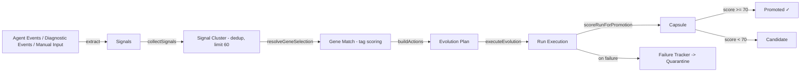

#### Signal 提取 ([extract.ts](file:///vol1/1000/projects/openclaw/src/evomap/signals/extract.ts))

- 从 `AgentEventPayload` 提取 `stream + phase + error` 组合为信号文本
- 从 `DiagnosticEventPayload` 提取 `webhook.error`, `session.stuck`, `message.processed`, `model.usage`
- 基于关键词模式匹配（`EvomapEventPattern`）确定 severity
- 使用 SHA-256 生成 stable fingerprint 用于去重和熔断

#### Gene Evolution Protocol ([assets.ts](file:///vol1/1000/projects/openclaw/src/evomap/gep/assets.ts))

默认 3 个基因：

| Gene ID | 名称 | 领域 | 标签 |
|---------|------|------|------|
| `gene-reliability` | Reliability Loop | ops | stability, retry, circuit-breaker |
| `gene-planning` | Planning Loop | workflow | funnel, triage, handoff |
| `gene-governance` | Governance Loop | policy | approval, budget, audit |

#### Plan Builder ([runner.ts](file:///vol1/1000/projects/openclaw/src/evomap/evolver/runner.ts))

- Risk 分级：presence of high→high, medium→medium, else→low
- Gene 选择：tag 共现评分 + confidence 权重
- Action 生成：`dispatch_task` + `send_followup` + `rollback`
- Approval 触发：high-risk ∨ rollback ∨ exec/network/write 关键词

#### Guardrails

```
maxRunSeconds: 600 (10分钟)
maxToolCalls: 120
maxTokens: 250,000
```

失败 3 次同一 fingerprint → **24 小时隔离（quarantine）**

---

## 三、关键问题与优化建议

### P0：架构级问题

#### 3.1 `server.impl.ts` God Object 反模式

[server.impl.ts](file:///vol1/1000/projects/openclaw/src/gateway/server.impl.ts) 是一个 **639 行的 God Function**（`startGatewayServer`），同时负责：
- 配置加载与迁移
- 插件注册
- TLS 初始化
- UI 资产构建
- WS/HTTP 服务器创建
- 事件总线绑定
- Cron 调度
- Heartbeat 启动
- Channel 管理
- 热重载
- 优雅关闭

```diff
-export async function startGatewayServer(port, opts) {
-  // 639 lines of initialization...
-}
+// 建议拆分为 Builder 模式：
+class GatewayBuilder {
+  withConfig(cfg: OpenClawConfig): this
+  withPlugins(registry: PluginRegistry): this
+  withChannels(manager: ChannelManager): this
+  withEvoMap(service: EvomapLoopService): this
+  build(): Promise<GatewayServer>
+}
```

> **影响**：新增功能必须修改此文件，冲突概率极高；测试需 mock 大量依赖；无法独立部署子系统。

#### 3.2 事件总线无背压 & 无持久化

`agent-events.ts` 的 `Set<listener>` + 同步 `forEach` 设计在以下场景会出问题：

1. **EvoMap listener 抛异常**：虽然 try-catch 吞掉了异常，但信号丢失无日志
2. **高频事件风暴**：无背压机制，listener 数量增加时延迟线性增长
3. **进程重启**：所有未消费事件丢失

```diff
-for (const listener of listeners) {
-  try { listener(enriched); } catch { /* ignore */ }
-}
+// 建议：引入 Ring Buffer + 异步消费
+class AgentEventBus {
+  private ring = new RingBuffer<AgentEventPayload>(10_000);
+  emit(event) { this.ring.push(event); this.notify(); }
+  subscribe(listener, opts: { backpressure: 'drop' | 'block' }) { ... }
+}
```

#### 3.3 `run.ts` 超大文件（34KB）

`pi-embedded-runner/run.ts` 是全系统最大的单文件，包含了完整的 Agent 执行生命周期。这违反了**单一职责原则**，建议拆分为：

| 目标模块 | 职责 |
|---------|------|
| `run-bootstrap.ts` | System prompt 构建 + 上下文初始化 |
| `run-model.ts` | Model 选择 + Provider 路由 |
| `run-tools.ts` | Tool 注入 + 执行策略 |
| `run-stream.ts` | 流式响应处理 + delta 管理 |
| `run-lifecycle.ts` | 生命周期管理 + abort/retry |

### P1：设计缺陷

#### 3.4 Route Resolver O(N²) 性能

`resolveAgentRoute` 中先 `filter` 再多轮 `find`，在绑定数量 > 100 时性能退化明显：

```diff
-const bindings = listBindings(input.cfg).filter(...)
-const peerMatch = bindings.find(b => matchesPeer(b.match, peer));
-const guildMatch = bindings.find(b => matchesGuild(b.match, guildId));
+// 建议：预构建索引 Map
+const bindingIndex = buildBindingIndex(listBindings(cfg));
+// lookups become O(1):
+const peerMatch = bindingIndex.byPeer.get(`${peer.kind}:${peer.id}`);
```

#### 3.5 Hook Transform 无安全沙箱

`loadTransform` 使用 `import()` 加载用户指定的 ESM 模块，无任何隔离：

```typescript
const mod = (await import(url)) as Record<string, unknown>;
```

> [!CAUTION]
> 这意味着 hook transform 可以访问整个 Node.js API，包括文件系统和网络。应考虑 `vm.Module` 或 Worker Thread 隔离。

#### 3.6 EvoMap Singleton 反测试模式

```typescript
let singleton: EvomapLoopService | null = null;
export function getEvomapLoopService(options?) {
  if (!singleton) singleton = new EvomapLoopService(options);
  return singleton;
}
```

Options 仅在首次创建时生效，后续调用传入不同 options 都被忽略。这导致：
- 测试间状态泄漏（虽然有 `resetForTest`）
- 无法并行测试不同配置

#### 3.7 Evolution Plan Builder 硬编码策略

`buildActions` 中的 action 生成逻辑完全硬编码，不支持基于 Gene 或模板的动态策略：

```typescript
// 始终生成 dispatch_task 作为第一个 action
actions.push({
  type: "dispatch_task",
  title: "dispatch-investigation",
  task: `Analyze and resolve: ${baseTask}`,
  targetAgentId: params.selectedGeneIds.includes("gene-reliability") 
    ? "maintagent" : undefined,
});
```

建议将 action 生成策略抽取为 `ActionStrategy` 接口，允许 GEP assets 中定义 action 模板。

### P2：改进建议

#### 3.8 Capsule Promotion 评分过于简单

`scoreRunForPromotion` 使用线性扣分：

```
base=82, errorCount*18, minutes*2, toolCalls-12, high_risk-10, rollback-8
```

无正向评分指标，无 A/B 对比机制。建议增加：
- Run 执行质量信号（如子 session 的完成率）
- 历史同类 Plan 的 baseline 对比
- 用户反馈信号权重

#### 3.9 Signal 提取缺乏结构化解析

`extractSignalsFromAgentEvents` 将所有事件字段拼成一个文本字符串：

```typescript
const summary = [event.stream, phase ? `phase=${phase}` : "", error ? `error=${error}` : ""]
  .filter(Boolean).join(" ");
```

丢失了结构化信息。建议保留原始字段到 `metadata`，并使用结构化匹配替代纯文本关键词匹配。

#### 3.10 无分布式/多进程支持

整个管道基于 **单进程内存状态**：
- `Map/Set` 保存运行状态
- EventEmitter 模式的事件传递
- Singleton 服务实例

在横向扩展（多 Gateway 实例）场景下无法工作。建议引入 Redis/Durable Objects 作为状态后端。

---

## 四、管道数据流完整路径

以 **Webhook→Agent 执行** 为例的完整数据流：

```
1. HTTP POST /hooks/:path
   → extractHookToken (Bearer / x-openclaw-token)
   → readJsonBody (256KB limit)
   → applyHookMappings
     → matchPath + matchSource
     → renderTemplate ({{payload.field}} 插值)
     → loadTransform (可选 ESM 自定义)
     → mergeAction → HookAction{kind:"agent", message, agentId, ...}

2. resolveHookTargetAgentId
   → normalizeAgentId → knownAgentIds check
   → isHookAgentAllowed → allowedAgentIds check

3. resolveAgentRoute
   → listBindings → filter(channel + accountId)
   → priority: peer → parentPeer → guild → team → account → channel → default
   → buildAgentSessionKey

4. queueEmbeddedPiMessage
   → runEmbeddedPiAgent (run.ts)
     → resolveModel + auth profiles
     → buildSystemPrompt (AGENTS.md + skills + identity)
     → limitHistoryTurns
     → createChatCompletion (streaming)
     → subscribeEmbeddedPiSession
       → handler: assistant text → emitAgentEvent
       → handler: tool call → execute → emitAgentEvent
       → handler: lifecycle end → emitAgentEvent

5. Event Bus Fanout
   → server-chat.ts: emitChatDelta → WS broadcast
   → EvoMap listener: push to agentEvents buffer
   → Diagnostic listener: push to diagnosticEvents buffer

6. (Async) EvoMap Loop
   → collectSignals → extractSignalsFromAgentEvents
   → planEvolution → buildEvolutionPlan
   → executeEvolution → sessions_spawn / sessions_send
   → scoreRunForPromotion → Capsule promotion
```

---

## 五、重构优先级矩阵

| 优先级 | 项目 | 复杂度 | 影响面 | 建议时间 |
|--------|------|--------|--------|---------|
| **P0** | `server.impl.ts` 拆分为 Builder | 高 | 全局 | 2-3 sprint |
| **P0** | 事件总线引入背压 + Ring Buffer | 中 | Agent 执行 + EvoMap | 1 sprint |
| **P1** | `run.ts` 按职责拆分为 5 模块 | 高 | Agent 执行 | 2 sprint |
| **P1** | Route Resolver 索引优化 | 低 | 路由性能 | 0.5 sprint |
| **P1** | Hook Transform 安全隔离 | 中 | 安全 | 1 sprint |
| **P2** | EvoMap action 策略可配置化 | 中 | 自进化质量 | 1 sprint |
| **P2** | Capsule 评分增加正向信号 | 低 | 自进化质量 | 0.5 sprint |
| **P2** | Signal 结构化提取 | 低 | 信号质量 | 0.5 sprint |

---

## 六、结论

OpenClaw 的需求管道设计展现了**较高的工程成熟度**，特别是：

1. **精细的 Hook Mapping 引擎**：模板渲染 + 动态转换 + 多层 override，低代码可扩展性好
2. **完整的 EvoMap 自进化闭环**：Signal→Gene→Plan→Execute→Capsule→Promote 全自动化
3. **健壮的 Guardrail 体系**：budget 三重限制 + fingerprint quarantine + approval 审批

但在**可维护性**和**可扩展性**方面存在明显瓶颈：
- God Object/God Function 反模式（server.impl.ts, run.ts）
- 无背压事件总线
- 硬编码策略与 Singleton 反模式

**建议先执行 P0 重构**（server.impl.ts 拆分 + 事件总线升级），再逐步推进 P1 改进，以显著降低开发摩擦和运维风险。

---

## 2026-02-26 13:58:53 +0800 | /vol1/1000/antigravity/data/User/History/-55161db9/6cke.md | source=Workspace Edit
resource: vscode-remote://ssh-remote%2B7b22686f73744e616d65223a22666e6f73227d/home/yuanhaizhou/.gemini/antigravity/brain/cf3a1159-970d-47d1-b0e2-2ff0828abf12/openclaw_pipeline_review.md

# OpenClaw 架构彻底改造设计

> 本文档基于 ChatGPT 5.2 Pro Extended Thinking 深度架构分析生成。
> 目标：把 OpenClaw 从"单体脚本框架"变成"内核化 + 事件化 + 端口化"的平台架构。

---

## 0. 根因诊断：你现在真正的系统性病因

你列的 9 个缺陷都指向同一个根因：

> **OpenClaw 目前没有稳定的架构边界（Boundaries）与运行时契约（Contracts）。**

所以所有东西只能靠"全局单例 + God Function/God File + 进程内 Map/Set"勉强粘在一起——导致：

| 症状 | 根因 |
|------|------|
| `server.impl.ts` / `run.ts` 宇宙文件 | 复杂度无法分区隔离，只能线性增长 |
| 事件总线是函数回调集合 | 不具备系统属性（背压/可靠性/可观测/可恢复/可扩展） |
| EvoMap 控制环是同步控制流 | 一旦多进程/多节点就整体崩塌 |
| 动态 `import()` 加载用户 ESM | 用户逻辑 = 你的进程权限，平台级安全红线 |
| 测试只能做黑盒 + 大量 mock | 反向逼迫你继续写 God Object |

**因此这次改造的目标不是"拆文件"，而是：**

> 让 OpenClaw 能从单进程自然演进到多进程、多节点，而不是推倒重写。

---

## 1. 目标宏观架构：Kernel + Apps + Adapters

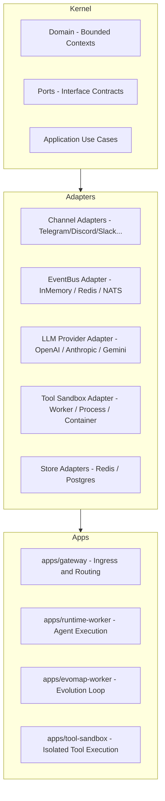

**WHY：**
- 阶段 1 仍是单进程单体，但内部已具备清晰边界
- 阶段 2 只需把不同 App 拆成不同进程，Kernel 无需大改
- 阶段 3 拆成多节点服务也只动 Adapters + 部分用例分配

---

## 2. DDD Bounded Context 划分

| BC | 职责 | 对应现有代码 |
|----|------|-------------|
| **Integration BC** | 多通道统一为 CanonicalMessage，鉴权/重放防护/限速 | `channels/`, `hooks.ts` |
| **Routing BC** | 路由解析（预编译索引），HookSpec 声明式匹配 | `resolve-route.ts`, `hooks-mapping.ts` |
| **Conversation BC** | 会话状态、消息历史、摘要、上下文窗口策略 | `pi-embedded-runner/compact.ts`, sessions |
| **Runtime BC** | Prompt 组装、Model 选择、Tool 注入、流式响应 | `run.ts`, `model-selection.ts` |
| **Evolution BC** | Signal→Plan→Guardrail→Actions→Capsule 自进化 | `evomap/` |
| **Governance BC** | Guardrails、权限、配额、成本预算、审批流 | `pi-tools.policy.ts` + 新增 |
| **Observability BC** | 结构化日志、指标、追踪、事件审计（横切） | `infra/` |

### Hexagonal Architecture 核心原则

- Domain/Application 永远依赖 **Ports（接口）**，不依赖任何具体实现
- Adapters 依赖 Domain/Application，并实现 Ports
- App 负责装配：选择 Redis Streams 还是 NATS、哪家 LLM、哪种 sandbox

---

## 3. 完整目标数据流（全链路 Mermaid）

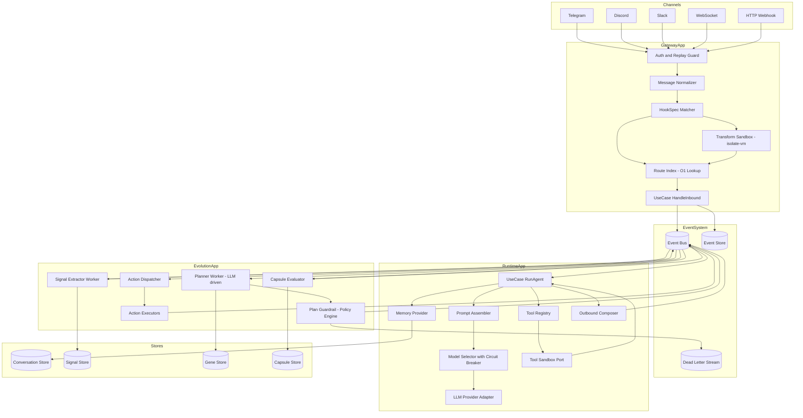

---

## 4. 事件总线升级：从同步回调到可背压 + 持久化 + 分布式

### 4.1 目标能力清单（EventBusPort 契约）

```typescript
export interface EventEnvelope<T = string, P = unknown> {
  id: string;           // ULID/UUIDv7，全局唯一
  type: T;
  ts: number;
  tenantId: string;
  key: string;          // 分区键（conversationId/peerId）
  traceId?: string;
  schemaVersion: number;
  payload: P;
}

export interface ConsumeContext {
  attempt: number;
  ack(): Promise<void>;
  nack(opts?: { retryAfterMs?: number; reason?: string }): Promise<void>;
}

export interface EventBusPort {
  publish<E extends EventEnvelope>(event: E): Promise<void>;
  subscribe<T extends string>(
    type: T,
    handler: (event: EventEnvelope<T, any>, ctx: ConsumeContext) => Promise<void>,
    opts: { group: string; consumer: string; maxInFlight: number; concurrency: number }
  ): Promise<() => Promise<void>>;
}
```

### 4.2 三阶段演进路径

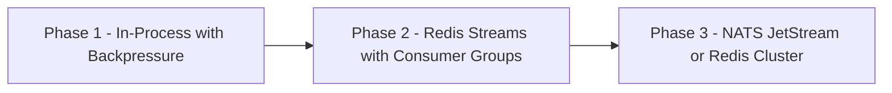

| 阶段 | 实现 | 核心能力 | 迁移成本 |
|------|------|---------|---------|
| **1** | InMemoryEventBus（队列+并发限制） | 背压、异步、异常上报 | 0（先固化 Port 接口） |
| **2** | Redis Streams + Consumer Group | at-least-once、持久化、DLQ、回放 | 低（只换 Adapter） |
| **3** | NATS JetStream | 高吞吐、多租户 quota、原生背压 | 中（评估运维成本后决定） |

> [!IMPORTANT]
> **先把事件契约（Envelope + ack/nack 语义）固定下来，再替换实现。** 事件 Envelope 从第一天起就要包含 `id`、`traceId`、`tenantId`、`schemaVersion`，这是分布式部署的地基。

### 4.3 幂等策略（at-least-once 的必要代价）

- 每个 consumer 维护 `processed:{consumerName}:{eventId}` Redis Set（带 TTL）
- 对外部 side-effect（发消息、执行工具）必须有 `idempotencyKey`
- Tool invocation 的 `idempotencyKey = hash(planId + stepId + attempt)`

---

## 5. 路由与 Hook 引擎重构

### 5.1 Route Resolver：O(N²) → O(1)

**现状问题：** `bindings.filter()` + 多轮 `bindings.find()` 每次请求都遍历

**解法：配置加载时预编译 RouteIndex**

```typescript
// 预编译（配置热更新时重建）
const routeIndex = new Map<string, RouteTarget>();
for (const binding of listBindings(cfg)) {
  const key = buildKey(binding.match); // e.g., "peer:xxx", "guild:yyy"
  routeIndex.set(key, buildTarget(binding));
}

// 查询 O(1)（固定优先级链，6层）
const PRIORITY_KEYS = (q: RouteQuery) => [
  q.peerId       && `peer:${q.peerId}`,
  q.parentPeerId && `parentPeer:${q.parentPeerId}`,
  q.guildId      && `guild:${q.guildId}`,
  q.teamId       && `team:${q.teamId}`,
  q.accountId    && `account:${q.accountId}`,
  q.channelId    && `channel:${q.channelId}`,
  'default',
].filter(Boolean) as string[];

for (const key of PRIORITY_KEYS(query)) {
  const route = routeIndex.get(key);
  if (route) return route;
}
```

### 5.2 Hook Transform：动态 import 消除，沙箱隔离

**现状风险：** `import(url)` 加载用户 ESM = 给用户完整 Node.js 权限

**重构目标：**

1. **80% 场景**：纯声明式 HookSpec（JSONPath + mustache 模板）
2. **20% 需要代码**：通过 `TransformRunnerPort` 在 V8 isolate 中执行

```typescript
export interface TransformRunnerPort {
  run(
    transformId: string,
    input: unknown,
    opts: { timeoutMs: number; memoryMb: number }
  ): Promise<unknown>;
}

// 实现：worker_threads + isolated-vm
// - 禁止 Node 内置模块
// - 输入输出必须 JSON 可序列化
// - 内存上限 32MB，超时 50-200ms 可配置
```

---

## 6. Runtime Pipeline 解构：34KB God File → 9 阶段可插拔管道

**现状：** `run.ts` 混合了 8+ 职责，无法独立测试任一阶段

**目标：**

```typescript
interface PipelineStage<In, Out> {
  name: string;
  execute(input: In, ctx: ExecutionContext): Promise<Out>;
}
```

| 阶段 | 名称 | 职责 | 关键 Port |
|------|------|------|----------|
| 1 | `ExecutionContextBuilder` | 装载 tenant 配置/权限/成本预算/会话信息 | ConfigPort |
| 2 | `MemoryProvider` | 拉取会话历史与摘要，压缩策略 | ConversationStorePort |
| 3 | `PromptAssembler` | 组合 system/dev/user messages + 治理策略 | - |
| 4 | `ModelSelector` | 选择 provider/model/auth profile，熔断检测 | ModelHealthPort |
| 5 | `ToolRegistry` | 根据权限注入工具 schema | PolicyPort |
| 6 | `PlanAndCallRunner` | LLM 交互 + tool calling 循环 | LlmProviderPort |
| 7 | `ToolExecutorPort` | 路由到 sandbox 执行，不在 runtime 进程 | ToolSandboxPort |
| 8 | `ResponseStreamer` | 流式输出 → OutboundMessage 事件 | EventBusPort |
| 9 | `Telemetry` | token/latency/tool time/失败率全链路 | ObservabilityPort |

---

## 7. EvoMap LLM 化：从硬编码规则到可控自适应控制环

### 7.1 目标架构：5 个独立逻辑服务

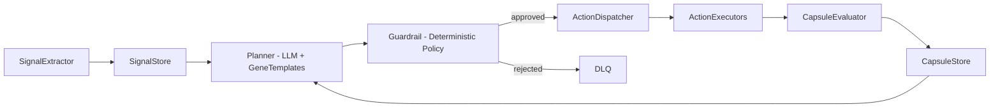

### 7.2 LLM Plan Generation + 双层约束

**Layer 1：Plan DSL（结构化输出，不是自然语言）**

```json
{
  "planId": "01J...ULID",
  "subject": { "tenantId": "t1", "conversationId": "c1" },
  "selectedGenes": ["Reliability@3", "Governance@2"],
  "intent": "reduce tool failures and improve followup",
  "steps": [
    {
      "stepId": "s1",
      "action": "send_followup",
      "params": { "channel": "telegram", "text": "..." },
      "risk": "low",
      "expectedImpact": { "reliability": 0.2 }
    },
    {
      "stepId": "s2",
      "action": "dispatch_task",
      "params": { "taskType": "reindex_routes", "scope": "team:t1" },
      "risk": "medium",
      "expectedImpact": { "planning": 0.3 }
    }
  ],
  "rollback": [
    { "when": "step_failed", "action": "rollback", "params": { "target": "s2" } }
  ]
}
```

**Layer 2：Guardrail（确定性策略引擎，不靠 prompt）**

- Schema 校验（字段缺失/类型错误直接拒绝）
- Policy 校验（OPA/Rego 或自研 DSL）：租户权限、风险预算、成本上限、工具 allowlist
- 执行前 dry-run（高风险 action 先模拟）

> [!WARNING]
> LLM 负责"提出方案"，确定性规则引擎负责"批准方案"。没有硬 Guardrail = 不可控自毁系统。

### 7.3 Gene Template Registry（策略数据化）

每个 GeneTemplate 包含：

```typescript
interface GeneTemplate {
  id: string;
  version: number;
  enabled: boolean;
  eligibility: Record<string, any>;    // 触发条件表达式
  constraints: {
    allowedActions: string[];
    maxRisk: 'low' | 'medium' | 'high';
    maxCost: number;
  };
  promptFragments: Record<string, any>; // 给 Planner 的提示片段（结构化）
  scoringRubric: Record<string, number>; // 评估维度权重
}
```

存储路径：阶段1 JSON 文件 → 阶段2 Postgres + 版本管理 → 阶段3 控制面 UI + 审计

### 7.4 Capsule Promotion：Beta-Binomial 替代线性扣分

**现状：** `base=82, errorCount*18, minutes*2 ...`（只扣分，收敛到"不做事最安全"）

**目标：** 证据累计 + 不确定性感知

```typescript
interface CapsuleScore {
  successCount: number;
  failureCount: number;
  avgLatency: number;
  cost: number;
  userSatisfaction?: number;
  riskIncidents: number;
}

// Beta-Binomial 置信区间下界（Wilson score 简化版）
function scoreCapule(c: CapsuleScore): number {
  const n = c.successCount + c.failureCount;
  if (n === 0) return 0.5; // 不确定时中性
  const p = c.successCount / n;
  const z = 1.96; // 95% CI
  const lower = (p + z*z/(2*n) - z*Math.sqrt(p*(1-p)/n + z*z/(4*n*n))) / (1 + z*z/n);
  return lower - c.riskIncidents * 0.1 - Math.max(0, c.cost - COST_BUDGET) * 0.05;
}
```

**好处：** 数据少→分数保守，成功多→分数自然上升，可解释、可审计。

---

## 8. 安全加固

### 8.1 Hook Transform 多层防线

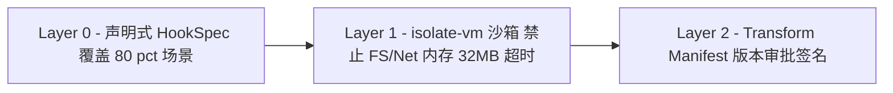

### 8.2 Tool Execution 三重防线

| 防线 | 位置 | 机制 |
|------|------|------|
| A - 治理层 | Plan Guardrail | action allowlist + 结构化参数 schema（禁止原始 shell 字符串） |
| B - 执行层 | ToolSandboxPort | runtime 不直接执行命令，走 sandbox service + timeout + output limit |
| C - OS 层 | 容器/cgroup | rootless user + seccomp + read-only rootfs + 网络白名单 + 审计日志 |

---

## 9. 可测试性：依赖注入 + 测试替身体系

### 9.1 依赖注入策略（手动 DI + 组合根）

```typescript
// apps/gateway/main.ts（组合根）
const eventBus: EventBusPort = new RedisStreamEventBusAdapter(redisClient, cfg);
const routeResolver: RouteResolverPort = new RouteIndexAdapter(config);
const handleInbound = new HandleInboundUseCase({ eventBus, routeResolver });
```

### 9.2 测试替身清单

| 替身 | 用途 |
|------|------|
| `InMemoryEventBus` | 队列+并发限制，验证事件流转 |
| `FakeEventStore` | 可回放历史事件 |
| `StubLLMProvider` | 固定输出 + 错误注入 |
| `FakeToolSandbox` | 模拟执行时间与失败 |
| `FakeClock` | 控制时间与重试窗口 |
| `InMemorySignalStore` | 验证 EvoMap signal 提取 |
| `RouteIndexFixture` | 路由金样测试（golden test） |

---

## 10. 核心 Ports 接口契约（`packages/kernel/ports/`）

### EventBusPort（见第4节）

### RouteResolverPort

```typescript
export interface RouteResolverPort {
  resolve(query: {
    tenantId: string;
    peerId?: string; parentPeerId?: string;
    guildId?: string; teamId?: string;
    accountId?: string; channelId?: string;
  }): Promise<{ agentId: string; runtimeProfileId: string; policyProfileId: string } | null>;
}
```

### LlmProviderPort + ToolSandboxPort

```typescript
export interface LlmProviderPort {
  generate(req: {
    model: string;
    messages: Array<{ role: 'system'|'user'|'assistant'; content: string }>;
    tools?: unknown;
  }, ctx: { tenantId: string; traceId?: string }): Promise<{
    outputText?: string;
    toolCalls?: Array<{ toolName: string; args: any }>;
    usage: { inputTokens: number; outputTokens: number };
  }>;
}

export interface ToolSandboxPort {
  execute(inv: {
    toolName: string; args: any;
    tenantId: string; idempotencyKey: string; traceId?: string;
  }, opts: { timeoutMs: number; maxOutputBytes: number }): Promise<{
    ok: boolean; stdout?: string; stderr?: string;
    exitCode?: number; durationMs: number;
  }>;
}
```

### EvoMap Ports

```typescript
export interface PlanGeneratorPort {
  generate(input: {
    tenantId: string; key: string;
    signals: Signal[]; genes: GeneTemplate[];
  }): Promise<Plan>;
}

export interface PlanGuardPort {
  approve(plan: Plan): Promise<{ ok: true } | { ok: false; reason: string }>;
}

export interface CapsuleRepositoryPort {
  updateFromOutcome(input: {
    tenantId: string; key: string; outcomes: any[];
  }): Promise<void>;
}
```

---

## 11. 三阶段渐进式迁移计划

> **先固化契约（Ports + Events），再替换实现（Adapters），最后拆分进程（Apps）。**

### 阶段 1：内核化与可测试化（仍单进程运行）

**目标：** 消灭 God Object 结构性原因，最危险的 transform/tool 先隔离

| # | 任务 | 优先级 | 验收标准 |
|---|------|--------|---------|
| 1 | 建立 `packages/kernel/domain`, `ports`, `application` 目录结构 | P0 | Kernel 中无任何外部依赖 import |
| 2 | 拆解 `server.impl.ts` → `apps/gateway/main.ts` + 独立模块 | P0 | 无 639 行单函数，各模块有 start/stop |
| 3 | 定义并落地 `EventBusPort`（进程内，带 ack/nack + 并发控制） | P0 | 替换 `infra/agent-events.ts` |
| 4 | 重构 Route Resolver → `RouteIndex` 预编译 | P1 | 路由耗时不随绑定数量 N 增长 |
| 5 | Hook Transform → `TransformRunnerPort`（Worker Thread + isolate-vm） | P1 | transform 无法访问主进程 Node API |
| 6 | 拆解 `run.ts` → 9 阶段 Runtime Pipeline | P1 | 各 stage 可独立单测 |
| 7 | 引入测试替身基建（InMemoryEventBus 等） | P2 | Use Case 级单测可运行 |
| 8 | 统一事件 Envelope + traceId + 关键异常上报 | P2 | 无异常被吞，所有事件带 traceId |

### 阶段 2：事件持久化 + 多进程（单机水平扩展）

**目标：** 进程可重启恢复，EvoMap 脱离单例

| # | 任务 |
|---|------|
| 1 | Redis Streams `EventBusAdapter`（consumer group + ack/nack + DLQ）|
| 2 | 外置状态：ConversationStore（Postgres）+ SignalStore/GeneStore/CapsuleStore（Postgres）|
| 3 | 进程拆分：`apps/gateway` + `apps/runtime-worker` + `apps/evomap-worker` |
| 4 | EvoMap LLM Plan Generator 上线（Plan DSL + Guardrail + 失败 fallback 旧规则）|
| 5 | Tool Sandbox 进程化（`apps/tool-sandbox`，资源限制 + 超时 + 输出限制）|
| 6 | 全链路幂等（outbound 消息 + tool invocation 的 idempotencyKey）|
| 7 | 监控报警（DLQ 堆积、处理延迟、runtime 成功率、token 成本）|

**验收：** 任意 worker 进程 kill 后系统自动恢复消费，DLQ 可观测可处理

### 阶段 3：多节点 + 平台化控制面

**目标：** 真正横向扩展，策略版本化可审计，安全达到平台运营水平

| # | 任务 |
|---|------|
| 1 | Gateway/Runtime/EvoMap/ToolSandbox 多副本部署 + LB |
| 2 | 用 `conversationId` 分片（`hash % 32 streams`）保证会话顺序性 |
| 3 | 消息系统升级：Redis Cluster Streams 或迁移 NATS JetStream |
| 4 | 控制面：GeneTemplate 版本管理 + 审批 + 灰度发布 |
| 5 | 安全增强：插件签名、Secrets KMS、全链路审计、PII 脱敏 |
| 6 | OpenTelemetry 分布式追踪 + 队列延迟/in-flight/错误率 |
| 7 | 灰度与回滚：gene/policy/model 变更可灰度到部分租户，失败自动回退基线 |

**验收：** 任意节点故障不影响整体服务，策略变更可审计可回滚可灰度

---

## 12. 问题→解法对照表

| 原始缺陷 | 解法 |
|---------|------|
| `server.impl.ts` God Object | 组合根 + 模块化装配 + 用例驱动 |
| 事件总线无背压/持久化/同步吞异常 | `EventBusPort` + ack/nack + Redis Streams + DLQ |
| `run.ts` 34KB God File | 9 阶段 Runtime Pipeline + ports 依赖注入 |
| Route Resolver O(N²) | RouteIndex 预编译 + 常数级查表 |
| Hook Transform 无沙箱 | HookSpec 声明式为主 + `isolate-vm` 沙箱 |
| EvoMap 全内存无法扩展 | 事件化控制环 + SignalStore/GeneStore/CapsuleStore 持久化 |
| Action 生成硬编码 | GeneTemplate `actionTemplates` + Plan DSL + LLM 填参 |
| Capsule 线性扣分 | Beta-Binomial 置信下界 + 正向信号 + 不确定性 |
| 无分布式支持 | Ports 固化 → Redis Streams → 多进程 → 多节点 |

---

> **下一步建议先从哪里开刀：**
> - **最高回报**：先固化 `EventBusPort` 接口（1天），再拆 `server.impl.ts` 组合根（2-3天）
> - **最高安全收益**：立即把 Hook Transform 换成 `TransformRunnerPort + isolate-vm`（1天）
> - **最大可测试性提升**：拆解 `run.ts` Pipeline + 引入 `StubLLMProvider`（1周）

---

## 2026-02-26 15:14:31 +0800 | /vol1/1000/antigravity/data/User/History/-3cd5fc9/IjE0.md | source=Workspace Edit
resource: vscode-remote://ssh-remote%2B7b22686f73744e616d65223a22666e6f73227d/home/yuanhaizhou/.gemini/antigravity/brain/cf3a1159-970d-47d1-b0e2-2ff0828abf12/refactoring_requirements.md

# OpenClaw 重构需求定义

> **目的**：在动手写代码之前，逐条确认重构范围、优先级和约束条件。
> 请逐条审阅，标注你的决定（✅同意 / ❌不做 / 🔧修改），我们确认后再进入实施。

---

## 约束条件（硬限制）

| 约束 | 说明 |
|------|------|
| **不能断功能** | 现有所有通道（Telegram/Discord/Slack/Line/WhatsApp/iMessage/WS/HTTP）必须持续可用 |
| **技术栈** | TypeScript ESM + Node 22+ + pnpm + Vitest（不引入新语言/框架） |
| **文件规模** | 单文件 ≤ 500 LOC（项目 AGENTS.md 已有此 guideline） |
| **测试覆盖** | 维持 70% lines/branches/functions/statements（Vitest V8 coverage） |
| **渐进式** | 每个 PR 可独立合并，不做"大爆炸"重构 |

---

## 需求 R1：事件总线升级

| 项目 | 内容 |
|------|------|
| **现状** | `infra/agent-events.ts`（84行），`Set<listener>` + 同步 forEach，无背压/持久化/ack |
| **目标** | 定义 `EventBusPort` 接口（publish/subscribe/ack/nack），先用 InMemory 实现（带异步+并发控制） |
| **范围** | 仅替换进程内事件传递机制，不引入 Redis（那是阶段2） |
| **优先级建议** | ⬆️ P0 — 所有后续拆分都依赖事件契约先固化 |

> [!IMPORTANT]
> **需确认**：你希望 EventBusPort 从第一天就带 `ack/nack` 语义，还是先简化为"异步 publish + 并发限制"就够？

---

## 需求 R2：`server.impl.ts` God Object 拆解

| 项目 | 内容 |
|------|------|
| **现状** | `gateway/server.impl.ts`（639行），`startGatewayServer` 单函数管理一切 |
| **目标** | 拆成组合根 `apps/gateway/main.ts` + 独立可测试模块（HTTP/WS/TLS/Cron/Heartbeat/Channel 各自 start/stop） |
| **范围** | 保持单进程运行不变，仅改内部结构 |
| **优先级建议** | ⬆️ P0 |

> [!IMPORTANT]
> **需确认**：拆解后是否引入 `packages/kernel/` 目录结构（DDD 分层），还是先在现有 `src/` 下拆模块？

---

## 需求 R3：`run.ts` Runtime Pipeline 分解

| 项目 | 内容 |
|------|------|
| **现状** | `pi-embedded-runner/run.ts`（34KB, 800+行），混合 system prompt/model selection/tool injection/compaction/stream |
| **目标** | 拆成 5-9 个 Pipeline Stage 文件，每个 ≤ 500 LOC，可独立单测 |
| **范围** | 行为完全不变（golden test 验证），仅拆结构 |
| **优先级建议** | ⬆️ P1 |

> [!IMPORTANT]
> **需确认**：是否同时引入 `LlmProviderPort` / `ToolSandboxPort` 接口抽象，还是先"纯拆文件"不改接口？

---

## 需求 R4：Route Resolver 性能优化

| 项目 | 内容 |
|------|------|
| **现状** | `routing/resolve-route.ts`（265行），`filter` + 多轮 `find` = O(N²) |
| **目标** | 配置加载时预编译 `RouteIndex`（Map），查询时 O(1) |
| **范围** | 现有测试 `resolve-route.test.ts` 必须全部通过 |
| **优先级建议** | P1 |

> **需确认**：当前绑定数量级是多少？如果 < 50，是否可以降优先级？

---

## 需求 R5：Hook Transform 安全隔离

| 项目 | 内容 |
|------|------|
| **现状** | `hooks-mapping.ts` 用 `import()` 加载用户 ESM transform，无沙箱 |
| **目标** | 引入 `TransformRunnerPort`，用 `isolated-vm` 或 Worker Thread 执行 |
| **范围** | 只改 transform 加载路径，声明式匹配逻辑不变 |
| **优先级建议** | ⬆️ P1（安全红线） |

> **需确认**：当前有多少自定义 transform 在使用？是否有用户依赖了 Node API（fs/net）？

---

## 需求 R6：EvoMap 进化策略可配置化

| 项目 | 内容 |
|------|------|
| **现状** | `evolver/runner.ts` action 生成硬编码，Capsule 评分纯线性扣分 |
| **目标** | Gene Template 支持 `actionTemplates` 字段 + Capsule 评分引入正向信号 |
| **范围** | 先做模板化，LLM Plan Generation 放阶段2 |
| **优先级建议** | P2 |

> **需确认**：你是否想先做 LLM Plan Generation（更激进），还是先做模板可配置化（更稳妥）？

---

## 需求 R7：EvoMap 状态持久化

| 项目 | 内容 |
|------|------|
| **现状** | `loop/service.ts` 全部基于进程内 Map/Set，singleton 模式 |
| **目标** | 引入 `SignalStorePort` / `CapsuleRepositoryPort` 接口，先 InMemory 实现 |
| **范围** | 接口定义 + 替换直接 Map 操作，不引入 Postgres（那是阶段2） |
| **优先级建议** | P2 |

---

## 需求 R8：可测试性基建

| 项目 | 内容 |
|------|------|
| **现状** | 测试需要 mock 大量内部细节，Use Case 级单测困难 |
| **目标** | 引入测试替身：`InMemoryEventBus`, `StubLLMProvider`, `FakeToolSandbox`, `FakeClock` |
| **范围** | 配合 R1-R3 的 Port 接口定义同步推进 |
| **优先级建议** | P1（与 R1-R3 同步推进） |

---

## 需求 R9：统一事件 Envelope + 可观测性

| 项目 | 内容 |
|------|------|
| **现状** | 事件结构不统一，部分异常被吞（try-catch 无日志） |
| **目标** | 定义统一 `EventEnvelope`（id/type/ts/tenantId/key/traceId/schemaVersion/payload），关键异常必须生成 DiagnosticEvent |
| **范围** | 先定义 envelope schema + 修复异常吞掉问题 |
| **优先级建议** | P1 |

---

## 总结：需要你确认的决定

| # | 问题 | 选项 |
|---|------|------|
| 1 | **执行顺序**：先从哪里开刀？ | A. EventBusPort → server.impl.ts → run.ts（架构先行）<br/>B. server.impl.ts → run.ts → EventBusPort（先消灭最大痛点）<br/>C. 你的想法？ |
| 2 | **目录结构**：是否引入 `packages/kernel/` DDD 分层？ | A. 是，从第一步就建立 kernel/ports/adapters<br/>B. 先在 `src/` 下拆模块，不改目录 |
| 3 | **接口深度**：EventBusPort 是否从第一天就带 ack/nack？ | A. 是（为阶段2 Redis Streams 铺路）<br/>B. 先简化为 async publish + concurrency control |
| 4 | **run.ts 拆解**：是否同时引入 Port 接口抽象？ | A. 是（LlmProviderPort + ToolSandboxPort 一步到位）<br/>B. 先纯拆文件，Port 接口阶段2做 |
| 5 | **EvoMap 方向**：先模板化还是先 LLM 化？ | A. 先模板可配置化（稳妥）<br/>B. 直接 LLM Plan Generation（激进） |
| 6 | **Hook Transform**：当前有多少自定义 transform 使用？ | 需要你告诉我实际情况 |

请逐条回复你的决定，我再出具体的实施计划和任务拆分。

---

## 2026-02-26 15:16:54 +0800 | /vol1/1000/antigravity/data/User/History/-1b1bc912/ScuY.md | source=Workspace Edit
resource: vscode-remote://ssh-remote%2B7b22686f73744e616d65223a22666e6f73227d/home/yuanhaizhou/.gemini/antigravity/brain/cf3a1159-970d-47d1-b0e2-2ff0828abf12/implementation_plan.md

# OpenClaw Phase 1 Implementation Plan

> Phase 1 目标：**内核化与可测试化**，仍单进程运行，消灭 God Object，固化事件契约。

## Architectural Decisions（已确定）

| # | 决定 | 选项 | 理由 |
|---|------|------|------|
| 1 | 执行顺序 | EventBusPort → server.impl → run.ts | 事件契约是所有拆分的地基 |
| 2 | 目录结构 | 先在 `src/` 下拆模块 | 避免 monorepo 结构大改动，渐进式 |
| 3 | EventBusPort 深度 | 从第一天带 ack/nack | 为阶段2 Redis Streams 铺路 |
| 4 | run.ts 拆解 | 同时引入 Port 接口 | 避免二次重构 |
| 5 | EvoMap 方向 | 先模板化 | 阶段2再做 LLM Plan Generation |
| 6 | Hook Transform | 当前代码无 `loadTransform` | R5 从 Phase 1 移除 |

---

## Proposed Changes

### PR1: EventBusPort 接口 + InMemoryEventBus

> [!IMPORTANT]
> 这是最关键的第一步，后续所有 PR 都依赖此契约。

#### [NEW] [event-bus.port.ts](file:///vol1/1000/projects/openclaw/src/infra/event-bus.port.ts)

定义核心接口：

```typescript
export interface EventEnvelope<T = string, P = unknown> {
  id: string;
  type: T;
  ts: number;
  key: string;
  traceId?: string;
  schemaVersion: number;
  payload: P;
}

export interface ConsumeContext {
  attempt: number;
  ack(): Promise<void>;
  nack(opts?: { retryAfterMs?: number; reason?: string }): Promise<void>;
}

export interface EventBusPort {
  publish<E extends EventEnvelope>(event: E): Promise<void>;
  subscribe<T extends string>(
    type: T,
    handler: (event: EventEnvelope<T, any>, ctx: ConsumeContext) => Promise<void>,
    opts: { group: string; consumer: string; maxInFlight: number; concurrency: number }
  ): Promise<() => Promise<void>>;
}
```

#### [NEW] [event-bus.inmemory.ts](file:///vol1/1000/projects/openclaw/src/infra/event-bus.inmemory.ts)

InMemory 实现，带异步投递 + 并发限制 + 异常上报（不吞异常）。

#### [MODIFY] [agent-events.ts](file:///vol1/1000/projects/openclaw/src/infra/agent-events.ts)

增加向 `EventBusPort` 转发功能（双写期），保持现有 `onAgentEvent` API 兼容。

#### [NEW] [event-bus.inmemory.test.ts](file:///vol1/1000/projects/openclaw/src/infra/event-bus.inmemory.test.ts)

测试覆盖：publish/subscribe、ack/nack、并发控制、异常不吞。

---

### PR2: `server.impl.ts` God Object 拆解

#### [MODIFY] [server.impl.ts](file:///vol1/1000/projects/openclaw/src/gateway/server.impl.ts)

将 638 行 `startGatewayServer` 拆分为：

#### [NEW] [server-bootstrap.ts](file:///vol1/1000/projects/openclaw/src/gateway/server-bootstrap.ts)

组合根：装配各模块，调用各模块的 `start()`/`stop()`。

#### [NEW] [server-http.ts](file:///vol1/1000/projects/openclaw/src/gateway/server-http.ts)

HTTP/Express 服务器创建 + 路由绑定。

#### [NEW] [server-lifecycle.ts](file:///vol1/1000/projects/openclaw/src/gateway/server-lifecycle.ts)

优雅关闭 + 信号处理 + 热重载。

#### [NEW] [server-plugins.ts](file:///vol1/1000/projects/openclaw/src/gateway/server-plugins.ts)

插件注册 + Channel 管理。

#### [NEW] [server-cron.ts](file:///vol1/1000/projects/openclaw/src/gateway/server-cron.ts)

Cron 调度 + Heartbeat 启动。

> `server.impl.ts` 缩减为 thin wrapper 调用 `server-bootstrap.ts`，保持对外 API 不变。

---

### PR3: `run.ts` Pipeline 分解

将 866 行 `run.ts` 拆为 5 个 Stage 文件（每个 ≤ 500 LOC）：

#### [NEW] [run/context-builder.ts](file:///vol1/1000/projects/openclaw/src/agents/pi-embedded-runner/run/context-builder.ts)

ExecutionContext 构建（config + session + tools 装载）。

#### [NEW] [run/prompt-assembler.ts](file:///vol1/1000/projects/openclaw/src/agents/pi-embedded-runner/run/prompt-assembler.ts)

System/dev/user prompt 组装。

#### [NEW] [run/model-router.ts](file:///vol1/1000/projects/openclaw/src/agents/pi-embedded-runner/run/model-router.ts)

Model 选择 + Provider 路由逻辑。

#### [NEW] [run/tool-executor.ts](file:///vol1/1000/projects/openclaw/src/agents/pi-embedded-runner/run/tool-executor.ts)

Tool 注入 + 执行策略。

#### [NEW] [run/stream-handler.ts](file:///vol1/1000/projects/openclaw/src/agents/pi-embedded-runner/run/stream-handler.ts)

流式响应处理 + delta 管理 + 生命周期事件发射。

#### [MODIFY] [run.ts](file:///vol1/1000/projects/openclaw/src/agents/pi-embedded-runner/run.ts)

缩减为 orchestrator，调用 5 个 Stage。行为完全不变（golden test 验证）。

---

### PR4: RouteIndex 预编译

#### [MODIFY] [resolve-route.ts](file:///vol1/1000/projects/openclaw/src/routing/resolve-route.ts)

- 新增 `buildRouteIndex(cfg)` 在配置加载时预编译 Map
- `resolveAgentRoute` 改为 O(1) 查表 + 固定优先级链
- 现有 `resolve-route.test.ts`（12KB）必须全部通过

---

### PR5: 统一 EventEnvelope + 异常修复

#### [MODIFY] [agent-events.ts](file:///vol1/1000/projects/openclaw/src/infra/agent-events.ts)

- `emitAgentEvent` 发射的事件包含 `EventEnvelope` 标准字段
- listener 异常从 `catch { /* ignore */ }` 改为 `catch { emitDiagnosticEvent(...) }`

#### [MODIFY] [agent-events.test.ts](file:///vol1/1000/projects/openclaw/src/infra/agent-events.test.ts)

新增测试："listener 异常必须生成 DiagnosticEvent"

---

### PR6: 测试基建

#### [NEW] [test-helpers/fake-event-bus.ts](file:///vol1/1000/projects/openclaw/src/test-helpers/fake-event-bus.ts)

InMemoryEventBus 的测试包装，支持事件断言。

#### [NEW] [test-helpers/stub-llm-provider.ts](file:///vol1/1000/projects/openclaw/src/test-helpers/stub-llm-provider.ts)

固定输出 + 错误注入的 LLM stub。

#### [NEW] [test-helpers/fake-clock.ts](file:///vol1/1000/projects/openclaw/src/test-helpers/fake-clock.ts)

可控时间源，用于测试重试/超时逻辑。

---

## Verification Plan

### Automated Tests

每个 PR 都必须通过以下命令：

```bash
# 全量回归测试（现有 70% 覆盖率不能降）
cd /vol1/1000/projects/openclaw && pnpm test

# 类型检查
cd /vol1/1000/projects/openclaw && pnpm build

# Lint + 格式检查
cd /vol1/1000/projects/openclaw && pnpm check
```

**PR1 专项测试**：
```bash
cd /vol1/1000/projects/openclaw && pnpm vitest run src/infra/event-bus.inmemory.test.ts
cd /vol1/1000/projects/openclaw && pnpm vitest run src/infra/agent-events.test.ts
```

**PR3 专项测试（golden test）**：
```bash
# 拆解后 run.ts 行为不变，现有 pi-embedded-runner 测试必须全部通过
cd /vol1/1000/projects/openclaw && pnpm vitest run src/agents/pi-embedded-runner/
```

**PR4 专项测试**：
```bash
cd /vol1/1000/projects/openclaw && pnpm vitest run src/routing/resolve-route.test.ts
```

### Manual Verification

- PR2 拆解 `server.impl.ts` 后，运行 `pnpm openclaw gateway run --dev` 确认 gateway 正常启动（PR合并前由用户验证）

---

## Execution Order

```
PR1 (EventBusPort)
  ↓
PR5 (EventEnvelope + 异常修复)  ←── 依赖 PR1
  ↓
PR2 (server.impl.ts 拆解)       ←── 依赖 PR1
  ↓
PR3 (run.ts Pipeline)            ←── 独立
  ↓
PR4 (RouteIndex)                 ←── 独立
  ↓
PR6 (测试基建)                   ←── 依赖 PR1 + PR3
```

---

## 2026-02-26 15:16:54 +0800 | /vol1/1000/antigravity/data/User/History/5fef7881/jMeA.md | source=Workspace Edit
resource: vscode-remote://ssh-remote%2B7b22686f73744e616d65223a22666e6f73227d/home/yuanhaizhou/.gemini/antigravity/brain/cf3a1159-970d-47d1-b0e2-2ff0828abf12/task.md

# OpenClaw Phase 1 重构任务清单

## PR1: EventBusPort 接口 + InMemoryEventBus
- [ ] 创建 `src/infra/event-bus.port.ts`（EventEnvelope + ConsumeContext + EventBusPort 接口）
- [ ] 创建 `src/infra/event-bus.inmemory.ts`（InMemory 实现，异步+并发控制）
- [ ] 创建 `src/infra/event-bus.inmemory.test.ts`（publish/subscribe/ack/nack/并发/异常）
- [ ] 修改 `agent-events.ts` 增加 EventBusPort 转发兼容层
- [ ] 运行 `pnpm test` 确认全量回归通过

## PR2: server.impl.ts God Object 拆解
- [ ] 创建 `src/gateway/server-bootstrap.ts`（组合根）
- [ ] 创建 `src/gateway/server-http.ts`（HTTP/Express 创建）
- [ ] 创建 `src/gateway/server-lifecycle.ts`（优雅关闭+热重载）
- [ ] 创建 `src/gateway/server-plugins.ts`（插件+Channel）
- [ ] 创建 `src/gateway/server-cron.ts`（Cron+Heartbeat）
- [ ] 修改 `server.impl.ts` 为 thin wrapper
- [ ] 运行 `pnpm test` + gateway 启动验证

## PR3: run.ts Pipeline 分解
- [ ] 创建 `src/agents/pi-embedded-runner/run/context-builder.ts`
- [ ] 创建 `src/agents/pi-embedded-runner/run/prompt-assembler.ts`
- [ ] 创建 `src/agents/pi-embedded-runner/run/model-router.ts`
- [ ] 创建 `src/agents/pi-embedded-runner/run/tool-executor.ts`
- [ ] 创建 `src/agents/pi-embedded-runner/run/stream-handler.ts`
- [ ] 修改 `run.ts` 为 orchestrator
- [ ] 运行 `pnpm vitest run src/agents/pi-embedded-runner/` 确认 golden test 通过

## PR4: RouteIndex 预编译
- [ ] 新增 `buildRouteIndex(cfg)` 函数
- [ ] 修改 `resolveAgentRoute` 为 O(1) 查表
- [ ] 运行 `pnpm vitest run src/routing/resolve-route.test.ts` 全部通过

## PR5: 统一 EventEnvelope + 异常修复
- [ ] 修改 `emitAgentEvent` 增加 EventEnvelope 标准字段
- [ ] 修改 listener 异常处理：catch → emitDiagnosticEvent
- [ ] 新增测试：listener 异常必须生成 DiagnosticEvent
- [ ] 更新 `agent-events.test.ts`

## PR6: 测试基建
- [ ] 创建 `src/test-helpers/fake-event-bus.ts`
- [ ] 创建 `src/test-helpers/stub-llm-provider.ts`
- [ ] 创建 `src/test-helpers/fake-clock.ts`

## 全局验证
- [ ] `pnpm test`（全量回归）
- [ ] `pnpm build`（类型检查）
- [ ] `pnpm check`（lint + 格式）
- [ ] 覆盖率不低于 70%

---

## 2026-02-26 15:17:19 +0800 | /vol1/1000/antigravity/data/User/History/5fef7881/Q6ju.md | source=Workspace Edit
resource: vscode-remote://ssh-remote%2B7b22686f73744e616d65223a22666e6f73227d/home/yuanhaizhou/.gemini/antigravity/brain/cf3a1159-970d-47d1-b0e2-2ff0828abf12/task.md

# OpenClaw Phase 1 重构任务清单

## PR1: EventBusPort 接口 + InMemoryEventBus
- [/] 创建 `src/infra/event-bus.port.ts`（EventEnvelope + ConsumeContext + EventBusPort 接口）
- [ ] 创建 `src/infra/event-bus.inmemory.ts`（InMemory 实现，异步+并发控制）
- [ ] 创建 `src/infra/event-bus.inmemory.test.ts`（publish/subscribe/ack/nack/并发/异常）
- [ ] 修改 `agent-events.ts` 增加 EventBusPort 转发兼容层
- [ ] 运行 `pnpm test` 确认全量回归通过

## PR2: server.impl.ts God Object 拆解
- [ ] 创建 `src/gateway/server-bootstrap.ts`（组合根）
- [ ] 创建 `src/gateway/server-http.ts`（HTTP/Express 创建）
- [ ] 创建 `src/gateway/server-lifecycle.ts`（优雅关闭+热重载）
- [ ] 创建 `src/gateway/server-plugins.ts`（插件+Channel）
- [ ] 创建 `src/gateway/server-cron.ts`（Cron+Heartbeat）
- [ ] 修改 `server.impl.ts` 为 thin wrapper
- [ ] 运行 `pnpm test` + gateway 启动验证

## PR3: run.ts Pipeline 分解
- [ ] 创建 `src/agents/pi-embedded-runner/run/context-builder.ts`
- [ ] 创建 `src/agents/pi-embedded-runner/run/prompt-assembler.ts`
- [ ] 创建 `src/agents/pi-embedded-runner/run/model-router.ts`
- [ ] 创建 `src/agents/pi-embedded-runner/run/tool-executor.ts`
- [ ] 创建 `src/agents/pi-embedded-runner/run/stream-handler.ts`
- [ ] 修改 `run.ts` 为 orchestrator
- [ ] 运行 `pnpm vitest run src/agents/pi-embedded-runner/` 确认 golden test 通过

## PR4: RouteIndex 预编译
- [ ] 新增 `buildRouteIndex(cfg)` 函数
- [ ] 修改 `resolveAgentRoute` 为 O(1) 查表
- [ ] 运行 `pnpm vitest run src/routing/resolve-route.test.ts` 全部通过

## PR5: 统一 EventEnvelope + 异常修复
- [ ] 修改 `emitAgentEvent` 增加 EventEnvelope 标准字段
- [ ] 修改 listener 异常处理：catch → emitDiagnosticEvent
- [ ] 新增测试：listener 异常必须生成 DiagnosticEvent
- [ ] 更新 `agent-events.test.ts`

## PR6: 测试基建
- [ ] 创建 `src/test-helpers/fake-event-bus.ts`
- [ ] 创建 `src/test-helpers/stub-llm-provider.ts`
- [ ] 创建 `src/test-helpers/fake-clock.ts`

## 全局验证
- [ ] `pnpm test`（全量回归）
- [ ] `pnpm build`（类型检查）
- [ ] `pnpm check`（lint + 格式）
- [ ] 覆盖率不低于 70%

---

## 2026-02-26 15:20:06 +0800 | /vol1/1000/antigravity/data/User/History/5fef7881/izX0.md | source=Workspace Edit
resource: vscode-remote://ssh-remote%2B7b22686f73744e616d65223a22666e6f73227d/home/yuanhaizhou/.gemini/antigravity/brain/cf3a1159-970d-47d1-b0e2-2ff0828abf12/task.md

# OpenClaw Phase 1 重构任务清单

## PR1: EventBusPort 接口 + InMemoryEventBus
- [x] 创建 `src/infra/event-bus.port.ts`（EventEnvelope + ConsumeContext + EventBusPort 接口）
- [x] 创建 `src/infra/event-bus.inmemory.ts`（InMemory 实现，异步+并发控制）
- [x] 创建 `src/infra/event-bus.inmemory.test.ts`（13 tests 全部通过 ✅）
- [ ] 修改 `agent-events.ts` 增加 EventBusPort 转发兼容层
- [ ] 运行 `pnpm test` 确认全量回归通过

## PR2: server.impl.ts God Object 拆解
- [ ] 创建 `src/gateway/server-bootstrap.ts`（组合根）
- [ ] 创建 `src/gateway/server-http.ts`（HTTP/Express 创建）
- [ ] 创建 `src/gateway/server-lifecycle.ts`（优雅关闭+热重载）
- [ ] 创建 `src/gateway/server-plugins.ts`（插件+Channel）
- [ ] 创建 `src/gateway/server-cron.ts`（Cron+Heartbeat）
- [ ] 修改 `server.impl.ts` 为 thin wrapper
- [ ] 运行 `pnpm test` + gateway 启动验证

## PR3: run.ts Pipeline 分解
- [ ] 创建 `src/agents/pi-embedded-runner/run/context-builder.ts`
- [ ] 创建 `src/agents/pi-embedded-runner/run/prompt-assembler.ts`
- [ ] 创建 `src/agents/pi-embedded-runner/run/model-router.ts`
- [ ] 创建 `src/agents/pi-embedded-runner/run/tool-executor.ts`
- [ ] 创建 `src/agents/pi-embedded-runner/run/stream-handler.ts`
- [ ] 修改 `run.ts` 为 orchestrator
- [ ] 运行 `pnpm vitest run src/agents/pi-embedded-runner/` 确认 golden test 通过

## PR4: RouteIndex 预编译
- [ ] 新增 `buildRouteIndex(cfg)` 函数
- [ ] 修改 `resolveAgentRoute` 为 O(1) 查表
- [ ] 运行 `pnpm vitest run src/routing/resolve-route.test.ts` 全部通过

## PR5: 统一 EventEnvelope + 异常修复
- [ ] 修改 `emitAgentEvent` 增加 EventEnvelope 标准字段
- [ ] 修改 listener 异常处理：catch → emitDiagnosticEvent
- [ ] 新增测试：listener 异常必须生成 DiagnosticEvent
- [ ] 更新 `agent-events.test.ts`

## PR6: 测试基建
- [ ] 创建 `src/test-helpers/fake-event-bus.ts`
- [ ] 创建 `src/test-helpers/stub-llm-provider.ts`
- [ ] 创建 `src/test-helpers/fake-clock.ts`

## 全局验证
- [ ] `pnpm test`（全量回归）
- [ ] `pnpm build`（类型检查）
- [ ] `pnpm check`（lint + 格式）
- [ ] 覆盖率不低于 70%

---

## 2026-02-26 15:28:30 +0800 | /vol1/1000/antigravity/data/User/History/29e6a7e8/TGQG.md | source=Workspace Edit
resource: vscode-remote://ssh-remote%2B7b22686f73744e616d65223a22666e6f73227d/home/yuanhaizhou/.gemini/antigravity/brain/cf3a1159-970d-47d1-b0e2-2ff0828abf12/needs_analysis.md

# 我到底想让 AI 帮我做什么？— 需求全景梳理

## 你的核心诉求（一句话）

> 我想要一个**足够聪明的 AI 助手系统**，能帮我高质量地完成各种工作和生活中的任务。

## 你遇到的核心矛盾

| 问题 | 说明 |
|------|------|
| **质量不达标** | 简单工作流跑出来的结果能用但不好用，不能直接拿去交差 |
| **场景太多太杂** | 从工作报告到儿子教育，需求跨度大 |
| **系统越做越复杂** | 为了提升质量，引入了 EvoMap、多模型辩论、需求漏斗…反而迷失了方向 |

---

## 你的所有需求场景分类

### A. 工作自动化（日常产出）
| # | 场景 | 期望产出 | 当前痛点 |
|---|------|---------|---------|
| A1 | 做 PPT | 可直接使用的演示文稿 | 质量不达标，需要大量人工修改 |
| A2 | 写报告 | 结构完整、论据充分的报告 | 框架有但内容深度不够 |
| A3 | 做调研 | 有结论的调研文档 | 信息广度可以，但洞察不够 |
| A4 | 项目规划 | 可执行的项目计划 | 规划太泛，不够落地 |

### B. 分析与研究（需要深度思考的）
| # | 场景 | 期望产出 |
|---|------|---------|
| B1 | 投资分析 | 有数据支撑的投资判断 |
| B2 | 行业研究 | 理解行业格局、竞争态势 |
| B3 | 纯学术研究 | 搞清楚某个领域的来龙去脉 |
| B4 | 知识图谱 | 理解概念/行业/公司之间的关系 |

### C. 应用开发（需要写代码的）
| # | 场景 | 期望产出 |
|---|------|---------|
| C1 | 工作流应用 | 自动化执行的工作流程 |
| C2 | 儿子教育-讲故事 | 互动式故事应用 |
| C3 | 儿子教育-激励系统 | 游戏化激励应用 |

### D. AI 能力本身（让 AI 更聪明）
| # | 场景 | 你尝试的方向 |
|---|------|-------------|
| D1 | 多模型辩论 | 不同 Agent/模型对抗提升质量 |
| D2 | 需求分析漏斗 | 结构化收集和分析需求 |
| D3 | 自进化系统（EvoMap） | AI 自动优化自己的策略 |
| D4 | ChatGPT REST 集成 | 调用外部最强模型（ChatGPT）|

---

## 依赖关系分析：什么先做，什么后做

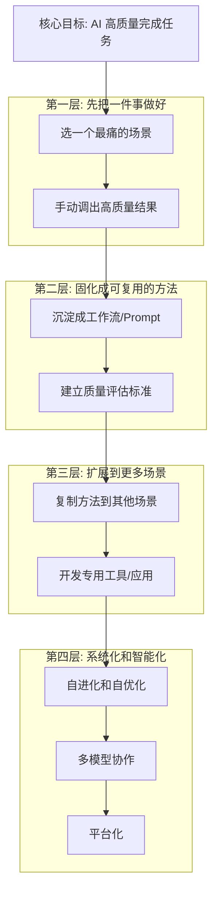

> [!IMPORTANT]
> **关键发现**：你现在是在**第四层**（EvoMap/多模型辩论/平台化）上花精力，但**第一层**（把一个场景做到高质量）还没有完全解决。这就是"越做越复杂但效果不好"的根因。

---

## 建议路径：先深后广

### 阶段 0：选一个最痛的场景（1-2 周）

> **需要你确认**：上面 A1-C3 这些场景里，哪一个是你**最频繁做**且**最痛**的？

选定后：

1. 用当前最好的工具（ChatGPT/Claude/Gemini）**手动**做一次，完整记录过程
2. 识别"质量不达标"具体差在哪里（内容深度？格式？逻辑？数据准确性？）
3. 迭代 Prompt/流程，直到产出能直接用

### 阶段 1：固化 + 自动化这一个场景

- 把成功的 prompt/流程变成脚本或工作流
- 建立"什么算合格"的检查清单
- 这一步可能只需要 ChatGPT REST + 简单脚本，**不需要** OpenClaw

### 阶段 2：复制到 2-3 个相似场景

- 把方法论迁移到相近的场景（比如 A2 报告 → A3 调研）
- 这时候才开始需要**通用的工作流引擎**

### 阶段 3：专用应用开发

- 给儿子的故事/激励应用（C2, C3）
- 知识图谱工具（B4）
- 这些是**独立应用**，可以并行开发

### 阶段 4：平台化（如果需要）

- 多模型辩论、EvoMap 自进化、需求漏斗
- **只在前面阶段验证了方法论之后才做**

---

## 串行 vs 并行

| 关系 | 说明 |
|------|------|
| **串行** | 阶段 0 → 阶段 1 → 阶段 2（必须按顺序，后一步依赖前一步的经验）|
| **并行** | 阶段 3 的各个应用之间互不依赖，可以并行 |
| **推迟** | 阶段 4（EvoMap/多模型）等前面验证完再考虑 |
| **现在就能用** | ChatGPT REST 已经有了，直接用来做阶段 0 |

---

## 待你确认

1. **最痛的场景是哪个？** A1-C3 里你最想先解决哪个？
2. **"质量不达标"具体差在哪？** 能给一个具体的例子吗？
3. **给儿子的应用是否紧急？** 还是可以放后面做？
4. **你同意"先深后广"的路径吗？** 还是你觉得应该先铺面？

---

## 2026-02-26 16:18:02 +0800 | /vol1/1000/antigravity/data/User/History/29e6a7e8/kq5E.md | source=Workspace Edit
resource: vscode-remote://ssh-remote%2B7b22686f73744e616d65223a22666e6f73227d/home/yuanhaizhou/.gemini/antigravity/brain/cf3a1159-970d-47d1-b0e2-2ff0828abf12/needs_analysis.md

# 需求全景梳理 v2（经你确认）

## 四大类 + 优先级排序

### A. 工作自动化（日常产出）

| 优先级 | 编号 | 场景 | 状态 |
|:---:|------|------|------|
| 🥇 | A4 | 项目规划 | 待做 |
| 🥈 | A2 | 写报告 | 待做 |
| 🥉 | A3 | 做调研 | 待做 |
| 4 | A1 | 做 PPT | 待做 |

### B. 分析与研究（需要深度思考）

| 优先级 | 编号 | 场景 | 状态 |
|:---:|------|------|------|
| 🥇 | B1 | 投资分析 | 待做 |
| 🥈 | B4 | 知识图谱 | 待做 |
| 🥉 | B2 | 行业研究 | 待做 |
| 4 | B3 | 纯学术研究 | 待做 |

> **A 和 B 是并行关系**，可以同时推进。

---

### C. 应用开发

| 优先级 | 编号 | 场景 | 状态 |
|:---:|------|------|------|
| 1 | C2 | 儿子教育-讲故事 | ✅ 已完成 |
| 2 | C4 | HomeAgent 语音对话助手（给儿子用） | 🔧 原型试用中，需增强 |
| 3 | C1 | 工作流应用 | 待做 |
| 4 | C3 | 儿子教育-激励系统 | 待做 |

### D. AI 能力提升（开发类）

| 优先级 | 编号 | 场景 | 状态 |
|:---:|------|------|------|
| 🥇 | D2 | 需求分析漏斗 | 待做 |
| 🥈 | D3 | 自进化系统（EvoMap） | 待做 |
| 🥉 | D1+D4 | 多模型/多智能体协作调用（合并） | 待做 |

> **C 和 D 都属于开发类**。

---

## 依赖关系总览

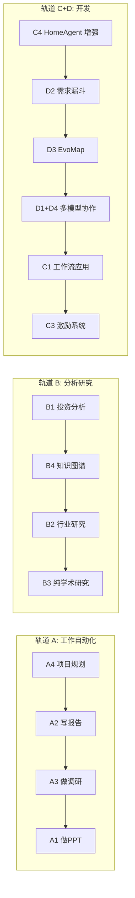

---

## 下一步需要确认

1. **A4 项目规划** — 你最近有具体的项目规划任务要做吗？能给个例子吗？
2. **B1 投资分析** — 你分析哪类投资？股票/基金/一级市场？
3. **C4 HomeAgent** — 原型做到什么程度了？"需要增强"具体差什么？
4. **D2 需求漏斗** — 这个和你之前做的 `planning` 仓库里的 funnel pipeline 是同一个东西吗？

确认后我出"第一步该做什么"的具体行动计划。

---

## 2026-02-26 16:31:32 +0800 | /vol1/1000/antigravity/data/User/History/29e6a7e8/Q4DS.md | source=Workspace Edit
resource: vscode-remote://ssh-remote%2B7b22686f73744e616d65223a22666e6f73227d/home/yuanhaizhou/.gemini/antigravity/brain/cf3a1159-970d-47d1-b0e2-2ff0828abf12/needs_analysis.md

# 需求全景 v3 — 项目实况盘点

## 四大类需求 + 你确认的优先级

### A. 工作自动化

| 优先级 | 场景 | 你已有的基础 |
|:---:|------|-------------|
| 🥇 | **A4 项目规划** | `planning/` 已有成熟的项目管理体系：项目台账(4个在执行)、31个候选项目、研究主题索引、KB系统 |
| 🥈 | **A2 写报告** | `research/` 已产出多份报告（增材制造董事长审阅版v8、爱尔思合作评估、精冲市场报告等） |
| 🥉 | **A3 做调研** | `research/` 中有完整的调研过程记录和归档体系 |
| 4 | **A1 做PPT** | `planning/业务PPT/` 已有多份PPT过程文件（2025工作总结、2026目标宣贯等） |

### B. 分析与研究

| 优先级 | 场景 | 你已有的基础 |
|:---:|------|-------------|
| 🥇 | **B1 投资分析** | `finagent/` 仅有memory记录，无代码；`finchat/` 有完整TS应用（含前端/后端/状态管理） |
| 🥈 | **B4 知识图谱** | `codexread/` = 最成熟的知识检索系统（9个worktree分支，含workflow runner、entity resolve等） |
| 🥉 | **B2 行业研究** | `research/archives/projects/` 下有10+个已完成的行业研究项目 |
| 4 | **B3 纯学术研究** | `kepu/`, `physics/` 等零散存在 |

### C. 应用开发

| 优先级 | 场景 | 你已有的基础 |
|:---:|------|-------------|
| 🥇 | **C3 激励系统** | `points/` = 完整的游戏化界面（Vite前端+Node后端+Docker+CI/CD），有Figma设计稿 |
| 🥈 | **C4 HomeAgent 增强** | `homeagent/` = 全栈语音助手（FastAPI brain_server + ESP32 + Android + Qdrant），原型已试用 |
| 🥉 | **C5 投研个人助手** | `finagent/` + `finchat/` 两个仓库，finchat 有前端代码 |
| ✅ | C2 讲故事 | `storyplay/` 已完成（故事生成+ASR/TTS管线+蛋蛋侦探连载+传记内容） |

### D. AI 辅助操作系统（需要一个名字）

| 优先级 | 场景 | 你已有的基础 |
|:---:|------|-------------|
| 🥇 | **D2 需求漏斗** | `planning/` 的funnel pipeline 有基础，但未达到完整收集→分类→落项目的闭环 |
| 🥈 | **D3 EvoMap 自进化** | `openclaw/src/evomap/` 有完整实现（745行service + 信号提取 + 基因协议），有8个测试 |
| 🥉 | **D1+D4 多模型协作** | `ChatgptREST/` 已实现 ChatGPT/Gemini/Qwen driver + MCP 集成 |

> **D 的命名建议**：
> - **NeuralOS** — AI 神经操作系统
> - **MindForge** — 思维锻造引擎
> - **Cortex** — 大脑皮层（直白但贴切）
> - **Nexus** — 连接中枢
> - **Synapse** — 突触（连接各个能力的核心）

---

## 项目仓库现状盘点

| 仓库 | 成熟度 | 关键发现 |
|------|:---:|---------|
| `planning/` | ⭐⭐⭐⭐ | 最成熟的入口体系：项目台账、候选清单、研究主题索引、KB、钉钉集成、协作闸门 |
| `ChatgptREST/` | ⭐⭐⭐⭐ | 核心工具：8个worktree，ChatGPT/Gemini/Qwen driver，MCP server，活跃开发中 |
| `codexread/` | ⭐⭐⭐⭐ | 知识检索系统：9个worktree（workflow-runner, entity-resolve, signal-timing等），最多并行开发 |
| `homeagent/` | ⭐⭐⭐ | 全栈语音助手：brain_server + ESP32网关 + Android客户端 + Qdrant + bench评测，试用中 |
| `storyplay/` | ⭐⭐⭐ | 故事应用：Vite/TS + ASR/TTS + 故事内容生成管线，**C2 已完成** |
| `openclaw/` | ⭐⭐⭐ | AI gateway 框架：多通道接入 + EvoMap + 路由引擎，有完善测试体系 |
| `points/` | ⭐⭐ | 激励系统 UI：Docker + CI/CD，有前端但后端只有 node_modules |
| `research/` | ⭐⭐ | 投资调研：10+ 归档项目、PDF报告、音频转写，无代码只有文档 |
| `finagent/` | ⭐ | 投研助手：仅 memory 日志，无代码实现 |
| `finchat/` | ⭐⭐ | 投研前端：有完整TS/Vite应用框架 |

---

## 场景 → 仓库 映射

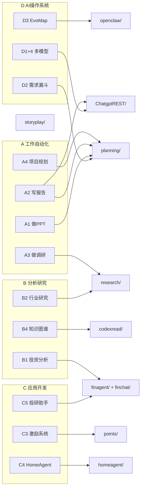

---

## 串行 / 并行关系

| 轨道 | 内部顺序（串行）| 与其他轨道关系 |
|------|--------------|-------------|
| **A** | A4 → A2 → A3 → A1 | 与 B 并行 |
| **B** | B1 → B4 → B2 → B3 | 与 A 并行 |
| **C** | C3 → C4 → C5 | 独立，但 C5 依赖 D 的多模型能力 |
| **D** | D2 → D3 → D1+D4 | **D 是基础设施**，增强后 A/B/C 都受益 |

---

## 待你确认

1. **D 的名字**：你喜欢 Cortex / Synapse / NeuralOS / MindForge 还是有自己的想法？
2. **A4 项目规划**已经有成熟体系，"质量不达标" 具体差在哪？是 planning 系统本身不够，还是 AI 生成的内容不够好？
3. **C3 激励系统（points）**：后端几乎是空的，你想要什么样的后端功能？用户体系？积分规则？
4. **D2 需求漏斗的完整定义**：你说的"任何想法→分类→落项目→团队处理→需求分析→目标和计划→执行和交付" — 这是否就是在 `planning/00_入口/` 体系基础上的**自动化和智能化**？

---

## 2026-02-26 16:57:39 +0800 | /vol1/1000/antigravity/data/User/History/29e6a7e8/si0S.md | source=Workspace Edit
resource: vscode-remote://ssh-remote%2B7b22686f73744e616d65223a22666e6f73227d/home/yuanhaizhou/.gemini/antigravity/brain/cf3a1159-970d-47d1-b0e2-2ff0828abf12/needs_analysis.md

# 需求全景 v4 — 经实地盘点后的完整版

> D 命名：**AIOS**（AI 辅助操作系统）

---

## 四大类需求 + 优先级

### A. 工作自动化 | B. 分析研究（并行）

| 优先级 | A（工作自动化） | B（分析研究） |
|:---:|------|------|
| 🥇 | **A4 项目规划** — `planning/` 已是最成熟入口 | **B1 投资分析** — `finagent/`早期 + `finchat/`有前端 |
| 🥈 | **A2 写报告** — 15个已归档报告但质量不稳定 | **B4 知识图谱** — `codexread/` 9个worktree最活跃 |
| 🥉 | **A3 做调研** — `research/` 15个项目已归档 | **B2 行业研究** — 有完整流程但深度不够 |
| 4 | **A1 做PPT** — `planning/业务PPT/` 有4套 | **B3 纯学术研究** — `kepu/` `physics/` 零散 |

**A/B 共同痛点**：AI 生成的内容质量不达标 — 框架结构不对、调研不够深入、需求理解不准确。

### C. 应用开发

| 优先级 | 场景 | 仓库 | 成熟度 |
|:---:|------|------|:---:|
| 🥇 | **C3 激励系统** | `points/` | ⭐⭐ 有前端+Docker，后端待做 |
| 🥈 | **C4 HomeAgent 增强** | `homeagent/` | ⭐⭐⭐ 全栈试用中 |
| 🥉 | **C5 投研个人助手** | `finagent/`+`finchat/` | ⭐ 早期 |
| ✅ | C2 讲故事 | `storyplay/` | 已完成 |

### D. AIOS（AI 辅助操作系统）

| 优先级 | 场景 | 仓库 | 成熟度 |
|:---:|------|------|:---:|
| 🥇 | **D2 需求漏斗** | `planning/` funnel pipeline | ⭐⭐ 有基础但未达完整闭环 |
| 🥈 | **D3 EvoMap 自进化** | `openclaw/src/evomap/` | ⭐⭐⭐ 745行+8个测试 |
| 🥉 | **D1+D4 多模型协作** | `ChatgptREST/` | ⭐⭐⭐⭐ 3个driver+MCP |

---

## OpenClaw 多 Agent 并行开发全貌

你已经通过 Codex 建立了一个**多 Agent 并行开发体系**：

### Agent 工作区清单（`/vol1/1000/openclaw-workspaces/`）

| Agent 工作区 | 职责 | 活跃度 |
|-------------|------|:---:|
| `pm/` | **项目管理主脑**：40+ 治理文档、派单队列、升级日志 | 🔴 极高 |
| `kb/` | **知识管理**：三层检索、registry 治理、归档验收 | 🟡 中 |
| `maintagent/` | **运维**：基础设施维护、ops 工具链 | 🟡 中 |
| `planning/` | **规划 Agent**：需求漏斗、项目群治理 | 🟡 中 |
| `hragent/` | **HR 管理**：人员调度与风险跟踪 | 🟢 低 |
| `feishu-intake/` | **飞书接入**：外部消息入口 | 🟢 低 |
| `main/` | **主 Agent**：antfarm 部署调度 | 🟢 低 |
| `subpm-a/` `subpm-b/` | **子 PM**：分布式执行审计 | 🟢 低 |

### 6 条并行工作流（Codex 开发中）

| 工作流 | 状态 | 关键产物 |
|--------|------|---------|
| **Funnel** | 方案质量显著提升，待真实链路跑通 | 状态机、CLI、权限门禁、证据链、CI测试 |
| **Coding Team** | 审查完成，主库合并交专责 Codex | client identity/advisor API/MCP tool |
| **KB Agent** | 2个commit已进main，30条completed资产 | 三层检索、registry治理、retrieval 100%验证 |
| **ChatgptREST** | 3个issue已提，测试矩阵完成 | advisor路由、边界测试、误路由问题 |
| **Auth** | 已完成隔离切换 | 专用认证链、回滚方案、同步脚本 |
| **Maint** | 持续运维 | workspace迁移、CDP端口、多开规则 |

---

## 全部仓库成熟度总览

| 仓库 | ⭐ | 说明 |
|------|:---:|------|
| `planning/` | ⭐⭐⭐⭐ | 最成熟入口：项目台账、候选清单、研究索引、KB、钉钉集成 |
| `ChatgptREST/` | ⭐⭐⭐⭐ | 核心工具：8 worktree，ChatGPT/Gemini/Qwen driver |
| `codexread/` | ⭐⭐⭐⭐ | 知识检索：9 worktree（workflow-runner, entity-resolve 等） |
| `openclaw/` | ⭐⭐⭐ | AI gateway：多通道+EvoMap+路由+KB 三层检索 |
| `homeagent/` | ⭐⭐⭐ | 语音助手：brain+ESP32+Android+Qdrant |
| `storyplay/` | ⭐⭐⭐ | 故事应用：Vite/TS+ASR/TTS ✅已完成 |
| `research/` | ⭐⭐ | 调研归档：15个项目，6份方法论文档 |
| `points/` | ⭐⭐ | 激励系统：前端+Docker，后端空 |
| `maint/` | ⭐⭐ | 运维记录：auth/CDP/workspace |
| `finagent/` | ⭐ | 投研：仅记忆日志 |
| `finchat/` | ⭐⭐ | 投研前端：有完整TS框架 |

---

## 需求漏斗完整定义（D2）

你描述的完整闭环：

```
任何想法/灵感/输入
      ↓
  [收集] 碎片收集箱（已有：planning/00_入口/碎片收集/）
      ↓
  [分类] 对应到现有框架（项目/研究/应用/运维）
      ↓
  [立项] 落成候选项目（已有：项目群候选清单 31 个）
      ↓
  [分派] 交给团队/Agent 处理
      ↓
  [分析] 需求分析 + 目标定义 + 计划制定 + 验收标准
      ↓
  [执行] 开发/调研/报告
      ↓
  [交付] 验收 + 归档入 KB
```

**现有基础**：`planning/00_入口/` 已有前4步的框架（碎片收集→候选清单→项目台账），但收集→分类→立项这段**不够自动和智能**。

---

## 下一步确认

1. **A/B 质量问题**：你说"AI 框架结构不对、调研不深入" — 你愿意给一个具体的例子吗？比如某份报告哪里不满意？这样我能定位是 prompt 问题还是工具链问题。

2. **C3 激励系统**：后端需要什么？用户登录体系？积分规则引擎？任务管理？还是只要一个简单的积分记录 API？

3. **开刀顺序**：我现在理解了全貌，你觉得应该先做哪件事？
   - A）把一个已有场景（比如 A2 写报告）**做到质量达标**
   - B）先把 C3 激励系统做完给儿子用
   - C）先完善 D2 需求漏斗让碎片能自动入库分类
   - D）其他？

---

## 2026-02-26 17:09:54 +0800 | /vol1/1000/antigravity/data/User/History/29e6a7e8/OMcD.md | source=Workspace Edit
resource: vscode-remote://ssh-remote%2B7b22686f73744e616d65223a22666e6f73227d/home/yuanhaizhou/.gemini/antigravity/brain/cf3a1159-970d-47d1-b0e2-2ff0828abf12/needs_analysis.md

# 需求全景 v5 — 质量诊断 + 行动方案

> 命名：**AIOS** | 经深度扫描 `planning/` + `research/` 全部文档后形成

---

## 核心诊断：质量问题出在哪

### 你已经有的（很好的基础）

| 已有能力 | 文件位置 | 状态 |
|---------|---------|------|
| 三套稿体系（外发沟通稿/内部底稿/执行拆解） | `research/docs/报告输出标准_三套稿_提示词体系.md` | ✅ 完整 |
| 7 个可复用模块库 | `research/docs/报告输出标准_目的矩阵.md` | ✅ 完整 |
| 目的矩阵（5 种场景 × 模块组合） | 同上 | ✅ 完整 |
| Pro 复审闭环工作流 | `research/docs/规划_Pro复审闭环工作流.md` | ✅ 完整 |
| 提示词模板（3 套：出稿/底稿/复审） | `报告输出标准_三套稿_提示词体系.md` | ✅ 完整 |
| KB 全文检索 + 证据包生成 | `planning/scripts/kb_build/query/pack/redact` | ✅ 可运行 |
| 钉钉发布自动化 | `planning/scripts/dingtalk_*` | ✅ 可运行 |

### 质量差在哪

> [!IMPORTANT]
> **不是缺标准，是标准每次都要用手喂。**

| 痛点 | 具体表现 |
|------|---------|
| **框架不对** | AI 不知道该用哪套稿件结构（外发 vs 底稿），每次需手动指定 |
| **深度不够** | AI 没有你的证据包和 KB 上下文，只能泛泛而谈 |
| **需求没理解准** | AI 不知道这个报告的"目的"是什么（技术预研 vs 合作评估 vs 请示），选错了模块组合 |
| **多次迭代才能用** | prompt → 初稿 → 手动 Pro 复审 → 替换段落 → 再审 → 脱敏 → 发布，链条太长 |

### 根因一句话

> **你有一整套出色的方法论，但每次执行都是手工艺——没有被固化成自动化管线。**

---

## 该做什么（按优先级）

### 第一步：把"写报告"端到端自动化（解决 A/B 痛点）

```
输入: "写一份__关于__的报告，发给__"
         ↓
 [1. 目的识别] 自动匹配目的矩阵 → 选模块组合
         ↓
 [2. 证据装载] 自动 kb_pack → 生成证据包
         ↓
 [3. 底稿生成] 用底稿prompt + 证据包 → 生成内部底稿
         ↓
 [4. 外发稿生成] 用外发prompt + 底稿结论 → 生成外发沟通稿
         ↓
 [5. Pro 复审] 调用复审prompt → 生成替换段落
         ↓
 [6. 脱敏 + 发布] kb_redact → dingtalk_publish
```

**这 6 步你已有全部零件，只差一个编排器把它们串起来。**

### 第二步：C3 激励系统（给儿子用）

`points/` 前端已有，需补一个后端。

### 第三步：C4 HomeAgent 增强

已在试用，迭代增强。

### 第四步：D2 需求漏斗完整闭环

把碎片收集 → 分类 → 立项 → 分派 → 执行 → 交付全链路跑通。

---

## 全部场景详细状态

### A/B 工作自动化 & 分析研究

| 场景 | 现有链路 | 缺少的 | 第一步行动 |
|------|---------|--------|-----------|
| A4 项目规划 | 项目台账+候选清单+KB | 自动生成规划报告 | 第一步的一部分 |
| A2 写报告 | 三套稿体系+prompt模板 | **编排器** | 🎯 **最优先** |
| A3 做调研 | research归档体系+kb_pack | 自动生成调研报告 | 第一步完成后复用 |
| A1 做PPT | markdown_convert + 钉钉 | PPT渲染质量 | 低优先 |
| B1 投资分析 | finagent(空)+finchat(前端) | 数据源+分析逻辑 | 阶段2 |
| B4 知识图谱 | codexread(9 worktree) | 实体关系可视化 | 阶段2 |
| B2 行业研究 | 15个归档项目 | 复用第一步管线 | 第一步完成后复用 |

### C 应用开发

| 场景 | 现有基础 | 需要做的 |
|------|---------|---------|
| C3 激励系统 | 前端+Docker+CI | 后端 API |
| C4 HomeAgent | brain_server+ESP32+Android | 迭代增强 |
| C5 投研助手 | finchat 前端框架 | 后端+数据源 |

### D AIOS

| 场景 | 现有基础 | 需要做的 |
|------|---------|---------|
| D2 需求漏斗 | 碎片收集+候选清单+项目台账 | 自动入库+分类+AI 匹配框架 |
| D3 EvoMap | 745行+8测试 | 先用模板，后接LLM |
| D1+D4 多模型 | ChatgptREST 3 driver | 辩论与交叉验证机制 |

---

## 待你确认

1. **第一步方向对不对？** 把"写报告"管线端到端自动化（串联目的识别 → 证据装载 → 底稿 → 外发稿 → 复审 → 发布），你同意吗？
2. **这个管线放在哪个仓库实现？** planning / openclaw / 新建？
3. **C3 激励系统后端**：你想要什么功能？（用户体系？积分规则？任务系统？）

---

## 2026-02-26 17:19:06 +0800 | /vol1/1000/antigravity/data/User/History/-1b1bc912/QzY5.md | source=Workspace Edit
resource: vscode-remote://ssh-remote%2B7b22686f73744e616d65223a22666e6f73227d/home/yuanhaizhou/.gemini/antigravity/brain/cf3a1159-970d-47d1-b0e2-2ff0828abf12/implementation_plan.md

# AIOS 框架架构设计

> **AIOS** = AI 辅助操作系统
> 位置：`projects/planning/aios/`（不新建仓库，在 planning 主库内实现）

---

## 一句话定义

> AIOS 是一个**管线编排框架**，把你已有的 25+ 个脚本工具和 12 个 skills 串成可复用的端到端工作流，让"说一句话就能出结果"成为可能。

---

## 三层架构

```
┌─────────────────────────────────────────────────┐
│                   用户输入                        │
│  "给董事长写一份增材制造预研的外发沟通稿"           │
└─────────────┬───────────────────────────────────┘
              ↓
┌─────────────────────────────────────────────────┐
│          Layer 1: 管线层 (Pipelines)              │
│                                                   │
│  ┌──────────┐ ┌──────────┐ ┌──────────┐          │
│  │ 报告管线  │ │ 调研管线  │ │ 规划管线  │          │
│  └──────────┘ └──────────┘ └──────────┘          │
│  ┌──────────┐ ┌──────────┐                        │
│  │ 激励管线  │ │ 需求漏斗  │                        │
│  └──────────┘ └──────────┘                        │
└─────────────┬───────────────────────────────────┘
              ↓
┌─────────────────────────────────────────────────┐
│          Layer 2: 能力层 (Capabilities)            │
│                                                   │
│  目的识别 → 证据装载 → 底稿生成 → 外发稿生成      │
│  → 复审 → 脱敏 → 发布                             │
│  试卷生成 → 评分规则 → 积分计算                    │
│  碎片收集 → 分类 → 立项匹配                        │
└─────────────┬───────────────────────────────────┘
              ↓
┌─────────────────────────────────────────────────┐
│          Layer 3: 工具层 (Tools)                   │
│                                                   │
│  kb_build  kb_pack  kb_redact  kb_query           │
│  ChatgptREST  markdown_convert  dingtalk_publish  │
│  render_ppt  repo_archive_scan  research_scan     │
└─────────────────────────────────────────────────┘
```

---

## 核心概念

### Pipeline（管线）

一条管线 = 一个 YAML 定义的步骤序列。每步调用一个 Capability。

```yaml
# aios/pipelines/report.yaml
name: report
description: "端到端报告生成（底稿+外发稿+复审+发布）"
triggers:
  - pattern: "写.*报告.*给.*"
  - pattern: "出.*沟通稿.*"
steps:
  - id: purpose
    capability: purpose_identify
    input: { text: "{{user_input}}" }

  - id: evidence
    capability: evidence_load
    input: { project: "{{purpose.project}}", scope: "{{purpose.scope}}" }

  - id: draft
    capability: draft_generate
    input:
      template: "internal_draft"
      purpose: "{{purpose.type}}"
      evidence_pack: "{{evidence.pack_path}}"

  - id: external
    capability: draft_generate
    input:
      template: "external_communication"
      purpose: "{{purpose.type}}"
      source_draft: "{{draft.output_path}}"

  - id: review
    capability: pro_review
    input:
      external: "{{external.output_path}}"
      internal: "{{draft.output_path}}"

  - id: redact
    capability: redact
    input: { file: "{{external.output_path}}" }
    when: "{{purpose.audience == 'external'}}"

  - id: publish
    capability: dingtalk_publish
    input: { file: "{{redact.output_path || external.output_path}}" }
    when: "{{purpose.publish == true}}"
    require_approval: true
```

### Capability（能力块）

每个能力块 = 一个 Python 函数，封装一个原子操作。输入/输出都是结构化的。

```python
# aios/capabilities/purpose_identify.py
from aios.core import Capability, CapabilityInput, CapabilityOutput

class PurposeIdentify(Capability):
    """从自然语言输入识别报告目的、受众、项目、模块组合"""

    def execute(self, input: CapabilityInput) -> CapabilityOutput:
        # 1. 用目的矩阵匹配
        # 2. 返回: type, audience, project, modules, scope
        ...
```

### Tool（工具）

已有的脚本/命令，被 Capability 调用：

| 工具 | 调用方式 | 已有 |
|------|---------|:---:|
| `kb_build` | `python scripts/kb_build.py` | ✅ |
| `kb_pack` | `python scripts/kb_pack.py "query"` | ✅ |
| `kb_redact` | `python scripts/kb_redact.py file` | ✅ |
| `ChatgptREST` | HTTP API / MCP | ✅ |
| `dingtalk_publish` | `python scripts/dingtalk_space_publish_alidocs.py` | ✅ |
| `markdown_convert` | `python scripts/markdown_convert.py` | ✅ |
| `render_ppt` | `python scripts/render_ppt_images_v0_3.py` | ✅ |

---

## 目录结构

```
planning/aios/
├── core/                    # 框架核心
│   ├── __init__.py
│   ├── pipeline.py          # Pipeline 加载器 + 执行引擎
│   ├── capability.py        # Capability 基类
│   ├── context.py           # 执行上下文（变量传递、状态跟踪）
│   └── registry.py          # 管线和能力的注册表
│
├── capabilities/            # 能力块实现
│   ├── purpose_identify.py  # 目的识别（匹配目的矩阵）
│   ├── evidence_load.py     # 证据装载（调用 kb_pack）
│   ├── draft_generate.py    # 底稿/外发稿生成（调用 ChatgptREST）
│   ├── pro_review.py        # Pro 复审（调用复审 prompt）
│   ├── redact.py            # 脱敏（调用 kb_redact）
│   ├── dingtalk_publish.py  # 钉钉发布
│   ├── quiz_generate.py     # 试卷/测评生成（激励系统用）
│   └── intake_classify.py   # 碎片分类入库（需求漏斗用）
│
├── pipelines/               # 管线定义（YAML）
│   ├── report.yaml          # 报告管线
│   ├── research.yaml        # 调研管线
│   ├── planning.yaml        # 项目规划管线
│   ├── incentive.yaml       # 激励系统管线
│   └── intake.yaml          # 需求漏斗管线
│
├── prompts/                 # Prompt 模板（从现有三套稿提取）
│   ├── internal_draft.md    # 内部底稿 prompt
│   ├── external_comm.md     # 外发沟通稿 prompt
│   ├── review.md            # 复审 prompt
│   └── quiz.md              # 试卷生成 prompt
│
├── cli.py                   # 命令行入口
└── tests/                   # 测试
    ├── test_pipeline.py
    └── test_capabilities.py
```

---

## 实施计划

### Phase 0: 框架骨架（本次完成）

- [ ] 创建 `aios/core/` 四个核心文件（pipeline/capability/context/registry）
- [ ] 创建 `aios/cli.py` 命令行入口
- [ ] 从现有 `报告输出标准_三套稿` 提取 prompt 模板到 `aios/prompts/`
- [ ] 写第一条管线 `report.yaml`
- [ ] 实现 `purpose_identify` 和 `evidence_load` 两个能力块
- [ ] 端到端测试：`python -m aios.cli "写一份增材制造内部底稿"`

### Phase 1: 报告管线完整跑通

- [ ] 实现 `draft_generate`（对接 ChatgptREST）
- [ ] 实现 `pro_review`
- [ ] 实现 `redact` + `dingtalk_publish`
- [ ] 用真实项目验证（60PEEK / 增材制造）

### Phase 2: 激励管线

- [ ] 实现 `quiz_generate`（试卷生成能力）
- [ ] 写 `incentive.yaml` 管线
- [ ] 对接 `points/` 前端

### Phase 3: 需求漏斗管线

- [ ] 实现 `intake_classify`
- [ ] 写 `intake.yaml` 管线
- [ ] 对接 `planning/00_入口/碎片收集/`

---

## 验证计划

```bash
# Phase 0 验证
cd /vol1/1000/projects/planning
python -m aios.cli "写一份增材制造预研的内部底稿"
# 预期: 自动识别目的(技术预研) → 装载证据包 → 生成底稿

# Phase 1 验证
python -m aios.cli "给董事长写一份增材制造的外发沟通稿"
# 预期: 底稿 → 外发稿 → 复审 → 脱敏 → 可选发布

# Phase 2 验证
python -m aios.cli "给儿子设计一套《老人与海》阅读测评试卷"
# 预期: 生成试卷 → 评分规则 → 对接积分系统
```

---

## 技术选型

| 选项 | 选择 | 理由 |
|------|------|------|
| 语言 | Python | 与现有 25+ 脚本一致，最小迁移成本 |
| 管线定义 | YAML | 声明式，非程序员也能理解和修改 |
| LLM 调用 | ChatgptREST MCP | 已有基础设施，支持多模型 |
| 存储 | 本地文件系统 | 与 planning 仓库一致 |
| 依赖 | 仅 stdlib + pyyaml | 最小依赖，与现有 .venv 兼容 |

---

## 2026-02-26 17:19:24 +0800 | /vol1/1000/antigravity/data/User/History/5fef7881/0m5t.md | source=Workspace Edit
resource: vscode-remote://ssh-remote%2B7b22686f73744e616d65223a22666e6f73227d/home/yuanhaizhou/.gemini/antigravity/brain/cf3a1159-970d-47d1-b0e2-2ff0828abf12/task.md

# AIOS 框架搭建任务清单

## Phase 0: 框架骨架
- [ ] 创建 `planning/aios/core/pipeline.py`（Pipeline 加载器 + 执行引擎）
- [ ] 创建 `planning/aios/core/capability.py`（Capability 基类）
- [ ] 创建 `planning/aios/core/context.py`（执行上下文 + 变量传递）
- [ ] 创建 `planning/aios/core/registry.py`（管线和能力注册表）
- [ ] 创建 `planning/aios/cli.py`（命令行入口）
- [ ] 从三套稿提取 prompt 模板到 `aios/prompts/`
- [ ] 写第一条管线 `pipelines/report.yaml`
- [ ] 实现 `capabilities/purpose_identify.py`
- [ ] 实现 `capabilities/evidence_load.py`
- [ ] 端到端冒烟测试

## Phase 1: 报告管线完整跑通
- [ ] 实现 `capabilities/draft_generate.py`（对接 ChatgptREST）
- [ ] 实现 `capabilities/pro_review.py`
- [ ] 实现 `capabilities/redact.py` + `capabilities/dingtalk_publish.py`
- [ ] 用真实项目验证（60PEEK / 增材制造）

## Phase 2: 激励管线
- [ ] 实现 `capabilities/quiz_generate.py`（试卷/测评生成）
- [ ] 写 `pipelines/incentive.yaml`
- [ ] 对接 points/ 前端

## Phase 3: 需求漏斗管线
- [ ] 实现 `capabilities/intake_classify.py`
- [ ] 写 `pipelines/intake.yaml`
- [ ] 对接 `planning/00_入口/碎片收集/`

---

## 2026-02-26 17:19:52 +0800 | /vol1/1000/antigravity/data/User/History/5fef7881/3e5r.md | source=Workspace Edit
resource: vscode-remote://ssh-remote%2B7b22686f73744e616d65223a22666e6f73227d/home/yuanhaizhou/.gemini/antigravity/brain/cf3a1159-970d-47d1-b0e2-2ff0828abf12/task.md

# AIOS 框架搭建任务清单

## Phase 0: 框架骨架
- [/] 创建 `planning/aios/core/pipeline.py`（Pipeline 加载器 + 执行引擎）
- [ ] 创建 `planning/aios/core/capability.py`（Capability 基类）
- [ ] 创建 `planning/aios/core/context.py`（执行上下文 + 变量传递）
- [ ] 创建 `planning/aios/core/registry.py`（管线和能力注册表）
- [ ] 创建 `planning/aios/cli.py`（命令行入口）
- [ ] 从三套稿提取 prompt 模板到 `aios/prompts/`
- [ ] 写第一条管线 `pipelines/report.yaml`
- [ ] 实现 `capabilities/purpose_identify.py`
- [ ] 实现 `capabilities/evidence_load.py`
- [ ] 端到端冒烟测试

## Phase 1: 报告管线完整跑通
- [ ] 实现 `capabilities/draft_generate.py`（对接 ChatgptREST）
- [ ] 实现 `capabilities/pro_review.py`
- [ ] 实现 `capabilities/redact.py` + `capabilities/dingtalk_publish.py`
- [ ] 用真实项目验证（60PEEK / 增材制造）

## Phase 2: 激励管线
- [ ] 实现 `capabilities/quiz_generate.py`（试卷/测评生成）
- [ ] 写 `pipelines/incentive.yaml`
- [ ] 对接 points/ 前端

## Phase 3: 需求漏斗管线
- [ ] 实现 `capabilities/intake_classify.py`
- [ ] 写 `pipelines/intake.yaml`
- [ ] 对接 `planning/00_入口/碎片收集/`

---

## 2026-02-26 17:59:20 +0800 | /vol1/1000/antigravity/data/User/History/-1b1bc912/7CLs.md | source=Workspace Edit
resource: vscode-remote://ssh-remote%2B7b22686f73744e616d65223a22666e6f73227d/home/yuanhaizhou/.gemini/antigravity/brain/cf3a1159-970d-47d1-b0e2-2ff0828abf12/implementation_plan.md

# AIOS 详细架构设计

> 版本：v1.0 | 2026-02-26

---

## 一、框架选型对比

### 候选方案

| 维度 | **LangGraph** | **CrewAI** | **AutoGen** | **自研轻量框架** |
|------|:---:|:---:|:---:|:---:|
| **状态管理** | ⭐⭐⭐⭐⭐ 图+Checkpoint 持久化 | ⭐⭐⭐ Flows 有状态 | ⭐⭐⭐ Agent 有状态 | ⭐⭐ 需自建 |
| **长任务** | ⭐⭐⭐⭐⭐ 原生支持断点恢复 | ⭐⭐⭐ 可暂停恢复 | ⭐⭐⭐ 异步消息 | ⭐⭐ 需自建 |
| **多模型路由** | ⭐⭐⭐ 需自建 Router | ⭐⭐ 绑模型 | ⭐⭐⭐ 支持多模型 | ⭐⭐⭐⭐ 完全自定义 |
| **辩论/交叉验证** | ⭐⭐⭐⭐ 条件分支+循环 | ⭐⭐⭐ 多角色协作 | ⭐⭐⭐⭐⭐ 对话驱动辩论 | ⭐⭐ 需自建 |
| **MCP 集成** | ⭐⭐⭐⭐ LangChain 有 MCP 适配 | ⭐⭐ 需包装 | ⭐⭐ 需包装 | ⭐⭐⭐ 直接调 |
| **学习曲线** | 🔴 陡（图概念+状态 Schema） | 🟢 平（角色+任务） | 🟡 中等 | 🟢 你自己定义 |
| **生产成熟度** | ⭐⭐⭐⭐⭐ 2025 发 1.0 | ⭐⭐⭐⭐ 2025 发 1.0 | ⭐⭐⭐ v0.4 仍在迭代 | ⭐ 从零开始 |
| **可观测性** | LangSmith 深度集成 | 内置 Tracing | OpenTelemetry | 需自建 |
| **Python 生态** | ✅ 原生 Python | ✅ 原生 Python | ✅ 原生 Python | ✅ |

### 推荐：LangGraph + FastAPI

**理由：**

1. **你需要状态持久化**：AIOS 是持续运行的服务，任务可能跑 30 分钟（Deep Research），需要断点恢复
2. **你需要条件分支和循环**：辩论/交叉验证需要"A 说完 → B 反驳 → 判断是否收敛 → 不收敛再来一轮"
3. **你需要图来描述复杂流程**：报告管线 6 步、有条件跳过、有审批门禁 — 图比线性管线更灵活
4. **你已有 LangGraph 基础**：ChatgptREST 已有 Advisor LangGraph 蓝图，不是从零开始
5. **AutoGen 虽适合辩论，但 API 不稳定**；CrewAI 太简单不够重量级

> [!NOTE]
> LangGraph 需要安装：`pip install langgraph langchain-core` (~50MB)
> FastAPI 需要安装：`pip install fastapi uvicorn[standard]` (~30MB)
> 当前环境 Python 3.11.2，兼容

---

## 二、模型路由器（ModelRouter）

### 路由优先级原则

> **会员免费额度优先，按量计费仅用于低延迟儿童应用。**

### Tier 1：会员无限额度（优先使用）

| 优先级 | 通道 | 接入方式 | 延迟 | 能力定位 | 并发限制 |
|:---:|------|---------|:---:|---------|:---:|
| **1** | Gemini CLI | MCP `gemini_cli_ask` | ⚡ 5-30s | **默认快模型**：意图理解、生成初稿、快速推理 | 1 进程 |
| **2** | ChatGPT Web | MCP `chatgpt_web_ask` | 🐢 30s-2min | 通用对话、稿件生成 | 1 tab |
| **3** | Gemini Web | MCP `gemini_web_*` | 🐢 30s-2min | 交叉验证第二视角 | 1 tab |
| **4** | Qwen Web | MCP `qwen_web_ask` | 🐢 1-3min | 中文专项推理、第三视角 | 1 tab |
| **5** | Codex CLI | CLI `codex exec` | ⚡ 10-60s | 代码执行、文件操作 | 多进程 |
| **6** | Claude Code | CLI `claude` | ⚡ 10-60s | 开发任务、Agent Teams | 多 tmux |

### Tier 2：会员重型模型（按需调用）

| 优先级 | 通道 | 接入方式 | 延迟 | 能力定位 | 使用条件 |
|:---:|------|---------|:---:|---------|---------|
| **7** | Gemini Deep Think | MCP `gemini_web_ask_pro_deep_think` | 🐌 5-10min | 复杂分析 | `complexity >= complex` |
| **8** | ChatGPT Pro Extended | MCP `chatgpt_web_ask_pro_extended` | 🐌 15-30min | 最强推理 | `complexity == critical` |
| **9** | ChatGPT Deep Research | MCP `chatgpt_web_ask_deep_research` | 🐌🐌 15-30min | 深度调研 | `task_type == research` |
| **10** | Gemini Deep Research | MCP `gemini_web_deep_research` | 🐌🐌 15-30min | 深度调研（备选） | DR 备选 |

### Tier 3：按量计费（仅儿童应用）

| 通道 | 接入方式 | 延迟 | 用途 |
|------|---------|:---:|------|
| 百炼 qwen-turbo | DashScope HTTP | ⚡⚡ <1s | 激励系统交互、试卷判分 |
| 百炼 qwen-plus | DashScope HTTP | ⚡ 1-3s | 激励系统复杂生成 |
| 豆包 ARK | ARK HTTP | ⚡ 1-3s | HomeAgent 语音响应 |

### 路由决策矩阵

```python
class ModelRouter:
    """根据任务特征选择最优模型通道"""

    def route(self, task: Task) -> list[ModelChannel]:
        # 1. 开发任务 → Claude Code Agent Teams
        if task.type == "code_development":
            return [ClaudeCodeChannel()]

        # 2. 代码执行 → Codex CLI
        if task.type == "code_execution":
            return [CodexChannel()]

        # 3. 深度调研 → Deep Research
        if task.type == "deep_research":
            return [ChatGPTDeepResearchChannel(),
                    GeminiDeepResearchChannel()]  # 备选

        # 4. 复杂分析/辩论 → 多模型交叉
        if task.complexity >= Complexity.COMPLEX:
            return [
                GeminiCLIChannel(),        # 快速初始分析
                ChatGPTProChannel(),       # 深度主分析
                GeminiDeepThinkChannel(),  # 交叉验证
            ]

        # 5. 中等任务 → Gemini CLI
        if task.complexity >= Complexity.MEDIUM:
            return [GeminiCLIChannel()]

        # 6. 简单任务 → Gemini CLI（最快免费通道）
        return [GeminiCLIChannel()]

        # ❌ 不使用百炼/豆包（除非 task.target == "child_app"）
```

### 降级策略

```
Gemini CLI 不可用
 → 降级到 ChatGPT Web
   → 降级到 Gemini Web
     → 降级到 Qwen Web
       → 报错（所有会员通道不可用）
```

---

## 三、服务层技术选型

| 层 | 选择 | 备选 | 理由 |
|---|------|------|------|
| **Web 框架** | FastAPI | Flask | 原生 async、自动 OpenAPI 文档、Pydantic 校验 |
| **ASGI 服务器** | uvicorn | gunicorn+uvicorn | 支持 WebSocket、热重载 |
| **任务队列** | 内置 asyncio | Celery | 当前单机足够，Celery 过重 |
| **Agent 编排** | LangGraph | 自研 | 图状态机、持久 Checkpoint、条件分支 |
| **状态存储** | SQLite (aiosqlite) | PostgreSQL | 单机足够、零运维、与 OpenClaw 一致 |
| **文件存储** | 本地文件系统 | S3 | 与 planning KB 体系一致 |
| **配置** | YAML + .env | TOML | 管线定义用 YAML，密钥用 .env |
| **MCP 客户端** | mcp SDK (python) | 自研 JSON-RPC | 标准协议、社区生态 |
| **可观测** | 结构化日志 + SQLite | LangSmith | 先不引入外部依赖 |
| **进程管理** | systemd | supervisor | Linux 原生、自动重启 |

---

## 四、五层架构详解

```
┌─────────────────────────────────────────────────────────┐
│                  Layer 1: 交互层 (Shell)                  │
│                                                         │
│  FastAPI HTTP ─── CLI ─── HomeAgent 语音 ─── 钉钉 Bot   │
│                                                         │
│  职责：接收输入 → 返回结果/任务状态                       │
│  协议：HTTP REST + WebSocket（实时推送）+ MCP            │
├─────────────────────────────────────────────────────────┤
│                  Layer 2: 内核 (Kernel)                   │
│                                                         │
│  ┌─────────────┐  ┌─────────────┐  ┌──────────────┐    │
│  │ IntentEngine │  │ TaskPlanner  │  │ ModelRouter   │    │
│  │ 意图理解     │  │ 任务拆解     │  │ 模型路由      │    │
│  │ (Gemini CLI) │  │ (LLM-based) │  │ (规则+LLM)   │    │
│  └─────────────┘  └─────────────┘  └──────────────┘    │
│  ┌─────────────┐  ┌─────────────┐  ┌──────────────┐    │
│  │ MemoryManager│  │ QualityGate  │  │ ContextBuilder│   │
│  │ 记忆管理     │  │ 质量门禁     │  │ 上下文构建    │    │
│  │ (KB+SQLite) │  │ (Pro复审)    │  │ (kb_pack)    │    │
│  └─────────────┘  └─────────────┘  └──────────────┘    │
├─────────────────────────────────────────────────────────┤
│            Layer 3: 调度层 (Scheduler)                    │
│                                                         │
│  ┌─────────────────────────────────────────────────┐    │
│  │              LangGraph StateGraph                │    │
│  │                                                 │    │
│  │  意图理解 → 任务拆解 → [并行/串行执行] →         │    │
│  │  质量评估 → [通过?] → 输出                       │    │
│  │       ↑         ↓(不通过)                       │    │
│  │       └── 修正 ←──┘                              │    │
│  │                                                 │    │
│  │  特殊流程：辩论图 → 多模型并行 → 裁判收敛        │    │
│  └─────────────────────────────────────────────────┘    │
│                                                         │
│  TaskQueue: asyncio.Queue (内存) + SQLite (持久化)       │
├─────────────────────────────────────────────────────────┤
│             Layer 4: 执行层 (Executors)                   │
│                                                         │
│  ┌──── MCP 通道 ────────────────────────────┐           │
│  │ chatgpt_web (ask/pro/dr/agent/image)     │           │
│  │ gemini_web (ask/deep_think/dr/image)     │           │
│  │ gemini_cli (ask) ← 默认快模型            │           │
│  │ qwen_web (ask)                           │           │
│  └──────────────────────────────────────────┘           │
│  ┌──── CLI 通道 ────────────────────────────┐           │
│  │ codex exec ← 代码执行                    │           │
│  │ claude --agent-teams ← 开发任务           │           │
│  └──────────────────────────────────────────┘           │
│  ┌──── HTTP API 通道（仅儿童应用）──────────┐           │
│  │ DashScope (qwen-turbo/plus)              │           │
│  │ ARK (豆包)                               │           │
│  └──────────────────────────────────────────┘           │
│  ┌──── 工具通道 ────────────────────────────┐           │
│  │ kb_pack, kb_redact, kb_query             │           │
│  │ dingtalk_publish, markdown_convert       │           │
│  │ render_ppt, research_scan                │           │
│  │ OpenClaw Agents (via MCP/CLI)            │           │
│  └──────────────────────────────────────────┘           │
├─────────────────────────────────────────────────────────┤
│            Layer 5: 存储层 (Storage)                      │
│                                                         │
│  ┌─────────┐  ┌──────────┐  ┌──────────────┐           │
│  │ SQLite   │  │ 文件系统   │  │ KB Index     │           │
│  │ 任务状态  │  │ 产出物     │  │ 知识检索     │           │
│  │ 记忆     │  │ 证据包     │  │ (已有)       │           │
│  │ 配置     │  │ 报告       │  │              │           │
│  └─────────┘  └──────────┘  └──────────────┘           │
└─────────────────────────────────────────────────────────┘
```

---

## 五、与 OpenClaw 的关系

### 选择：MCP 桥接，不嵌入

OpenClaw 是 **TypeScript/Node.js** 项目，AIOS 是 **Python** 项目。
直接嵌入代码不可行，但可以通过 MCP 协议桥接：

```
AIOS (Python)
  │
  ├─ 调用 OpenClaw Agent → 通过 MCP stdio 或 CLI
  │   "codex exec --task '在 kb workspace 执行 sync'"
  │
  ├─ 读取 OpenClaw 产物 → 直接读文件系统
  │   /vol1/1000/openclaw-workspaces/{agent}/state/
  │
  └─ 发送任务给 OpenClaw → 写入任务文件
      /vol1/1000/openclaw-workspaces/{agent}/tasks/
```

**OpenClaw 的 10 个 Agent 在 AIOS 中的角色：**

| OpenClaw Agent | AIOS 角色 | 调用方式 |
|---------------|---------|---------|
| PM Agent | 项目管理执行者 | 读写 workspace 文件 |
| KB Agent | 知识库维护者 | 调用 kb:registry 命令 |
| Maint Agent | 基础设施维护 | CLI 调用 |
| 其他 Agent | 按需扩展 | MCP/CLI |

---

## 六、辩论与交叉验证设计

```
┌──────────────────────────────────────────────┐
│              辩论 StateGraph                  │
│                                              │
│  ┌─────────┐      ┌─────────┐               │
│  │ 正方     │      │ 反方     │               │
│  │ Model A  │      │ Model B  │               │
│  │(ChatGPT  │      │(Gemini   │               │
│  │  Pro)    │      │ DeepThink)│               │
│  └────┬────┘      └────┬────┘               │
│       │ 论点            │ 反驳               │
│       ↓                ↓                     │
│  ┌─────────────────────────────┐             │
│  │        裁判 (Gemini CLI)     │             │
│  │  评估：是否收敛？质量够吗？   │             │
│  └─────────────┬───────────────┘             │
│                │                              │
│       ┌────────┼────────┐                    │
│       ↓ 收敛    ↓ 不收敛  ↓ 质量不够          │
│     输出结论  下一轮辩论  补充证据后重来       │
└──────────────────────────────────────────────┘
```

**模型分配（辩论场景）：**
- 正方：ChatGPT Pro Extended（最强推理，15-30min）
- 反方：Gemini Deep Think（独立视角，5-10min）
- 裁判：Gemini CLI（快速判断，5-30s）
- 第三视角（可选）：Qwen Deep Think

---

## 七、目录结构

```
projects/aios/
├── aios/
│   ├── __init__.py
│   ├── main.py              # FastAPI 应用入口
│   ├── config.py             # 配置加载（.env + YAML）
│   │
│   ├── kernel/               # Layer 2: 内核
│   │   ├── intent.py         # IntentEngine 意图理解
│   │   ├── planner.py        # TaskPlanner 任务拆解
│   │   ├── router.py         # ModelRouter 模型路由
│   │   ├── memory.py         # MemoryManager 记忆管理
│   │   ├── quality.py        # QualityGate 质量门禁
│   │   └── context.py        # ContextBuilder 上下文构建
│   │
│   ├── scheduler/            # Layer 3: 调度层
│   │   ├── graphs/           # LangGraph 状态图定义
│   │   │   ├── report.py     # 报告管线图
│   │   │   ├── research.py   # 调研管线图
│   │   │   ├── debate.py     # 辩论图
│   │   │   └── intake.py     # 需求漏斗图
│   │   ├── queue.py          # 任务队列
│   │   └── checkpoint.py     # 状态 Checkpoint
│   │
│   ├── executors/            # Layer 4: 执行层
│   │   ├── base.py           # Executor 基类
│   │   ├── mcp_channel.py    # MCP 通道（chatgpt/gemini/qwen/gemini_cli）
│   │   ├── cli_channel.py    # CLI 通道（codex/claude）
│   │   ├── api_channel.py    # HTTP API 通道（百炼/ARK）
│   │   └── tool_channel.py   # 工具通道（kb_pack/redact/dingtalk）
│   │
│   ├── storage/              # Layer 5: 存储层
│   │   ├── db.py             # SQLite 操作
│   │   ├── artifacts.py      # 产出物管理
│   │   └── kb_bridge.py      # KB 索引桥接
│   │
│   ├── api/                  # Layer 1: 交互层
│   │   ├── routes.py         # HTTP 路由
│   │   ├── ws.py             # WebSocket 实时推送
│   │   └── schemas.py        # Pydantic 数据模型
│   │
│   └── prompts/              # Prompt 模板
│       ├── intent.md         # 意图理解 prompt
│       ├── planner.md        # 任务拆解 prompt
│       ├── internal_draft.md # 内部底稿 prompt
│       ├── external_comm.md  # 外发沟通稿 prompt
│       ├── review.md         # 复审 prompt
│       └── debate.md         # 辩论 prompt
│
├── pipelines/                # 管线配置（YAML）
│   ├── report.yaml
│   ├── research.yaml
│   ├── incentive.yaml
│   └── intake.yaml
│
├── tests/
├── .env                      # 密钥配置
├── pyproject.toml            # 项目配置
└── README.md
```

---

## 八、实施路线图

### Phase 0：骨架可运行（~2天）
- 创建仓库 `projects/aios/`
- 实装 FastAPI + uvicorn 服务骨架
- 实装 ModelRouter（Gemini CLI 为默认通道）
- 实装 IntentEngine（调用 Gemini CLI 理解意图）
- 端到端测试：HTTP POST → 意图识别 → Gemini CLI 响应

### Phase 1：报告管线（~3天）
- 实装 LangGraph 报告状态图
- 实装 ContextBuilder（调用 kb_pack）
- 实装 QualityGate（调用复审 prompt）
- 端到端测试：HTTP POST → 生成完整底稿+外发稿

### Phase 2：辩论与多模型（~3天）
- 实装辩论 StateGraph
- 实装 ChatGPT Pro + Gemini Deep Think 双通道
- 实装裁判收敛逻辑

### Phase 3：激励系统管线（~2天）
- 试卷生成 + 评分 + 积分
- 对接 points 前端（API 接口）

### Phase 4：需求漏斗 + 完整闭环（~3天）
- 碎片收集 → 分类 → 立项 → 分派
- 对接 OpenClaw Agents

---

## 待确认

> [!IMPORTANT]
> 1. **LangGraph + FastAPI** 作为核心框架，你同意吗？
> 2. **新仓库 `projects/aios/`**，你同意吗？
> 3. Phase 0 先把 Gemini CLI 接通作为默认快模型，你同意吗？

---

## 2026-02-26 17:59:55 +0800 | /vol1/1000/antigravity/data/User/History/5fef7881/5vfb.md | source=Workspace Edit
resource: vscode-remote://ssh-remote%2B7b22686f73744e616d65223a22666e6f73227d/home/yuanhaizhou/.gemini/antigravity/brain/cf3a1159-970d-47d1-b0e2-2ff0828abf12/task.md

# AIOS 框架搭建任务清单

## Phase 0: 骨架可运行
- [/] 创建 `projects/aios/` 仓库结构 + `pyproject.toml`
- [ ] 实装 `aios/config.py` 配置加载
- [ ] 实装 `aios/executors/base.py` Executor 基类
- [ ] 实装 `aios/executors/mcp_channel.py` MCP 通道（Gemini CLI 优先）
- [ ] 实装 `aios/kernel/router.py` ModelRouter 模型路由
- [ ] 实装 `aios/kernel/intent.py` IntentEngine 意图理解
- [ ] 实装 `aios/storage/db.py` SQLite 存储
- [ ] 实装 `aios/main.py` FastAPI 服务入口
- [ ] 实装 `aios/api/routes.py` HTTP 路由
- [ ] 端到端冒烟测试

## Phase 1: 报告管线
- [ ] 实装 LangGraph 报告状态图
- [ ] 实装 ContextBuilder（调用 kb_pack）
- [ ] 实装 QualityGate（调用复审 prompt）

## Phase 2: 辩论与多模型
- [ ] 辩论 StateGraph
- [ ] 多通道并行执行

## Phase 3: 激励系统管线
- [ ] 试卷生成 + 评分 + 积分

## Phase 4: 需求漏斗
- [ ] 碎片收集 → 分类 → 立项 → 分派

---

## 2026-02-26 18:11:57 +0800 | /vol1/1000/antigravity/data/User/History/-1b1bc912/UAhW.md | source=Workspace Edit
resource: vscode-remote://ssh-remote%2B7b22686f73744e616d65223a22666e6f73227d/home/yuanhaizhou/.gemini/antigravity/brain/cf3a1159-970d-47d1-b0e2-2ff0828abf12/implementation_plan.md

# AIOS 深度架构设计 v2

> 基于对 EvoMap 源码、Intake Funnel、Project Operating Model、Requirements Map 的深度阅读后形成

---

## 一、AIOS 和现有体系的关系全景

```mermaid
graph TB
    subgraph AIOS["AIOS（新建 Python 服务）"]
        Shell["交互层 Shell"]
        Kernel["内核 Kernel"]
        Scheduler["调度层"]
        Executors["执行层"]
        Storage["存储层"]
    end

    subgraph OpenClaw["OpenClaw（现有 TypeScript）"]
        Gateway["Gateway 网关"]
        ACP["ACP 代理通信协议"]
        EvoMap["EvoMap 自演化"]
        AgentWS["10 个 Agent Workspace"]
    end

    subgraph ChatgptREST["ChatgptREST（现有 Node.js）"]
        Drivers["3 个模型 Driver"]
        MCPServer["chatgpt_web MCP Server"]
    end

    subgraph Planning["planning/（现有文档仓库）"]
        KB["KB 索引 + 证据包"]
        Scripts["25+ Python 脚本"]
        Entry["00_入口 体系"]
    end

    Shell --> Kernel
    Kernel --> Scheduler
    Scheduler --> Executors

    Executors -->|"MCP 协议"| MCPServer
    Executors -->|"CLI 调用"| Gateway
    Executors -->|"文件系统读写"| AgentWS
    Executors -->|"subprocess"| Scripts

    Kernel -->|"读写状态"| Storage
    Kernel -->|"读 EvoMap 快照"| EvoMap
    Kernel -->|"读写 KB"| KB
    Kernel -->|"读写入口"| Entry
```

### 核心定位

| 系统 | 在 AIOS 中的角色 | 集成方式 |
|------|----------------|---------|
| **AIOS** | 操作系统内核 + 用户交互 | 新建 Python 服务 |
| **OpenClaw** | Agent 执行引擎 | 文件系统 + CLI |
| **EvoMap** | 自演化反馈循环 | 读快照 JSON，写信号 |
| **ChatgptREST** | 模型驱动（慢通道） | MCP 协议 |
| **Gemini CLI** | 模型驱动（快通道） | MCP/subprocess |
| **planning/** | 知识库 + 工具集 | 文件系统 + subprocess |

---

## 二、核心业务流程：Intake Funnel

> 你的 KB 里已经定义了 6 层漏斗（`02_intake_funnel.md`）。
> **AIOS 的核心工作就是驱动这个漏斗的每一层。**

```mermaid
flowchart TD
    Input["用户输入<br/>语音/文本/截图/链接/长录音"]
    L0["L0 摄取 Capture<br/>原始记录留存"]
    L1["L1 纠偏 Normalize<br/>结构化摘要"]
    L2["L2 发散 Diverge<br/>多模型多视角<br/>含辩论模式"]
    L3["L3 收敛 Converge<br/>要不要做/何时/谁/如何验收"]
    L4["L4 项目化 Projectize<br/>PM建卡+HR分配Agent"]
    L5["L5 交付 Deliver<br/>证据+入库KB"]

    Input --> L0
    L0 --> L1
    L1 --> L2
    L2 --> L3
    L3 -->|"不做"| Archive["归档为碎片"]
    L3 -->|"做"| L4
    L4 --> L5
    L5 --> KB["KB 发布"]

    subgraph DebateLoop["辩论循环（L2 内部）"]
        direction LR
        ProModel["正方 Model A"]
        ConModel["反方 Model B"]
        Judge["裁判 Gemini CLI"]
        ProModel --> Judge
        ConModel --> Judge
        Judge -->|"不收敛"| ProModel
        Judge -->|"收敛"| Output["收敛结论"]
    end

    L2 -.-> DebateLoop
```

### 每层的 AIOS 模块映射

| 漏斗层 | AIOS 模块 | 业务逻辑 | 调用的底层能力 |
|:---:|---------|---------|-------------|
| **L0** | `IntentEngine` | 接收原始输入，提取主题、来源、时间戳，原样留存 | 无 LLM（纯结构化） |
| **L1** | `IntentEngine` + `ContextBuilder` | 口语转书面、同义词归一、歧义标记、生成结构化摘要（背景/目标/约束/疑问/下一步） | Gemini CLI（快速结构化） |
| **L2** | `DebateGraph` | 对同一问题多模型多视角分析。简单问题→单模型直接回答；复杂问题→启动辩论循环 | 多模型并行（下文详述） |
| **L3** | `ConvergeEngine` | 回答"要不要做、何时、谁来做、如何验收"四个问题。输出立项建议或归档决定 | Gemini CLI（决策推理） |
| **L4** | `ProjectBridge` | 调用 PM Agent 建立项目卡、里程碑；调用 HR Agent 分配资源 | OpenClaw Agent（文件系统写入） |
| **L5** | `DeliveryEngine` + `QualityGate` | 执行结果形成证据 → 质量门禁复审 → KB Agent 入库 | Pro 复审 + kb_redact + KB Agent |

---

## 三、辩论机制在架构中的定位

### 辩论不是独立模块，是 L2 发散层的核心子图

```
L2 入口
    ↓
 [复杂度判断]
    ├── 简单 → 单模型直答（Gemini CLI）→ L3
    ├── 中等 → 双模型验证 → L3
    └── 复杂 → 辩论循环 → L3
```

### 辩论 StateGraph 详细设计

```python
# 辩论图的状态定义
class DebateState(TypedDict):
    topic: str                  # 辩论主题
    evidence: str               # 证据包
    round: int                  # 当前轮次
    max_rounds: int             # 最大轮次（默认 3）
    pro_arguments: list[str]    # 正方论点列表
    con_arguments: list[str]    # 反方论点列表
    judge_verdicts: list[str]   # 裁判每轮裁定
    convergence: bool           # 是否收敛
    final_conclusion: str       # 最终结论
    quality_score: float        # 质量评分 (0-1)

# 辩论图的节点
# 1. pro_argue: 正方提出/强化论点 → ChatGPT Pro（最强推理）
# 2. con_argue: 反方反驳/补充 → Gemini Deep Think（独立视角）
# 3. judge:    裁判评估收敛性 → Gemini CLI（快速判断）
# 4. conclude: 生成最终结论 → Gemini CLI
```

### 辩论的模型分配与成本控制

| 角色 | 模型 | 理由 | 时间预算 |
|------|------|------|---------|
| 正方 | ChatGPT Pro Extended | 最强推理，深度分析 | 15-30min/轮 |
| 反方 | Gemini Deep Think | 独立推理引擎，避免同源偏见 | 5-10min/轮 |
| 裁判 | Gemini CLI | 快速判断是否收敛 | 5-30s/轮 |
| 第三视角（可选） | Qwen Deep Think | 中文场景额外视角 | 1-3min |

> [!WARNING]
> 一次完整辩论（3轮）可能耗时 **60-120 分钟**。
> 因此辩论必须是**异步任务**，用户提交后可以去做别的事，AIOS 通过 WebSocket 推送进度。

---

## 四、EvoMap 集成方案

### EvoMap 是什么（基于源码分析）

EvoMap 是 OpenClaw 的**自演化引擎**，核心概念：

| 概念 | 含义 | 对应 AIOS |
|------|------|----------|
| **Signal** | 系统事件/异常信号（来源：agent-events / diagnostic / manual） | AIOS 产生的质量反馈、失败记录 |
| **Gene** | 能力基因（name + area + tags + confidence） | AIOS 的 Capability 注册 |
| **Capsule** | 演化产物（candidate → promoted → rolled_back） | 新能力/新管线的版本 |
| **EvolutionPlan** | 演化计划（信号→选择基因→动作→预算→审批） | AIOS 的改进计划 |
| **Run** | 一次执行（queued→running→completed/failed/quarantined） | AIOS 任务执行记录 |
| **GuardrailBudget** | 资源护栏（maxRunSeconds/maxToolCalls/maxTokens） | AIOS 的成本控制 |

### AIOS 与 EvoMap 的集成点

```
AIOS 执行任务
    ↓ 执行完成
    ├── 成功 → 写入 Signal（type=completed, source=aios）
    ├── 失败 → 写入 Signal（type=failed, severity=high）
    └── 质量不达标 → 写入 Signal（type=quality_gate_failed）
         ↓
EvoMap 的 evolver/runner.ts 定期扫描 Signal
    ↓
生成 EvolutionPlan（选择要改进的 Gene，规划 Action）
    ↓
等待审批（requiresApproval=true → 你确认）
    ↓
执行改进（dispatch_task → 调用 Agent 修改代码/配置）
    ↓
Capsule 验证（score > 阈值 → promoted，否则 rolled_back）
```

### 集成方式

```python
# AIOS 不嵌入 EvoMap 代码（TypeScript 无法直接调用）
# 而是通过 JSON 文件交互

class EvoMapBridge:
    """AIOS ↔ EvoMap 的桥接层"""

    def __init__(self, store_path: Path):
        # EvoMap store 是一个 JSON 文件
        self.store_path = store_path  # e.g. openclaw-workspaces/.evomap/store.json

    def emit_signal(self, signal: dict):
        """AIOS 向 EvoMap 发送信号"""
        # 写入 signals/ 目录，EvoMap evolver 会扫描

    def read_metrics(self) -> dict:
        """读取 EvoMap 的运行指标（看板用）"""
        # 读取 store.json 的 metrics 部分

    def read_active_plans(self) -> list:
        """读取当前活跃的演化计划（看板用）"""

    def read_run_history(self) -> list:
        """读取执行历史（看板用）"""
```

---

## 五、任务管理看板设计

### 看板是什么

不是额外做一个 Web UI（那是 Phase 后期的事），而是：
1. **SQLite 存储所有任务状态**（AIOS 的持久层）
2. **HTTP API 暴露任务状态**（FastAPI endpoints）
3. **前端渲染**（先用 CLI 表格，后接 Web UI）

### 任务状态模型

```python
class TaskStatus(str, Enum):
    PENDING    = "pending"       # 等待执行
    QUEUED     = "queued"        # 已入队
    L0_CAPTURE = "l0_capture"    # 摄取中
    L1_NORMALIZE = "l1_normalize" # 纠偏中
    L2_DIVERGE = "l2_diverge"    # 发散/辩论中
    L3_CONVERGE = "l3_converge"  # 收敛决策中
    L4_PROJECT = "l4_project"    # 项目化中
    L5_DELIVER = "l5_deliver"    # 交付中
    REVIEWING  = "reviewing"     # 质量门禁
    COMPLETED  = "completed"     # 完成
    FAILED     = "failed"        # 失败
    ARCHIVED   = "archived"      # 归档（L3 判定不做）

class Task(BaseModel):
    task_id: str
    title: str
    user_input: str
    status: TaskStatus
    funnel_layer: int            # 当前所在漏斗层 (0-5)
    pipeline: str                # 使用的管线名称
    model_channel: str           # 当前使用的模型通道
    created_at: datetime
    updated_at: datetime
    parent_task_id: str | None   # 父任务（拆解时）
    children: list[str]          # 子任务
    artifacts: list[str]         # 产出物路径
    debate_state: dict | None    # 辩论状态（如果在 L2）
    quality_score: float | None  # 质量门禁得分
    evomap_signal_id: str | None # 关联的 EvoMap 信号
    budget_used: dict            # 已用预算 {tokens, time_ms, tool_calls}
    budget_limit: dict           # 预算上限（来自 GuardrailBudget）
```

### 看板 API

```
GET  /api/tasks                    # 任务列表（支持按状态/管线过滤）
GET  /api/tasks/{id}               # 单任务详情
GET  /api/tasks/{id}/timeline      # 任务时间线（每层的进入/退出时间）
GET  /api/tasks/{id}/debate        # 辩论详情（各轮论点/反驳/裁定）
GET  /api/tasks/{id}/artifacts     # 产出物列表
POST /api/tasks                    # 创建新任务（接收自然语言输入）
POST /api/tasks/{id}/approve       # 审批（L3 决策 / 质量门禁）
GET  /api/dashboard                # 仪表盘（全局统计）
GET  /api/evomap/metrics           # EvoMap 指标
GET  /api/evomap/plans             # 活跃演化计划
```

### 看板数据流

```
用户输入  →  AIOS 创建 Task（status=pending）
               ↓
         Task 进入漏斗（status=l0_capture → l1 → l2 → ...）
               ↓
         每层状态变更都写入 SQLite + 推送 WebSocket
               ↓
         前端（CLI/Web）实时展示任务流转
               ↓
         完成后 Task→completed，产出物路径存入 artifacts
```

---

## 六、每个模块的业务逻辑详解

### 6.1 IntentEngine（意图理解）

**不只是分类，是理解。**

```
输入: "给董事长写一份增材制造预研的外发沟通稿"

IntentEngine 输出:
{
    "intent": "generate_report",    // 意图
    "funnel_entry": "L1",           // 从 L1 开始（已结构化输入）
    "project": "sc58_additive_3dp", // 识别到项目
    "purpose": "阶段性请示",         // 目的矩阵匹配
    "audience": "董事长",            // 受众
    "draft_type": "external_communication", // 外发稿
    "modules": ["模块01","模块02","模块06"], // 推荐模块
    "complexity": "medium",         // 不需要辩论
    "pipeline": "report",           // 走报告管线
    "estimated_time": "5-10min",    // 预估时间
    "model_suggestion": "gemini_cli" // 推荐模型
}
```

**vs 另一个输入:**

```
输入: "分析一下行星丝杠市场，要全面深入"

IntentEngine 输出:
{
    "intent": "deep_research",
    "funnel_entry": "L0",            // 从 L0 开始（需要摄取材料）
    "project": "planetary_roller_screw",
    "purpose": "技术预研",
    "complexity": "complex",          // 需要辩论
    "pipeline": "research",
    "estimated_time": "60-120min",    // 需要 Deep Research
    "model_suggestion": ["deep_research", "debate"]
}
```

**实现方式**: 调用 Gemini CLI，输入是用户原文 + 系统 prompt（包含目的矩阵、项目关键词表、复杂度判断标准）。Gemini CLI 返回结构化 JSON。

### 6.2 ModelRouter（模型路由）

**不只是选模型，是调度策略。**

```python
class ModelRouter:
    """三级路由 + 降级 + 并发管理"""

    # 通道状态管理
    channels: dict[str, ChannelState]  # 每个通道的状态
    # ChannelState 包含:
    #   - available: bool (是否可用)
    #   - last_used: datetime (上次使用时间)
    #   - cooldown_until: datetime (冷却期)
    #   - concurrent_count: int (当前并发数)
    #   - max_concurrent: int (最大并发)
    #   - avg_latency_ms: int (平均延迟)
    #   - success_rate: float (成功率)

    def route(self, task) -> RoutingPlan:
        """生成路由计划（可能是多个通道的编排）"""
        # 1. 根据 task.complexity 确定策略
        # 2. 检查通道可用性
        # 3. 应用降级逻辑
        # 4. 返回 RoutingPlan（含主通道 + 备选 + 并行通道）

    def report_result(self, channel, success, latency_ms):
        """记录通道执行结果，用于动态调整路由"""
        # 更新 success_rate、avg_latency_ms
        # 失败超阈值 → 标记冷却期
```

**路由计划示例:**

```python
# 简单任务
RoutingPlan(
    primary=GeminiCLI(),
    fallback=[ChatGPTWeb()],
    parallel=[]
)

# 辩论任务
RoutingPlan(
    primary=None,  # 辩论没有"主"通道
    parallel=[
        (Role.PRO, ChatGPTProExtended()),
        (Role.CON, GeminiDeepThink()),
        (Role.JUDGE, GeminiCLI()),
    ],
    fallback_strategy="degrade_to_dual"  # 如果三通道同时不可用
)
```

### 6.3 ContextBuilder（上下文构建）

**不只是拼接文本，是智能检索+裁剪。**

```python
class ContextBuilder:
    """为 LLM 构建最优上下文"""

    def build(self, task) -> Context:
        # 1. 从 KB 检索相关证据（调用 kb_pack）
        # 2. 从项目台账获取项目历史
        # 3. 从记忆获取用户偏好/历史决策
        # 4. 裁剪到模型 context window 内
        #    - Gemini CLI: ~1M tokens（很宽裕）
        #    - ChatGPT: ~128K tokens
        # 5. 优先级排序：直接证据 > 项目历史 > 用户偏好
```

### 6.4 QualityGate（质量门禁）

**不只是检查格式，是对照你的报告输出标准。**

```python
class QualityGate:
    """基于 报告输出标准_三套稿 的质量门禁"""

    checks = [
        # 外发稿检查
        "全中文：不出现英文单词/字母缩写",
        "不出现内部痕迹：路径/编号/对话记录",
        "结论为主：不做背景科普/过程推导",
        "结构完整：结论+建议+为什么+确认事项+关注事项+安排",

        # 口径一致性检查
        "外发稿与内部底稿的数字/范围/节奏/边界一致",

        # 受众适配检查
        "措辞匹配受众（领导→柔和建议 vs 技术委员会→严谨数据）",
    ]

    def evaluate(self, draft, purpose_config) -> QualityResult:
        """调用 Gemini CLI 执行复审 prompt"""
        # 输出: 可外发 / 建议修改后外发 / 暂不建议外发
        # 如果需要修改，给出"可直接粘贴的替换段落"
```

### 6.5 ProjectBridge（项目化桥接）

**L4 的业务逻辑：对接 OpenClaw 的 PM 和 HR Agent。**

```python
class ProjectBridge:
    """AIOS ↔ OpenClaw Agent 的桥接"""

    def create_project(self, converge_result) -> str:
        """在 PM workspace 创建项目卡"""
        # 写入 /vol1/1000/openclaw-workspaces/pm/projects/{id}.md
        # 字段来自 06_project_operating_model.md:
        #   project_id, objective, required_roles,
        #   deadline/sla, risk_level, quota_hint

    def request_resources(self, project) -> str:
        """向 HR Agent 申请资源"""
        # 写入 /vol1/1000/openclaw-workspaces/hr/requests/{id}.md
        # PM→HR 契约字段

    def track_milestone(self, project_id, milestone):
        """更新项目里程碑状态"""
        # 读写 PM workspace 的里程碑文件
```

---

## 七、技术选型深度分析

### 7.1 为什么 LangGraph 而不是自研

| 自研要重建的 | LangGraph 已有的 |
|------------|-----------------|
| 状态图定义语法 | `StateGraph` + `add_node` + `add_edge` + 条件路由 |
| Checkpoint 持久化 | `SqliteSaver` / `MemorySaver`，断点恢复开箱即用 |
| 子图嵌套 | `add_subgraph` 支持图中套图（辩论图嵌入漏斗图） |
| 并行执行 | `Send` API 支持 fan-out/fan-in |
| 流式输出 | `stream` / `astream` 原生支持 |
| Time Travel | `get_state_history` + `update_state` 可回溯和修改 |

**风险**: LangGraph Python SDK 版本 (langgraph 0.3.x)，需要 Python 3.10+。你的 Python 3.11.2 满足。

### 7.2 为什么 FastAPI 而不是其他

| 场景 | FastAPI | Flask | aiohttp |
|------|---------|-------|---------|
| 异步支持 | ✅ 原生 async | ❌ 需扩展 | ✅ |
| WebSocket（任务推送） | ✅ 原生 | ❌ | ✅ |
| 数据校验 | ✅ Pydantic | ❌ 手动 | ❌ |
| API 文档 | ✅ 自动 OpenAPI | ❌ | ❌ |
| 社区生态 | ⭐⭐⭐⭐⭐ | ⭐⭐⭐⭐ | ⭐⭐⭐ |
| 与 LangGraph 集成 | ✅ 都是 async Python | 需适配 | ✅ |

### 7.3 SQLite 够不够

| 场景 | SQLite 表现 | 是否够用 |
|------|-----------|:---:|
| 单用户并发写入 | 写锁但足够 | ✅ |
| 任务数 <10000 | 毫秒级查询 | ✅ |
| LangGraph Checkpoint | `SqliteSaver` 官方支持 | ✅ |
| 全文搜索 | FTS5 扩展 | ✅ |
| 多进程写入 | WAL 模式可支持 | ✅ |
| 如果需要扩展 | 切换到 PostgreSQL 只需改连接字符串 | 预留接口 |

### 7.4 MCP 客户端选型

```python
# 方案 A: mcp 官方 Python SDK
from mcp import ClientSession, StdioClientTransport

# 优点: 标准协议，社区维护
# 缺点: 需要 pip install mcp

# 方案 B: 直接用 subprocess + JSON-RPC
# 优点: 零依赖
# 缺点: 要自己处理 JSON-RPC 协议、错误处理、超时

# 推荐: 方案 A（mcp SDK），因为你已有 gemini_cli 和 chatgpt_web 两个 MCP server
```

---

## 八、待讨论

以上是基于深度阅读你全部现有系统后的架构设计，以下问题需要你确认：

1. **Intake Funnel 作为 AIOS 核心工作流**，这个理解对吗？（L0→L5 驱动所有场景）
2. **辩论定位在 L2 发散层**，作为子图嵌入漏斗，而不是独立服务，你同意吗？
3. **EvoMap 通过 JSON 文件交互**（而非代码级嵌入），你同意吗？
4. **看板先做 API + CLI 表格**，Web UI 放到后面，你同意吗？
5. **有没有我遗漏的业务场景或模块？**

---

## 2026-02-26 18:27:20 +0800 | /vol1/1000/antigravity/data/User/History/-28b8daed/zZmd.md | source=Workspace Edit
resource: vscode-remote://ssh-remote%2B7b22686f73744e616d65223a22666e6f73227d/home/yuanhaizhou/.gemini/antigravity/brain/cf3a1159-970d-47d1-b0e2-2ff0828abf12/memory_module_design.md

# AIOS 记忆管理模块深度设计

> 基于对以下材料的逐字阅读后形成：
> - HomeAgent `DEEP_BRAIN_SKILL_PLATFORM_PLAN_20260226.md`（392 行）
> - ChatgptREST 顾问 `q1_answer_full.md`（814 行）
> - KB 全局搜索报告 `MEMORY_CONTEXT_GLOBAL_SEARCH_REPORT`（164 条强相关）
> - KB 记忆架构 `03_memory_kb_architecture.md`
> - OpenClaw memory/ 代码索引（55 个实现文件）

---

## 一、现状：三套独立记忆系统

你现在有 **三套完全独立的记忆系统**，各自服务不同场景，互不相通：

```mermaid
graph LR
    subgraph HomeAgent["HomeAgent 记忆"]
        WM["Working Memory<br/>key/value + TTL"]
        Mem0["mem0 长期画像<br/>异步compact写入"]
        CO["context_orchestrator<br/>session_start/turn_enrich/turn_commit"]
    end

    subgraph OpenClaw["OpenClaw 记忆"]
        MM["memory/manager.ts<br/>向量搜索+embedding"]
        SM["search-manager.ts<br/>混合检索(FTS+vector)"]
        SF["session-files.ts<br/>会话文件同步"]
        KBC["kb-core extension<br/>registry/router/audit"]
    end

    subgraph Planning["planning KB"]
        KBP["kb_pack.py<br/>证据包打包"]
        KBR["kb_redact.py<br/>脱敏"]
        KBQ["kb_query.py<br/>检索"]
        KBB["kb_build.py<br/>索引构建"]
        Docs["research/archives/<br/>报告/资料/录音转写"]
    end

    HomeAgent -.->|"❌ 不通"| OpenClaw
    OpenClaw -.->|"❌ 不通"| Planning
    HomeAgent -.->|"❌ 不通"| Planning
```

### 三套系统对比

| 维度 | HomeAgent | OpenClaw | planning KB |
|------|----------|---------|------------|
| **语言** | Python | TypeScript | Python 脚本 |
| **存储** | SQLite + mem0 | 文件系统 + 向量DB | 文件系统 + 全文索引 |
| **读延迟** | <100ms | <200ms | <500ms |
| **写延迟** | ST同步, LT异步 | 异步index | 批量offline |
| **检索** | key/value 精确匹配 | 混合(FTS+向量) | 全文搜索 |
| **用途** | 儿童陪伴会话 | Agent 知识管理 | 报告/调研证据 |
| **记忆类型** | Working + Semantic | Episodic + Semantic | Evidence + KB发布 |
| **写入保护** | ST/LT 门槛 + 敏感过滤 | staging→promote | 手动/脚本发布 |

---

## 二、KB 已定义的记忆架构（`03_memory_kb_architecture.md`）

你的 KB Agent 已经定义了清晰的四层信息模型和四分类记忆：

### 四层信息模型

| 层 | 名称 | 含义 | 对应 AIOS |
|:---:|------|------|----------|
| **L0** | Evidence | 原始输入（语音/链接/截图/文档） | `Intake Funnel L0 Capture` |
| **L1** | Digest | 结构化摘要（去噪/纠偏/提claim） | `Intake Funnel L1 Normalize` |
| **L2** | Memory | 近期状态和会话上下文（可变/可衰减） | `MemoryManager.working` |
| **L3** | KB | 发布后的知识卡片（稳定/可检索） | `MemoryManager.knowledge` |

### 四分类记忆

| 类型 | 含义 | 存储 | TTL | AIOS 用途 |
|------|------|------|-----|----------|
| **Working** | 当前任务态+最近偏好 | SQLite (内存热) | 会话/24h | 意图理解上下文、任务状态 |
| **Episodic** | 按时间的事件和会话摘要 | SQLite | 30天 | 任务历史、辩论记录、产出物索引 |
| **Semantic/Profile** | 长期稳定事实和偏好 | SQLite + 文件 | 90天+ | 用户画像、项目知识、方法论 |
| **Meta** | 路由策略/审计日志/冲突记录 | SQLite | 永久 | 模型路由统计、质量门禁记录 |

### 写入管线（staging→promote）

```
Capture → Validate → Promote → Audit → (可 Rollback)
  新信息    冲突检测    满足阈值    记录谁/何时/为何    按record_id级联回滚
  先进staging  来源检查   晋升到Memory或KB  
              敏感检查
```

**这个管线已经定义好了，AIOS 应该直接采用而不是重建。**

---

## 三、AIOS 记忆管理模块与其他模块的关系

```mermaid
graph TD
    subgraph Shell["交互层"]
        UserInput["用户输入"]
        TaskStatus["任务状态查询"]
    end

    subgraph Kernel["内核"]
        IE["IntentEngine<br/>意图理解"]
        CB["ContextBuilder<br/>上下文构建"]
        MR["ModelRouter<br/>模型路由"]
        QG["QualityGate<br/>质量门禁"]
    end

    subgraph Memory["记忆管理 MemoryManager"]
        WM["Working Memory<br/>当前任务+最近上下文"]
        EM["Episodic Memory<br/>历史任务+辩论记录"]
        SM["Semantic Memory<br/>用户画像+项目知识"]
        MM["Meta Memory<br/>路由统计+审计"]
        StagingGate["Staging Gate<br/>写入门控"]
    end

    subgraph Scheduler["调度层"]
        DebateGraph["辩论图"]
        ReportGraph["报告图"]
        IntakeGraph["漏斗图"]
    end

    subgraph Executors["执行层"]
        MCP["MCP 通道"]
        Tools["工具通道"]
        KBBridge["KB Bridge<br/>planning KB 桥接"]
    end

    %% 读路径
    UserInput --> IE
    IE -->|"读 Working (最近上下文)"| WM
    IE -->|"读 Semantic (用户偏好)"| SM
    CB -->|"读 Semantic (项目知识)"| SM
    CB -->|"读 Episodic (历史摘要)"| EM
    CB -->|"检索 KB"| KBBridge
    MR -->|"读 Meta (路由统计)"| MM

    %% 写路径
    IE -->|"写 Working (本轮意图)"| StagingGate
    DebateGraph -->|"写 Episodic (辩论记录)"| StagingGate
    ReportGraph -->|"写 Episodic (报告产出)"| StagingGate
    QG -->|"写 Meta (质量评分)"| StagingGate
    MR -->|"写 Meta (路由结果)"| StagingGate
    Tools -->|"写 Episodic (工具执行结果)"| StagingGate

    StagingGate -->|"直接写入"| WM
    StagingGate -->|"满足门槛→promote"| EM
    StagingGate -->|"跨会话稳定→promote"| SM
    StagingGate -->|"审计记录"| MM

    %% KB 同步
    SM -->|"可复用→发布"| KBBridge
```

### 各模块对记忆的读写需求

| AIOS 模块 | 读什么 | 写什么 |
|----------|--------|--------|
| **IntentEngine** | Working（最近 N 轮意图）、Semantic（用户偏好/项目列表） | Working（本轮解析的意图结构） |
| **ContextBuilder** | Semantic（项目知识/方法论）、Episodic（历史报告摘要）、KB（证据检索） | 无（只读） |
| **ModelRouter** | Meta（各通道的成功率/延迟/冷却状态） | Meta（每次路由结果 + 通道执行统计） |
| **QualityGate** | Semantic（报告标准/三套稿规则） | Meta（质量评分记录）、Episodic（复审意见） |
| **DebateGraph** | Working（辩论当前轮状态） | Episodic（每轮论点/反驳/裁定）、Working（收敛状态） |
| **ProjectBridge** | Semantic（项目台账）、Episodic（项目历史里程碑） | Episodic（项目状态更新） |
| **DeliveryEngine** | Episodic（执行结果） | Semantic（可复用产出→发布到 KB） |
| **EvoMap Bridge** | Meta（EvoMap 信号/计划/运行历史） | Meta（AIOS 向 EvoMap 发送信号） |

---

## 四、统一记忆管理器设计

### 设计原则

1. **不重建已有系统**：AIOS 的 MemoryManager 是统一读写的"门面"，不替代底层存储
2. **桥接而非复制**：planning KB 通过 subprocess 调用，OpenClaw 通过文件系统读
3. **写入有门控**：所有写入走 StagingGate，防噪+防冲突+审计
4. **读取有分层**：Working 最快（内存），Semantic 次快（SQLite），KB 最慢（文件检索）

### 核心类设计

```python
class MemoryManager:
    """AIOS 统一记忆管理器"""

    def __init__(self, db_path: Path, kb_root: Path, openclaw_root: Path):
        self.db = aiosqlite.connect(db_path)       # SQLite for Working/Episodic/Semantic/Meta
        self.kb_bridge = KBBridge(kb_root)           # planning KB subprocess 调用
        self.openclaw_bridge = OpenClawBridge(openclaw_root)  # 文件系统读
        self.staging_gate = StagingGate(self.db)     # 写入门控

    # ─── 读 API ───

    async def get_working_context(self, session_id: str) -> WorkingContext:
        """获取当前会话的工作记忆（最快，<10ms）"""
        # 返回: 最近 N 轮意图、当前任务状态、活跃变量

    async def get_episodic(self, query: str, limit: int = 5) -> list[Episode]:
        """检索历史事件/任务（中等，<100ms）"""
        # 按时间倒序 + 关键词匹配

    async def get_semantic(self, domain: str) -> dict:
        """获取领域知识/用户画像（中等，<100ms）"""
        # domain = "user_profile" | "project:{id}" | "method:{name}"

    async def search_kb(self, query: str, project: str = None) -> list[KBResult]:
        """检索 planning KB（最慢，<500ms）"""
        # 调用 kb_pack.py 或 kb_query.py

    async def get_meta(self, key: str) -> dict:
        """获取元数据（路由统计/审计/EvoMap）"""

    # ─── 写 API（全部走 StagingGate）───

    async def stage(self, record: MemoryRecord) -> str:
        """所有写入先进 staging"""
        return await self.staging_gate.stage(record)

    async def promote(self, record_id: str, target: MemoryTier) -> bool:
        """满足门槛后晋升"""
        return await self.staging_gate.promote(record_id, target)

    async def rollback(self, record_id: str) -> bool:
        """按 record_id 级联回滚"""
```

### StagingGate 写入门控

```python
class StagingGate:
    """写入门控：防噪 + 防冲突 + 审计"""

    async def stage(self, record: MemoryRecord) -> str:
        # 1. 冲突检测：同一 key/fingerprint 在 staging 中是否已存在
        # 2. 敏感检查：PII 过滤、高风险内容标记
        # 3. 写入 staging 表，标记 status=staged
        # 4. 记录审计：who, when, why, source_evidence

    async def promote(self, record_id: str, target: MemoryTier) -> bool:
        # Working → 直接晋升（几乎无门槛，保证下轮可用）
        # Episodic → 需要 confidence ≥ 0.5
        # Semantic → 严格门槛：
        #   - 跨 ≥2 次出现 + confidence ≥ 0.65
        #   - 或强信号一次 + confidence ≥ 0.75
        # KB → 不直接从 AIOS 发布，走 KB Agent 审核流

    PROMOTION_RULES = {
        MemoryTier.WORKING:  {"min_confidence": 0.0},   # 几乎无门槛
        MemoryTier.EPISODIC: {"min_confidence": 0.5},
        MemoryTier.SEMANTIC: {"min_confidence": 0.65, "min_occurrences": 2},
        MemoryTier.KB:       {"requires_review": True},  # 走 KB Agent
    }
```

### MemoryRecord 数据模型

```python
class MemoryTier(str, Enum):
    STAGING  = "staging"
    WORKING  = "working"
    EPISODIC = "episodic"
    SEMANTIC = "semantic"
    META     = "meta"

class MemoryRecord(BaseModel):
    record_id: str          # ULID
    tier: MemoryTier
    category: str           # "intent" | "debate_round" | "task_result" | "quality_score" | "route_stat" | ...
    key: str                # 命名空间化: "intent:{task_id}" | "debate:{debate_id}:round:{n}" | ...
    value: dict             # 结构化内容
    confidence: float       # 0.0-1.0
    source: MemorySource    # 来源标记
    evidence_span: str | None  # 原始证据片段
    fingerprint: str        # 用于去重
    ttl_seconds: int | None # 过期时间
    created_at: datetime
    updated_at: datetime

class MemorySource(BaseModel):
    type: str               # "user_input" | "llm_inference" | "tool_result" | "evomap_signal"
    agent: str              # "aios" | "openclaw.pm" | "openclaw.kb" | ...
    session_id: str | None
    task_id: str | None
```

---

## 五、与 HomeAgent 记忆的关系

HomeAgent 的记忆系统是为**儿童陪伴会话**优化的，AIOS 的记忆系统是为**个人 AI 操作系统**优化的。它们不冲突：

| 维度 | HomeAgent | AIOS |
|------|----------|------|
| **用户** | 你的儿子（儿童） | 你本人（成人） |
| **场景** | 实时对话、绘画、游戏 | 报告、调研、项目管理 |
| **延迟要求** | p95 < 1.5s（实时会话） | 可以等分钟级（异步任务） |
| **记忆写入** | TurnPlan + commit + 门控 | staging → promote + 审计 |
| **安全要求** | 儿童隐私、红线禁忌、anti-PII | 商业敏感、脱敏发布 |

### 未来桥接可能

```
HomeAgent 观察到孩子对恐龙持续感兴趣（LT 记忆确认）
     ↓ AIOS 读取 HomeAgent 的 LT 记忆 (via API/文件)
     ↓
AIOS 的 IntentEngine 理解：用户说"给儿子准备个恐龙主题的周末计划"时
     → 自动关联 HomeAgent 已知的兴趣画像
     → ContextBuilder 从 KB 检索恐龙相关科普材料
     → 生成个性化的周末安排
```

**建议：Phase 0 不桥接，各自独立。Phase 3+ 可以通过共享 SQLite 或 HTTP API 实现读桥接。**

---

## 六、SQLite Schema 设计

```sql
-- 统一记忆表
CREATE TABLE memory_records (
    record_id  TEXT PRIMARY KEY,
    tier       TEXT NOT NULL,       -- staging/working/episodic/semantic/meta
    category   TEXT NOT NULL,
    key        TEXT NOT NULL,
    value      TEXT NOT NULL,       -- JSON
    confidence REAL DEFAULT 0.0,
    source     TEXT NOT NULL,       -- JSON (MemorySource)
    evidence   TEXT,
    fingerprint TEXT,
    ttl_expires_at TEXT,            -- ISO8601, NULL=永不过期
    created_at TEXT NOT NULL,
    updated_at TEXT NOT NULL
);

CREATE INDEX idx_memory_tier ON memory_records(tier);
CREATE INDEX idx_memory_category ON memory_records(tier, category);
CREATE INDEX idx_memory_key ON memory_records(key);
CREATE INDEX idx_memory_fingerprint ON memory_records(fingerprint);
CREATE INDEX idx_memory_expires ON memory_records(ttl_expires_at)
    WHERE ttl_expires_at IS NOT NULL;

-- 审计表
CREATE TABLE memory_audit (
    audit_id   TEXT PRIMARY KEY,
    record_id  TEXT NOT NULL,
    action     TEXT NOT NULL,       -- stage/promote/update/rollback/expire
    old_tier   TEXT,
    new_tier   TEXT,
    reason     TEXT,
    agent      TEXT NOT NULL,       -- 谁写的
    created_at TEXT NOT NULL
);

CREATE INDEX idx_audit_record ON memory_audit(record_id);

-- LangGraph Checkpoint 表（LangGraph SqliteSaver 自动创建）
-- 这里不需要手动定义
```

---

## 七、建议总结

| 决策点 | 建议 | 理由 |
|--------|------|------|
| **是否统一三套记忆** | ❌ 不统一底层，✅ 统一读写门面 | 三套系统语言/场景不同，强统一成本极高 |
| **AIOS 自己的存储** | SQLite 单表 + 审计表 | 简单、够用、与 LangGraph Checkpoint 共库 |
| **写入策略** | 采用 KB 已定义的 staging→promote 管线 | 你已经定义好了，不需要重建 |
| **记忆分类** | 采用 KB 已定义的 4 分类（Working/Episodic/Semantic/Meta） | 覆盖 AIOS 全部需求 |
| **与 HomeAgent 桥接** | Phase 0 不桥接 | 互不影响，后期可加 |
| **与 OpenClaw KB 桥接** | 通过 subprocess 调用 kb_pack/query | 已有脚本，零改动 |
| **与 OpenClaw memory 桥接** | 通过文件系统读 workspace 状态 | 已验证可行 |
| **NeedItem schema** | 参考 HomeAgent 的设计但简化 | AIOS 面向成人场景，不需要儿童安全字段 |

---

## 待确认

1. **SQLite 单库还是分库？** 记忆 + LangGraph Checkpoint + 任务状态 放同一个 `.db`？
2. **KB 检索走 subprocess 还是 import？** `kb_pack.py` 可以直接 import 吗？
3. **HomeAgent 桥接的优先级？** 放到 Phase 几？

---

## 2026-02-26 18:37:25 +0800 | /vol1/1000/antigravity/data/User/History/-28b8daed/wliA.md | source=Workspace Edit
resource: vscode-remote://ssh-remote%2B7b22686f73744e616d65223a22666e6f73227d/home/yuanhaizhou/.gemini/antigravity/brain/cf3a1159-970d-47d1-b0e2-2ff0828abf12/memory_module_design.md

# AIOS 记忆管理模块深度设计

> 基于对以下材料的逐字阅读后形成：
> - HomeAgent `DEEP_BRAIN_SKILL_PLATFORM_PLAN_20260226.md`（392 行）
> - ChatgptREST 顾问 `q1_answer_full.md`（814 行）
> - KB 全局搜索报告 `MEMORY_CONTEXT_GLOBAL_SEARCH_REPORT`（164 条强相关）
> - KB 记忆架构 `03_memory_kb_architecture.md`
> - OpenClaw memory/ 代码索引（55 个实现文件）

---

## 一、现状：三套独立记忆系统

你现在有 **三套完全独立的记忆系统**，各自服务不同场景，互不相通：

```mermaid
graph LR
    subgraph HomeAgent["HomeAgent 记忆"]
        WM["Working Memory<br/>key/value + TTL"]
        Mem0["mem0 长期画像<br/>异步compact写入"]
        CO["context_orchestrator<br/>session_start/turn_enrich/turn_commit"]
    end

    subgraph OpenClaw["OpenClaw 记忆"]
        MM["memory/manager.ts<br/>向量搜索+embedding"]
        SM["search-manager.ts<br/>混合检索(FTS+vector)"]
        SF["session-files.ts<br/>会话文件同步"]
        KBC["kb-core extension<br/>registry/router/audit"]
    end

    subgraph Planning["planning KB"]
        KBP["kb_pack.py<br/>证据包打包"]
        KBR["kb_redact.py<br/>脱敏"]
        KBQ["kb_query.py<br/>检索"]
        KBB["kb_build.py<br/>索引构建"]
        Docs["research/archives/<br/>报告/资料/录音转写"]
    end

    HomeAgent -.->|"❌ 不通"| OpenClaw
    OpenClaw -.->|"❌ 不通"| Planning
    HomeAgent -.->|"❌ 不通"| Planning
```

### 三套系统对比

| 维度 | HomeAgent | OpenClaw | planning KB |
|------|----------|---------|------------|
| **语言** | Python | TypeScript | Python 脚本 |
| **存储** | SQLite + mem0 | 文件系统 + 向量DB | 文件系统 + 全文索引 |
| **读延迟** | <100ms | <200ms | <500ms |
| **写延迟** | ST同步, LT异步 | 异步index | 批量offline |
| **检索** | key/value 精确匹配 | 混合(FTS+向量) | 全文搜索 |
| **用途** | 儿童陪伴会话 | Agent 知识管理 | 报告/调研证据 |
| **记忆类型** | Working + Semantic | Episodic + Semantic | Evidence + KB发布 |
| **写入保护** | ST/LT 门槛 + 敏感过滤 | staging→promote | 手动/脚本发布 |

---

## 二、KB 已定义的记忆架构（`03_memory_kb_architecture.md`）

你的 KB Agent 已经定义了清晰的四层信息模型和四分类记忆：

### 四层信息模型

| 层 | 名称 | 含义 | 对应 AIOS |
|:---:|------|------|----------|
| **L0** | Evidence | 原始输入（语音/链接/截图/文档） | `Intake Funnel L0 Capture` |
| **L1** | Digest | 结构化摘要（去噪/纠偏/提claim） | `Intake Funnel L1 Normalize` |
| **L2** | Memory | 近期状态和会话上下文（可变/可衰减） | `MemoryManager.working` |
| **L3** | KB | 发布后的知识卡片（稳定/可检索） | `MemoryManager.knowledge` |

### 四分类记忆

| 类型 | 含义 | 存储 | TTL | AIOS 用途 |
|------|------|------|-----|----------|
| **Working** | 当前任务态+最近偏好 | SQLite (内存热) | 会话/24h | 意图理解上下文、任务状态 |
| **Episodic** | 按时间的事件和会话摘要 | SQLite | 30天 | 任务历史、辩论记录、产出物索引 |
| **Semantic/Profile** | 长期稳定事实和偏好 | SQLite + 文件 | 90天+ | 用户画像、项目知识、方法论 |
| **Meta** | 路由策略/审计日志/冲突记录 | SQLite | 永久 | 模型路由统计、质量门禁记录 |

### 写入管线（staging→promote）

```
Capture → Validate → Promote → Audit → (可 Rollback)
  新信息    冲突检测    满足阈值    记录谁/何时/为何    按record_id级联回滚
  先进staging  来源检查   晋升到Memory或KB  
              敏感检查
```

**这个管线已经定义好了，AIOS 应该直接采用而不是重建。**

---

## 三、AIOS 记忆管理模块与其他模块的关系

```mermaid
graph TD
    subgraph Shell["交互层"]
        UserInput["用户输入"]
        TaskStatus["任务状态查询"]
    end

    subgraph Kernel["内核"]
        IE["IntentEngine<br/>意图理解"]
        CB["ContextBuilder<br/>上下文构建"]
        MR["ModelRouter<br/>模型路由"]
        QG["QualityGate<br/>质量门禁"]
    end

    subgraph Memory["记忆管理 MemoryManager"]
        WM["Working Memory<br/>当前任务+最近上下文"]
        EM["Episodic Memory<br/>历史任务+辩论记录"]
        SM["Semantic Memory<br/>用户画像+项目知识"]
        MM["Meta Memory<br/>路由统计+审计"]
        StagingGate["Staging Gate<br/>写入门控"]
    end

    subgraph Scheduler["调度层"]
        DebateGraph["辩论图"]
        ReportGraph["报告图"]
        IntakeGraph["漏斗图"]
    end

    subgraph Executors["执行层"]
        MCP["MCP 通道"]
        Tools["工具通道"]
        KBBridge["KB Bridge<br/>planning KB 桥接"]
    end

    %% 读路径
    UserInput --> IE
    IE -->|"读 Working (最近上下文)"| WM
    IE -->|"读 Semantic (用户偏好)"| SM
    CB -->|"读 Semantic (项目知识)"| SM
    CB -->|"读 Episodic (历史摘要)"| EM
    CB -->|"检索 KB"| KBBridge
    MR -->|"读 Meta (路由统计)"| MM

    %% 写路径
    IE -->|"写 Working (本轮意图)"| StagingGate
    DebateGraph -->|"写 Episodic (辩论记录)"| StagingGate
    ReportGraph -->|"写 Episodic (报告产出)"| StagingGate
    QG -->|"写 Meta (质量评分)"| StagingGate
    MR -->|"写 Meta (路由结果)"| StagingGate
    Tools -->|"写 Episodic (工具执行结果)"| StagingGate

    StagingGate -->|"直接写入"| WM
    StagingGate -->|"满足门槛→promote"| EM
    StagingGate -->|"跨会话稳定→promote"| SM
    StagingGate -->|"审计记录"| MM

    %% KB 同步
    SM -->|"可复用→发布"| KBBridge
```

### 各模块对记忆的读写需求

| AIOS 模块 | 读什么 | 写什么 |
|----------|--------|--------|
| **IntentEngine** | Working（最近 N 轮意图）、Semantic（用户偏好/项目列表） | Working（本轮解析的意图结构） |
| **ContextBuilder** | Semantic（项目知识/方法论）、Episodic（历史报告摘要）、KB（证据检索） | 无（只读） |
| **ModelRouter** | Meta（各通道的成功率/延迟/冷却状态） | Meta（每次路由结果 + 通道执行统计） |
| **QualityGate** | Semantic（报告标准/三套稿规则） | Meta（质量评分记录）、Episodic（复审意见） |
| **DebateGraph** | Working（辩论当前轮状态） | Episodic（每轮论点/反驳/裁定）、Working（收敛状态） |
| **ProjectBridge** | Semantic（项目台账）、Episodic（项目历史里程碑） | Episodic（项目状态更新） |
| **DeliveryEngine** | Episodic（执行结果） | Semantic（可复用产出→发布到 KB） |
| **EvoMap Bridge** | Meta（EvoMap 信号/计划/运行历史） | Meta（AIOS 向 EvoMap 发送信号） |

---

## 四、统一记忆管理器设计

### 设计原则

1. **不重建已有系统**：AIOS 的 MemoryManager 是统一读写的"门面"，不替代底层存储
2. **桥接而非复制**：planning KB 通过 subprocess 调用，OpenClaw 通过文件系统读
3. **写入有门控**：所有写入走 StagingGate，防噪+防冲突+审计
4. **读取有分层**：Working 最快（内存），Semantic 次快（SQLite），KB 最慢（文件检索）

### 核心类设计

```python
class MemoryManager:
    """AIOS 统一记忆管理器"""

    def __init__(self, db_path: Path, kb_root: Path, openclaw_root: Path):
        self.db = aiosqlite.connect(db_path)       # SQLite for Working/Episodic/Semantic/Meta
        self.kb_bridge = KBBridge(kb_root)           # planning KB subprocess 调用
        self.openclaw_bridge = OpenClawBridge(openclaw_root)  # 文件系统读
        self.staging_gate = StagingGate(self.db)     # 写入门控

    # ─── 读 API ───

    async def get_working_context(self, session_id: str) -> WorkingContext:
        """获取当前会话的工作记忆（最快，<10ms）"""
        # 返回: 最近 N 轮意图、当前任务状态、活跃变量

    async def get_episodic(self, query: str, limit: int = 5) -> list[Episode]:
        """检索历史事件/任务（中等，<100ms）"""
        # 按时间倒序 + 关键词匹配

    async def get_semantic(self, domain: str) -> dict:
        """获取领域知识/用户画像（中等，<100ms）"""
        # domain = "user_profile" | "project:{id}" | "method:{name}"

    async def search_kb(self, query: str, project: str = None) -> list[KBResult]:
        """检索 planning KB（最慢，<500ms）"""
        # 调用 kb_pack.py 或 kb_query.py

    async def get_meta(self, key: str) -> dict:
        """获取元数据（路由统计/审计/EvoMap）"""

    # ─── 写 API（全部走 StagingGate）───

    async def stage(self, record: MemoryRecord) -> str:
        """所有写入先进 staging"""
        return await self.staging_gate.stage(record)

    async def promote(self, record_id: str, target: MemoryTier) -> bool:
        """满足门槛后晋升"""
        return await self.staging_gate.promote(record_id, target)

    async def rollback(self, record_id: str) -> bool:
        """按 record_id 级联回滚"""
```

### StagingGate 写入门控

```python
class StagingGate:
    """写入门控：防噪 + 防冲突 + 审计"""

    async def stage(self, record: MemoryRecord) -> str:
        # 1. 冲突检测：同一 key/fingerprint 在 staging 中是否已存在
        # 2. 敏感检查：PII 过滤、高风险内容标记
        # 3. 写入 staging 表，标记 status=staged
        # 4. 记录审计：who, when, why, source_evidence

    async def promote(self, record_id: str, target: MemoryTier) -> bool:
        # Working → 直接晋升（几乎无门槛，保证下轮可用）
        # Episodic → 需要 confidence ≥ 0.5
        # Semantic → 严格门槛：
        #   - 跨 ≥2 次出现 + confidence ≥ 0.65
        #   - 或强信号一次 + confidence ≥ 0.75
        # KB → 不直接从 AIOS 发布，走 KB Agent 审核流

    PROMOTION_RULES = {
        MemoryTier.WORKING:  {"min_confidence": 0.0},   # 几乎无门槛
        MemoryTier.EPISODIC: {"min_confidence": 0.5},
        MemoryTier.SEMANTIC: {"min_confidence": 0.65, "min_occurrences": 2},
        MemoryTier.KB:       {"requires_review": True},  # 走 KB Agent
    }
```

### MemoryRecord 数据模型

```python
class MemoryTier(str, Enum):
    STAGING  = "staging"
    WORKING  = "working"
    EPISODIC = "episodic"
    SEMANTIC = "semantic"
    META     = "meta"

class MemoryRecord(BaseModel):
    record_id: str          # ULID
    tier: MemoryTier
    category: str           # "intent" | "debate_round" | "task_result" | "quality_score" | "route_stat" | ...
    key: str                # 命名空间化: "intent:{task_id}" | "debate:{debate_id}:round:{n}" | ...
    value: dict             # 结构化内容
    confidence: float       # 0.0-1.0
    source: MemorySource    # 来源标记
    evidence_span: str | None  # 原始证据片段
    fingerprint: str        # 用于去重
    ttl_seconds: int | None # 过期时间
    created_at: datetime
    updated_at: datetime

class MemorySource(BaseModel):
    type: str               # "user_input" | "llm_inference" | "tool_result" | "evomap_signal"
    agent: str              # "aios" | "openclaw.pm" | "openclaw.kb" | ...
    session_id: str | None
    task_id: str | None
```

---

## 五、与 HomeAgent 记忆的关系

HomeAgent 的记忆系统是为**儿童陪伴会话**优化的，AIOS 的记忆系统是为**个人 AI 操作系统**优化的。它们不冲突：

| 维度 | HomeAgent | AIOS |
|------|----------|------|
| **用户** | 你的儿子（儿童） | 你本人（成人） |
| **场景** | 实时对话、绘画、游戏 | 报告、调研、项目管理 |
| **延迟要求** | p95 < 1.5s（实时会话） | 可以等分钟级（异步任务） |
| **记忆写入** | TurnPlan + commit + 门控 | staging → promote + 审计 |
| **安全要求** | 儿童隐私、红线禁忌、anti-PII | 商业敏感、脱敏发布 |

### 未来桥接可能

```
HomeAgent 观察到孩子对恐龙持续感兴趣（LT 记忆确认）
     ↓ AIOS 读取 HomeAgent 的 LT 记忆 (via API/文件)
     ↓
AIOS 的 IntentEngine 理解：用户说"给儿子准备个恐龙主题的周末计划"时
     → 自动关联 HomeAgent 已知的兴趣画像
     → ContextBuilder 从 KB 检索恐龙相关科普材料
     → 生成个性化的周末安排
```

**建议：Phase 0 不桥接，各自独立。Phase 3+ 可以通过共享 SQLite 或 HTTP API 实现读桥接。**

---

## 六、SQLite Schema 设计

```sql
-- 统一记忆表
CREATE TABLE memory_records (
    record_id  TEXT PRIMARY KEY,
    tier       TEXT NOT NULL,       -- staging/working/episodic/semantic/meta
    category   TEXT NOT NULL,
    key        TEXT NOT NULL,
    value      TEXT NOT NULL,       -- JSON
    confidence REAL DEFAULT 0.0,
    source     TEXT NOT NULL,       -- JSON (MemorySource)
    evidence   TEXT,
    fingerprint TEXT,
    ttl_expires_at TEXT,            -- ISO8601, NULL=永不过期
    created_at TEXT NOT NULL,
    updated_at TEXT NOT NULL
);

CREATE INDEX idx_memory_tier ON memory_records(tier);
CREATE INDEX idx_memory_category ON memory_records(tier, category);
CREATE INDEX idx_memory_key ON memory_records(key);
CREATE INDEX idx_memory_fingerprint ON memory_records(fingerprint);
CREATE INDEX idx_memory_expires ON memory_records(ttl_expires_at)
    WHERE ttl_expires_at IS NOT NULL;

-- 审计表
CREATE TABLE memory_audit (
    audit_id   TEXT PRIMARY KEY,
    record_id  TEXT NOT NULL,
    action     TEXT NOT NULL,       -- stage/promote/update/rollback/expire
    old_tier   TEXT,
    new_tier   TEXT,
    reason     TEXT,
    agent      TEXT NOT NULL,       -- 谁写的
    created_at TEXT NOT NULL
);

CREATE INDEX idx_audit_record ON memory_audit(record_id);

-- LangGraph Checkpoint 表（LangGraph SqliteSaver 自动创建）
-- 这里不需要手动定义
```

---

## 七、建议总结

| 决策点 | 建议 | 理由 |
|--------|------|------|
| **是否统一三套记忆** | ❌ 不统一底层，✅ 统一读写门面 | 三套系统语言/场景不同，强统一成本极高 |
| **AIOS 自己的存储** | SQLite 单表 + 审计表 | 简单、够用、与 LangGraph Checkpoint 共库 |
| **写入策略** | 采用 KB 已定义的 staging→promote 管线 | 你已经定义好了，不需要重建 |
| **记忆分类** | 采用 KB 已定义的 4 分类（Working/Episodic/Semantic/Meta） | 覆盖 AIOS 全部需求 |
| **与 HomeAgent 桥接** | Phase 0 不桥接 | 互不影响，后期可加 |
| **与 OpenClaw KB 桥接** | 通过 subprocess 调用 kb_pack/query | 已有脚本，零改动 |
| **与 OpenClaw memory 桥接** | 通过文件系统读 workspace 状态 | 已验证可行 |
| **NeedItem schema** | 参考 HomeAgent 的设计但简化 | AIOS 面向成人场景，不需要儿童安全字段 |

---

## 待确认

1. **SQLite 单库还是分库？** 记忆 + LangGraph Checkpoint + 任务状态 放同一个 `.db`？
2. **KB 检索走 subprocess 还是 import？** `kb_pack.py` 可以直接 import 吗？
3. **HomeAgent 桥接的优先级？** 放到 Phase 几？

---

## 八、向量库分析：终极形态需要语义检索

### 现有向量能力

| 系统 | 向量能力 | 存储 | Embedding 提供商 | Python 可用？ |
|------|---------|------|-----------------|:---:|
| **OpenClaw QMD** | ✅ 生产级 hybrid (BM25+vector) | SQLite | gemini/openai/voyage | ❌ TypeScript only |
| **HomeAgent mem0** | ✅ 外部服务 | mem0 cloud/self-hosted | 内置 | ⚠️ 需要 mem0 服务运行 |
| **planning KB** | ❌ 只有 FTS | 文件系统 | N/A | ⚠️ 脚本级 |
| **AIOS** | ❌ 无 | N/A | N/A | 需要新建 |

### 候选方案对比

| 方案 | 安装 | 存储 | 嵌入 | 适合场景 | 依赖 |
|------|------|------|------|---------|------|
| **ChromaDB** | `pip install chromadb` | SQLite+hnswlib | 内置或自定义 | 单机、开发友好 | ~200MB |
| **LanceDB** | `pip install lancedb` | Lance 文件 | 自定义 | 大数据、低延迟 | ~50MB |
| **SQLite FTS5 + 自建向量** | 无额外依赖 | SQLite | 调 Gemini CLI | 极简、与现有栈一致 | 0MB |
| **FAISS** | `pip install faiss-cpu` | 内存+文件 | 自定义 | 纯相似度搜索 | ~50MB |

### 推荐：**渐进路线**

```
Phase 0-1: SQLite FTS5 + 关键词匹配
   → 不引入新依赖，先跑通全流程
   → 意图理解和上下文检索先靠结构化查询

Phase 2: 引入 ChromaDB + Gemini Embedding
   → 语义检索："增材制造" 能搜到 "3D打印"
   → Gemini CLI 可以生成 embedding（免费额度）
   → ChromaDB 单机部署，与 SQLite 共存

Phase 3+: 混合检索（仿 OpenClaw QMD）
   → FTS5(BM25) + Vector(cosine) 加权合并
   → 与 OpenClaw 的 mergeHybridResults 策略一致
```

> [!NOTE]
> **Embedding 来源**：不需要用付费 API。Gemini CLI 可以生成 embedding（通过 `gemini --output-format json` 附带 embedding 请求），你的 Google One Ultra 会员覆盖。或者用本地的 `sentence-transformers` 模型（~100MB，零 API 调用）。

---

## 九、Advisor Brain 吸收方案

### Advisor Brain 是什么（`advisor_orchestrate.py` 448 行）

ChatgptREST 的 Advisor 已经实现了 AIOS 需要的多模型编排原型：

| Advisor 功能 | AIOS 对应 | 吸收策略 |
|-------------|---------|--------|
| `_ROUTE_GEMINI` | ModelRouter: Gemini 通道 | 直接对应 |
| `_ROUTE_DEEP_RESEARCH` | ModelRouter: DR 通道 | 直接对应 |
| `_ROUTE_PRO_THEN_DR_THEN_PRO` | 调度层: 串行多模型管线 | AIOS 用 LangGraph 替代 |
| `_ROUTE_PRO_GEMINI_CROSSCHECK` | 辩论图: 交叉验证 | AIOS 用 DebateGraph 替代 |
| `advisor_runs` (run/step/lease/event) | 任务管理: 状态机+审计 | AIOS 用 SQLite Task 表替代 |
| `OpenClawAdapter` (ACP) | 执行层: OpenClaw 桥接 | 直接复用 |
| 降级处理 (DEGRADED) | ModelRouter: 降级策略 | 直接对应 |
| `quality_threshold` (fast/balanced/strict) | QualityGate: 模式 | 直接对应 |

### 吸收而非重建

```
Advisor Brain (ChatgptREST, Python)     →    AIOS (Python)
─────────────────────────────────────────────────────────────
路由逻辑 (_build_child_job)             →    ModelRouter.route()
run/step/lease 状态机                   →    LangGraph StateGraph
event 审计流                            →    MemoryManager.Meta
OpenClawAdapter                         →    ExecutorLayer.openclaw_channel
质量模式 (fast/balanced/strict)          →    QualityGate.mode
降级处理                                →    ModelRouter.fallback_strategy
```

Advisor Brain 已经验证了核心模式：**接收问题 → 路由到模型 → 创建子任务 → 跟踪状态 → 降级处理**。AIOS 不是从零开始，而是把这个模式提升为 AIOS 调度核心：

1. **路由**：从硬编码 route 字符串 → LLM 驱动的智能路由
2. **编排**：从单步 ask_primary → LangGraph 多步图（漏斗 L0-L5）
3. **交叉验证**：从 `_ROUTE_PRO_GEMINI_CROSSCHECK` → 完整辩论图
4. **状态管理**：从自建 run/step → LangGraph Checkpoint

---

## 十、更新后的建议总结

| 决策点 | 之前建议 | 更新后建议 | 理由 |
|--------|---------|-----------|------|
| 向量库 | 无考虑 | Phase 2 引入 ChromaDB | 与 OpenClaw QMD 策略对齐，但用 Python 原生 |
| Embedding | 无考虑 | Gemini CLI 生成（免费） | 会员覆盖，不增加成本 |
| Advisor Brain | 无考虑 | 吸收其路由/状态/降级模式 | 已验证可行，不重建 |
| 混合检索 | 无考虑 | Phase 3 仿 QMD 的 BM25+vector 加权 | OpenClaw 已验证此策略有效 |

---

## 2026-02-26 18:46:39 +0800 | /vol1/1000/antigravity/data/User/History/448e5cf2/OqRE.md | source=Workspace Edit
resource: vscode-remote://ssh-remote%2B7b22686f73744e616d65223a22666e6f73227d/home/yuanhaizhou/.gemini/antigravity/brain/cf3a1159-970d-47d1-b0e2-2ff0828abf12/module_business_logic.md

# AIOS 各模块业务逻辑深度设计

> 基于真实项目数据（30 个候选项目）和报告输出标准（双轨制）的深度阅读

---

## 一、IntentEngine 意图理解

### 1.1 完整意图分类树

```
用户输入
 │
 ├── 报告类 (report)
 │   ├── report.external_comm     "给领导写沟通稿"
 │   ├── report.internal_draft    "整理一份内部底稿"
 │   ├── report.execution_plan    "帮我拆解执行计划"
 │   └── report.ppt              "做个PPT"
 │
 ├── 调研类 (research)
 │   ├── research.deep            "深入分析行星丝杠市场"
 │   ├── research.quick           "快速查一下XX是什么"
 │   ├── research.comparison      "对比A和B方案"
 │   └── research.due_diligence   "对这个供应商做尽调"
 │
 ├── 项目管理类 (project)
 │   ├── project.create           "立个新项目"
 │   ├── project.status           "XX项目进展怎么样了"
 │   ├── project.milestone        "更新里程碑"
 │   └── project.review           "复盘上周工作"
 │
 ├── 知识类 (knowledge)
 │   ├── knowledge.query          "我们之前行星丝杠的结论是？"
 │   ├── knowledge.ingest         "把这个录音转写入库"
 │   └── knowledge.publish        "把这份底稿发布到KB"
 │
 ├── 碎片类 (fragment)
 │   ├── fragment.idea            "有个想法..."
 │   ├── fragment.todo            "提醒我明天..."
 │   └── fragment.voice_memo      [语音输入]
 │
 └── 儿童/家庭类 (child)
     ├── child.incentive          "给儿子出一套试卷"
     └── child.plan               "安排一个周末恐龙主题计划"
```

### 1.2 意图 → 管线映射

| 意图 | 管线 | 起始漏斗层 | 预估时间 | 默认复杂度 |
|------|------|:---:|---------|:---:|
| report.external_comm | `report_pipeline` | L1 | 5-30min | medium |
| report.internal_draft | `report_pipeline` | L1 | 5-20min | medium |
| report.execution_plan | `report_pipeline` | L1 | 10-30min | medium |
| report.ppt | `report_pipeline` + `ppt_convert` | L1 | 15-60min | medium |
| research.deep | `research_pipeline` | L0 | 60-120min | complex |
| research.quick | `quick_answer` | — | 30s-2min | simple |
| research.comparison | `research_pipeline` + `debate` | L0 | 30-90min | complex |
| research.due_diligence | `research_pipeline` | L0 | 60-120min | complex |
| project.* | `project_pipeline` | L4 | 1-5min | simple |
| knowledge.query | `kb_search` | — | 5-30s | simple |
| knowledge.ingest | `ingest_pipeline` | L0 | 5-15min | simple |
| knowledge.publish | `publish_pipeline` | L5 | 2-5min | simple |
| fragment.* | `intake_pipeline` | L0 | 1-10min | simple |
| child.* | `child_pipeline` | L1 | 5-30min | medium |

### 1.3 复杂度判断规则

```python
def assess_complexity(intent, user_input, context) -> Complexity:
    """
    判断复杂度的规则链（按优先级）：

    强制 COMPLEX:
    - 用户显式要求 "全面/深入/彻底/详细分析"
    - 涉及竞争对手对比 (research.comparison)
    - 涉及尽调 (research.due_diligence)
    - 涉及战略规划类项目 (十五五/预算/事业部)
    - 报告受众是董事长/总裁级

    强制 SIMPLE:
    - 快速查询 (research.quick)
    - KB 检索 (knowledge.query)
    - 项目状态查询 (project.status)
    - 碎片记录 (fragment.*)

    否则根据上下文判断:
    - 项目台账中有该项目且标记"高"优先级 → MEDIUM+
    - 输入文本 > 200字 → MEDIUM（长输入往往是复杂需求）
    - 输入涉及多个主题/项目 → COMPLEX
    - 没有匹配到任何项目 → MEDIUM（新领域，保守处理）
    """
```

### 1.4 项目识别逻辑

```python
# 项目关键词表（来自项目群候选清单的真实数据）
PROJECT_KEYWORDS = {
    "sc58_additive_3dp": ["增材", "3D打印", "SC58", "增材制造"],
    "planetary_roller_screw": ["行星丝杠", "行星滚柱", "丝杠"],
    "104_joint_module": ["104关节", "104模组", "关节模组代工"],
    "60_peek_module": ["60系列", "PEEK模组", "60关节"],
    "15th_five_year_plan": ["十五五", "规划", "五年规划"],
    "2026_budget": ["预算", "2026预算", "事业部预算"],
    "robot_parts_mfg": ["零部件", "规模制造", "协同"],
    "weekly_report": ["周报", "工作周报"],
    "kpi_okr": ["KPI", "OKR", "绩效", "军令状"],
}

def identify_project(text: str) -> str | None:
    """
    从用户输入中识别项目：
    1. 先做关键词精确匹配
    2. 无匹配 → 调 Gemini CLI 做语义匹配（传入项目列表）
    3. 仍无匹配 → 返回 None（后续走碎片漏斗）
    """
```

---

## 二、ModelRouter 通道管理

### 2.1 通道状态机

每个通道有独立的状态机：

```
                  ┌─────────────┐
                  │   IDLE      │  空闲可用
                  └──────┬──────┘
                         │ route()
                  ┌──────▼──────┐
                  │   BUSY      │  正在执行
                  └──────┬──────┘
                    ┌────┴────┐
               成功 │         │ 失败
            ┌──────▼───┐  ┌──▼──────────┐
            │  IDLE     │  │ COOLING     │  冷却中
            │(更新统计) │  │(失败次数++)  │
            └──────────┘  └──────┬──────┘
                                │ 冷却时间到
                         ┌──────▼──────┐
                         │   IDLE      │
                         └─────────────┘
                                │ 连续失败 ≥ 3次
                         ┌──────▼──────┐
                         │ QUARANTINED │  隔离
                         │ (30min后恢复)│
                         └─────────────┘
```

### 2.2 并发控制

```python
CHANNEL_CONCURRENCY = {
    "gemini_cli":         1,   # 单进程限制
    "chatgpt_web":        1,   # 单 browser tab
    "gemini_web":         1,   # 单 browser tab
    "qwen_web":           1,   # 单 browser tab
    "codex_cli":          3,   # 可多进程
    "claude_code":        2,   # 可多 tmux session
    "dashscope_turbo":    5,   # HTTP API 高并发
    "dashscope_plus":     3,   # HTTP API 中并发
    "ark_doubao":         5,   # HTTP API 高并发
}

# 关键约束：chatgpt_web / gemini_web / qwen_web 共享同一个浏览器
# 所以实际上这三个通道的总并发 = 1（需要排队）
BROWSER_MUTEX_GROUP = ["chatgpt_web", "gemini_web", "qwen_web"]
```

### 2.3 路由决策详细流程

```python
async def route(self, task: Task) -> RoutingPlan:
    # Step 1: 根据意图确定通道类别
    channel_pool = self._intent_to_channels(task.intent)

    # Step 2: 过滤掉不可用的通道
    available = [ch for ch in channel_pool
                 if self._is_available(ch)]

    # Step 3: 如果所有首选都不可用，尝试降级
    if not available:
        available = self._fallback_channels(task.intent)

    # Step 4: 如果仍然没有，排队等待
    if not available:
        return RoutingPlan(action="queue",
                          queue_position=self._enqueue(task),
                          estimated_wait_ms=self._estimate_wait())

    # Step 5: 从可用通道中选最优
    best = self._rank_channels(available, task)

    # Step 6: 如果是辩论任务，返回多通道并行计划
    if task.complexity >= Complexity.COMPLEX and task.intent.startswith("research"):
        return self._build_debate_plan(task, available)

    return RoutingPlan(
        primary=best,
        fallback=available[1:],
        estimated_latency_ms=best.avg_latency_ms,
    )

def _rank_channels(self, channels, task) -> Channel:
    """
    排序规则（权重）：
    1. 成功率 × 0.4（历史成功率越高越优先）
    2. 延迟匹配 × 0.3（任务有时间预算时匹配）
    3. 空闲时间 × 0.2（最近没被用过的优先，分散负载）
    4. 能力匹配 × 0.1（某些通道对特定任务更擅长）
    """
```

---

## 三、调度层 LangGraph 管线详设

### 3.1 报告管线 (`report_pipeline`)

```mermaid
graph TD
    START["START<br/>接收 IntentEngine 输出"]
    
    CtxBuild["ContextBuilder<br/>1. 从 KB 检索证据包<br/>2. 从项目台账获取信息<br/>3. 从记忆获取上次结论"]

    PurposeMatch["PurposeMatch<br/>匹配目的矩阵<br/>确定推荐模块"]

    DraftGen["DraftGenerate<br/>生成内部底稿<br/>(Gemini CLI)"]
    
    QG1["QualityGate 初审<br/>检查完整性<br/>(Gemini CLI)"]

    NeedRevise1{需要修改?}

    ExtComm["ExtCommGenerate<br/>生成外发沟通稿<br/>(ChatGPT Pro)"]

    QG2["QualityGate 复审<br/>对照三套稿标准<br/>(独立模型)"]

    NeedRevise2{需要修改?}

    ConsistCheck["口径一致性检查<br/>底稿 vs 外发稿<br/>数字/范围一致?"]

    Output["输出<br/>1.内部底稿<br/>2.外发沟通稿<br/>3.复审意见"]

    START --> CtxBuild
    CtxBuild --> PurposeMatch
    PurposeMatch --> DraftGen
    DraftGen --> QG1
    QG1 --> NeedRevise1
    NeedRevise1 -->|是| DraftGen
    NeedRevise1 -->|否| ExtComm
    ExtComm --> QG2
    QG2 --> NeedRevise2
    NeedRevise2 -->|是,≤2次| ExtComm
    NeedRevise2 -->|是,>2次| Output
    NeedRevise2 -->|否| ConsistCheck
    ConsistCheck --> Output
```

**每个节点的模型分配：**

| 节点 | 模型 | 理由 | 时间预算 |
|------|------|------|---------|
| ContextBuilder | 无 LLM | subprocess 调 kb_pack | 5-30s |
| PurposeMatch | Gemini CLI | 快速结构化匹配 | 5-15s |
| DraftGenerate | Gemini CLI | 内部底稿不需要最强模型 | 30s-2min |
| QG1 初审 | Gemini CLI | 快速完整性检查 | 10-30s |
| ExtCommGenerate | ChatGPT Pro | 外发稿需要最强语言能力 | 2-15min |
| QG2 复审 | Gemini CLI（不同模型避免同源偏见） | 对照标准检查 | 10-30s |
| ConsistCheck | Gemini CLI | 机械对比 | 5-15s |

### 3.2 调研管线 (`research_pipeline`)

```mermaid
graph TD
    START["START"]
    
    Scope["ScopeDefine<br/>定义调研范围<br/>关键问题清单"]

    KBSearch["KB 预检索<br/>已有什么?<br/>缺什么?"]

    HasEnough{已有材料足够?}

    DeepResearch["Deep Research<br/>(ChatGPT/Gemini DR)<br/>15-30min"]

    QuickSearch["快速补充<br/>(Gemini CLI + Web)"]

    Synthesize["综合分析<br/>(Gemini CLI)"]

    NeedDebate{需要辩论?}

    DebateGraph["辩论子图<br/>(详见下节)"]

    DraftReport["生成调研报告<br/>(内部底稿+外发稿)"]

    QG["QualityGate 复审"]

    KB_Ingest["入库 KB<br/>(可复用部分)"]

    START --> Scope
    Scope --> KBSearch
    KBSearch --> HasEnough
    HasEnough -->|是| Synthesize
    HasEnough -->|否,量大| DeepResearch
    HasEnough -->|否,量小| QuickSearch
    DeepResearch --> Synthesize
    QuickSearch --> Synthesize
    Synthesize --> NeedDebate
    NeedDebate -->|复杂度≥complex| DebateGraph
    NeedDebate -->|否| DraftReport
    DebateGraph --> DraftReport
    DraftReport --> QG
    QG --> KB_Ingest
```

### 3.3 辩论子图 (`debate_subgraph`)

```python
class DebateState(TypedDict):
    topic: str
    evidence: str         # 来自 ContextBuilder
    round: int
    max_rounds: int       # 默认 3
    pro_args: list[str]
    con_args: list[str]
    judge_verdicts: list[dict]
    convergence: bool
    quality_score: float
    final_conclusion: str

# 辩论图节点

async def pro_argue(state: DebateState) -> dict:
    """
    正方论证 (ChatGPT Pro Extended)
    
    Prompt 结构：
    - 角色：你是该领域的资深专家，需要就以下主题提出支持论点
    - 上下文：{evidence}
    - 前几轮反方观点：{con_args}（如有）
    - 要求：
      1. 提出 3-5 个有力论点
      2. 每个论点必须有证据支撑
      3. 回应对方的反驳（如有）
      4. 注明你的置信度
    """

async def con_argue(state: DebateState) -> dict:
    """
    反方论证 (Gemini Deep Think)
    
    Prompt 结构：
    - 角色：你是批判性思维专家，需要找出正方论点的漏洞
    - 正方论点：{pro_args[-1]}
    - 要求：
      1. 指出正方每个论点的弱点/假设/风险
      2. 提出替代方案或反面证据
      3. 标注哪些是关键分歧（核心争议）vs 次要分歧（措辞差异）
    """

async def judge(state: DebateState) -> dict:
    """
    裁判评估 (Gemini CLI - 快速)
    
    输入：本轮正方论点 + 反方反驳
    判断：
    1. 是否收敛？（双方核心分歧是否已解决）
    2. 质量评分 (0-1)
    3. 下一步动作：
       - 收敛 + 质量够 → conclude
       - 收敛但质量低 → 补充证据后 conclude
       - 未收敛 + 轮次未满 → 继续辩论
       - 未收敛 + 轮次已满 → 强制 conclude + 标注争议点
    """
```

### 3.4 需求漏斗管线 (`intake_pipeline`)

```mermaid
graph TD
    Input["碎片输入<br/>(语音/文本/截图/链接)"]
    
    L0["L0 Capture<br/>原样存储<br/>打时间戳+来源标签"]

    L1["L1 Normalize<br/>Gemini CLI 结构化<br/>输出: 背景/目标/约束/疑问/下一步"]

    Classify["分类<br/>这是哪种意图?<br/>属于哪个项目?"]

    IsActionable{可执行?}

    L2["L2 Diverge<br/>多角度发散<br/>(简单→单模型/复杂→辩论)"]

    L3["L3 Converge<br/>回答四个问题:<br/>做不做/何时/谁做/怎么验收"]

    DoOrNot{做?}

    L4["L4 Projectize<br/>PM Agent 建项目卡<br/>HR Agent 分配资源"]

    Archive["归档为碎片<br/>保留在 Episodic 记忆"]

    Input --> L0
    L0 --> L1
    L1 --> Classify
    Classify -->|明确意图| IsActionable
    Classify -->|无法分类| Archive
    IsActionable -->|简单可直接做| L4
    IsActionable -->|需要分析| L2
    L2 --> L3
    L3 --> DoOrNot
    DoOrNot -->|做| L4
    DoOrNot -->|不做/暂缓| Archive
```

---

## 四、QualityGate 质量门禁

### 4.1 外发商务沟通稿检查项

```python
EXTERNAL_COMM_CHECKS = [
    # === 硬红线（不通过直接打回）===
    {"id": "EC001", "severity": "BLOCK",
     "rule": "全中文：不出现任何英文单词、字母缩写、英文品牌名",
     "evidence": "逐句扫描是否含 [A-Za-z] 字符"},

    {"id": "EC002", "severity": "BLOCK",
     "rule": "不出现内部痕迹：路径、编号、对话记录、平台引用符号",
     "evidence": "检测 / \\ file:// http:// 【对话ID】等模式"},

    {"id": "EC003", "severity": "BLOCK",
     "rule": "不暴露AI参与：不出现'根据我的分析/作为AI/模型生成'",
     "evidence": "关键词黑名单匹配"},

    # === 结构检查（不通过建议修改）===
    {"id": "EC004", "severity": "WARN",
     "rule": "结论先行：第一段必须是结论+建议，不做背景铺垫",
     "evidence": "检查首段是否含'建议/结论/推荐'"},

    {"id": "EC005", "severity": "WARN",
     "rule": "篇幅控制：600-1200字，不超过2页",
     "evidence": "字数统计"},

    {"id": "EC006", "severity": "WARN",
     "rule": "完整结构：结论+建议+为什么+确认事项+关注事项+安排",
     "evidence": "检查是否含所有必要章节"},

    # === 受众适配 ===
    {"id": "EC007", "severity": "WARN",
     "rule": "受众匹配：领导→柔和建议语气，技术→严谨数据语气",
     "evidence": "LLM 判断语气是否匹配目标受众"},
]
```

### 4.2 内部底稿检查项

```python
INTERNAL_DRAFT_CHECKS = [
    {"id": "ID001", "severity": "WARN",
     "rule": "目的与边界：必须明确写出本次回答什么、不回答什么"},
    {"id": "ID002", "severity": "WARN",
     "rule": "输入材料索引：每个引用必须标注文件名、版本、页码"},
    {"id": "ID003", "severity": "WARN",
     "rule": "关键结论：每条结论必须指向对应材料入口"},
    {"id": "ID004", "severity": "WARN",
     "rule": "假设与待确认：缺什么信息会影响什么结论"},
    {"id": "ID005", "severity": "WARN",
     "rule": "关键数字口径：单位、范围、适用条件、冲突点"},
]
```

### 4.3 口径一致性检查

```python
async def consistency_check(internal_draft: str, external_comm: str) -> list[Issue]:
    """
    对比内部底稿和外发稿，检查：
    1. 数字一致：底稿说"3000万"，外发稿不能变成"3亿"
    2. 范围一致：底稿说"仅限A产品"，外发稿不能扩展到"全线"
    3. 节奏一致：底稿说"Q2启动"，外发稿不能变成"立即"
    4. 边界一致：底稿标注"待确认"的内容，外发稿不能写成确定
    """
```

---

## 五、4 个真实场景端到端走查

### 场景 1：「给董事长写一份增材制造预研的外发沟通稿」

```
用户输入 → IntentEngine:
  intent = report.external_comm
  project = sc58_additive_3dp
  audience = 董事长
  complexity = MEDIUM (不需要辩论)
  pipeline = report_pipeline

→ ModelRouter:
  primary = gemini_cli (底稿生成)
  secondary = chatgpt_web (外发稿生成)
  
→ report_pipeline:
  1. ContextBuilder:
     - kb_pack("增材制造 SC58") → 返回证据包
     - 读项目台账 → CAND-022(高优) 相关信息
     - 读记忆 → 上次底稿结论
  2. PurposeMatch:
     - 匹配 "阶段性请示" → 推荐模块01+02+06
  3. DraftGenerate (Gemini CLI, ~1min):
     - 生成内部底稿(含材料索引、关键数字、假设)
  4. QG1 (Gemini CLI, ~15s):
     - 检查完整性 → 通过
  5. ExtCommGenerate (ChatGPT Pro, ~5min):
     - 输入: 底稿 + 受众=董事长 + 外发稿模板
     - 输出: 600字外发商务沟通稿
  6. QG2 (Gemini CLI, ~15s):
     - EC001 全中文 → ✅
     - EC002 无内部痕迹 → ✅
     - EC004 结论先行 → ✅
     - EC005 篇幅 → ✅ (820字)
  7. ConsistCheck:
     - 数字对比 → ✅
     - 范围对比 → ✅
  
→ 输出:
  - 内部底稿.md (存入 artifacts)
  - 外发沟通稿.md (存入 artifacts)
  - 复审意见.md (存入 Meta 记忆)

总耗时: ~7-8min
```

### 场景 2：「深入分析行星丝杠赛道，要全面」

```
用户输入 → IntentEngine:
  intent = research.deep
  project = planetary_roller_screw
  complexity = COMPLEX ("全面" → 强制 COMPLEX)
  pipeline = research_pipeline + debate

→ ModelRouter:
  debate_plan = {
    pro: ChatGPT Pro Extended (最强推理)
    con: Gemini Deep Think (独立视角)
    judge: Gemini CLI (快速判断)
  }

→ research_pipeline:
  1. ScopeDefine (Gemini CLI, ~30s):
     - 关键问题: 市场规模/竞争格局/技术路线/壁垒/切入点
  2. KB 预检索:
     - 已有: CAND-026 领导摘要、之前的调研底稿
     - 缺少: 最新竞品数据、专利布局
  3. Deep Research (ChatGPT DR, ~15-25min):
     - 发起异步任务，WebSocket 推进度
  4. 综合分析 (Gemini CLI, ~1min)
  5. 辩论 (总共 ~45-60min):
     Round 1:
       正方(ChatGPT Pro, ~15min): "看好行星丝杠赛道，理由..."
       反方(Gemini DT, ~8min): "存在以下风险..."
       裁判(Gemini CLI, ~15s): "核心分歧在定价和量产，未收敛"
     Round 2:
       正方: 针对反方的定价质疑补充数据
       反方: 提出替代方案和退出策略
       裁判: "定价问题有共识，量产路线尚有分歧，再来一轮"
     Round 3:
       正方+反方: 聚焦量产路线
       裁判: "已收敛，质量分 0.82，输出最终结论"
  6. 生成报告 (底稿+外发稿)
  7. QualityGate 复审
  8. 可复用结论入库 KB

总耗时: ~75-100min (异步，不阻塞用户)
```

### 场景 3：「有个想法」(语音备忘)

```
用户输入(语音) → IntentEngine:
  intent = fragment.voice_memo
  project = None (尚未分类)
  complexity = SIMPLE
  pipeline = intake_pipeline

→ intake_pipeline:
  L0 Capture (无LLM, <1s):
    - 语音转文字(已由前端完成)
    - 打时间戳、标记来源=voice
    - 原样存入 Evidence
    
  L1 Normalize (Gemini CLI, ~15s):
    - 口语→书面
    - 输出结构化摘要:
      背景: 客户XXX提到想看60系列PEEK方案
      目标: 需要准备方案
      约束: 客户时间窗口2周
      疑问: PEEK材料是否达标
      下一步: 确认材料参数
    
  Classify (Gemini CLI, ~10s):
    - intent = project.related (与60_peek_module相关)
    - project = 60_peek_module

  → 简单可执行 → 直接到 L4
  
  L4 (ProjectBridge, ~30s):
    - 写入 PM workspace: 60_peek_module 新增待办
    - 不需要 HR 分配（已有项目）
    
→ 输出:
  - 碎片已记录并分类
  - 已关联到 60_peek_module 项目
  - 待办已写入 PM

总耗时: ~1min
```

### 场景 4：「给儿子出一套恐龙主题的数学试卷」

```
用户输入 → IntentEngine:
  intent = child.incentive
  project = None (特殊: 走儿童管线)
  complexity = MEDIUM
  pipeline = child_pipeline

→ ModelRouter:
  primary = dashscope_turbo  ← 注意: 儿童场景用按量计费
  fallback = gemini_cli

→ child_pipeline:
  1. 年龄判断 (读 HomeAgent 记忆或默认):
     - 年龄段: 6-8岁
  2. 试卷生成 (DashScope qwen-turbo, ~3s):
     - 主题: 恐龙
     - 年龄匹配: 一年级数学
     - 生成 10 题 (加减法+应用题+趣味题)
     - 每题融入恐龙元素
  3. 配套生成 (DashScope, ~2s):
     - 答案卡
     - 积分规则 (每题10分)
  4. 输出:
     - 试卷.md + 答案.md
     - 积分记录写入 child 记忆

总耗时: ~30s
```

---

## 六、跨模块数据流汇总

```
┌────────────┐     IntentResult      ┌──────────────┐
│IntentEngine├─────────────────────▶│ ModelRouter   │
│            │     {intent,          │              │
│   读:      │      project,         │   读:        │
│   Working  │      complexity,      │   Meta(统计) │
│   Semantic │      pipeline,        │              │
│            │      audience}        │   写:        │
└────────────┘                       │   Meta(路由) │
                                     └──────┬───────┘
                                            │ RoutingPlan
                                     ┌──────▼───────┐
     ┌──────────────┐                │ Scheduler    │
     │ContextBuilder│◀───────────────│ (LangGraph)  │
     │              │    请求上下文   │              │
     │   读:        │                │   读:        │
     │   Semantic   │────Context────▶│   Working    │
     │   Episodic   │                │              │
     │   KB(bridge) │                │   写:        │
     └──────────────┘                │   Working    │
                                     │   Episodic   │
                                     └──────┬───────┘
                                            │ Draft
                                     ┌──────▼───────┐
                                     │ QualityGate  │
                                     │              │
                                     │   读:        │
                                     │   Semantic   │
                                     │   (三套稿标准)│
                                     │              │
                                     │   写:        │
                                     │   Meta(评分) │
                                     │   Episodic   │
                                     └──────────────┘
```

---

## 2026-02-26 18:47:45 +0800 | /vol1/1000/antigravity/data/User/History/5fef7881/e299.md | source=Workspace Edit
resource: vscode-remote://ssh-remote%2B7b22686f73744e616d65223a22666e6f73227d/home/yuanhaizhou/.gemini/antigravity/brain/cf3a1159-970d-47d1-b0e2-2ff0828abf12/task.md

# AIOS 框架搭建任务清单

## 设计阶段 ✅
- [x] AIOS 深度架构设计（5层 + 模型分级 + 辩论机制 + EvoMap 集成）
- [x] 记忆管理模块深度设计（三系统分析 + 4层信息模型 + 向量库路线）
- [x] 各模块业务逻辑深度设计（17意图 + 4管线 + QG检查项 + 4场景走查）
- [x] Advisor Brain 评估（结论：吸收模式不吸收代码）

## Phase 0: 骨架可运行
- [/] 创建 `projects/aios/` 仓库结构 + `pyproject.toml`
- [ ] 实装 `aios/config.py` 配置加载
- [ ] 实装 `aios/kernel/intent.py` IntentEngine（17种意图 + 项目识别）
- [ ] 实装 `aios/kernel/router.py` ModelRouter（通道状态机 + 并发控制 + 浏览器互斥）
- [ ] 实装 `aios/kernel/memory.py` MemoryManager（SQLite + StagingGate）
- [ ] 实装 `aios/kernel/context.py` ContextBuilder（KB检索 + 记忆读取）
- [ ] 实装 `aios/kernel/quality.py` QualityGate（三套稿检查项）
- [ ] 实装 `aios/executors/base.py` Executor 基类
- [ ] 实装 `aios/executors/mcp_channel.py` MCP 通道（Gemini CLI 优先）
- [ ] 实装 `aios/storage/db.py` SQLite 存储（memory_records + memory_audit）
- [ ] 实装 `aios/main.py` FastAPI 服务入口
- [ ] 实装 `aios/api/routes.py` HTTP 路由
- [ ] 端到端冒烟测试

## Phase 1: 报告管线
- [ ] 实装 LangGraph report_pipeline（7节点 + 模型分配）
- [ ] ContextBuilder 对接 kb_pack subprocess
- [ ] QualityGate 外发沟通稿 7 项检查（EC001-EC007）
- [ ] QualityGate 内部底稿 5 项检查（ID001-ID005）
- [ ] QualityGate 口径一致性检查

## Phase 2: 辩论与多模型
- [ ] debate_subgraph（pro_argue / con_argue / judge 3节点）
- [ ] research_pipeline（ScopeDefine → KB预检 → DR → 综合 → 辩论 → 报告）
- [ ] 多通道并行执行 + 浏览器互斥锁

## Phase 3: 需求漏斗
- [ ] intake_pipeline（L0 Capture → L1 Normalize → 分类 → L4 Projectize）
- [ ] 碎片语音/文本自动归档到项目
- [ ] PM/HR workspace 写入

## Phase 4: 激励系统 + 向量库
- [ ] child_pipeline（试卷生成 + 积分）
- [ ] ChromaDB + Gemini Embedding 引入
- [ ] 混合检索（FTS5 + Vector 加权）

---

## 2026-02-26 18:57:50 +0800 | /vol1/1000/antigravity/data/User/History/448e5cf2/kJI6.md | source=Workspace Edit
resource: vscode-remote://ssh-remote%2B7b22686f73744e616d65223a22666e6f73227d/home/yuanhaizhou/.gemini/antigravity/brain/cf3a1159-970d-47d1-b0e2-2ff0828abf12/module_business_logic.md

# AIOS 各模块业务逻辑深度设计（V2 细化版）

> 反思 V1 不够细的原因：缺少 **输入/输出数据结构**、**异常处理路径**、**完整 prompt 模板**、**边界情况**、**配置项**、**模块间失败级联**。V2 逐一补齐。

---

## 一、IntentEngine 意图理解引擎

### 1.1 输入/输出契约

```python
# ── 输入 ──
class IntentRequest(BaseModel):
    raw_text: str                # 用户原始输入（可能含口语/错别字/缩写）
    modality: str = "text"       # text | voice | image | mixed
    session_id: str | None       # 会话ID（有则读上下文，无则新会话）
    metadata: dict = {}          # 前端传入的元数据（客户端类型 etc）

# ── 输出 ──
class IntentResult(BaseModel):
    # 核心判断
    intent: str                  # "report.external_comm" | "research.deep" | ...
    confidence: float            # 0.0-1.0
    
    # 项目关联
    project_id: str | None       # 匹配到的项目（如 "sc58_additive_3dp"）
    project_confidence: float    # 项目匹配置信度

    # 任务特征
    complexity: str              # "simple" | "medium" | "complex"
    pipeline: str                # 要走哪条管线
    audience: str | None         # 受众（"董事长" | "跨部门" | "内部" | None）
    purpose_type: str | None     # 匹配目的矩阵中的目的类型

    # 问题改写
    refined_question: str        # 结构化后的问题（给 LLM 用）
    context_snapshot: dict       # 从记忆中读取的上下文快照
    
    # 补充信息
    gaps: list[str]              # 缺失的信息（需要追问用户）
    negations: list[str]         # 用户明确否定的行为（如 "不需要联网调研"）
```

### 1.2 处理步骤（共 7 步）

```
Step 1  文本归一化               无 LLM      < 1ms
Step 2  否定规则匹配             正则         < 1ms
Step 3  快速意图分类             规则优先     < 5ms
Step 4  项目识别                 关键词+LLM   < 15s (含 LLM fallback)
Step 5  受众与目的判断           规则+上下文   < 1ms
Step 6  复杂度评估               规则链       < 1ms
Step 7  问题改写 + 缺口检查     规则         < 1ms
```

#### Step 1: 文本归一化

```python
def normalize(raw: str) -> str:
    """
    1. 合并连续空白为单空格
    2. 去掉首尾空白
    3. 不做繁简转换（保留用户原文语义）
    4. 不做自动纠错（避免改变意图）
    """
    return " ".join(raw.replace("\r", "\n").split()).strip()
```

#### Step 2: 否定规则匹配

直接复用 wrapper_v1 的 6 条否定正则（已验证有效）：

```python
NEGATION_RULES = [
    ("zh_no_online_research",  r"(不需要|无需|不用|别|不要)\s*(联网|在线|web)?\s*(调研|研究|搜索|检索)"),
    ("zh_no_web_research",     r"(不需要|无需|不用|别|不要)\s*(web|网络|联网)\s*(research|调研|搜索)"),
    ("en_no_research",         r"\b(no|without)\s+(web\s+)?(research|search)\b"),
    ("zh_no_do_research",      r"(不做|别做|不要做)\s*(联网|在线)?\s*(调研|研究|搜索)"),
    ("zh_not_online_research", r"不\s*(联网|在线|web)\s*(调研|研究|搜索)"),
    ("en_do_not_need",         r"\b(do\s+not|don't)\s+need\s+(any\s+)?(web\s+)?(research|search)\b"),
]

def detect_negations(text: str) -> list[str]:
    """返回触发的否定规则ID列表"""
    hit = []
    for rule_id, pattern in NEGATION_RULES:
        if re.search(pattern, text, re.I):
            hit.append(rule_id)
    return hit
```

**边界情况**：
- "不需要联网调研，但需要查内部KB" → 否定联网，但 KB 检索仍然执行
- "不要用 ChatGPT" → 不在否定列表中 → 直接传给 ModelRouter 作为通道排除

#### Step 3: 快速意图分类

```python
# 优先用关键词规则（零延迟，覆盖 80% 常见场景）
INTENT_RULES = [
    # 报告类
    (r"(写|出|准备|草拟).*(沟通稿|通报|汇报|要点)", "report.external_comm"),
    (r"(内部|底稿|对账|复盘)", "report.internal_draft"),
    (r"(拆解|分工|排期|执行计划|谁来做)", "report.execution_plan"),
    (r"(PPT|幻灯|演示)", "report.ppt"),
    
    # 调研类
    (r"(深入|全面|彻底|详细).*(分析|调研|研究)", "research.deep"),
    (r"(快速|简单|查一下|什么是|解释)", "research.quick"),
    (r"(对比|比较|哪个好|A还是B)", "research.comparison"),
    (r"(尽调|尽职调查|供应商评估|合作评估)", "research.due_diligence"),
    
    # 项目管理类
    (r"(立项|新项目|开始一个)", "project.create"),
    (r"(进展|进度|状态|怎么样了)", "project.status"),
    (r"(里程碑|更新|排期)", "project.milestone"),
    (r"(复盘|回顾|总结上周)", "project.review"),
    
    # 知识类
    (r"(之前|上次|我们的结论|记得.*说过)", "knowledge.query"),
    (r"(入库|归档|保存|记录下来)", "knowledge.ingest"),
    (r"(发布|上线|公开到KB)", "knowledge.publish"),
    
    # 碎片类
    (r"(有个想法|突然想到|记一下)", "fragment.idea"),
    (r"(提醒我|别忘了|明天)", "fragment.todo"),
    
    # 儿童类
    (r"(试卷|练习题|出题|习题)", "child.incentive"),
    (r"(儿子|女儿|孩子|小朋友).*(计划|安排|活动)", "child.plan"),
]

def classify_by_rules(text: str) -> tuple[str | None, float]:
    """规则匹配，返回 (intent, confidence)"""
    for pattern, intent in INTENT_RULES:
        if re.search(pattern, text, re.I):
            return intent, 0.85  # 规则匹配的置信度固定为 0.85
    return None, 0.0

# 如果规则未命中 → 调 Gemini CLI 做分类（LLM 兜底）
CLASSIFY_PROMPT = """你是意图分类器。请判断以下用户输入属于哪种意图。

可选意图列表：
{intent_list}

用户输入：
{user_text}

请严格按 JSON 格式输出：
{{"intent": "xxx.yyy", "confidence": 0.0-1.0, "reason": "一句话解释"}}

规则：
1. 如果无法确定，用 "fragment.idea"
2. confidence < 0.5 的意图不要输出
3. 如果涉及多个意图，选最主要的一个"""
```

**异常处理**：
- 规则和 LLM 都未命中 → 默认 `fragment.idea`，confidence=0.3
- LLM 返回非法 JSON → 降级为 `fragment.idea`
- LLM 超时（>15s） → 降级用规则匹配结果（即使 confidence 低）

#### Step 4: 项目识别

```python
PROJECT_KEYWORDS = {
    "sc58_additive_3dp":        ["增材", "3D打印", "SC58", "增材制造", "选区熔化"],
    "planetary_roller_screw":   ["行星丝杠", "行星滚柱", "丝杠", "滚柱"],
    "104_joint_module":         ["104关节", "104模组", "关节代工"],
    "60_peek_module":           ["60系列", "PEEK模组", "60关节", "PEEK"],
    "15th_five_year_plan":      ["十五五", "五年规划", "规划"],
    "2026_budget":              ["预算", "2026预算", "事业部预算", "经营预算"],
    "robot_parts_mfg":          ["零部件", "规模制造", "协同制造"],
    "weekly_report":            ["周报", "工作周报", "本周"],
    "kpi_okr":                  ["KPI", "OKR", "绩效", "军令状", "考核"],
}

def identify_project(text: str) -> tuple[str | None, float]:
    """
    Step 1: 关键词精确匹配（多词匹配的置信度更高）
    Step 2: 无匹配 → Gemini CLI 语义匹配（传入项目清单）
    Step 3: 仍无匹配 → None

    边界情况：
    - "十五五规划的预算"：同时命中两个项目 → 取更多关键词命中的
    - "新项目"：无关键词 → 返回 None，由后续漏斗处理
    - "上次那个"：指代不明 → 读上一轮 Working 记忆的 project_id
    """
    scores = {}
    text_lower = text.lower()
    for proj_id, keywords in PROJECT_KEYWORDS.items():
        hits = sum(1 for kw in keywords if kw.lower() in text_lower)
        if hits > 0:
            scores[proj_id] = hits / len(keywords)  # 命中比例
    
    if scores:
        best = max(scores, key=scores.get)
        return best, min(scores[best] + 0.3, 1.0)  # 基础 0.3 + 命中比例
    
    # LLM fallback（仅在无任何关键词命中时）
    return None, 0.0
```

#### Step 5: 受众与目的判断

```python
AUDIENCE_KEYWORDS = {
    "董事长": ["董事长", "总裁", "boss", "老板"],
    "总经理": ["总经理", "GM", "总"],
    "跨部门": ["跨部门", "其他部门", "协同", "通知"],
    "客户":   ["客户", "对方", "合作方", "供应商"],
    "内部":   ["自己", "内部", "团队", "我们"],
    "领导":   ["领导", "上级", "给领导"],
}

# 受众 → 目的矩阵匹配
PURPOSE_MAPPING = {
    ("report.external_comm", "董事长"):     "阶段性请示",
    ("report.external_comm", "总经理"):     "阶段性请示",
    ("report.external_comm", "领导"):       "阶段性请示",
    ("report.external_comm", "跨部门"):     "项目推进",
    ("report.external_comm", "客户"):       "对外沟通",
    ("research.deep", None):                "技术预研",
    ("research.due_diligence", None):       "合作评估",
    ("research.comparison", None):          "技术预研",
}

# 目的 → 必选模块
PURPOSE_MODULES = {
    "技术预研":     {"required": [1, 2, 4],    "optional": [3, 6]},
    "合作评估":     {"required": [1, 5, 6],    "optional": [3, 4, 7]},
    "阶段性请示":   {"required": [1, 2, 6],    "optional": [4]},
    "项目推进":     {"required": [4, 5],        "optional": [3, 6]},
    "对外沟通":     {"required": [5, 7],        "optional": [4]},
}
```

#### Step 6: 复杂度评估

```python
def assess_complexity(intent: str, text: str, project_id: str | None,
                      audience: str | None, negations: list[str]) -> str:
    # ── 强制 COMPLEX ──
    if any(word in text for word in ["全面", "彻底", "详细分析", "深入"]):
        return "complex"
    if intent in ("research.comparison", "research.due_diligence"):
        return "complex"
    if audience in ("董事长", "总裁"):
        return "complex"  # 给老板的东西必须高标准

    # ── 强制 SIMPLE ──
    if intent in ("research.quick", "knowledge.query", "project.status",
                  "fragment.idea", "fragment.todo", "fragment.voice_memo"):
        return "simple"

    # ── 上下文判断 ──
    word_count = len(text)
    if word_count > 200:
        return "complex"  # 长输入往往是复杂需求
    if project_id is None:
        return "medium"   # 新领域，保守
    return "medium"
```

#### Step 7: 问题改写 + 缺口检查

直接复用 wrapper_v1 的 `prompt_refine` 和 `question_gap_check`（已验证有效）：

```python
def refine_question(raw: str, context: dict) -> str:
    """
    把用户口语化输入改写为结构化 advisor prompt。

    输出结构：
    1) 目标定义：明确要解决的核心问题与成功标准
    2) 上下文与约束：补齐已知事实、未知项、边界条件
    3) 子问题拆解：把任务拆成 3-5 个可执行子问题
    4) 渠道建议：说明为什么选择某个模型组合
    5) 交付格式：结论、证据、不确定项、下一步、来源引用
    """

GAP_FIELDS = {
    "project":      "请补充项目/仓库名称与分支信息。",
    "goal":         "本次希望达成的明确目标是什么（可验证）？",
    "constraints":  "请给出约束条件（时间、资源、合规、架构边界）。",
    "environment":  "请补充运行环境（语言版本、依赖、部署环境）。",
    "acceptance":   "请定义验收标准（日志指标、测试用例或交付物）。",
}

AMBIGUOUS_TOKENS = ("这个", "那个", "它", "上次", "之前那", "same issue", "that one")
URGENCY_TOKENS = ("尽快", "马上", "立刻", "asap", "urgent", "rush")
```

**缺口追问的 3 种处理方式**：
1. `gaps = []` → 直接进入管线，不阻塞
2. `gaps` 有项但 `complexity = simple` → 不追问，直接执行（简单任务容忍模糊）
3. `gaps` 有项且 `complexity >= medium` → 回传给用户追问（**阻塞**，等用户补充）

### 1.3 失败处理

| 失败场景 | 处理方式 | 用户感知 |
|----------|---------|---------|
| 文本为空 | 返回引导性问题模板 | "请描述你需要做什么（背景+目标+约束）" |
| 意图识别 confidence < 0.4 | 降级为 fragment.idea + 追问 | "我不太确定你想做什么，能再说详细点吗？" |
| 项目识别失败 | 不阻塞，pipeline 继续 | 无感知（后续分类到碎片漏斗） |
| LLM 超时 | 用规则结果降级 | 可能分类不够精准但不阻塞 |
| 同时命中多个意图 | 取最高 confidence 的 | 无感知 |

---

## 二、ModelRouter 模型路由器

### 2.1 输入/输出契约

```python
# ── 输入 ──
class RoutingRequest(BaseModel):
    intent: str
    complexity: str
    pipeline: str
    negations: list[str]     # 用户排除的行为
    channel_excludes: list[str] = []  # 用户排除的通道（如 "不要用ChatGPT"）
    time_budget_ms: int = 0  # 0=无限制

# ── 输出 ──
class RoutingPlan(BaseModel):
    primary: ChannelAssignment
    fallback: list[ChannelAssignment]
    
    # 辩论模式（当 complexity=complex 且需要辩论时）
    debate_plan: DebatePlan | None
    
    # 排队信息（所有通道都忙时）
    queued: bool = False
    estimated_wait_ms: int = 0

class ChannelAssignment(BaseModel):
    channel_id: str          # "gemini_cli" | "chatgpt_web" | ...
    preset: str              # "thinking_heavy" | "pro" | "deep_research" | ...
    timeout_ms: int
    retry_budget: int        # 允许重试几次

class DebatePlan(BaseModel):
    pro_channel: ChannelAssignment
    con_channel: ChannelAssignment
    judge_channel: ChannelAssignment
    max_rounds: int = 3
    total_budget_ms: int     # 辩论总时间预算
```

### 2.2 通道注册与能力声明

```python
CHANNELS = {
    "gemini_cli": {
        "tier": 1,
        "concurrency": 1,
        "strengths": ["reasoning", "code", "structured_output", "fast"],
        "weaknesses": ["web_search", "long_form_writing"],
        "avg_latency_ms": 15_000,
        "max_timeout_ms": 120_000,
        "cost": "membership",
        "presets": ["default"],
    },
    "chatgpt_web": {
        "tier": 1,
        "concurrency": 1,
        "browser_mutex": True,  # ← 关键：与 gemini_web/qwen_web 互斥
        "strengths": ["writing", "reasoning", "nuance", "chinese"],
        "weaknesses": ["speed"],
        "avg_latency_ms": 120_000,
        "max_timeout_ms": 600_000,
        "cost": "membership",
        "presets": ["thinking", "thinking_heavy", "pro_extended", "deep_research"],
    },
    "gemini_web": {
        "tier": 1,
        "concurrency": 1,
        "browser_mutex": True,
        "strengths": ["deep_thinking", "analysis", "debate"],
        "weaknesses": ["speed", "chinese_writing"],
        "avg_latency_ms": 180_000,
        "max_timeout_ms": 600_000,
        "cost": "membership",
        "presets": ["pro", "pro_deep_think", "deep_research"],
    },
    "dashscope_turbo": {
        "tier": 3,
        "concurrency": 5,
        "strengths": ["speed", "chinese", "low_cost"],
        "weaknesses": ["reasoning_depth"],
        "avg_latency_ms": 3_000,
        "max_timeout_ms": 30_000,
        "cost": "pay_per_use",  # ← 按量计费
        "price_per_1k_tokens": 0.003,  # 元
        "presets": ["qwen-turbo", "qwen-plus"],
    },
}

# 浏览器互斥锁
BROWSER_MUTEX_CHANNELS = {"chatgpt_web", "gemini_web", "qwen_web"}
```

### 2.3 路由算法详细伪码

```python
async def route(self, req: RoutingRequest) -> RoutingPlan:
    # ───── Step 1: 意图→候选通道池 ─────
    pool = self._intent_channel_pool(req.intent, req.complexity)
    # 例如 research.deep → [chatgpt_web(pro_extended), gemini_web(deep_think)]
    # 例如 research.quick → [gemini_cli]
    # 例如 child.incentive → [dashscope_turbo]

    # ───── Step 2: 排除不可用 ─────
    pool = [ch for ch in pool
            if ch.id not in req.channel_excludes        # 用户排除
            and self._state(ch.id) == "IDLE"             # 空闲
            and ch.id not in self._quarantined]          # 未被隔离

    # ───── Step 3: 浏览器互斥检查 ─────
    browser_busy = any(self._state(ch) == "BUSY"
                       for ch in BROWSER_MUTEX_CHANNELS)
    if browser_busy:
        pool = [ch for ch in pool if ch.id not in BROWSER_MUTEX_CHANNELS]

    # ───── Step 4: 否定规则过滤 ─────
    if "zh_no_online_research" in req.negations:
        pool = [ch for ch in pool if ch.preset != "deep_research"]

    # ───── Step 5: 无可用通道 → 降级/排队 ─────
    if not pool:
        fallback_pool = self._fallback_pool(req.intent)  # 降级通道池
        fallback_pool = [ch for ch in fallback_pool
                         if self._state(ch.id) == "IDLE"]
        if fallback_pool:
            pool = fallback_pool
        else:
            return RoutingPlan(queued=True,
                               estimated_wait_ms=self._estimate_wait(),
                               primary=None, fallback=[])

    # ───── Step 6: 排序选最优 ─────
    ranked = sorted(pool, key=lambda ch: self._score(ch, req), reverse=True)

    # ───── Step 7: 辩论计划（如需） ─────
    debate = None
    if req.complexity == "complex" and req.pipeline in ("research_pipeline",):
        debate = self._build_debate_plan(ranked, req)

    return RoutingPlan(
        primary=ranked[0],
        fallback=ranked[1:3],
        debate_plan=debate,
    )

def _score(self, ch, req) -> float:
    """
    评分 = 成功率×0.4 + 延迟匹配×0.3 + 空闲优先×0.2 + 能力匹配×0.1

    成功率: 最近 20 次调用的成功率
    延迟匹配: 1.0 if req.time_budget == 0 else (1.0 - abs(ch.avg_latency - budget) / budget)
    空闲优先: 1.0 if 距上次调用 > 5min else (elapsed / 300)
    能力匹配: intent 需要的 strength 在 ch.strengths 中的命中比例
    """

INTENT_CHANNEL_MAP = {
    # intent → [(channel, preset, priority)]
    "report.external_comm":     [("chatgpt_web", "thinking_heavy", 1),
                                 ("gemini_cli", "default", 2)],
    "report.internal_draft":    [("gemini_cli", "default", 1)],
    "research.quick":           [("gemini_cli", "default", 1)],
    "research.deep":            [("chatgpt_web", "pro_extended", 1),
                                 ("gemini_web", "pro_deep_think", 2)],
    "research.comparison":      [("chatgpt_web", "pro_extended", 1),
                                 ("gemini_web", "pro_deep_think", 2)],
    "child.incentive":          [("dashscope_turbo", "qwen-turbo", 1)],
    "knowledge.query":          [("gemini_cli", "default", 1)],
    "fragment.idea":            [("gemini_cli", "default", 1)],
}

FALLBACK_MAP = {
    # 当首选通道不可用时的降级链
    "chatgpt_web":  ["gemini_web", "gemini_cli"],
    "gemini_web":   ["chatgpt_web", "gemini_cli"],
    "gemini_cli":   ["dashscope_turbo"],
    "dashscope_turbo": ["gemini_cli"],
}
```

### 2.4 通道状态管理

```python
class ChannelState:
    channel_id: str
    status: str           # IDLE | BUSY | COOLING | QUARANTINED
    current_task_id: str | None
    busy_since: float | None
    
    # 统计（滚动窗口 20 次）
    recent_results: deque[bool]   # True=成功 False=失败
    recent_latencies: deque[int]  # 毫秒
    consecutive_failures: int
    last_failure_at: float | None
    
    # 冷却配置
    cooldown_until: float | None  # 冷却到期时间
    quarantine_until: float | None

    COOLDOWN_DURATIONS = {
        1: 10,    # 第1次失败: 冷却10s
        2: 30,    # 第2次连续: 冷却30s
        3: None,  # 第3次连续: 进入隔离
    }
    QUARANTINE_DURATION = 1800  # 30分钟

    def on_success(self):
        self.status = "IDLE"
        self.consecutive_failures = 0
        self.recent_results.append(True)

    def on_failure(self):
        self.consecutive_failures += 1
        self.recent_results.append(False)
        
        if self.consecutive_failures >= 3:
            self.status = "QUARANTINED"
            self.quarantine_until = time.time() + self.QUARANTINE_DURATION
        else:
            cd = self.COOLDOWN_DURATIONS.get(self.consecutive_failures, 10)
            self.status = "COOLING"
            self.cooldown_until = time.time() + cd
```

### 2.5 失败处理

| 失败场景 | 处理 | 用户感知 |
|----------|------|---------|
| 首选通道 BUSY | 自动切 fallback | 可能稍慢但不阻塞 |
| 所有通道 BUSY | 排队 + 预估等待时间 | "当前所有通道繁忙，预计等待约Xmin" |
| 通道执行超时 | 记录失败 + 进入 COOLING + 切 fallback | "正在用备选通道重试..." |
| 通道连续失败3次 | QUARANTINED 30min | 自动从候选池移除，无需用户干预 |
| 浏览器互斥冲突 | 排除浏览器通道，用非浏览器通道 | 无感知 |
| 所有通道 QUARANTINED | 强制最久未用的通道恢复 | "系统正在恢复，可能延迟较大" |

---

## 三、QualityGate 质量门禁

### 3.1 输入/输出契约

```python
class QGRequest(BaseModel):
    draft_text: str              # 待审内容
    draft_type: str              # "external_comm" | "internal_draft" | "research_report"
    purpose_type: str | None     # "技术预研" | "合作评估" | ...
    audience: str | None
    context: dict                # 原始上下文（项目信息、材料索引等）
    evidence_paths: list[str]    # 证据文件路径
    mode: str = "balanced"       # "fast" | "balanced" | "strict"

class QGResult(BaseModel):
    passed: bool
    total_score: int             # 0-25（5维度×5分）
    threshold: int               # 模式决定: fast=14, balanced=17, strict=20
    dimensions: list[DimensionScore]
    hard_blocks: list[str]       # 红线违规（直接不通过）
    warnings: list[str]          # 建议修改
    revision_prompt: str | None  # 如果不通过，给 LLM 的修改指令
```

### 3.2 五维质量评分（来自 advisor_gates.py 已验证的模型）

```python
def score_dimensions(text: str, context: dict, has_evidence: bool) -> list[dict]:
    """
    5 个维度，每个 0-5 分，总分 25 分。
    
    阈值: fast=14(56%), balanced=17(68%), strict=20(80%)
    """
    return [
        {
            "name": "结论清晰度",
            "weight": "最核心维度",
            "score": _score_conclusion(text),
            "criteria": [
                "结论是否在首段/首屏可见（+2）",
                "是否有明确的'建议/推荐/结论'标记词（+1）",
                "结论是否可执行（有下一步行动）（+1）",
                "结论是否有置信度/条件限定（+1）",
            ],
        },
        {
            "name": "证据覆盖度",
            "weight": "防止空口无凭",
            "score": _score_evidence(text, has_evidence),
            "criteria": [
                "是否引用了具体数据/数字（+1）",
                "是否标注了信息来源（+1）",
                "是否有对比/佐证（+1）",
                "是否附带证据文件（+1）",
                "来源是否多元（≥2个独立来源）（+1）",
            ],
        },
        {
            "name": "不确定性披露",
            "weight": "防止过度自信",
            "score": _score_uncertainty(text),
            "criteria": [
                "是否标注了假设与前提（+1）",
                "是否列出了待确认信息（+1）",
                "是否标注了风险/可能出错的地方（+1）",
                "不确定项是否量化（概率/范围）而非模糊定性（+1）",
                "是否说明了'如果假设不成立会怎样'（+1）",
            ],
        },
        {
            "name": "可执行性",
            "weight": "防止空谈",
            "score": _score_actionable(text),
            "criteria": [
                "是否有具体下一步行动（+1）",
                "行动是否有负责人或对象（+1）",
                "行动是否有时间节点（+1）",
                "行动是否有验收标准（+1）",
                "行动是否分优先级（+1）",
            ],
        },
        {
            "name": "约束符合度",
            "weight": "防止跑题",
            "score": _score_constraints(text, context),
            "criteria": [
                "输出是否在要求篇幅内（+1）",
                "是否回答了原始问题的核心（+1）",
                "是否遵守了否定规则（如不联网）（+1）",
                "用词是否匹配受众（+1）",
                "格式是否符合要求（+1）",
            ],
        },
    ]
```

### 3.3 外发沟通稿硬红线检查（先于评分执行，任何一条不通过 → 直接打回）

```python
HARD_BLOCKS = [
    {
        "id": "EC001",
        "name": "全中文",
        "check": lambda text: not re.search(r'[A-Za-z]{3,}', text),
        "message": "外发稿出现英文词汇（≥3连续字母），必须用中文表达",
        "fix_prompt": "把所有英文词汇替换为中文等价表达",
    },
    {
        "id": "EC002",
        "name": "无内部痕迹",
        "check": lambda text: not any(p in text for p in
                    ["file://", "http://", "/vol1/", "/home/", "【对话", "[对话"]),
        "message": "外发稿包含内部路径或对话标记",
        "fix_prompt": "删除所有文件路径、URL、对话标记",
    },
    {
        "id": "EC003",
        "name": "无AI声明",
        "check": lambda text: not any(p in text for p in
                    ["作为AI", "根据我的分析", "模型生成", "我是一个", "作为语言模型"]),
        "message": "外发稿暴露了AI参与",
        "fix_prompt": "删除所有AI自我声明，改为第一人称专业表述",
    },
]
```

### 3.4 不通过时的修改指令生成

```python
def build_revision_prompt(qg_result: QGResult, draft_text: str) -> str:
    """
    当 QG 不通过时，自动生成修改指令给 LLM。
    
    策略：
    1. 红线违规 → 精确定位违规位置 + 明确修改要求
    2. 维度低分 → 按低分维度依次给出提升建议
    3. 限制修改轮次: ≤2次自动修改，超过2次 → 输出当前最佳版本 + 人工复审标记
    """
    parts = []
    
    # 红线修改
    for block in qg_result.hard_blocks:
        parts.append(f"【必须修改】{block}")
    
    # 低分维度改进
    for dim in qg_result.dimensions:
        if dim.score < 3:  # 低于及格线
            parts.append(f"【建议提升】{dim.name}（当前{dim.score}/5）：{dim.improvement_hint}")
    
    return "\n".join([
        "请按以下要求修改稿件：",
        "\n".join(parts),
        "",
        "原稿：",
        draft_text[:2000],  # 截断避免 token 爆炸
    ])
```

---

## 四、ContextBuilder 上下文构建器

### 4.1 输入/输出契约

```python
class ContextRequest(BaseModel):
    intent_result: IntentResult
    pipeline_stage: str          # 当前管线阶段（用于决定检索什么）

class ContextResult(BaseModel):
    evidence_pack: dict | None   # KB 证据包
    project_info: dict | None    # 项目台账信息
    memory_context: dict         # 从记忆系统读取的上下文
    token_budget_used: int       # 已用 token
    retrieval_sources: list[str] # 检索了哪些来源（审计用）
```

### 4.2 处理步骤

```python
async def build_context(self, req: ContextRequest) -> ContextResult:
    """
    Token 预算管理（关键细节）：
    - 每个模型有最大上下文窗口（Gemini CLI: 128K, ChatGPT: 128K）
    - 上下文预算 = 窗口的 50%（留 50% 给生成）
    - 预算分配: 项目信息 10% | 记忆 20% | 证据包 60% | 系统提示 10%
    """
    total_budget = 64_000  # tokens (128K 的 50%)

    # Step 1: 读 Working 记忆 — 最近 N 轮意图 + 当前任务状态
    working = await self.memory.get_working_context(req.intent_result.session_id)
    working_text = self._format_working(working)  # 截断到 budget×20%

    # Step 2: 读项目台账（如有匹配项目）
    project = None
    if req.intent_result.project_id:
        project = self._read_project_ledger(req.intent_result.project_id)

    # Step 3: KB 证据检索
    evidence = None
    if req.pipeline_stage in ("draft_generate", "ext_comm_generate", "synthesize"):
        evidence = await self._search_kb(
            query=req.intent_result.refined_question,
            project=req.intent_result.project_id,
            budget_tokens=int(total_budget * 0.6),
        )

    # Step 4: Token 预算裁剪（超出则按优先级截断）
    # 优先级: 系统提示 > 项目信息 > 记忆 > 证据（证据量大可裁剪）

    return ContextResult(
        evidence_pack=evidence,
        project_info=project,
        memory_context={"working": working_text},
        token_budget_used=self._count_tokens(working_text, project, evidence),
        retrieval_sources=self._sources,
    )

async def _search_kb(self, query: str, project: str | None,
                     budget_tokens: int) -> dict | None:
    """
    KB 检索策略（Phase 0-1 用 subprocess，Phase 2+ 加向量）：
    
    Phase 0-1:
      subprocess.run(["python3", "kb_pack.py", "--query", query, "--project", project])
      读返回的 JSON 证据包
    
    Phase 2+:
      1. FTS5 关键词搜索 → top 10
      2. ChromaDB 向量搜索 → top 10
      3. 合并去重 → 按分数排序 → 截断到 budget
    """
```

### 4.3 边界情况

| 场景 | 处理 |
|------|------|
| KB 检索返回空 | context 不包含证据，QualityGate 的 evidence_gate 会标记 |
| 项目台账中无该项目 | project_info=None，不影响管线继续 |
| 上下文超出 token 预算 | 先截断证据（保留前 N 条），再截断记忆（保留最近 3 轮） |
| kb_pack subprocess 超时（>30s） | 跳过证据检索，记录 Meta warning |
| 记忆库为空（新用户） | 空上下文，intent 仍然能工作（只靠用户输入） |

---

## 五、跨模块失败级联表

```
IntentEngine 失败
  ├→ LLM 分类超时 → 降级用规则 → 继续（可能分类不精准）
  ├→ 完全无法分类 → 默认 fragment.idea → 进碎片漏斗（安全）
  └→ 项目识别错误 → ContextBuilder 拉到错误项目 → QG 复审时可能发现不一致

ModelRouter 失败
  ├→ 首选通道忙 → 自动 fallback → 用户感知延迟增加
  ├→ 所有通道忙 → 排队（返回预估时间）
  ├→ 通道执行失败 → 记录 + 冷却 + 切 fallback（最多3次）
  └→ 全部 fallback 失败 → 返回降级结果 + 人工介入标记

ContextBuilder 失败
  ├→ KB 检索超时 → 跳过证据 → 继续（QG 会标记 evidence 不足）
  ├→ 记忆读取失败 → 空上下文 → 继续（LLM 仍能根据输入生成）
  └→ Token 超预算 → 截断证据 → 继续（可能丢信息）

QualityGate 失败
  ├→ 红线违规 → 自动修改重试（≤2次）→ 超次数 → 输出最佳版本 + 警告标记
  ├→ 评分低于阈值 → 自动修改重试（≤2次）→ 超次数 → 同上
  └→ QG 自身 LLM 超时 → 跳过质量检查 → 输出草稿 + "未经复审"标记

Scheduler 管线失败
  ├→ 某节点超时 → 跳过该节点 → 用已有中间结果继续
  ├→ LangGraph checkpoint 写入失败 → 重试3次 → 失败则丢弃该次状态
  └→ 整条管线崩溃 → 返回已完成的中间产物 + 错误信息
```

---

## 2026-02-26 21:18:49 +0800 | /vol1/1000/antigravity/data/User/History/-472d16ed/t12x.md | source=Workspace Edit
resource: vscode-remote://ssh-remote%2B7b22686f73744e616d65223a22666e6f73227d/home/yuanhaizhou/.gemini/antigravity/brain/cf3a1159-970d-47d1-b0e2-2ff0828abf12/dual_model_audit_report.md

# AIOS 深度设计双模型审核报告

> 审核方：ChatGPT Pro Extended + Gemini Deep Think
> 审核时间：2026-02-26
> 审核对象：implementation_plan.md, memory_module_design.md, module_business_logic.md

---

## 核心结论：从“强模块拼装”到“OS 级底座”

两位大师级架构师（模型）给出了一致的根本性判断：
**当前设计超越了市面绝大多数 Agent 应用，触及了复杂工作流的顶层，但依然是一个“强模块拼装”的 DAG 引擎，距离真正的不可替代“OS 级底座”还有距离。**

为了实现长期演进，系统必须完成从“应用层管线编排”到“微内核原语、虚拟内存调度、进程隔离”的认知升级。

---

## 12 个不可忽视的共识行动点

### 🔴 P0 级（决定系统生死存亡的架构方向）

**1. Kernel 必须退化为 Microkernel（微内核）**
- **当前问题**：Kernel（意图/路由/记忆/质量/上下文）承担了太多数据面职能，容易膨胀成超级胶水层，且容易产生循环依赖（如 Router 依赖 Memory，Memory promote 又依赖 Router）。
- **终极改造**：Kernel 只保留**统一数据契约（Schema）、事件总线（Event Bus）、策略装载（Policy）**。Intent、Router、Memory 等全部作为可插拔的独立服务，通过总线交互。

**2. 确立统一中间表示：TaskSpec（任务规格）+ RunRecord（产物图）**
- **当前问题**：模块间各讲各话，数据流靠隐式约定。IntentEngine 改写问题容易导致原始约束丢失，且不支持幂等重试。
- **终极改造**：
  - `TaskSpec`：贯穿始终的强契约结构体（包含 raw_query, 意图, 预算, 风险等级, 约束集合）。
  - `RunRecord / ArtifactGraph`：带有证据引用与版本谱系的运行记录图谱。

**3. 记忆系统必须走向 Event Sourcing（事件溯源）**
- **当前问题**：`staging -> promote -> rollback` 存在语义重叠，且底层依赖文件/JSON极易被并发破坏。
- **终极改造**：
  - L0（Evidence/Event）是**唯一不可变真相（Append-only）**。
  - L1-L3（Digest/Memory/KB）全部是**基于 L0 可随时重算的派生视图（Materialized Views）**。
  - 引入全局 `global_id` 和 Tombstone（墓碑）删除机制，保证跨系统一致性。

**4. 剥离 Web 会员通道的关键路径依赖**
- **当前问题**：Web 通道（ChatGPT Web/Gemini Web）作为主干执行器存在极大的账号风险、UI 脆弱性与并发阻塞（浏览器互斥）。
- **终极改造**：Web 通道降级为“低 SLA / 人工在环”的稀缺资源补充。核心业务流必须依赖 API、CLI 或本地模型。

### 🟡 P1 级（关键功能机制重构）

**5. 剥离 Telemetry Store，重构路由计分系统**
- 运行指标、质量打分从 Memory 中剥离为独立的 `Telemetry Store`，切断 Router 与 Memory 的循环依赖。
- 路由权重从静态公式（0.4/0.3/0.2/0.1）改为**意图/成本/风险条件化**的评分函数，并引入“探索/利用（Bandit/RL）”机制防止通道固化。

**6. QualityGate 必须引入 Claim-based Verification（原子断言验证）**
- 仅靠 5 维 LLM 主观打分存在严重“同源偏见”和“谄媚效应”。
- 从输出中抽取**原子事实断言（Atomic Claims）**，强制逆向回溯图谱做事实蕴含（Entailment）比对。能用代码或 Schema 强校验的（如红线规则），绝不依赖 LLM 主观判断。

**7. Token 预算从“静态配比”走向“价值驱动”与“虚拟分页”**
- 取消 10/20/60/10 的静态 Token 比例。采用 MMR 去冗余，按 marginal utility 动态分配。
- 长期演进参考 MemGPT：将 LLM Context 视为 RAM，KB 视为 Disk，实现缺页中断（Page Fault）式的动态换入换出。

**8. 通道状态机全面扩容**
- 增加真实世界必需的状态：`AUTH_EXPIRED`, `MANUAL_REQUIRED`, `THROTTLED`（频控）, `DEGRADED`, `POLICY_BLOCKED`（合规拦截）。

**9. 全局可观测性与强制幂等**
- `run_id` 与 `trace_id` 必须贯穿 Intent→Router→Context→Scheduler→Executor→Quality→Memory。
- 所有副作用动作（工具调用、记忆写入、信号发射）必须携带 `idempotency_key`。

**10. 修复策略从“整篇重写”改为“Patch 定点修复”**
- QG 打回不能仅靠自动回炉重造（容易导致内容漂移与死循环）。必须输出结构化 Issue List，进行精确断点 Patch 编辑，并保存修补 diff。

**11. KB 检索服务化，告别 Subprocess 调用**
- Subprocess 检索会导致元数据丢失与错误不可控。需定义统一的内部检索 Schema 契约（含 chunk_id、score、版本号等），提供 gRPC/HTTP 或强 SDK 库调用。

**12. 统一 Executor 工具契约**
- 定义跨所有执行器的统一沙盒与契约：输入/输出 Schema、Error Code、Timeout、配额声明与权限域。

---

## 6 个分歧点与决策建议

| 议题 | ChatGPT Pro 意见 | Gemini Deep Think 意见 | 我的决策方案 |
|------|----------------|----------------------|------------|
| **编排引擎** | 建议外包：**外层 Durable Workflow Runtime + 内层 LangGraph**，结合使用。 | 激烈批判：LangGraph 太僵化，应改用 **Actor 异步总线 + HTN 动态规划**。 | **采纳 ChatGPT 组合拳**：考虑到个人 OS 规模，当前用 Actor 过重。LangGraph 负责图谱推理，外挂一个轻量持久化状态机控制层兜底长任务。 |
| **检索底层** | chromaDB 渐进可行，但别锁死 Embedding 供应商。 | 向量检索是死局。必须走向 **Temporal GraphRAG（时序概念图谱）**。 | **渐进路线**：坚持 Phase 2 引入 ChromaDB，但在 Phase 4 规划 GraphRAG 原型预研。不在起步期给自己加难度。 |
| **Prompt工程** | 未特别指责。 | 严禁手写 prompt，要求全面上 **DSPy 动态编译与对齐**。 | **推迟**：当前手写 prompt 足以起步，DSPy 引入系统复杂度过高，作为优化的后备武器。 |
| **上下文分页** | 建议根据价值动态组装。 | 强烈要求引入 **MemGPT 式缺页中断置换机制**。 | **推迟**：长远目标，需要极高的工程基建。当前先用预算管理器度过早期阶段。 |
| **自我进化** | 认为 EvoMap 读 JSON 风险高，建议改事件流。 | 要求 Voyager 范式：遇瓶颈时后台主动写代码扩充工具集群（**Tool-Maker**）。 | **阶段性接纳**：工具自生长太科幻，目前只做 EvoMap 事件流日志化。 |
| **本地微调** | 未涉及。 | 建议利用闭环轨迹持续 LoRA DPO 微调本地路由小模型。 | **长远期待**：缺乏高质量算力前不盲目行动。保留 Telemetry 数据即可。 |

---

## 结论

本次审核极为成功，帮我们提前排除了系统在运行四个月后必然遭遇的“重构深坑”。

**接下来的任务重点：**
将 `implementation_plan.md` 的核心架构模型重构。抛弃原有的强线性管线流水线架构图，以 **Event Bus 微内核、TaskSpec 契约、Event Sourcing 记忆基座** 为核心，重新绘制理想形态的系统蓝图。

---

## 2026-02-26 21:44:39 +0800 | /vol1/1000/antigravity/data/User/History/-472d16ed/mAuM.md | source=Workspace Edit
resource: vscode-remote://ssh-remote%2B7b22686f73744e616d65223a22666e6f73227d/home/yuanhaizhou/.gemini/antigravity/brain/cf3a1159-970d-47d1-b0e2-2ff0828abf12/dual_model_audit_report.md

# AIOS 深度设计双模型审核报告

> 审核方：ChatGPT Pro Extended + Gemini Deep Think
> 审核时间：2026-02-26 19:00 CST

---

## 总评对比

| | ChatGPT Pro Extended | Gemini Deep Think |
|--|---------------------|-------------------|
| **总判** | "强模块拼装，不像OS级底座" | "V12内燃机马车，终极需要电磁悬浮" |
| **立场** | 工程务实派：12个可落地修正 | 学术激进派：按OS内核理论重构 |
| **核心批评** | 缺统一数据契约、缺可持久化工作流、缺成本治理 | 缺内核原语（中断/分页/IPC）、编排太死板、记忆太浅 |

---

## 🔴 12 个共识点

### P0 — 架构方向

1. **Kernel → Microkernel**：只保留 schema + 事件总线 + 策略 + 插件运行时
2. **定义 TaskSpec + ArtifactGraph** 统一中间表示（IR）
3. **Web 通道降级为"辅助"**，API/CLI 为主执行面

### P1 — 模块缺陷

4. **循环依赖**：分离 Telemetry Store（Router ↔ Memory 解环）
5. **上下文预算**：固定比例→意图条件化→价值驱动
6. **QG 加 Claim-based Verification**（原子断言→证据回溯）
7. **记忆 Event Sourcing**：L0 不可变，L1-L3 可重算
8. **路由排序条件化**：加成本/预算维度 + 探索/利用
9. **通道状态机扩展**：+AUTH_EXPIRED / MANUAL_REQUIRED / THROTTLED / DEGRADED / POLICY_BLOCKED
10. **run_id 贯穿全链路**
11. **幂等键** 所有副作用动作
12. **EvoMap → append-only 事件日志**

---

## 🟡 6 个分歧点

| 议题 | ChatGPT Pro | Gemini DT | 建议 |
|------|------------|-----------|------|
| LangGraph | 保留 + 外加 Durable Runtime | 降级，换 Actor+HTN | **采纳 ChatGPT**：外层 Durable + 内层 LangGraph |
| 向量库 | ChromaDB 可行 | 必须 Neo4j GraphRAG | **渐进**：Phase 2 ChromaDB → Phase 4+ 评估 GraphRAG |
| DSPy | 未提 | "严禁手写 prompt" | **不急**：当前规模手写可控 |
| MemGPT 分页 | 未提 | "废弃静态配比" | **Phase 3+ 参考** |
| Actor Model | 未提 | "废弃 Node 轮转" | **不采纳**：个人OS并发不高 |
| 本地 LoRA | 未提 | "微调本地小模型" | **Phase 5+ 远期** |

---

## 与已建骨架的对齐

当前 AIOS 骨架 (`/vol1/1000/projects/planning/aios/`) 已实现：

| 组件 | 现状 | 审核意见吸收 |
|------|------|------------|
| `Capability` ABC | ✅ 已有 | 需加 idempotency_key 支持 |
| `Registry` | ✅ auto-discover | ✅ 已满足"可插拔"要求 |
| `PipelineRunner` | ✅ 顺序执行 | 需加 run_id 贯穿 + checkpoint 持久化 |
| `PipelineContext` | ✅ {{}} 变量解析 | 需演进为 TaskSpec 统一 IR |
| `StepResult` | ✅ 基础 | 需加 idempotency_key + artifact_hash |
| 3 个 capabilities | ✅ draft/evidence/purpose | ✅ 方向正确 |

---

## 推荐论文

| 系统 | 核心启发 |
|------|---------|
| **AIOS** (Rutgers/Berkeley) | 内核抢占调度、进程上下文切换 |
| **MemGPT** (Berkeley) | LLM 虚拟内存、分页换入换出 |
| **Microsoft GraphRAG** | 社区发现的图谱 RAG |
| **DSPy** (Stanford) | 可微分 Prompt 编译 |
| **Voyager** / OSWorld | 代码级工具自我合成 |

---

## 原始审核

- ChatGPT Pro: [对话链接](https://chatgpt.com/c/69a027a9-f920-83a3-9f0f-70d80aef9710) — 14,461 字完整审核，保存于 [answer file](/vol1/1000/projects/ChatgptREST/artifacts/answers/f9088daac3f14b4fb577e69227123107.md)
- Gemini DT: [对话链接](https://gemini.google.com/app/902be6528212dd02)

---

## 2026-02-26 23:10:17 +0800 | /vol1/1000/antigravity/data/User/History/5fef7881/Bkr3.md | source=Workspace Edit
resource: vscode-remote://ssh-remote%2B7b22686f73744e616d65223a22666e6f73227d/home/yuanhaizhou/.gemini/antigravity/brain/cf3a1159-970d-47d1-b0e2-2ff0828abf12/task.md

# AIOS 开发任务清单

## Phase 0: 架构修正 + 内核原语（Claude Code Agent Teams）

- [/] 创建最终开发计划（吸收 ChatGPT Pro + Gemini DT 审核意见）
- [ ] 启动 Claude Code Agent Teams 执行开发
- [ ] 监控 Agent Teams 进度直到所有测试通过

### 开发目标
- [ ] 1. 内核原语层：EventLog + TaskSpec + ArtifactStore + PolicyEngine
- [ ] 2. 修复现有代码 bug（evaluate_condition, path config, success semantics）
- [ ] 3. 管线执行器升级（run_id + idempotency_key + durable checkpoint）
- [ ] 4. Verification Pipeline 替代简单 QG 评分
- [ ] 5. 完整测试套件

### 测试
- [ ] 所有单元测试通过
- [ ] 集成测试通过
- [ ] 代码骨架与设计文档一致性验证

---


## 2026-02-26 23:11:37 +0800 | /vol1/1000/antigravity/data/User/History/-5358c8d5/v3JV.md | source=Workspace Edit
resource: /vol1/1000/projects/planning/aios/DEVELOPMENT_PLAN.md

# AIOS Phase 0 开发计划（Claude Code Agent Teams 执行）

> 基于 ChatGPT Pro Extended + Gemini Deep Think 双模型审核修正后的终极架构

## 架构核心决策

1. **Funnel 是 App，不是 Kernel** — Kernel 提供通用原语，Intake/Research/Delivery 是 user-space apps
2. **Event Log 是唯一事实来源** — 所有状态派生自事件，Task 表/Dashboard 是视图
3. **QualityGate → Verification Pipeline** — 多 pass（结构→DLP→claim抽取→evidence linking→crosscheck→policy）
4. **一切产出皆 Artifact** — content-addressed (sha256)，不可变，带 provenance

## 目录结构（目标）

```
/vol1/1000/projects/planning/aios/
├── __init__.py
├── kernel/                    # 内核原语层
│   ├── __init__.py
│   ├── event_log.py          # Event sourcing — append-only event store
│   ├── task_spec.py          # TaskSpec 统一中间表示
│   ├── artifact_store.py     # Content-addressed artifact store
│   ├── policy_engine.py      # 策略引擎（安全/成本/质量/发布）
│   ├── resource_manager.py   # 资源管理（通道并发/信号量/预算）
│   └── errors.py             # 统一错误码体系
├── core/                      # 执行层（已有，需升级）
│   ├── __init__.py
│   ├── capability.py         # 升级: +idempotency_key +artifact_hash
│   ├── registry.py           # 升级: +manifest +动态包路径
│   ├── pipeline.py           # 升级: +run_id贯穿 +checkpoint +event emit
│   └── context.py            # 修复: evaluate_condition bug; 演进为 TaskSpec
├── capabilities/              # 能力块（已有，需修复）
│   ├── __init__.py
│   ├── draft_generate.py     # 修复: evidence截断 → structured truncation
│   ├── evidence_load.py      # 修复: path config + success semantics
│   └── purpose_identify.py   # 保留
├── pipelines/                 # YAML 管线定义
│   └── report_pipeline.yaml
├── config.py                  # 所有外部路径 & 环境配置
└── tests/                     # 完整测试套件
    ├── __init__.py
    ├── test_event_log.py
    ├── test_task_spec.py
    ├── test_artifact_store.py
    ├── test_policy_engine.py
    ├── test_resource_manager.py
    ├── test_errors.py
    ├── test_capability.py
    ├── test_registry.py
    ├── test_pipeline.py
    ├── test_context.py
    ├── test_draft_generate.py
    ├── test_evidence_load.py
    ├── test_purpose_identify.py
    └── test_integration.py
```

---

## 开发任务（按优先级，共 5 个 Work Package）

### WP1: 内核原语层（kernel/）

#### 1.1 event_log.py — Event Sourcing
```python
# 输入/输出契约
@dataclass
class AIOSEvent:
    event_id: str          # ULID
    event_type: str        # "task.created" | "step.started" | "step.finished" | "artifact.produced" | ...
    task_id: str           # 关联任务
    actor: str             # 触发者 ("system" | "user" | "capability:draft_generate")
    timestamp: str         # ISO 8601
    payload: dict          # 事件数据
    trace_id: str          # 全链路追踪
    security_label: str    # "public" | "internal" | "confidential"

class EventLog:
    def __init__(self, db_path: str): ...  # SQLite WAL mode
    def append(self, event: AIOSEvent) -> str: ...  # 返回 event_id
    def query(self, task_id: str = None, event_type: str = None, 
              since: str = None, limit: int = 100) -> list[AIOSEvent]: ...
    def replay(self, task_id: str) -> list[AIOSEvent]: ...  # 回放
```

**验收标准**：
- append 后立即可通过 query 读回
- 并发 append 不会数据丢失（用 SQLite WAL）
- replay 返回正确时间顺序

#### 1.2 task_spec.py — 统一中间表示
```python
@dataclass
class TaskSpec:
    task_id: str
    user_query_raw: str         # 永远不丢
    user_query_normalized: str
    intent: dict                # {"family": "research", "type": "deep", "confidence": 0.82}
    constraints: dict           # {"language": "zh-CN", "format": "markdown", ...}
    missing_fields: list[str]
    risk_level: str             # "low" | "medium" | "high"
    budget: dict                # {"max_cost": 5.0, "max_latency_s": 180}
    context_policy: dict        # {"memory": "allowed", "pii_redaction": True}
    
class TaskStatus(Enum):
    CREATED = "created"
    RUNNING = "running"
    PAUSED = "paused"
    COMPLETED = "completed"
    FAILED = "failed"
    CANCELLED = "cancelled"

class TaskManager:
    def __init__(self, event_log: EventLog): ...
    def create_task(self, spec: TaskSpec) -> str: ...   # emit task.created event
    def update_status(self, task_id: str, status: TaskStatus, reason: str = ""): ...
    def get_task(self, task_id: str) -> TaskSpec | None: ...  # derived from events
```

**验收标准**：
- TaskSpec 创建后 raw_query 不可变
- 状态变更通过 EventLog 驱动，不直接改 DB
- get_task 返回从事件重建的最新状态

#### 1.3 artifact_store.py — 内容寻址工件库
```python
@dataclass
class Artifact:
    artifact_id: str            # sha256(content)
    content_type: str           # "text/markdown" | "application/json" | ...
    content_path: str           # 文件系统路径（hash命名）
    task_id: str
    step_id: str
    producer: str               # capability name
    evidence_refs: list[str]    # 引用的证据 artifact_id
    security_label: str
    created_at: str
    metadata: dict              # 额外元数据

class ArtifactStore:
    def __init__(self, base_dir: str, db_path: str): ...
    def store(self, content: str | bytes, *, task_id: str, step_id: str, 
              producer: str, content_type: str = "text/markdown",
              evidence_refs: list[str] = None, security_label: str = "internal",
              metadata: dict = None) -> Artifact: ...
    def get(self, artifact_id: str) -> Artifact | None: ...
    def get_content(self, artifact_id: str) -> str | bytes | None: ...
    def list_by_task(self, task_id: str) -> list[Artifact]: ...
```

**验收标准**：
- 相同内容产生相同 artifact_id（去重）
- content 写入用原子 rename（先写 .tmp 再 rename）
- get_content 返回的内容 sha256 与 artifact_id 一致

#### 1.4 policy_engine.py — 策略引擎
```python
@dataclass
class PolicyDecision:
    allowed: bool
    reason: str
    conditions: list[str]       # 附加条件（如 "requires_human_approval"）

class PolicyEngine:
    def __init__(self, config: dict = None): ...
    def check_delivery(self, artifact: Artifact, audience: str) -> PolicyDecision: ...
    def check_cost(self, estimated_tokens: int, channel: str) -> PolicyDecision: ...
    def check_security(self, content: str, security_label: str) -> PolicyDecision: ...
```

**验收标准**：
- confidential 内容 + external audience → allowed=False
- 超预算 → allowed=False + reason 说明
- 包含敏感模式（路径/邮箱/手机号） → allowed=False

#### 1.5 resource_manager.py — 资源信号量
```python
class ResourceManager:
    def __init__(self): ...
    def acquire(self, resource: str, task_id: str, timeout_s: float = 30) -> bool: ...
    def release(self, resource: str, task_id: str): ...
    def is_available(self, resource: str) -> bool: ...
    # 资源: "browser", "mcp_chatgpt", "mcp_gemini", ...
```

**验收标准**：
- 同一资源不可被两个任务同时持有
- acquire 超时返回 False
- release 后资源立即可用

#### 1.6 errors.py — 统一错误码
```python
class AIOSError(Exception):
    code: str       # "E_TRANSIENT" | "E_PERMANENT" | "E_CORRUPTION" | "E_POLICY"
    retryable: bool
    message: str

class TransientError(AIOSError): code = "E_TRANSIENT"; retryable = True
class PermanentError(AIOSError): code = "E_PERMANENT"; retryable = False
class CorruptionError(AIOSError): code = "E_CORRUPTION"; retryable = False
class PolicyError(AIOSError): code = "E_POLICY"; retryable = False
```

**验收标准**：
- 所有 capability 异常必须映射到这 4 类之一
- retryable 属性可被 pipeline 用于判断是否重试

---

### WP2: 修复现有代码 Bug

#### 2.1 修复 context.py evaluate_condition
- **Bug**: `{{step.field == 'value'}}` 无法正确解析（resolve 先处理了 {{}} 但不认识含 == 的表达式）
- **Fix**: 在 resolve 之前先提取条件表达式中的变量引用，分别 resolve 左右两侧
- **验收**: `evaluate_condition("{{purpose.purpose_type == '技术预研'}}")` 在 purpose step 输出 purpose_type='技术预研' 时返回 True

#### 2.2 修复 evidence_load.py 路径配置
- **Bug**: `PLANNING_ROOT = Path(__file__).resolve().parent.parent.parent` 算错目录
- **Fix**: 从 config.py 读取 PLANNING_ROOT 环境变量
- **验收**: 当 PLANNING_ROOT 正确设置时找到 scripts/kb_pack.py; 未设置时抛出 PermanentError 而非返回 success=True

#### 2.3 修复 success 语义
- **Bug**: evidence_load 返回 success=True + fallback=True 语义模糊
- **Fix**: CapabilityResult 增加 business_success 字段; QG 读 business_success
- **验收**: evidence fallback 时 success=True 但 business_success=False; 下游收到警告

---

### WP3: 管线执行器升级

#### 3.1 PipelineRunner 加 run_id 和 event emit
- 每次 run() 生成 run_id (已有)，同时 emit task.created 到 EventLog
- 每步 emit step.started / step.finished
- **验收**: 一次 pipeline 执行后，EventLog 中有完整事件链

#### 3.2 PipelineRunner 加 idempotency_key
- 每步执行带 idempotency_key = f"{run_id}:{step_id}"
- 相同 key 的重复执行返回缓存结果
- **验收**: 同一步骤重试不会产生重复 artifact

#### 3.3 registry.py 动态包路径
- auto_discover_capabilities 不硬编码 `aios.capabilities`
- 从传入 package 推导完整模块路径
- **验收**: 即使包名改变也能正确发现 capabilities

---

### WP4: Config 模块

#### 4.1 config.py — 集中环境配置
```python
@dataclass
class AIOSConfig:
    planning_root: Path          # AIOS_PLANNING_ROOT env
    data_dir: Path               # AIOS_DATA_DIR env (default: ~/.aios)
    db_path: Path                # data_dir / "aios.db"
    artifacts_dir: Path          # data_dir / "artifacts"
    event_log_path: Path         # data_dir / "events.db"
    log_level: str               # AIOS_LOG_LEVEL (default: INFO)

def load_config() -> AIOSConfig: ...  # 从环境变量加载
```

**验收标准**：
- 所有路径从环境变量读取，不硬编码
- 缺少必要配置时抛出 PermanentError

---

### WP5: 完整测试套件

#### 单元测试（每个模块独立）
| 测试文件 | 测试内容 | 最低用例数 |
|----------|---------|-----------|
| test_event_log.py | append/query/replay/并发安全 | 8 |
| test_task_spec.py | 创建/状态变更/从事件重建 | 6 |
| test_artifact_store.py | store/get/dedup/原子写入 | 8 |
| test_policy_engine.py | 安全/成本/外发策略检查 | 6 |
| test_resource_manager.py | acquire/release/超时/互斥 | 5 |
| test_errors.py | 错误类型/retryable属性 | 4 |
| test_capability.py | 基类/validate/business_success | 4 |
| test_registry.py | 注册/发现/动态路径 | 5 |
| test_pipeline.py | 执行/条件跳过/错误处理/event emit | 8 |
| test_context.py | resolve/evaluate_condition修复 | 8 |
| test_evidence_load.py | 路径配置/fallback语义/错误映射 | 5 |
| test_purpose_identify.py | 意图识别/关键词匹配 | 4 |
| test_draft_generate.py | 生成/裁剪/证据引用 | 4 |

#### 集成测试
| 测试文件 | 测试内容 |
|----------|---------|
| test_integration.py | 完整 pipeline 执行: 事件链完整 + artifact 产出 + 策略检查 |

**总计: ~80 个测试用例**

---

## 验收标准总结

1. `pytest tests/ -v` 全部通过（0 failures）
2. 每个 kernel 模块有 ≥4 个测试
3. evaluate_condition bug 修复并有回归测试
4. 所有 capability 使用 config.py 获取路径（不硬编码）
5. CapabilityResult 包含 business_success 字段
6. EventLog 记录完整任务生命周期
7. ArtifactStore 使用 sha256 content addressing
8. PolicyEngine 能拦截 confidential 外发

---

## 2026-02-26 22:10:01 +0800 | /vol1/1000/antigravity/data/User/History/33124e6e/TD3u.md | source=Workspace Edit
resource: /home/yuanhaizhou/.gemini/antigravity/brain/8f31b744-4424-4b62-b083-2f6f7f4d9a67/claude_code_agent_teams_guide.md

# Claude Code Agent Teams 指南 + Session Manager 使用说明

> 本指南面向所有 Antigravity 对话上下文，覆盖 Agent Teams 架构、启动方式、数据模型和 Dashboard 使用。

---

## 一、Agent Teams 架构概览

Claude Code Agent Teams（蜂群模式）是一种 **leader-worker 多 Agent 协作架构**。

```mermaid
graph TD
  L["🎖 Leader Agent<br/>任务分解 + 协调"] --> W1["🔧 Worker 1<br/>Coder"]
  L --> W2["🔍 Worker 2<br/>Researcher"]
  L --> W3["🧪 Worker 3<br/>Tester"]
  W1 <--> W2
  W2 <--> W3
```

| 角色 | 职责 |
|------|------|
| **Leader** | 接收用户任务 → 拆分子任务 → 分配给 Worker → 聚合结果 |
| **Worker** | 独立上下文窗口，执行具体编码/研究/测试任务 |
| **通信** | Worker 之间可互相发消息（共享任务列表 + 直接消息收件箱） |

### 1.1 Agent 生命周期

| 阶段 | 说明 |
|------|------|
| **创建** | Leader 通过 `Agent`/`Delegate` tool_use 创建 Worker |
| **Working** | Worker 认领任务，通过 `taskUpdate` 更新进度 |
| **Done** | Worker 完成任务，标记为 `done`，报告回 Leader |
| **Idle** | 正常的 turn-end 状态，等待下一轮指令（**不是卡住**） |
| **Shutdown** | Leader 发 `shutdown_request`，Worker 回 `shutdown_response` |
| **GC 回收** | 已完成的 teammate 任务被垃圾回收，释放 session state 内存 |

> [!IMPORTANT]
> "Idle notifications" 是正常的 turn-end 信号，Leader 有时会误判为 Worker 卡住。实际上 Worker 只是在等待新任务。

---

## 二、启动 Agent Teams

### 2.1 本机环境别名 `claudeminmax`

```bash
alias claudeminmax='ANTHROPIC_BASE_URL="https://api.minimaxi.com/anthropic" \
  ANTHROPIC_API_KEY="sk-cp-nPkomEXmfeVz0KMfucPCwMY780LyjlH17mtDCV9evFzEszv64fLLfIIXTjDL7KeP8MUMzG5od-gHyNWJXSE68I4fuEZ8zycqeFYa1gISVRHjRIyqLD1LY5I" \
  CLAUDE_CODE_EXPERIMENTAL_AGENT_TEAMS=1 \
  claude --model MiniMax-M2.5 --allow-dangerously-skip-permissions'
```

**关键环境变量**：

| 变量 | 值 | 作用 |
|------|-----|------|
| `ANTHROPIC_BASE_URL` | `https://api.minimaxi.com/anthropic` | 路由到 MiniMax API |
| `ANTHROPIC_API_KEY` | `sk-cp-...` | MiniMax API Key |
| `CLAUDE_CODE_EXPERIMENTAL_AGENT_TEAMS` | `1` | **启用 Agent Teams 功能** |

### 2.2 交互模式启动

```bash
# 直接进入交互式 Agent Teams
claudeminmax

# 指定工作目录
cd /your/project && claudeminmax
```

### 2.3 非交互模式（适用于 Antigravity 远程调用）

```bash
# 基本用法 — 执行单次任务并输出结果
ANTHROPIC_BASE_URL="https://api.minimaxi.com/anthropic" \
ANTHROPIC_API_KEY="sk-cp-..." \
CLAUDE_CODE_EXPERIMENTAL_AGENT_TEAMS=1 \
claude --model MiniMax-M2.5 -p --dangerously-skip-permissions \
  "你的任务提示"

# 带 JSON 输出
claude ... -p --output-format json "任务"

# 带流式 JSON 输出（需要 --verbose）
claude ... -p --verbose --output-format stream-json "任务"
```

> [!WARNING]
> 从 Antigravity 调用时，**必须**完整设置环境变量。裸 `claude -p` 会因缺少 API Key 而返回 `Not logged in`。

### 2.4 带 MCP 工具启动

MCP 服务器配置在 `~/.claude.json` 的 `mcpServers` 字段中：

```json
{
  "mcpServers": {
    "chatgptrest-mcp": { "type": "http", "url": "http://127.0.0.1:18701/mcp" },
    "playwright-browser": { "type": "stdio", "command": "npx", "args": ["@playwright/mcp@0.0.68", "--headless"] }
  }
}
```

---

## 三、数据模型 — 文件存储位置

所有 Claude Code 数据存储在 `~/.claude/` 下：

```
~/.claude/
├── projects/                          # 按项目路径组织的 session 文件
│   ├── -home-yuanhaizhou/            # 项目：~
│   │   ├── <session-id>.jsonl        # 每个 session 的完整对话记录
│   │   └── ...
│   ├── -vol1-1000-projects-openclaw/ # 项目：/vol1/1000/projects/openclaw
│   └── ...
├── todos/                             # Agent 任务列表
│   ├── <session-id>-agent-<agent-id>.json   # 每个 agent 的任务清单
│   └── ...
├── history.jsonl                      # 全局用户输入历史
├── session-env/                       # Session 环境变量快照
├── debug/                             # 调试日志 (.txt)
├── shell-snapshots/                   # Shell 输出快照
└── .credentials.json                  # 认证凭据
```

### 3.1 Session JSONL 格式

```jsonc
// 类型 1: queue-operation（任务入队/出队）
{"type":"queue-operation","operation":"enqueue","timestamp":"2026-02-26T14:17:32Z","sessionId":"092a63c7-...","content":"用户提示..."}

// 类型 2: assistant（AI 回复，含 tool_use）
{"type":"assistant","uuid":"msg-uuid","message":{"content":[{"type":"thinking","thinking":"..."},{"type":"text","text":"..."},{"type":"tool_use","name":"Bash","input":{"command":"ls"}}],"usage":{"input_tokens":1234,"output_tokens":56}}}

// 类型 3: user（用户消息）
{"type":"user","message":{"content":"用户输入..."},"timestamp":"..."}

// 类型 4: tool_result（工具执行结果）
{"type":"tool_result","tool_use_id":"call_xxx","content":"command output..."}
```

### 3.2 Agent Agent Todo 文件格式

```json
[
  {"content": "通读代码理解项目架构", "status": "in_progress", "activeForm": "通读代码"},
  {"content": "使用 Playwright 测试第一个场景", "status": "pending", "activeForm": "测试场景1"},
  {"content": "总结测试结果", "status": "done", "activeForm": "总结"}
]
```

`status` 取值：`pending` | `in_progress` | `done`

---

## 四、Session Manager Dashboard

### 4.1 启动

```bash
cd /home/yuanhaizhou/projects/session-manager
bash start.sh
# 访问 http://localhost:3456
```

### 4.2 功能一览

| 功能 | 说明 |
|------|------|
| **项目列表** | 左侧栏按项目分组，展示所有历史 session |
| **Token 统计** | Input / Output / Total tokens + 估算成本 |
| **工具使用分析** | 水平柱状图展示 Bash、Read、Write、Edit 等工具的调用次数和 token 消耗 |
| **交互时间线** | 右侧面板按时间线展示 User↔Assistant 的对话流 |
| **Subagent 检测** | 自动识别真正的 Agent 委托（`Agent`/`Delegate` tool_use） |
| **容错读取** | 自动重试、坏行跳过、BOM 修复、JSON 降级 |

### 4.3 API 端点

| 端点 | 说明 |
|------|------|
| `GET /api/health` | 健康检查 |
| `GET /api/projects` | 所有项目和 session 列表 |
| `GET /api/sessions/:id` | 单个 session 详情（含 agentFlow 分析） |
| `GET /api/sessions/:id/messages?limit=100&offset=0` | 分页获取消息 |
| `GET /api/agents/:agentId/tasks` | Agent 任务列表 |
| `GET /api/history?limit=50` | 全局输入历史 |

### 4.4 从 Antigravity 调用 API

```bash
# 获取所有项目
curl -s http://localhost:3456/api/projects | python3 -m json.tool

# 获取特定 session 的工具使用分析
curl -s http://localhost:3456/api/sessions/<session-id> | python3 -c "
import json,sys
d = json.load(sys.stdin)
for t in d['data']['agentFlow']['tools']:
    print(f\"{t['name']:12} {t['count']:3}× {t['totalTokens']:>10} tokens  \${t['estimatedCost']}\")
"
```

---

## 五、从 Antigravity 编排 Claude Code 的最佳实践

1. **必须设置完整环境变量** — 否则 `claude -p` 会报 Not logged in
2. **用 `-p` 的文本输出做简单任务** — 适合单步命令
3. **用 `--output-format json` 获取结构化结果** — 包含 token 用量、成本、session_id
4. **用 `--verbose --output-format stream-json` 做实时监控** — 可配合 `command_status` 轮询
5. **超大任务让 Claude Code 自己写文件** — `-p` 模式下的 stdout 可能为空（文件已写入磁盘）
6. **Dashboard 验证成果** — 启动 session-manager 查看 Claude Code 的实际工具调用和 token 消耗

---
