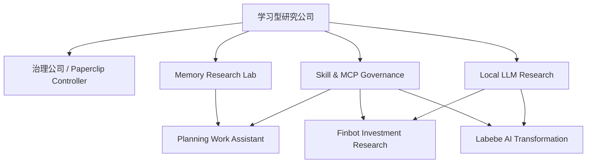
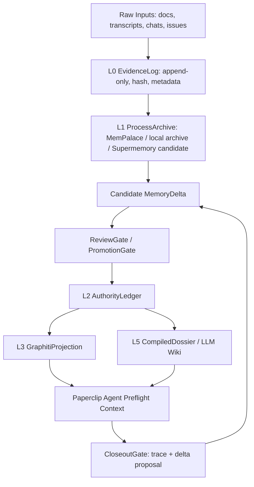

# Paperclip 学习型研究公司调查与需求梳理

> 日期: 2026-05-06  
> 状态: draft / requirements baseline  
> 范围: Paperclip 公司化主线、planning 记忆管理、本地模型研究、runtime / coding plan / skill / MCP 治理  
> 本轮原则: 只做调查与需求梳理；不继续 runtime_allocator 编码；不安装新 skill；不下载大模型；不写入长期记忆 authority。

---

## 1. 总判断

当前 Paperclip 已经有一些“公司名称”和“agent 名称”，但还没有形成可持续自治的工作系统。核心缺口不是再多建几个 agent，而是缺少三件东西：

1. **研究公司级别的任务链条**：目标 -> 项目 -> issue -> agent -> evidence -> review -> memory delta -> closeout。
2. **可信 current truth / authority 记忆底座**：尤其是 planning，不能再靠长聊天和旧文档漂移。
3. **runtime / skill / MCP 的治理闭环**：知道哪些 runtime 能做什么、哪些 key/plan 可用、哪些 skill 应保留/淘汰、哪些外部 skill 值得引入。

因此建议把“学习型研究公司”定义为 Paperclip 的横向研究与进化部门，而不是普通业务公司。它服务于已有公司：治理公司、Planning Work Assistant、Finbot、Labebe AI Transformation、Local LLM Research。

---

## 2. 当前事实核验

### 2.1 Paperclip live 状态

本轮通过 `http://127.0.0.1:3100/api/health` 和 company-scoped API 核验：

- Paperclip server: healthy, version `0.3.1`, local_trusted, private exposure.
- company 总数: `320`
- active company: `8`

当前 active companies：

| Company | 定位 | 当前状态判断 |
|---|---|---|
| PECL Runtime Steward Company 20260503 | runtime / memory / skill governance steward | 有 2 agents、1 project、18 issues，是目前最像“能执行”的公司 |
| Local LLM Research | HomePC 本地模型研究 | 有 4 agents，但 0 projects / 0 issues |
| Planning Work Assistant | 战略、人资、会议、文档 | 有 7 agents，但 0 projects / 0 issues |
| Labebe AI Transformation | Labebe DTC / commerce / claim-safe evidence | active |
| Labebe AI Design Studio | Labebe 产品设计 demo | active |
| Finbot Investment Research | 个人投研 | active |
| Memory Research Lab | 记忆系统研究 | 有 4 agents，但 0 projects / 0 issues |
| Paperclip Controller & Runtime Company | controller / gate / runtime validation | 有 1 project、6 issues，但 0 agents |

结论：已经存在 `Memory Research Lab` 和 `Local LLM Research`，所以“学习型研究公司”不应盲目再建一套孤岛。更好的做法是创建或升级一个 umbrella company，把 Memory Research、Local LLM、Skill/MCP、Runtime Evaluation、Pro Review Packet 统一成一个研究执行系统。

### 2.2 claudekimi runtime 收口状态

claudekimi 已把 runtime_allocator 停在一个合理的暂停点：

- 已提交:
  - `1882bab` P0 bug fixes
  - `da3472d` P1 schema registry / company_id / deps
- 测试记录: `python3 -m pytest runtime_allocator/tests -q` -> `157 passed`
- 仍有未提交 runtime 文件和未编码 P0/P1/P2+ 项。

本需求文档不建议继续 runtime 修复作为主线。runtime_allocator 是 Paperclip 自治的依赖项，但当前用户目标是公司化、记忆与研究系统设计。runtime 后续应作为 Learning Research Company 的一个受控 workstream，而不是继续抢占全部上下文。

---

## 3. 学习型研究公司的定位

### 3.1 推荐名称

中文名：学习型研究公司  
英文名：`Paperclip Learning Research Company`

### 3.2 Mission

把碎片化研究、外部工具、历史经验、runtime 评测、skill/MCP 配置，转化为可执行、可复用、可审计的 Paperclip 组织能力。

### 3.3 Non-goals

- 不直接替代治理公司。
- 不绕过用户/ReviewGate 写入 authority memory。
- 不直接安装未经审计的外部 skill/MCP。
- 不直接执行大模型下载；任何超过 100MB 的下载必须先确认，且优先国内镜像或直连局域网，不走代理流量。
- 不把 Graphiti、Supermemory、GBrain 等任何单个系统当唯一真相源。

---

## 4. 推荐组织结构

### 4.1 公司层级关系



建议实现方式有两种：

| 方案 | 做法 | 优点 | 风险 |
|---|---|---|---|
| A. 新建 umbrella company | 新建 `Paperclip Learning Research Company`，把现有 Memory Research Lab / Local LLM Research 作为项目或下属 company 关联 | 概念清晰，符合用户“再成立一个公司”的想法 | 需要避免重复 agent |
| B. 升级 Memory Research Lab | 将现有 `Memory Research Lab` 改名/扩展为 Learning Research Company | 减少重复公司 | 名称和职责跨度变大 |

我的建议：选 A，但第一轮只 seed projects/issues，不急着迁移旧公司；等首轮跑通后再决定是否 archive/合并重复公司。

### 4.2 建议 agent

| Agent | 职责 | 首轮权限 |
|---|---|---|
| Research Intake Steward | 接收碎片资料、去重、建 source registry、生成研究包 | read + candidate issue |
| Memory Research Steward | 设计并执行 planning 记忆实验；维护 memory_delta schema 和 gate | read + candidate_delta |
| Runtime & Model Research Steward | 维护 runtime/coding plan/local model 能力矩阵、preflight、fallback 策略 | read + benchmark proposal |
| Skill/MCP Research Steward | 审计现有 skill/MCP，提出淘汰/更新/引入计划 | read + change proposal |
| Evaluation & Pro Review Steward | 准备 Pro 评审 packet、contract tests、验收 rubric | read + packet generation |
| Paperclip Implementation Liaison | 把研究结论转成 Paperclip projects/issues/agents seed spec | issue/project write, no authority memory write |

---

## 5. Workstream A: planning 记忆管理

### 5.1 已有研究结论

`planning/docs/2026-04-23_planning记忆实验交接文档_v1.md` 已记录：

- Graphiti 是当前第一主线。
- 两个 latest fresh repro run 均为 `100.0 / 100.0 / passed`。
- 已证明的是 current truth、stale suppression、authority pointer、evidence 底层能力。
- 还不能外推成完整岗位代理系统。
- 下一步应进入真实业务 case、memory_delta、clean-room / provenance 补证。

`planning/docs/2026-05-05_Pro记忆系统评审答案_v1.md` 的关键修正：

- Graphiti 应作为 `CurrentTruthProjection` / temporal graph serving layer。
- 真正 authority 应是 `EvidenceLog + reviewed AuthorityLedger`。
- MemPalace 是 verbatim / process archive。
- Supermemory 应进入 head-to-head challenger，但首轮只允许 read path + candidate write，不能 authority write。
- GBrain 适合 sandbox / ops plane，不能直接写主 memory。
- 必须引入 runtime trace、memory_delta gate、clean-room full rerun、provenance audit。

`planning/docs/2026-05-05_Pro会话历史分析答案_v1.md` 的关键修正：

- planning 的瓶颈不是“缺更聪明 agent”，而是缺可审计 current truth / authority / verbatim 记忆底座和角色化 workflow。
- 每个 session 应先生成任务 contract 卡：目标、authority、verbatim、允许/禁止路径、模型 lane、验收命令、停止线、上一轮 findings。
- 工程任务流应是：Graphiti current truth preflight -> 主力实现 -> 测试证据 -> 窄范围红队 -> 修复 -> 架构争议仲裁 -> 记忆写回。

### 5.2 目标架构



### 5.3 MemoryDelta 最小约束

任何会改变未来回答的长期记忆写入，都必须变成 `memory_delta`，至少包含：

- `delta_id`
- `task_id`
- `proposed_by`
- `target_layer`
- `operation`
- `delta_type`
- `claim`
- `source_ids`
- `source_spans`
- `document_date`
- `event_date`
- `valid_at`
- `supersedes`
- `conflicts_with`
- `authority_level`
- `privacy_class`
- `review_status`

硬规则：

- claim 不允许没有 source_spans。
- current truth 不允许没有 valid_at。
- supersede 不允许没有旧 delta。
- inferred 不能直接 promoted 为 safe mouthpiece。
- `review_status != approved` 不允许进入 AuthorityLedger。

### 5.4 实验计划

| Phase | 目标 | 产物 | Gate |
|---|---|---|---|
| M0 Source Freeze | 汇总 4/23 handoff、5/5 Pro 答案、Windows clippings、现有 eval 文件 | source registry + duplicate report | 所有 source 有 path/hash/date |
| M1 Clean-room rerun | 重跑 Graphiti L0，不改变能力，只补 trace | clean-room run + runtime_trace | raw output / retrieved spans / scorer 全保留 |
| M2 Business cases | Case 01/04/07: Graphiti only vs Graphiti + MemPalace | case result matrix | 每个答案有 evidence spans |
| M3 Challenger | 加入 Supermemory，同 contract head-to-head | challenger report | no authority write |
| M4 Paperclip integration | Memory Audit Agent read-only MVP | preflight packet + closeout delta proposal | read-only, no durable memory write |
| M5 Planning adoption | Planning Work Assistant session contract card | contract card template + API seed issue | 用户确认后才启用 |

### 5.5 首批 contract tests

建议把 Pro 提到的 76 条 pushback 转成 9 类 contract tests：

1. 不把旧文档当 current truth。
2. 不重复上一轮已修 finding。
3. 不越过 write allowlist。
4. 不用错模型/测试 lane。
5. 不把 ASR 说话人或不确定 claim 臆测成事实。
6. 每个 claim 必须有 source span。
7. memory_delta 未过 gate 不得写 authority。
8. current truth 必须可 supersede / retract。
9. closeout 必须产出 trace、测试证据、未决风险和 candidate delta。

---

## 6. Workstream B: 本地模型部署研究

### 6.1 当前核验结论

`LOCAL_MODEL_HANDOVER_20260506.md` 显示：

- HomePC: Ubuntu 22.04.5, Ryzen 9700X, 2x RTX 3090 24GB。
- Ollama 0.17.5 live on `127.0.0.1:11434`。
- qwen3.5:27b 和 qwen3.6:35b-a3b-q4_K_M 均已验证 tool calling。
- gemma3:27b / gemma3n:e4b 适合摘要/草拟，但不支持 tool calling。
- ComfyUI live on `127.0.0.1:8188`，Wan 2.1 benchmark 完成。
- TRELLIS pipeline 就绪但空闲。
- vLLM、llama-server、Gemma4 实验 lane 当前 drifted。
- 模型资产总量约 640GB+。

### 6.2 研究目标

本地模型当前只进入研究与能力评估，不参与 Paperclip MVP 系统搭建。未来如果研究证明质量、稳定性、成本和回退机制合格，再把它纳入自动化任务，用于低风险后台处理：

- 长文 first-pass digest。
- 结构化抽取预处理。
- finbot 自动化批处理。
- Labebe 图文/视频/3D pipeline 辅助。
- memory evidence chunking / embedding。
- runtime fallback 中的低风险任务。

### 6.3 必做 preflight

Local Model Steward 每次执行前必须确认：

- HomePC SSH 可达。
- Ollama / ComfyUI / TRELLIS 端口可达。
- GPU 显存状态。
- `NO_PROXY` 覆盖 localhost / LAN。
- 大文件下载是否需要用户确认。
- HF 下载是否使用 `HF_ENDPOINT=https://hf-mirror.com` 或已确认直连策略。

---

## 7. Workstream C: runtime / coding plan / quota 使用

### 7.1 当前 runtime 画像

`PAPERCLIP_RUNTIME_INVENTORY_20260506.md` 与 `PAPERCLIP_CREDENTIALS_AND_PLANS_AUDIT_20260506.md` 显示：

| Runtime | 资源/凭证 | 建议角色 |
|---|---|---|
| codex1 / codex | OpenAI OAuth, `gpt-5.5`, xhigh | 最高质量主控、复杂工程、最终把关 |
| claudekimi | Kimi Coding Plan, `mimo-v2.5-pro` | 复杂任务编排、证据合成、长链执行 |
| claudeds | DeepSeek key, `deepseek-v4-pro` | 编程任务、低价缓存命中实验、fallback |
| claudeminmax | MiniMax key, `MiniMax-M2.7-highspeed` | 重复性任务、批量审查、文档、finbot 自动化、多模态/TTS/生图资源利用 |
| Kimi Code / kimicode | Kimi native CLI / ACP candidate | Paperclip 原生 ACP / native CLI 调用候选，需要单独纳入 runtime matrix |
| gemini CLI | Gemini Coding Plan | 外部第二视角、文件/多模态/Google 生态 |
| HomePC Ollama | 本地 GPU | research-only；在本地模型研究完成前，不参与 Paperclip 系统搭建或真实任务路由 |

Inactive / do not route for current MVP:

| Runtime | 原因 | 策略 |
|---|---|---|
| claudegac | credits 已用完 | 从有效 runtime pool 移除；只保留历史记录 |
| claudemi | credits 已用完 | 从有效 runtime pool 移除；只保留历史记录，不作为 fallback |

### 7.2 调度原则

不要把所有复杂任务都打到最强 runtime。建议按“风险 + 复杂度 + 成本 + 可验证性”分配：

- P0/P1 架构与关键代码：codex1 主控，claudekimi 可做执行或第二实现。
- 长链研究与证据包：claudekimi。
- 窄范围重复审查：claudeminmax。
- DeepSeek cache/cost 评测：claudeds。
- 投研/战略红队：先由 codex1 / claudekimi 形成事实包，必要时再走 Pro；不再依赖 claudegac。
- 多模态/TTS/生图：MiniMax / ComfyUI / TRELLIS 按任务选择。
- 本地批处理：暂不启用；HomePC Ollama 只做 research-only benchmark，不能作为当前 MVP 依赖。

### 7.3 Runtime preflight 需求

Runtime Allocator / Skill-MCP Agent 应提供统一 preflight：

- provider health。
- quota / billing / cooldown。
- proxy health。
- model capability: coding, long context, tool calling, vision, TTS, image/video。
- task_class policy。
- fallback chain。
- human_review_required gate。
- current MCP baseline。

注意：当前 runtime_allocator 仍有 P0/P1 未完成项，所以 Paperclip autonomy 第一阶段应使用“只读 preflight + 人控调度”，不要直接让 allocator 自主执行高风险任务。

---

## 8. Workstream D: Skill / MCP 管理与外部生态

### 8.1 当前本机问题

`PAPERCLIP_SKILLS_MCP_RUNTIME_RECONCILED_20260506.md` 已核验：

- runtime MCP 数量不一致：2 到 8 个不等。
- `claudeminmax` 实际只有 2 个 MCP，并不继承全局。
- `claudeds` / `claudemi` 有配置漂移。
- 多处 `settings.json` / `mcp.json` 存在硬编码 key 风险。
- Paperclip demo skills 有外部绝对路径，不可移植。
- Paperclip MCP template 当前用 `src/stdio.ts` 而非构建产物。
- Paperclip demo 层有 5 skills、34 MCP tools、default-deny、mutation gating。

### 8.2 Skill lifecycle schema

Skill/MCP Research Steward 应维护一个 registry，每个 skill 至少有：

- `skill_id`
- `name`
- `source`
- `owner`
- `scope`: global / repo / company / agent
- `runtime_compatibility`
- `mcp_dependencies`
- `permissions`
- `secret_requirements`
- `risk_level`
- `tests`
- `last_verified`
- `status`: candidate / active / deprecated / archived / blocked
- `replacement`
- `evidence`

### 8.3 首轮淘汰/整改规则

第一轮不是“多装技能”，而是先治理：

- 硬编码 key 的配置先整改。
- 绝对路径 skill 标记为 `deprecated_pending_relink`。
- 没有 owner / tests / trigger description 的 skill 标记为 candidate，不进 active。
- runtime MCP baseline 不统一前，不允许 skill 自动触发高风险 MCP。
- 外部 skill 先进入 `candidate`，只能 read/audit，不能直接执行 mutation。

### 8.4 外部生态调查

本轮外部调研结论：

| 候选 | 定位 | 可用价值 | 风险/限制 |
|---|---|---|---|
| Superpowers | agentic skills framework，支持 Claude Code、Codex App/CLI、Gemini CLI 等 | 适合作为 planning / spec / review / subagent workflow 参考 | 当前会话里 superpowers plugin 未暴露为可调用工具；远程还需单独安装/审计 |
| gstack | 面向 Claude Code / Codex 的工程角色与交付 workflow skill pack | `/office-hours`、plan review、QA、ship、context-save、learn 等值得拆解吸收 | 角色很多，直接全量安装会污染上下文；需按 Paperclip 公司角色裁剪 |
| SkillPort | CLI + MCP skill 管理，支持 validate / add / update / list / MCP lazy loading | 很适合做 Paperclip Skill Registry 的参考实现或对照工具 | 项目状态仍标注 WIP，API 可能变 |
| Vercel `npx skills` | open agent skills CLI，支持 Codex / Claude / Cursor 等多平台安装、list、find、update、remove | 可作为 skill 包管理命令行参考 | 安装型工具必须走审计，不应让 agent 自动安装 |
| Local Skills MCP | 本地 filesystem skills 通过 MCP lazy load | 适合多 runtime 共享 skill，同时降低上下文占用 | 需要严格权限隔离，避免所有 agent 看到所有技能 |
| FindSkills / AgenticSkills | skill 发现目录 | 适合外部候选发现 | 社区来源必须审计，不能直接信任 |
| Skills-ContextManager / Skillz / MCPSkills | skill 管理 UI、自扩展 MCP、包管理方向 | 可作为研究对象 | 自扩展/自动激活风险高，首轮只能 sandbox |
| SkillFoundry / CoEvoSkills / SkillOrchestra / Skilldex | 自进化 skill、验证、路由、package registry 研究 | 可为长期“自主学习”设计提供原则 | 不应直接产品化，先抽象为 eval 和治理规则 |

### 8.5 外部 skill 引入 gate

任何外部 skill 进入 active 前必须通过：

1. 来源可信度检查。
2. `SKILL.md` frontmatter / trigger / scope 校验。
3. permission / allowed-tools / MCP dependency 审计。
4. secret 使用审计。
5. 本地 sandbox smoke。
6. 可回滚安装方式。
7. Paperclip registry 登记。
8. 用户批准。

---

## 9. Workstream E: Paperclip 自治路线

### 9.1 分阶段放权

| Stage | 控制方式 | Agent 能做什么 | 用户/Codex 职责 |
|---|---|---|---|
| S0 当前 | Codex 主导 | 只读调查、生成需求文档 | 用户确认方向，Codex 把关 |
| S1 研究公司 MVP | Paperclip agents 做 read-only research | 生成 source registry、计划、issue proposal | Codex 审查并下发任务 |
| S2 受控执行 | agent 可跑 benchmark / smoke / packet | runtime preflight、skill audit、memory eval | Codex 监控，风险任务停线 |
| S3 Hermes intake | Hermes 收集零碎信息并生成 task contract | 自动确认目标、边界、路径、验收 | 用户只确认关键目标 |
| S4 自治闭环 | Paperclip 自动分配、执行、review、closeout | 低/中风险任务自治 | 用户处理高风险 approval |

### 9.2 Hermes intake contract

Hermes 作为入口时，每个任务必须先转成：

```text
目标:
背景/原话证据:
当前 authority:
所属 company/project:
建议 agent:
允许读路径:
允许写路径:
禁止事项:
runtime lane:
预算/额度要求:
代理/下载规则:
验收命令:
closeout 格式:
需要用户确认的问题:
```

没有 contract，不进入执行。

---

## 10. 建议首批 Paperclip projects / issues

### Project LR-001: Research Source Registry

目标：把记忆管理、本地模型、runtime、skill/MCP 外部生态资料统一登记。

首批 issues：

- LR-001-01: ingest 4/23 planning memory handoff。
- LR-001-02: ingest 5/5 Pro memory review。
- LR-001-03: ingest 5/5 Pro session history analysis。
- LR-001-04: 查找并去重 Windows clippings 两份文档。
- LR-001-05: 建立 source hash / freshness / authority level 表。

### Project LR-002: Planning Memory Experiment

目标：让 planning 的记忆管理从研究结论进入可执行实验。

首批 issues：

- LR-002-01: 定义 memory_delta schema v0。
- LR-002-02: Graphiti clean-room full rerun plan。
- LR-002-03: Case 01/04/07 input pack freeze。
- LR-002-04: Graphiti vs Graphiti+MemPalace eval。
- LR-002-05: Supermemory challenger read-only eval。
- LR-002-06: Memory Audit Agent read-only MVP spec。

### Project LR-003: Runtime & Model Preflight

目标：让 Skill/MCP agent 拥有最新 runtime 状态记忆，并能安全选择 fallback。

首批 issues：

- LR-003-01: runtime matrix freeze from 2026-05-06 docs。
- LR-003-02: coding plan / key source matrix freeze。
- LR-003-03: HomePC Ollama research-only health / quality / fallback preflight。
- LR-003-04: MiniMax repetitive task benchmark。
- LR-003-05: DeepSeek coding/cache/cost benchmark。
- LR-003-06: no-proxy / no-large-download gate。

### Project LR-004: Skill & MCP Governance

目标：第一轮先治理，再引入。

首批 issues：

- LR-004-01: current skill registry schema。
- LR-004-02: hardcoded key cleanup plan。
- LR-004-03: absolute path skill deprecation plan。
- LR-004-04: runtime MCP baseline proposal。
- LR-004-05: Superpowers install/readiness packet。
- LR-004-06: gstack audit packet。
- LR-004-07: SkillPort / npx skills / Local Skills MCP comparison。

### Project LR-005: Paperclip Autonomy Protocol

目标：从 Codex 主导过渡到 Hermes intake + Paperclip 自治。

首批 issues：

- LR-005-01: task contract card template。
- LR-005-02: agent role routing policy。
- LR-005-03: preflight gate requirements。
- LR-005-04: closeout gate requirements。
- LR-005-05: Pro review packet template。

---

## 11. Acceptance Criteria

第一轮完成标准：

- Paperclip 中出现一个可执行的 Learning Research company 或 umbrella spec。
- 至少 5 个 project 和 20 个 issue 被 seed，且每个 issue 有 owner、scope、evidence、gate。
- Memory Research Lab 不再只是 agent 列表，而有 Case 01/04/07 实验队列。
- Local LLM Research 不再只是 agent 列表，而有 HomePC preflight 和 benchmark 队列。
- Skill/MCP Research Steward 有当前 runtime/MCP/skill registry 的 frozen snapshot。
- Pro review 不是自由提问，而是基于事实包和明确问题。
- 任何 external skill / MCP / 大模型下载都不能自动执行，必须先过审计和用户确认。

---

## 12. 当前未决问题

1. Windows clipping docs 是否挂载在本机：本轮快速查找未定位到 `D:\LifeOS Pro PARA Vault\Clippings\...` 对应文件，需要确认 Windows 盘是否挂载或通过同步目录访问。
2. 学习型研究公司是新建 umbrella，还是升级现有 Memory Research Lab。
3. Local LLM Research 是否保留独立公司，还是转成 Learning Research Company 下的 project。
4. claudekimi 是否继续 runtime_allocator P0/P1，还是先转入 Pro review / Paperclip 公司化任务。
5. Superpowers 是否要安装到远程的 Codex/Claude/Gemini 每个 host，还是先只做 read-only audit。
6. Kimi Code / ACP 作为 Paperclip native runtime 的接入方式尚未核验，需要纳入 runtime preflight。

---

## 13. 建议下一步

我建议下一步按这个顺序执行：

1. 先把本需求文档作为 Paperclip Learning Research Company 的 seed spec。
2. 创建或升级公司，但暂不迁移旧公司。
3. Seed LR-001 到 LR-005 projects/issues。
4. 给 claudekimi 的 Pro 咨询先准备事实包，不让它自由散问。
5. 由 Codex 主控第一轮：Memory Research Steward 做 M0/M1，Skill/MCP Research Steward 做 LR-004，Runtime & Model Research Steward 做 LR-003。
6. 第一轮只允许 read-only / candidate_delta，等结果稳定后再开放 bounded execution。

---

## 14. 本轮参考资料

### Local authoritative docs

- `/vol1/1000/projects/planning/docs/2026-04-23_planning记忆实验交接文档_v1.md`
- `/vol1/1000/projects/planning/docs/2026-05-05_Pro记忆系统评审答案_v1.md`
- `/vol1/1000/projects/planning/docs/2026-05-05_Pro会话历史分析答案_v1.md`
- `/vol1/1000/projects/toyresearch/docs/LOCAL_MODEL_HANDOVER_20260506.md`
- `/vol1/1000/projects/toyresearch/docs/PAPERCLIP_RUNTIME_INVENTORY_20260506.md`
- `/vol1/1000/projects/toyresearch/docs/PAPERCLIP_SKILLS_MCP_RUNTIME_RECONCILED_20260506.md`
- `/vol1/1000/projects/toyresearch/docs/PAPERCLIP_CREDENTIALS_AND_PLANS_AUDIT_20260506.md`
- `/vol1/1000/projects/toyresearch/docs/AGENT_PROXY_TRAPS_AND_BEST_PRACTICES.md`

### External references checked

- Superpowers: https://github.com/obra/superpowers
- gstack: https://github.com/garrytan/gstack/blob/main/AGENTS.md
- gstack overview: https://gstack.lol/
- SkillPort: https://github.com/gotalab/skillport
- Vercel skills CLI: https://github.com/vercel-labs/skills
- Local Skills MCP: https://github.com/kdpa-llc/local-skills-mcp
- FindSkills: https://www.findskills.org/
- AgenticSkills: https://agenticskills.io/
- SkillFoundry: https://arxiv.org/abs/2604.03964
- CoEvoSkills: https://arxiv.org/abs/2604.01687
- SkillOrchestra: https://arxiv.org/abs/2602.19672
- Skilldex: https://arxiv.org/abs/2604.16911
